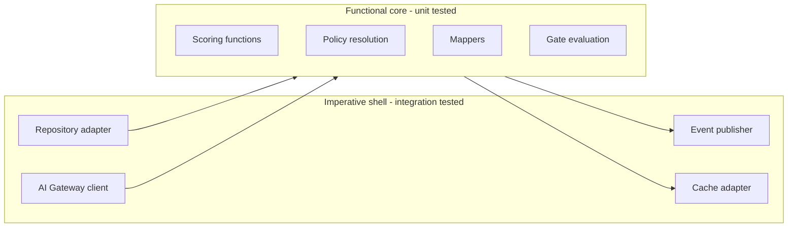
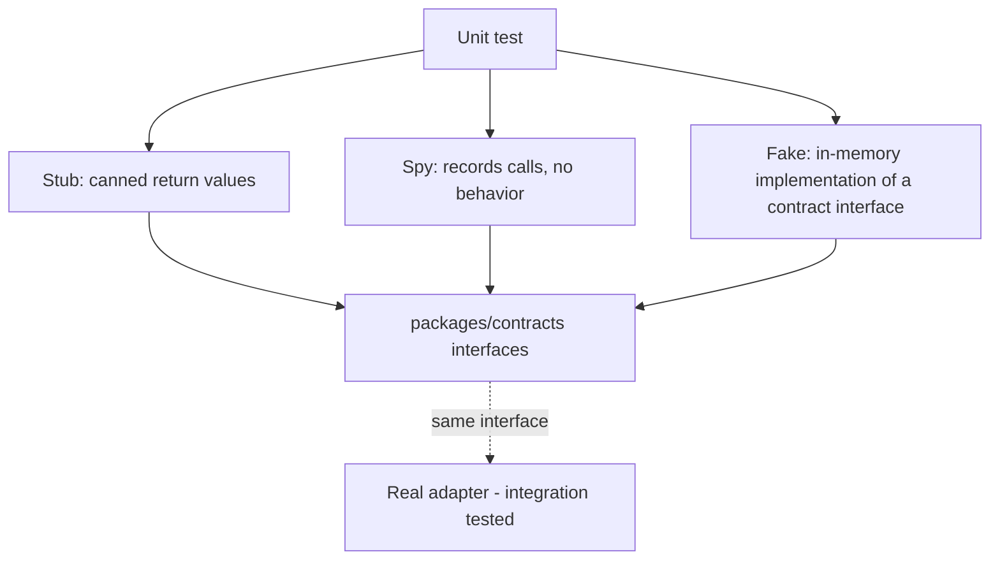
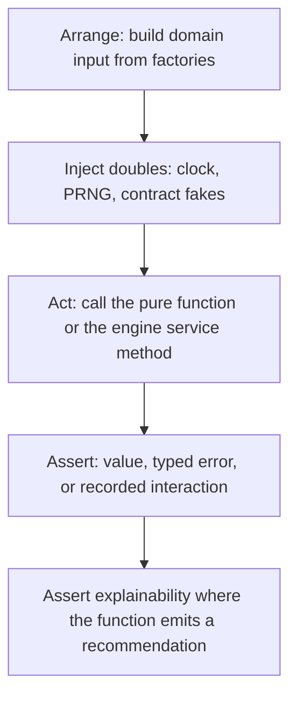

# Unit Testing

> **Status:** v1.0 — complete. Level 2 of the taxonomy in `testing-strategy.md` §3.
> **Scope:** in-process tests of pure logic with every I/O dependency doubled. Defines what belongs at this level, how determinism is enforced, how doubles are built from `packages/contracts`, and the per-package unit test obligations for all twelve modules.

## 1. Overview

**Why this level exists.** Most of what ContentOS decides is arithmetic and policy, not I/O: how a keyword opportunity is scored, which model tier a task routes to, whether a gate verdict is `pass`, `soft-warn`, or `block`, how a competitor gap becomes a "how-to-beat" recommendation, how token budget is apportioned across evidence in the Context Builder. These decisions determine the product's output quality, they change often, and they are cheap to verify exhaustively — but only if they are reachable without a database, a queue, or a model.

**Business purpose.** Scoring and gate policy are the product's opinions. When a customer asks "why did this article score 74?", the answer must be a deterministic function of documented inputs, and that function must be pinned by tests that fail the moment someone changes it accidentally.

**Technical purpose.** Provide sub-second feedback on the largest body of logic in the codebase and enforce, by construction, that engines contain testable pure cores. A unit test that cannot be written without a container is a signal that I/O has leaked into the domain layer.

**Design philosophy — functional core, imperative shell.** Every engine is structured so that its decision logic is a set of pure functions over plain data, and its adapters (repositories, AI Gateway client, queue publisher) live at the edge. The pure core is unit-tested exhaustively; the shell is covered by integration tests. This is not stylistic preference — it is what makes the "blast radius contained to one engine" requirement (§6, Maintainability) verifiable.

## 2. Responsibilities

**Unit tests MUST cover:**
- Scoring and ranking functions, with boundary and degenerate inputs.
- Policy resolution: model routing decisions, gate threshold application, credit cost calculation, retry/backoff decision functions.
- Pure transformations: provider response → domain object mappers, outline → prompt variable assembly, draft → citation anchor extraction.
- Contract conformance: every event payload and DTO validates against its schema in `packages/contracts`, including the Explainability Envelope.
- Error construction: typed errors carry the documented code, retryability flag, and user-facing message.

**Unit tests MUST NOT:**
- Touch PostgreSQL, Redis, Temporal, object storage, the network, the filesystem, or the system clock.
- Assert the *content* of model output. A unit test may assert that a prompt was rendered with the right variables and that the response was parsed correctly; the quality of the response is `ai-evaluation.md`'s concern.
- Re-verify RLS, transactions, or queue semantics — doubling a database proves nothing about the database (`integration-testing.md`).
- Assert framework behavior (NestJS DI wiring, Next.js routing). Wiring is proven by integration and E2E tests.

**Boundary:** the moment a test needs a real dependency's semantics to be meaningful, it moves down the pyramid to integration.

## 3. Architecture

### 3.1 Functional core / imperative shell



The arrows carry plain data structures defined in `packages/contracts`. No core function receives a client, a connection, or a framework object.

### 3.2 Double taxonomy



**Rule:** doubles implement the interface from `packages/contracts`, never an ad-hoc shape. Because the real adapter implements the same interface, a contract change breaks both the double and the adapter at compile time — which is the point. Hand-written `any`-typed mocks are prohibited by lint.

**Fakes over stubs where state matters.** `InMemoryEvidenceStore`, `InMemoryPromptRegistry`, and `FakeAIGateway` are maintained in `tooling/test` and shared. A fake that drifts from its real counterpart is caught by the shared contract test suite that runs both implementations against the same specification.

## 4. Inputs

| Input class | Construction | Notes |
|---|---|---|
| Domain objects | Typed builders in `tooling/test/factories` | `anArticle().withSections(3).withCitations(12).build()` |
| Provider payloads | Trimmed real samples committed as JSON fixtures | Shared with adapter mapper tests in `integration-testing.md` |
| Policy config | Loaded from `packages/config` defaults, overridden explicitly per test | Tests never hardcode a threshold that production reads from config |
| Randomness | Seeded PRNG injected as a dependency | Same seed → same output, always |
| Time | Injected `Clock` interface; `FixedClock` in tests | `Date.now()` in domain code fails lint |

**Preconditions:** no global state; no shared module-level mutable singletons; each spec constructs its own subject. **Authorization** is not exercised here — permission checks live in the shell and are asserted at integration and E2E levels.

**Error cases at the input boundary:** a factory that produces an invalid domain object (e.g., a `GateThresholds` with a value outside 0–100) throws at build time rather than producing a test that passes against impossible input.

## 5. Outputs

| Output | Consumer |
|---|---|
| Pass/fail per spec (JUnit XML) | `unit` gate in the CI contract |
| Coverage (LCOV) | `coverage` gate — ≥ 85% on `packages/engines/*` and `packages/contracts` |
| Snapshot artifacts (explainability payloads, rendered prompts) | Review diffs |

**Side effects:** none. A unit spec that leaves a file, an open handle, or a timer behind fails the harness's leak detector.

**Snapshot policy.** Snapshots are used only for stable structured output — a rendered prompt string, an Explainability Envelope, a gate report shape. They are never used for model output. Every snapshot must be human-reviewable in a diff; a snapshot larger than ~60 lines must be replaced with targeted assertions.

## 6. Internal Workflow



Step E is specific to this platform: any function that produces a user-facing recommendation must be asserted to emit a complete Explainability Envelope — `{ recommendation, reason, evidence[], expected_impact, confidence }` — with a non-empty `evidence[]` whenever the recommendation claims grounding (§4.6). A recommendation without evidence is a product defect, and this is the level that catches it.

## 7. Dependencies

**Tooling:** Vitest (runner, coverage via v8), `@faker-js/faker` seeded deterministically for realistic-but-fixed strings, `zod` schemas from `packages/contracts` for payload validation assertions, `vitest-fetch-mock` only as a guard that asserts no fetch occurs (network access from a unit test is a failure, not a stub opportunity).

**Internal:** `packages/contracts` (interfaces + schemas), `packages/config` (thresholds, routing policy), `tooling/test` (factories, fakes, `FixedClock`, seeded PRNG).

**Explicitly not depended on:** any adapter in `packages/integrations`, any real store, any NestJS application context.

## 8. Database Impact

None by design. This is the only level with zero database impact, and enforcing that is what keeps it fast.

Enforcement is mechanical: the unit Vitest project sets an environment where the database URL is unset and the `pg` module is aliased to a throwing stub. A unit test that reaches for a connection fails immediately with `UNIT_TEST_DB_ACCESS`, rather than silently hanging or connecting to a developer's local database.

Repository logic is nevertheless partly testable here: query *builders* are pure. Asserting that a repository builds a query with a `tenant_id` predicate is a valid unit test — but it is a defense-in-depth check, not a substitute for the RLS isolation suite, which asserts the database denies the row regardless of what the query says.

## 9. API Contracts

This level has no HTTP surface, but it owns **schema contracts**:

```ts
// Every domain event must satisfy this envelope (packages/contracts)
interface DomainEvent<T> {
  eventId: string;          // uuid v7 — used for consumer-side dedupe (§18)
  eventType: string;        // e.g. 'OutlineApproved'
  occurredAt: string;       // ISO 8601, from the injected Clock
  tenantId: string;         // never optional
  aggregateId: string;      // ordering key where order matters
  version: number;          // schema version of the payload
  payload: T;
}
```

Contract obligations asserted at this level:
- Every event type declared in `01-system-architecture/10-event-flow.md` has a schema and a round-trip test.
- Schema evolution is additive: a test loads the previous version's fixture and asserts it still validates. A breaking field change fails the `static` gate.
- Typed errors (`RateLimited`, `BudgetExceeded`, `ProviderUnavailable`, `GuardrailBlocked`) are exhaustively covered — every code the AI Gateway can emit has a construction test and a documented retryability flag.

## 10. Error Handling

| Condition | Expected behavior asserted |
|---|---|
| Missing prompt variable | Render throws before dispatch; no partial prompt is produced (`08-ai-platform/prompt-engine.md`) |
| Unknown template id/version | Typed error, never a guessed prompt |
| Model returns malformed JSON | Parser returns a typed `OutputValidationFailed`, never a partially-populated object |
| Evidence coverage below threshold | Planning returns "request more research", never an outline with unsupported sections |
| Budget exceeded | Function refuses and returns an actionable error; no silent downgrade to a cheaper model unless policy explicitly allows it |
| Provider mapper receives an unexpected field | Ignores unknown fields, fails loudly on missing required fields |

**The no-fabrication rule is a test class, not a guideline.** For every engine that can produce "I don't have enough evidence," there is a spec asserting the degraded path returns the refusal rather than a plausible-looking result. This mirrors the baseline's stance that a fabricated success is worse than a typed failure.

## 11. Security

Security-relevant unit obligations:
- **Tenant threading:** any function accepting a tenant-scoped identifier must reject a call where `tenantId` is absent or empty. Asserted per repository builder and per event constructor.
- **Redaction:** the PII redaction function used by the AI Gateway guardrail has a dedicated corpus (emails, phone numbers, API keys, addresses) with an asserted false-negative rate of zero on the corpus.
- **Log hygiene:** the structured logger's serializer is unit-tested to redact `authorization`, `api_key`, `password`, `refresh_token`, and connector credentials at any nesting depth.
- **Injection framing:** the Context Builder's evidence-wrapping function is asserted to wrap retrieved content in the data-not-instructions envelope, with a spec proving that content containing "ignore previous instructions" is still wrapped and never concatenated as a system message.

## 12. Performance

The whole unit suite must finish in **under 90 seconds** on CI and under 10 seconds in watch mode for a single package. Practices: no `beforeAll` container work, no sleeps (time is injected), no unbounded property-based runs in the default suite (property tests run with a fixed small case count in CI and a larger count nightly), and shard-by-package parallelism.

Property-based testing (`fast-check`) is used selectively where the input space is large and invariants are crisp: scoring monotonicity (adding a supporting evidence item never decreases a coverage score), gate ordering (`block` always dominates `soft-warn`), and token-budget apportionment (the sum of allocated context never exceeds the budget).

## 13. Observability

Per-spec duration and retry counts are exported with the rest of the CI telemetry (`testing-strategy.md` §13). The two signals watched specifically at this level: unit suite duration trend (a rising trend usually means I/O has leaked into the core) and coverage delta per package on each PR, surfaced as a review comment rather than only a gate.

## 14. Future Expansion

- **Mutation testing** on scoring and gate modules, where coverage percentage is least trustworthy.
- **Shared contract test kits:** each interface in `packages/contracts` ships a reusable spec suite that both the fake and the real adapter must pass, eliminating fake drift entirely.
- **Golden explainability corpus:** a fixed set of recommendations whose envelopes are diffed across releases to detect silent reasoning-quality regressions.
- **Generated fixtures from schemas** so that adding a contract field automatically surfaces every factory that must be updated.

## 15. Open Questions

- Whether property-based tests should be a blocking gate or advisory (currently advisory, run at higher case counts nightly).
- Coverage floor for `packages/integrations` mapper code, which straddles unit and integration (currently counted under the 70% "elsewhere" bucket).

Tracked in `99-open-questions.md`.

## Cross References

- `testing-strategy.md` — taxonomy, gate contract, budgets
- `integration-testing.md` — where doubles end and real dependencies begin
- `ai-evaluation.md` — where model output quality is judged
- `07-development-guide/coding-standards.md` — assertion style, naming, lint rules referenced here
- `08-ai-platform/prompt-engine.md`, `08-ai-platform/model-router.md` — the policy logic most heavily unit-tested
- `05-content-platform/review-engine.md`, `05-content-platform/planning-engine.md` — gate and coverage logic under test
