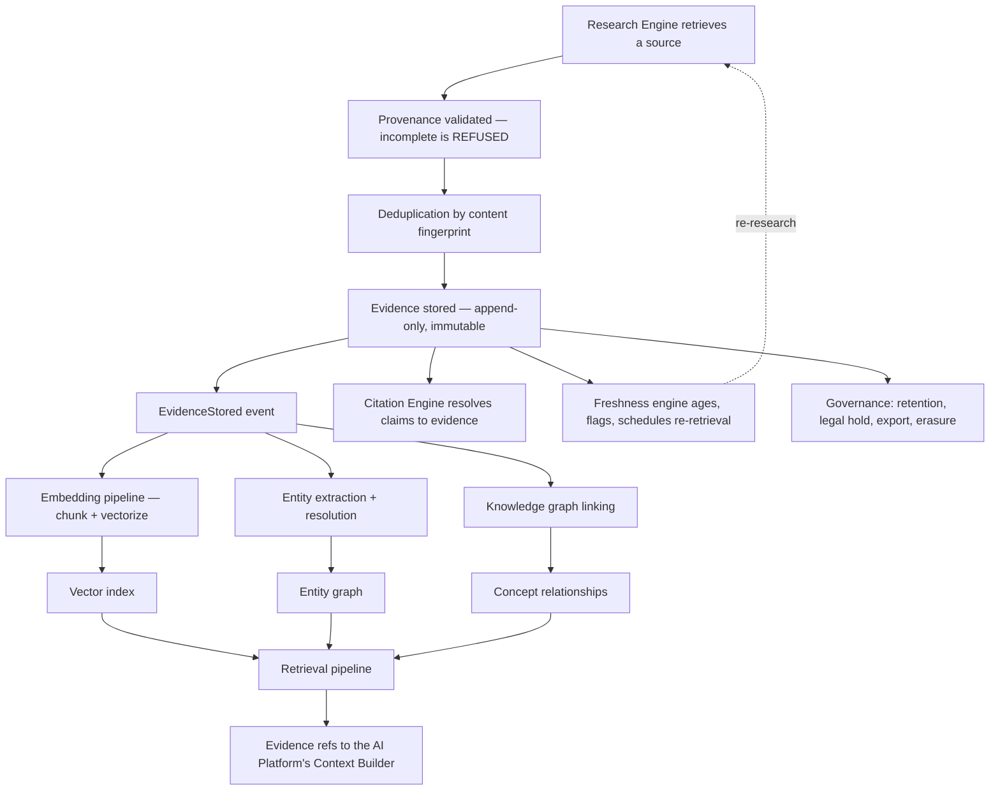

# 11 — Knowledge Platform

The authoritative source of facts and evidence for ContentOS AI. It answers exactly one question:

> **"What does the platform know?"**

It never answers *"what should the platform generate?"* — that is the AI Platform — and it never answers *"what should we do about it?"* — that is the Content Platform.

## Why this platform exists

The product's central promise is that every published factual claim traces to a verified source. That promise is kept or broken by a single property: **evidence carries mandatory, immutable provenance recorded at the moment of acquisition**. Provenance cannot be reconstructed later. If a source's URL, retrieval timestamp, and excerpt offsets were not captured when the content was fetched, the claim built on it is permanently unverifiable.

This platform is where that property lives, and it is the direct structural answer to the v1 defect where a fact-checker accepted invented sources because they matched a phrasing pattern (`AUDIT.md` §00). In v2 there is nothing to match against except real evidence rows.

## Authoritative boundaries

These are mandatory and appear in every document in this folder.

| Platform | Stores |
|---|---|
| **Knowledge (here)** | Evidence · Sources · Entities · Relationships · Embeddings · Citations · Provenance · Freshness · Retrieval indexes |
| **AI Platform (08)** | AI Memory · Prompt execution state · Context assembly · AI requests |
| **Content Platform (05)** | Drafts · Articles · Reviews · Plans · Scores |

**The sharpest of these is the memory boundary** (ADR-026). AI Memory stores interaction context and personalization and is **never a source of truth**. This platform stores facts with provenance and **always is**. A preference may never support a claim; a claim may never originate in memory. The two stores are never merged, and this platform never duplicates memory functionality.

## Documents

| # | Document | Owns |
|---|---|---|
| 1 | `evidence-bank.md` | Evidence ingestion, identity, immutability, versions, lifecycle, expiration |
| 2 | `citation-engine.md` | Citation identifiers, formatting, reference verification, broken-citation detection |
| 3 | `knowledge-graph.md` | Concepts, relationships, semantic links, topic hierarchy |
| 4 | `entity-graph.md` | Canonical entities, aliases, resolution, merge and split rules |
| 5 | `vector-search.md` | Embedding indexes, ANN search, similarity and hybrid retrieval |
| 6 | `embedding-pipeline.md` | Chunking, embedding generation, re-embedding, versioning, drift |
| 7 | `retrieval-pipeline.md` | Query expansion, filtering, ranking, token budgeting, retrieval manifest |
| 8 | `freshness-engine.md` | Source age, staleness detection, refresh scheduling, crawl triggers |
| 9 | `provenance.md` | The provenance contract — what makes evidence valid at all |
| 10 | `deduplication.md` | Duplicate detection, canonicalization, merge workflow, conflict handling |
| 11 | `governance.md` | Retention, compliance, audit, isolation, deletion, legal hold, export |
| 12 | `observability.md` | Knowledge-specific metrics, tracing, lifecycle visibility |
| 13 | `knowledge-apis.md` | The published interfaces every consumer uses |

## Golden rules

Binding on every document in this folder.

| Rule | Consequence |
|---|---|
| **Never generates content** | No drafting, no writing, no summarization of evidence into prose |
| **Never evaluates SEO, performs review, or publishes** | Those are Content Platform engines |
| **Never owns AI Memory or user preferences** | ADR-026 |
| **Never owns scoring** | ADR-021 — it supplies evidence that scoring engines consume |
| **Never exposes database tables directly** | Published interfaces only (`knowledge-apis.md`) |
| **Evidence is append-only** | History is never mutated; correction is supersession |
| **Evidence without complete provenance is invalid** | Enforced by database `CHECK`, not by convention |
| **Every retrieval is tenant-scoped** | Including vector search, where the tenant filter is explicit and mandatory |
| **Every async operation uses the EventBus** | ADR-020 — outbox in the state-changing transaction |

## On AI independence

The platform is **architecturally AI-independent**: it contains no model logic, no prompts, no provider coupling, and no dependency on any model's availability for its correctness. Evidence, provenance, citations, entities, and relationships are all stored and verified without a model.

Two derived capabilities require vector representations and extraction, and both follow the same rule the rest of the platform follows:

> **Where a model is needed, this platform issues an `AIRequest` through the AI Gateway** (ADR-008), exactly as any engine would. It never calls a provider, never imports a provider SDK, and never names a model.

Those outputs — embeddings, extracted entity candidates — are **derived data**. They are rebuildable from evidence plus archives, they are excluded from the authoritative backup set, and their loss degrades retrieval quality without compromising factual correctness. That asymmetry is deliberate: the platform's authority rests on provenance, which no model touches.

## The knowledge lifecycle

**Evidence outlives the run and the article that used it.** A refresh twelve months later starts from what is already known rather than from zero — which is what makes the content library an appreciating asset rather than a depreciating one.

## Consumers

| Consumer | Uses |
|---|---|
| `05-content-platform/research-engine.md` | **Producer** — writes evidence through the ingestion interface |
| `05-content-platform/planning-engine.md` | Coverage validation before an outline can be approved |
| `05-content-platform/writing-engine.md` | Evidence refs for grounded drafting; citation anchors |
| `05-content-platform/review-engine.md` | Citation resolution and coverage for `citation_quality` and `fact_confidence` |
| `05-content-platform/refresh-engine.md` | Evidence age for refresh scoping |
| `08-ai-platform/context-builder.md` | Retrieval, as the **`source_of_truth`** half of assembled context |
| `08-ai-platform/guardrails.md` | Manifest membership verification for citation enforcement |

**No consumer reads a Knowledge Platform table.** Every interaction goes through the published interfaces in `knowledge-apis.md`, which is what allows the storage layer to change — pgvector to Qdrant, for instance — without touching a consumer.

## Database ownership

Owned tables, specified in Phase 3 and **not redesigned here** (`03-database/tables.md` §4):

| Table | Purpose |
|---|---|
| `source_documents` | Retrieved documents with provenance, fingerprint, archive reference, trust and freshness estimates |
| `evidence_items` | The atomic unit of grounding — append-only, deduplicated, provenance-mandatory |
| `evidence_embeddings` | Chunk-level vectors; the only `CASCADE` in the schema, because embeddings are derived |
| `extracted_entities` · `entity_mentions` | Canonical entities and their occurrences |

New tables introduced by this phase are additive and named in their owning documents. Raw source archives live in Cloudflare R2 under tenant-prefixed keys (`12-storage-platform/storage-abstraction.md`).

## Trust, freshness, and scoring

Per **ADR-021**, this platform **produces no score categories and consumes none**.

Trust and freshness are **labelled estimates** carrying a method and a `computedAt`, attached to sources. They are deliberately not Scores: they measure a *source*, not our content; they carry no verdict; they have no producer entry in the category registry; and they are inputs to engines that do produce scores. Introducing a "knowledge score" here would create a category with no owner and break the contract's exclusivity rule.

## Cross references

- `02-domain-design/research.md` — the domain model for evidence, sources, and entities
- `03-database/tables.md` §4 · `indexes.md` §4.2 — physical schema and vector indexing
- `05-content-platform/research-engine.md` — the producer
- `08-ai-platform/context-builder.md` — the primary retrieval consumer
- `01-system-architecture/13-adr-log.md` — ADR-006, ADR-009, ADR-020, ADR-021, ADR-026
- `01-system-architecture/14-scoring-contract.md` — why this platform produces no scores
- `12-storage-platform/` — PostgreSQL, pgvector, Qdrant, R2
- `16-security/` — isolation, prompt-injection posture, compliance
- `99-open-questions.md` — OQ-6 (vector cutover), OQ-9 (retention), OQ-11 (embedding model)
