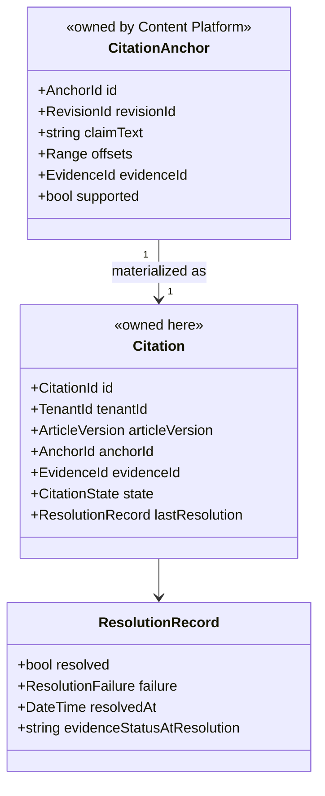
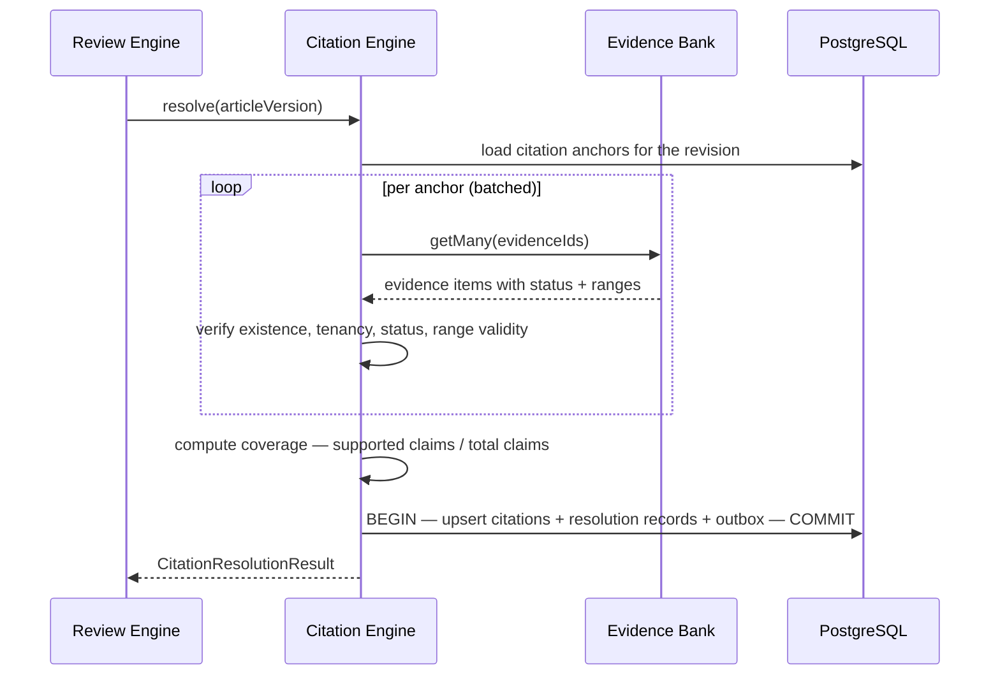
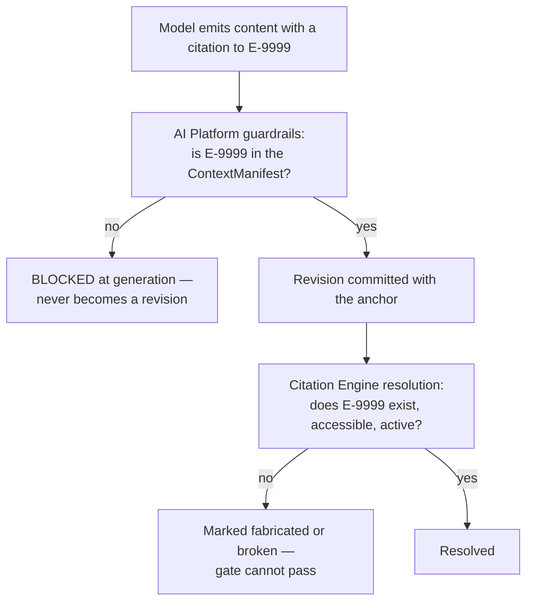
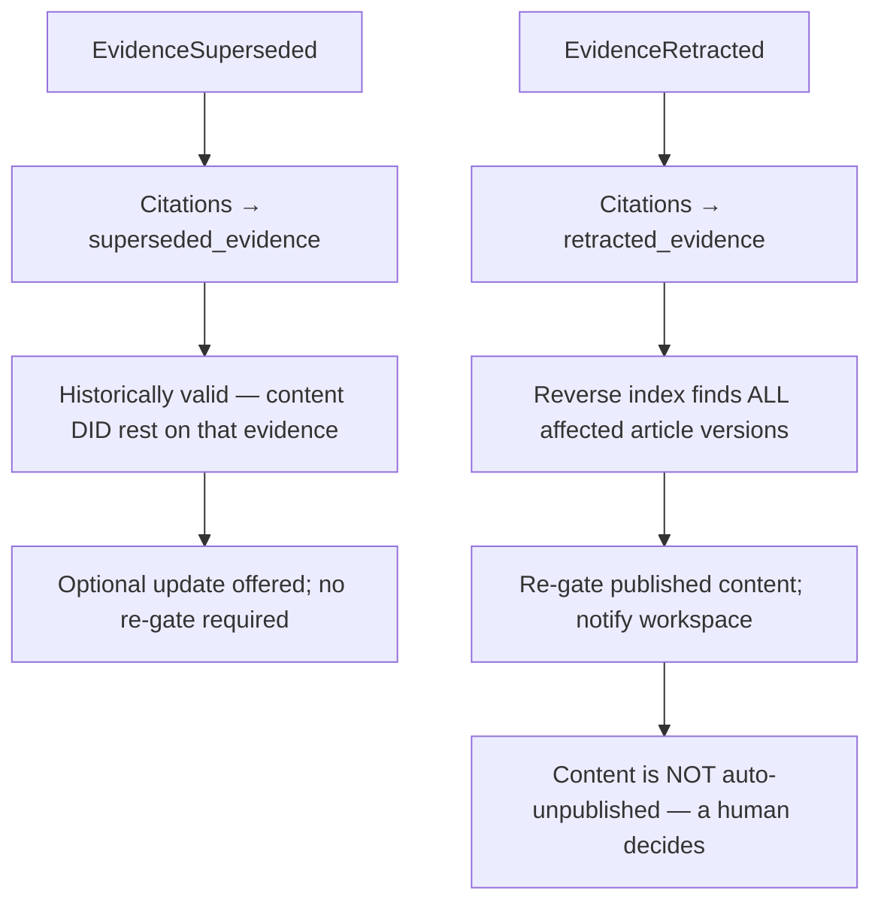

# Citation Engine

> **Status:** v1.0 — complete. New in Phase 7.
> **The one boundary that defines this component:** it verifies **references**, never **facts**. Whether a citation points at real evidence is its question; whether that evidence is correct is the Review Engine's.

## Overview

**Business purpose.** A citation is the visible half of the grounding promise. It is what a customer shows a legal reviewer, what an enterprise buyer inspects during procurement, and what makes "AI-generated" acceptable in regulated verticals. A citation that does not resolve is worse than no citation at all — it manufactures the appearance of verification, which is precisely the v1 defect that falsified the product's central claim (`AUDIT.md` §00).

**Technical purpose.** Assign stable citation identifiers, resolve claim-level citation anchors to evidence items, detect broken and fabricated references, maintain reference integrity as evidence changes, and format citations for presentation and publication.

**Design posture — resolution is deterministic.** No model, no heuristic, no pattern match. A citation resolves if and only if its evidence identifier exists, is accessible to the tenant, and is in an acceptable state. That is a set lookup, and its determinism is the entire value.

## Responsibilities

- Citation identifier assignment and stability.
- Resolving `CitationAnchor` → `EvidenceItem` for a given article revision.
- Citation coverage computation: what share of claims are supported.
- Broken-citation detection, continuously and on evidence change.
- Fabricated-reference detection in cooperation with AI Platform guardrails.
- Reference integrity maintenance across supersession and retraction.
- Citation formatting for display, export, and published output.

## Non-responsibilities

| Not owned | Owner |
|---|---|
| **Whether a claim is factually correct** | `05-content-platform/review-engine.md` |
| Producing `citation_quality` or `fact_confidence` scores | `05-content-platform/review-engine.md` (ADR-021) |
| Creating citation anchors in content | `05-content-platform/writing-engine.md` |
| Storing evidence | `evidence-bank.md` |
| Deciding gate outcomes | `05-content-platform/review-engine.md` |
| Blocking a model response for a fabricated citation | `08-ai-platform/guardrails.md` — this component supplies the resolution it checks |
| Publishing formatted output | `05-content-platform/publishing-engine.md` |

**The truth boundary, stated concretely.** Given the claim *"the market grew 34% in 2025"* with an anchor to evidence `E-1234`, this component answers: does `E-1234` exist, is it accessible to this tenant, is it `active`, and does its excerpt range still resolve? It does **not** answer whether the market grew 34%. That requires comparing the claim against the excerpt's meaning, which is the Review Engine's `fact_confidence` work performed through the AI Gateway.

Keeping them apart is what lets citation resolution be deterministic and instant while fact verification is probabilistic and expensive.

## Domain model



**The anchor lives in content; the citation lives here.** An anchor is a position in a draft with a claim and a reference — Authoring's model. A `Citation` is this platform's record of whether that reference resolves, tracked over time as evidence changes underneath it. Separating them means a revision's content is immutable while its citations' *validity* can legitimately change when a source is retracted.

| State | Meaning |
|---|---|
| `resolved` | Evidence exists, accessible, `active`, range valid |
| `superseded_evidence` | Evidence was superseded — **still historically valid**, flagged for optional update |
| `broken` | Evidence missing, inaccessible, or range no longer resolves |
| `retracted_evidence` | Evidence retracted — **invalid**; dependent content must be re-gated |
| `fabricated` | The identifier never existed in the context manifest for the generating request |

## Resolution



```ts
interface CitationResolutionResult {
  articleVersion: ArticleVersion;
  totalClaims: number;
  resolvedCount: number;
  coverageRatio: number;               // a MEASURE, not a Score (ADR-021)
  failures: Array<{
    anchorId: string;
    evidenceId: string | null;
    failure: 'missing' | 'cross_tenant' | 'retracted' | 'range_invalid' | 'fabricated';
  }>;
  flaggedUnsupported: number;          // anchors explicitly marked supported = false
  resolvedAt: string;
}
```

**`coverageRatio` is a measure, not a Score.** It is a ratio with no verdict, no 0–100 normalization, and no category in the registry. The Review Engine consumes it as one input to `citation_quality`, which it — as the category's single producer — computes (ADR-021 §3).

## Fabricated-reference detection

The structural closure of the v1 defect, implemented across two components:



| Layer | Owner | Catches |
|---|---|---|
| **Manifest membership** at generation | `08-ai-platform/guardrails.md` | A model citing an identifier it never received |
| **Existence and state** at resolution | This component | An identifier that was in context but has since been retracted, or that never existed |

Two independent layers, because the failure is unrecoverable once published. In v1 a regex could mark a claim supported by matching *"according to \<Capitalised\>"*; here the acceptable set is a finite list of identifiers fixed before dispatch, and the model did not write it.

## Reference integrity over time

Evidence changes underneath published content. This component maintains integrity without ever mutating a revision.



**Supersession and retraction are handled differently, deliberately.** A superseded source means better information exists; the published claim was accurate when made. A retracted source means the basis was never sound; that requires action.

**Retracted evidence does not auto-unpublish.** The platform re-gates, notifies, and surfaces the affected URLs — but removing content from a customer's live site without their decision is not the platform's call (`05-content-platform/publishing-engine.md`).

The reverse lookup depends on `ix_citation_anchors__evidence` (`03-database/indexes.md` §5). Without it, finding affected content would require a full scan and retraction handling would be impractical at scale.

## Citation formatting

Formatting is presentation, kept separate from resolution:

| Style | Used for |
|---|---|
| `inline_numeric` | In-content markers with a reference list |
| `inline_link` | Direct hyperlink to the source |
| `footnote` | Publication targets supporting footnotes |
| `structured` | JSON-LD `citation` for schema markup, consumed by the SEO Engine |
| `export` | Bibliographic form for document export |

**A citation is only formatted if it resolves.** An unresolved reference is never rendered as a citation — it surfaces as an explicitly flagged unsupported claim, or it blocks. Rendering a broken citation is how an audit failure is manufactured.

Format selection is supplied by the caller (publication target capability, workspace convention); this component executes it and never chooses.

## Business rules

1. **References only, never facts.** Resolution answers existence, accessibility, state, and range validity.
2. **Resolution is deterministic** — no model, no heuristic, no pattern matching.
3. A citation resolves only if evidence is **accessible to the requesting tenant**; a cross-tenant identifier is a resolution failure **and a security event**.
4. **Retracted evidence invalidates citations** and triggers re-gating of dependent content.
5. **Superseded evidence keeps citations historically valid**; update is offered, never forced.
6. **Only resolving citations are formatted.**
7. Citation identifiers are **stable** for the life of the article version, so external references remain valid.
8. `coverageRatio` is a measure; **this component produces no Score** (ADR-021).
9. **Resolution never mutates content.** It records citation state alongside the revision, and the revision itself is immutable.
10. An anchor explicitly marked `supported = false` is **not** a resolution failure — it is an honest declaration and is counted separately.
11. Resolution runs **on every revision commit** and **on every relevant evidence change**, not only at review time.

**Idempotency:** resolution is a pure function of anchors plus evidence state at a point in time; re-running produces the same result for the same inputs. **Concurrency:** resolutions for different revisions are independent; per-revision resolution is serialized.

## Events

Published through the transactional outbox in the state-changing transaction (ADR-020).

| Event | Producer | Consumers | Payload | Retry / DLQ |
|---|---|---|---|---|
| `CitationsResolved` | This component | Review Engine, Read models | `{ articleVersion, totalClaims, resolvedCount, coverageRatio }` | Standard |
| `BrokenCitationDetected` | This component | **Review Engine (re-gate)**, Notifications, Observability | `{ articleVersion, anchorId, evidenceId, failure }` | **Critical** |
| `FabricatedCitationDetected` | This component | **Security monitoring**, Review Engine, Evaluation harness | `{ articleVersion, citedId, promptVersion? }` | **Critical — pages** |
| `CitationIntegrityCompromised` | This component | **Notifications (workspace)**, Review Engine | `{ affectedArticleVersions[], evidenceId, reason }` | **Critical — pages** |
| `CitationsUpdatedAfterSupersession` | This component | Read models, Notifications | `{ articleVersion, updatedCount }` | Standard |

`FabricatedCitationDetected` feeds the evaluation harness: a prompt version producing fabricated references must not be promoted (`10-testing/ai-evaluation.md`).

**Consumed:** `RevisionCommitted` → resolve the new revision; `EvidenceRetracted` → find and invalidate dependent citations, emit integrity compromise; `EvidenceSuperseded` → mark citations and offer update; `ArticlePublished` → record the published citation set for audit.

**Payloads carry identifiers and counts — never claim text or excerpt content.**

## Database impact

Reads `evidence_items` (owned by `evidence-bank.md`) and `citation_anchors` (owned by `05-content-platform/`). **No schema redesign.**

Owns one new table:

| Table | Purpose | Notes |
|---|---|---|
| `citations` | `tenant_id`, `article_id`, `revision_number`, `anchor_id`, `evidence_id`, `state`, `last_resolved_at`, `failure` | Tenant-scoped with RLS; upserted per resolution; state history retained via `citation_resolutions` |
| `citation_resolutions` | Append-only resolution history per citation | 90-day retention; the audit trail of when a citation broke |

**Indexes:** `(tenant_id, article_id, revision_number)` for per-revision resolution; `(evidence_id)` for the reverse lookup on retraction; partial `(state) WHERE state <> 'resolved'` for integrity sweeps, which stays small because most citations resolve.

Cross-component index dependency: `ix_citation_anchors__evidence` in the content schema is what makes retraction handling tractable — a documented dependency rather than an incidental one.

## APIs

Published interfaces only (`knowledge-apis.md`).

| Interface | Purpose |
|---|---|
| `CitationEngine.resolve(articleVersion) → CitationResolutionResult` | Primary path; called by Review and on revision commit |
| `CitationEngine.resolveOne(anchorId) → ResolutionRecord` | Single-anchor check for editor surfaces |
| `CitationEngine.format(citations[], style) → FormattedCitation[]` | Presentation |
| `CitationEngine.findDependent(evidenceId) → ArticleVersion[]` | Reverse lookup, used by retraction handling |
| `CitationEngine.integrityReport(tenantId, scope) → IntegrityReport` | Governance and audit |

**REST:** `GET /v1/articles/{id}/revisions/{n}/citations` · `GET /v1/articles/{id}/citations/integrity` · `GET /v1/evidence/{id}/dependents`.

## Security

- **Cross-tenant citation resolution is a security event**, not merely a failure: an identifier from another workspace appearing in an anchor indicates either a defect or an attack, and it is escalated rather than silently marked broken.
- Resolution respects RLS; a citation to inaccessible evidence resolves as broken, and the response never reveals whether the identifier exists elsewhere.
- **Fabricated-reference detection is a security control** — it is the last barrier before an unverifiable claim reaches published content.
- Citation and resolution records carry identifiers and states, never claim text or excerpts.
- Integrity reports are workspace-scoped and permission-gated (`analytics.read` or above).
- Reference `16-security/`; this component defines no controls of its own.

## Performance

| Concern | Approach |
|---|---|
| Resolution latency | **p95 < 200 ms** for a typical article — batch evidence fetch, then set operations |
| Batching | `getMany` for all anchors in one call; per-anchor fetching would be an N+1 on the review path |
| Caching | Resolution cached by `(articleVersion, evidenceStateVersion)`; a re-review with unchanged evidence reuses it |
| Reverse lookup | Index-backed; a retraction affecting hundreds of articles resolves in one indexed scan |
| Integrity sweep | Batched per workspace, off-peak, reading the partial index of non-resolved citations |
| Formatting | Pure transformation, no I/O |

## Observability

- **Metrics:** `citation_resolutions_total{outcome}`, `citation_coverage_ratio` (histogram), `broken_citations_total{failure}`, `fabricated_citations_total`, `citation_resolution_duration_seconds`, `citation_integrity_sweeps_total`, `dependent_articles_per_retraction` (histogram).
- **Tracing:** resolution is a span within the review activity, carrying claim count and coverage.
- **Logging:** article version, counts, failure classifications, correlation id — never claim or excerpt text.
- **Business KPIs:** citation coverage at publication (the headline grounding metric) and time from evidence retraction to re-gate completion, which measures how quickly the platform corrects itself.
- **Alerts:** any `fabricated_citations_total` (**page** — the grounding invariant is breached); `CitationIntegrityCompromised` DLQ entries (**page** — published content may rest on retracted evidence with nobody informed); broken-citation rate rising, which usually indicates aggressive retention deleting referenced evidence.

## Cross references

- `evidence-bank.md` — the rows this component resolves against
- `provenance.md` — what makes an evidence item valid to cite in the first place
- `08-ai-platform/guardrails.md` — manifest-membership check at generation, the first fabrication layer
- `05-content-platform/review-engine.md` — consumes coverage; owns `citation_quality` and `fact_confidence`
- `05-content-platform/writing-engine.md` — creates the anchors this component resolves
- `05-content-platform/publishing-engine.md` — publishes only gate-passed content; never auto-unpublishes on retraction
- `01-system-architecture/14-scoring-contract.md` — why coverage is a measure and not a Score
- `03-database/indexes.md` §5 — the reverse index this component depends on
- `10-testing/ai-evaluation.md` — fabrication as a blocking evaluation case
