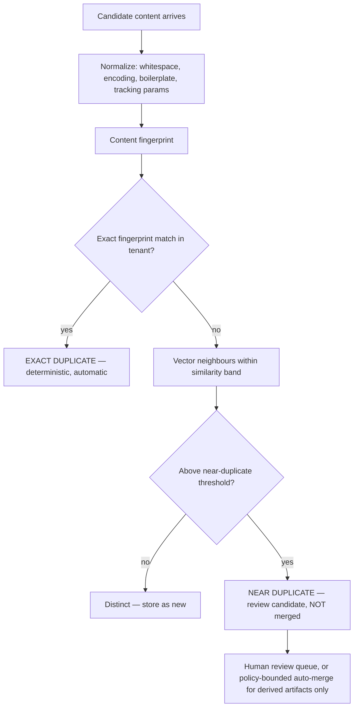
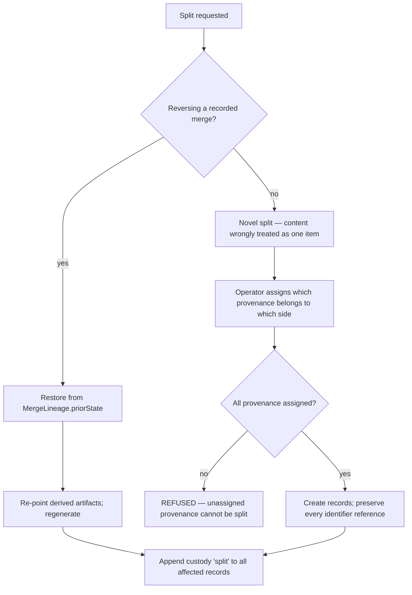
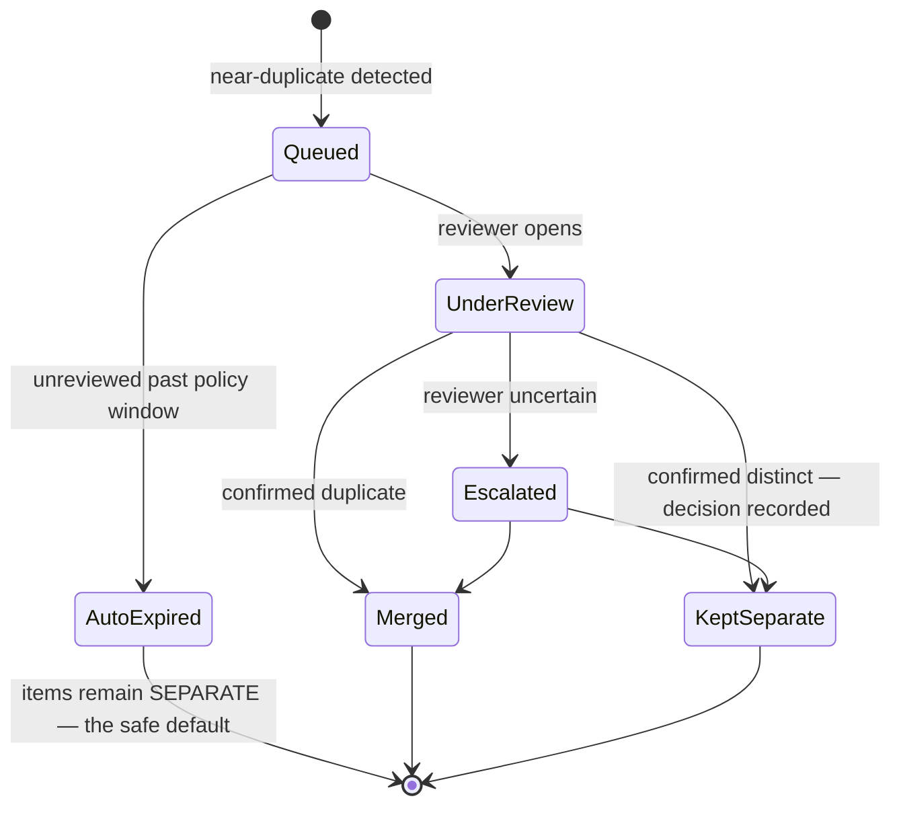

# Deduplication

> **Status:** v1.0 — complete. New in Phase 7.
> **The governing rule:** derived artifacts may be regenerated; **human decisions remain authoritative**. Similarity produces review candidates, never automatic merges of authoritative records.

## Overview

**Business purpose.** Research retrieves the same content repeatedly — a statistic syndicated across five outlets, a press release quoted verbatim by a dozen publications, a source re-fetched during refresh. Without deduplication, a workspace's Evidence Bank fills with near-copies, retrieval returns five versions of one fact, generated content cites the same claim five ways, and storage cost grows with redundancy rather than knowledge.

Correct deduplication does the opposite: it turns repeated observation into **corroboration signal**. Three independent sources stating the same thing is stronger evidence than one, and only deduplication can tell the difference between three sources and one source seen three times.

**Technical purpose.** Detect exact and near duplicates, select canonical representatives, execute reversible merges that preserve lineage completely, support splits that preserve historical references, and route ambiguity to human review rather than resolving it by guess.

## Responsibilities

- Duplicate detection: exact and near.
- Canonical selection among duplicates.
- Merge workflow for evidence and sources.
- Split workflow.
- Conflict resolution when duplicates disagree.
- Lineage tracking through custody links.
- Merge reversibility.
- The human review queue.

## Non-responsibilities

| Not owned | Owner |
|---|---|
| Entity merge and split | `entity-graph.md` — entity resolution is a distinct problem |
| Evidence storage and immutability | `evidence-bank.md` |
| The provenance record and custody schema | `provenance.md` |
| Similarity computation | `vector-search.md` — this component consumes `neighbours` |
| Retention and deletion | `governance.md` |
| Whether duplicated content is *true* | `05-content-platform/review-engine.md` |
| Any score | ADR-021 |

**Relationship to `entity-graph.md`.** Both merge things and both must never lose history, and they share those principles deliberately. They are separate because the problems differ: deduplication asks *"is this the same content?"* — answerable by hashing and similarity; entity resolution asks *"is this the same real-world thing?"* — answerable only with world knowledge and judgment. One is mechanical, the other is not.

## Detection



| Class | Determination | Action |
|---|---|---|
| **Exact** | Identical fingerprint after normalization | Automatic — a custody link is appended, no new item created |
| **Near** | Similarity above threshold, fingerprints differ | **Review candidate.** Never auto-merged for authoritative records |
| **Distinct** | Below threshold | Stored independently |

**Normalization is where deduplication succeeds or fails.** Two retrievals of one page differ by tracking parameters, timestamps, session tokens, advertising markup, and cookie banners. Normalization strips what is presentational and retains what is substantive — and a normalization regression presents as a collapsed deduplication ratio, which is why that ratio is alerted rather than merely charted.

**Thresholds are versioned policy, not constants.** This document specifies the architecture — bands, review routing, escalation — and never numeric values, which are tuned against measured false-merge and false-split rates.

## The automation boundary

The rule that separates safe automation from damaging automation:

| Artifact | Class | Automatic merge |
|---|---|---|
| Embeddings, vector index entries | Derived | **Yes** — regenerable, no history to lose |
| Extracted entity mentions | Derived | **Yes** — regenerable from evidence |
| Concept links | Derived | **Yes** |
| **Evidence items** | **Authoritative** | **No** — near-duplicates go to review |
| **Provenance records** | **Authoritative** | **Never merged at all** — always preserved separately |
| **Verified aliases, human merge decisions** | **Authoritative** | **Never** |

**Exact duplicates of evidence are the one automatic case**, and they are safe precisely because they are not a judgment: identical normalized content is identical content, and the operation appends a provenance observation rather than discarding one.

**Near-duplicate evidence is never merged automatically.** Two excerpts that are 94% similar may be the same claim restated or two genuinely different figures from different periods. Merging them silently would destroy a real distinction and attribute one source's number to another — invisible in generated content until someone checks.

## Canonical selection

When duplicates are confirmed, one becomes canonical. Selection is **deterministic and ordered**, so the same duplicate set always yields the same canonical choice:

1. **Earliest acquisition** — the first retrieval established the record.
2. **Highest source trust** — where trust estimates differ materially.
3. **Most complete provenance** — a record with `publishedAt` outranks one without.
4. **Most complete archive** — a full document outranks a partial fetch.
5. **Lexicographic identifier** — a total tie-break, so selection is never arbitrary.

**Non-canonical duplicates are retained, not deleted.** They become `superseded` with a forward pointer, and their provenance survives intact. That is what makes a merge reversible and what preserves the corroboration signal — three retentions of one claim from three sources is the fact that matters.

## Merge workflow

```mermaid
sequenceDiagram
    participant D as Deduplication
    participant R as Review queue
    participant EB as Evidence Bank
    participant PROV as Provenance
    participant EP as Embedding Pipeline
    participant PG as PostgreSQL

    D->>D: detect duplicate set; select canonical
    alt exact duplicate
        D->>PROV: append custody link 'deduplicated'
        D->>PG: no new evidence item created
    else near duplicate — authoritative
        D->>R: enqueue review candidate with both records + diff
        R-->>D: human decision (merge | keep separate | split later)
        alt merge approved
            D->>PG: BEGIN
            D->>EB: mark non-canonical superseded → canonical
            D->>PROV: append custody 'merged' to BOTH records
            D->>PG: write MergeLineage with full prior state
            D->>PG: outbox EvidenceDeduplicated
            D->>PG: COMMIT
            D->>EP: regenerate derived artifacts for the canonical item
        else keep separate
            D->>PG: record a negative decision — suppresses re-review
        end
    end
```

**Negative decisions are recorded.** A human deciding two items are genuinely distinct must not be asked again every sweep. The decision is stored and suppresses re-review unless the content itself changes — without this, the review queue re-presents the same rejected pairs indefinitely and reviewers stop trusting it.

**Derived artifacts are regenerated, not merged.** Embeddings and mentions for the non-canonical item are dropped and recomputed for the canonical one. Attempting to merge vectors would produce a representation of neither.

## Lineage

Every merge writes a lineage record sufficient to reconstruct the prior state exactly:

```ts
interface MergeLineage {
  mergeId: string;
  tenantId: string;
  canonicalEvidenceId: string;
  mergedEvidenceIds: string[];
  priorState: Array<{
    evidenceId: string;
    status: EvidenceStatus;
    supersededBy: string | null;
    provenanceSnapshot: Provenance;      // complete, not summarized
  }>;
  detectionMethod: 'exact_fingerprint' | 'near_similarity' | 'manual';
  similarityObserved?: number;
  decidedBy: ActorRef;                    // system for exact, human for near
  reason: string;
  reversible: boolean;
  correlationId: string;
}
```

**The prior state includes complete provenance snapshots**, not references. A reversal must be able to reconstruct records independently of whatever happened to the live rows afterward.

**Evidence identifiers are never reused, never reassigned, and never deleted.** A merged-away item's identifier continues to resolve — to a superseded record with a forward pointer. Citations created before a merge remain resolvable, which is what allows deduplication to run against a corpus that published content already depends on.

## Split workflow

Splitting reverses a merge, or separates content that was wrongly considered one item.



**A split with unassigned provenance is refused.** Every provenance observation must belong to exactly one resulting record; dropping one would break the chain of custody, and duplicating one would falsely assert two independent acquisitions.

**Historical references survive.** A citation to the pre-split item resolves to whichever resulting record retains the cited excerpt range; where it spans both, it resolves to the canonical side with the split recorded — never to nothing.

## Conflict resolution

Duplicates sometimes disagree — the same syndicated article with a corrected figure, or a page edited between retrievals.

| Conflict | Handling |
|---|---|
| Same fingerprint, different provenance | Not a conflict — append both observations; this is corroboration |
| Near-duplicate, materially different figures | **Never merged.** Both retained; flagged as `contradictory_evidence` for Review |
| Near-duplicate, one has fuller context | Review candidate; canonical selection prefers completeness |
| Same URL, different content across retrievals | Supersession, not deduplication — the source changed (`freshness-engine.md`) |
| Near-duplicate across different sources | Retained separately; corroboration is the point |

**Contradictory evidence is surfaced, never reconciled here.** Two sources stating different figures is a fact about the world, and deciding which is correct requires judgment this component does not have. It flags the contradiction; the Review Engine's `fact_confidence` work resolves it (`05-content-platform/review-engine.md`).

That is the deduplication analogue of the platform's general rule: **surface the difficulty rather than resolving it invisibly.**

## Human review workflow



**An unreviewed candidate expires to "keep separate."** The safe default is redundancy, not conflation: two retained copies waste storage, while a wrong merge corrupts evidence. Defaulting to the reversible failure is the only defensible choice.

Review presents a **diff** — the normalized content difference, both provenance records, both sources' trust and freshness, and observed similarity — so the decision is made on evidence rather than on a similarity number.

## Business rules

1. **Never automatically merge authoritative records** on similarity. Exact fingerprint matches are the sole automatic case.
2. **Similarity creates review candidates only.**
3. **Every merge preserves lineage** sufficient for exact reconstruction.
4. **Every split preserves historical references.**
5. **No loss of provenance** — observations are appended or reassigned, never discarded.
6. **No loss of evidence identifiers** — never reused, never reassigned, always resolvable.
7. **Derived artifacts are regenerated**, never merged.
8. Canonical selection is **deterministic and ordered**.
9. **Negative decisions are recorded** and suppress re-review.
10. **Unreviewed candidates expire to separate**, the safe default.
11. **Contradictory evidence is flagged, never reconciled** here.
12. Thresholds are **versioned policy**; this document specifies no numeric values.
13. Deduplication is **per workspace**; cross-tenant deduplication is prohibited outright (`evidence-bank.md` rule 6).

**Idempotency:** detection is deterministic per `(tenantId, fingerprint)`; a repeated sweep produces the same candidate set. **Concurrency:** merges lock every participating record; concurrent merges of overlapping sets serialize.

## AI usage

**None.** Detection is hashing and vector similarity; the vectors come from `embedding-pipeline.md` and the comparison from `vector-search.neighbours`. Canonical selection is deterministic ordering. Review is human.

A model was considered for near-duplicate adjudication and rejected: it would introduce probabilistic judgment into an operation whose failure mode is silent evidence corruption, and it would make merge decisions unexplainable to the reviewer who has to trust them.

## Scoring

Per **ADR-021**: no categories produced or consumed. Similarity is a distance; the deduplication ratio is an operational metric. Neither carries a verdict, a 0–100 normalization, or a registry category.

## Events

Published through the transactional outbox in the state-changing transaction (ADR-020).

| Event | Producer | Consumers | Payload | Retry / DLQ |
|---|---|---|---|---|
| `EvidenceDeduplicated` | This component | Embedding Pipeline (regenerate), Retrieval (invalidate), Observability | `{ canonicalEvidenceId, mergedIds[], detectionMethod, mergeId }` | **Critical** |
| `DuplicateCandidateQueued` | This component | Review queue, Notifications | `{ candidateId, evidenceIds[], similarityObserved }` | Standard |
| `DuplicateDecisionRecorded` | This component | Observability, Review queue | `{ candidateId, decision, decidedBy }` | Standard |
| `EvidenceSplit` | This component | Embedding Pipeline, Citation Engine, Retrieval | `{ originalId, resultingIds[], mergeId? }` | **Critical** |
| `MergeReversed` | This component | All derived consumers, Audit | `{ mergeId, restoredIds[], actor, reason }` | **Critical** |
| `ContradictoryEvidenceDetected` | This component | **Review Engine**, Notifications | `{ evidenceIds[], conflictType }` | Critical |

**Consumed:** `EvidenceStored` → detect against the existing corpus; `EvidenceSuperseded` → re-evaluate affected candidate sets; `EmbeddingVersionChanged` → near-duplicate detection re-baselines, since similarity is not comparable across embedding generations (`vector-search.md`).

That last consumption is easy to overlook: a near-duplicate threshold calibrated against one embedding generation is meaningless against another, so a version change invalidates pending candidates rather than carrying them forward.

## Database impact

New tables, additive. **No schema redesign.**

| Table | Purpose | Notes |
|---|---|---|
| `merge_lineage` | Complete prior state, method, actor, reason, reversibility | **Append-only; authoritative** — encodes human decisions, so it is backed up, not classed as derived |
| `duplicate_candidates` | `tenant_id`, evidence ids, similarity, state, decided by, decided at | Negative decisions retained to suppress re-review |
| `deduplication_policies` | Versioned thresholds, review windows, expiry | Reference data (ADR-025 exception class) |

Relies on existing constraints: `UNIQUE (tenant_id, fingerprint)` on `evidence_items` (exact detection), and the `superseded_by` self-reference (`03-database/tables.md` §4).

**Indexes:** `(tenant_id, state)` on candidates for the review queue; `(canonical_evidence_id)` on lineage for reversal; `(tenant_id, decided_at)` for negative-decision lookup during detection.

**`merge_lineage` is authoritative.** Like verified aliases and entity merge records (`entity-graph.md`), it captures judgment a rebuild cannot reconstruct.

## APIs

Published interfaces only (`knowledge-apis.md`).

| Interface | Purpose |
|---|---|
| `Deduplication.detect(evidenceId) → DuplicateSet` | Detection for a single item |
| `Deduplication.candidates(tenantId, filter) → DuplicateCandidate[]` | Review queue |
| `Deduplication.merge(candidateId, decision, actor) → MergeLineage` | Elevated; audited |
| `Deduplication.split(evidenceId, assignment, actor) → SplitResult` | Elevated; audited |
| `Deduplication.reverse(mergeId, actor, reason) → ReversalResult` | Elevated; audited |
| `Deduplication.lineageFor(evidenceId) → MergeLineage[]` | Audit and support |

**REST:** `GET /v1/knowledge/duplicates` · `POST /v1/knowledge/duplicates/{id}/decide` · `POST /v1/knowledge/evidence/{id}/split` · `POST /v1/knowledge/merges/{id}/reverse`. Merge, split, and reversal require `research.evidence.retract`-level authority — all three alter what evidence exists and can change what published content means.

## Security

- **Deduplication is per workspace, never across.** Cross-tenant deduplication would reveal that another workspace holds identical content — an inference channel, and prohibited outright.
- Merge, split, and reversal are **elevated, audited operations** with actor and reason.
- Review candidates expose excerpt content to reviewers and are permission-gated at the workspace level.
- **Lineage is tamper-evident**: append-only, with `UPDATE`/`DELETE` revoked, so a merge cannot be retroactively rewritten.
- The review queue is a social-engineering surface — a reviewer approving a bad merge corrupts evidence — so decisions record the actor and are reversible.
- Reference `16-security/`; this component defines no controls of its own.

## Performance

| Concern | Approach |
|---|---|
| Exact detection | Single unique-index probe on ingestion; effectively free |
| Near detection | Bounded `neighbours` query; **not** run on every ingestion — batched in a sweep |
| Sweep shape | Per workspace, over recently-ingested evidence, off-peak |
| Merge | Bounded transaction; large sets process in batches |
| Regeneration | Asynchronous; the merge commits before derived artifacts rebuild |
| Review queue | Cursor-paginated; candidates carry precomputed diffs |

**Near-duplicate detection is deliberately not on the ingestion path.** Running a vector query per incoming item would add latency to research and multiply retrieval load during a batch. Exact detection is inline and cheap; near detection is a sweep, and evidence is briefly redundant until it runs — a trade that costs storage and buys ingestion throughput.

## Observability

- **Metrics:** `deduplication_detections_total{class}`, `deduplication_hit_ratio`, `duplicate_candidates_queued_total`, `duplicate_review_backlog` (gauge), `duplicate_decisions_total{decision}`, `merges_total{method}`, `merge_reversals_total`, `splits_total`, `contradictory_evidence_total`, `candidate_expiry_total`.
- **Tracing:** detection is a span within the sweep; merges trace with `correlationId` linking to the review decision.
- **Logging:** evidence ids, fingerprints, similarity, decision, actor, correlation id — never excerpt content.
- **Business KPIs:** deduplication hit ratio (storage and cost efficiency, and a normalization-health signal) and **merge reversal rate** — a rising reversal rate means the review process is approving bad merges, which is the failure this component's design most guards against.
- **Alerts:** `deduplication_hit_ratio` collapsing (**normalization regression** — near-certainly a parser change); review backlog above threshold; any `MergeReversed` (notify — a bad merge reached evidence); `EvidenceDeduplicated` or `EvidenceSplit` DLQ entries, which leave derived artifacts inconsistent.

## Cross references

- `evidence-bank.md` — the immutability and identity rules this component operates within
- `provenance.md` — custody links appended on every merge and split
- `vector-search.md` — `neighbours` for near-duplicate detection; embedding-version sensitivity
- `embedding-pipeline.md` — regenerates derived artifacts after a merge
- `entity-graph.md` — the sibling merge problem, deliberately separate
- `citation-engine.md` — identifiers must remain resolvable across merges
- `governance.md` — retention interacts with deduplication; lineage is authoritative
- `05-content-platform/review-engine.md` — resolves contradictory evidence
- `03-database/tables.md` §4 — the fingerprint constraint enabling exact detection
