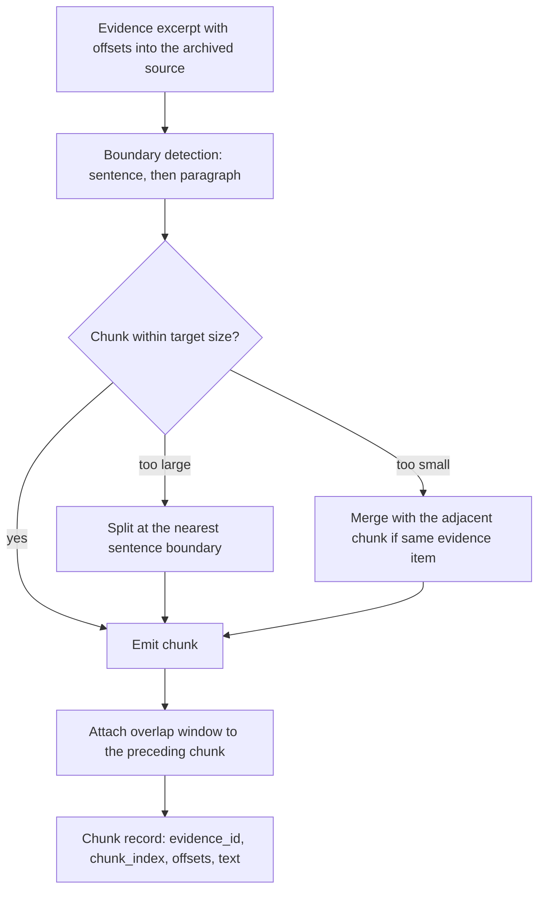
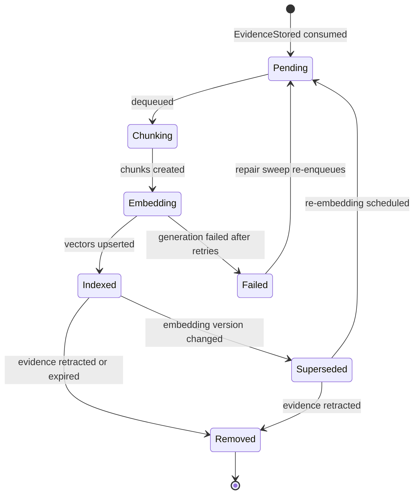
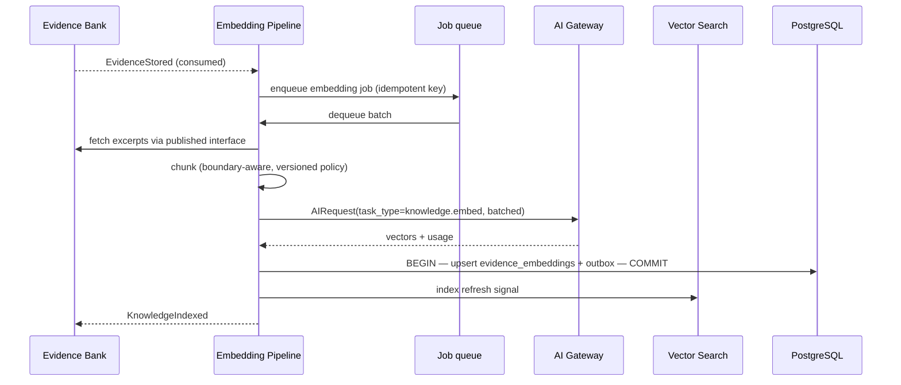
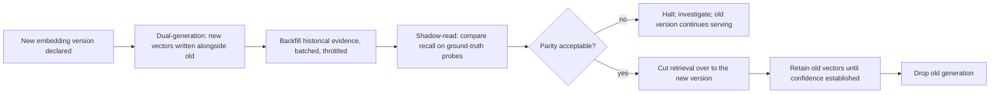

# Embedding Pipeline

> **Status:** v1.0 — complete. New in Phase 7.
> **Classification: derived.** Embeddings are rebuildable from evidence plus archives, non-authoritative, and excluded from the authoritative backup set. Losing them degrades retrieval; it compromises no fact.

## Overview

**Business purpose.** Semantic retrieval is what lets the platform ground a section about "reducing churn" in a source discussing "subscriber retention." Without vectors, grounding would work only where vocabulary happened to match, and the Evidence Bank would be a store nobody could search well.

**Technical purpose.** Convert evidence excerpts into chunk-level vector representations, maintain them across model and strategy changes, coordinate index refresh, and detect the quality drift that silently degrades retrieval as a corpus grows.

**Design posture — derived, always.** Every decision here follows from embeddings being reconstructible. Failures degrade rather than corrupt, rebuilds are a routine operation rather than a disaster recovery, and no correctness property of the platform depends on a vector being present.

## Responsibilities

- Chunk creation from evidence excerpts.
- Embedding generation, through the AI Gateway.
- Embedding version identity and coexistence during migration.
- Re-embedding: on model change, chunking change, or drift.
- Queue orchestration and backlog management.
- Index refresh coordination with vector search.
- Drift detection against ground-truth probes.

## Non-responsibilities

| Not owned | Owner |
|---|---|
| **Provenance** — this component never records or modifies it | `provenance.md` |
| Evidence storage, immutability, lifecycle | `evidence-bank.md` |
| Index configuration, ANN parameters, search execution | `vector-search.md` |
| Query-side embedding and expansion | `retrieval-pipeline.md` |
| Model selection, prompts, routing | `08-ai-platform/` |
| Deciding *when* a source is stale | `freshness-engine.md` |
| **Any business logic** | The Content Platform |
| Any score | ADR-021 |

**On provenance:** a chunk inherits its evidence item's provenance by reference and never carries a copy. Copying it would create a second place where the record of origin lives — and a derived component holding a copy of authoritative data is exactly the blurring the derived/authoritative boundary exists to prevent.

## Chunking

Evidence excerpts are bounded by policy but still frequently exceed useful embedding granularity. Chunking splits them; how it splits determines retrieval quality more than the embedding model does.



| Rule | Reasoning |
|---|---|
| **Never split mid-sentence** | A half-sentence vector represents nothing retrievable |
| **Never split across evidence items** | A chunk spanning two sources would resolve to ambiguous provenance |
| **Overlap between adjacent chunks** | A claim landing on a boundary is otherwise retrievable from neither side |
| **Chunk offsets are absolute into the archived source** | So a retrieved chunk is verifiable against the original, exactly like its parent excerpt |
| Target size and overlap are **policy**, versioned | They will be tuned against measured recall, not guessed once |

**Chunk offsets are absolute, not relative to the excerpt.** That preserves the verification chain: a retrieved chunk resolves to a range in the archived document, the same property that makes an evidence item verifiable at all.

## Embedding version identity

An embedding is only comparable to another embedding produced the same way. Three inputs form its version:

```ts
interface EmbeddingVersion {
  modelIdentity: string;        // OPAQUE — supplied by the AI Platform, never interpreted here
  chunkingVersion: string;      // chunk size, overlap, boundary rules
  normalizationVersion: string; // text normalization applied before embedding
}
// rendered as a single opaque string, e.g. 'emb@3'
```

**`modelIdentity` is opaque.** This component never parses it, never branches on it, and never names a model. It records what the AI Platform reported and uses it only for equality comparison — which is the entire requirement.

**Comparing vectors across versions is prohibited.** Different chunking or normalization produces geometrically incompatible spaces, and a distance computed across them is meaningless. `vector-search.md` refuses cross-generation ranking; this component is what makes the version knowable.

## Lifecycle



**`Failed` is recoverable and visible.** Evidence remains valid and citable while its vectors are missing — it simply is not retrievable semantically. That degradation is recorded and swept, never silent, because silently unretrievable evidence looks identical to evidence that does not exist.

## Generation



**Generation goes through the AI Gateway** (ADR-008) with `task_type = knowledge.embed`. This platform holds no prompt, names no model, imports no provider SDK, and performs no routing. It receives vectors and a version identity.

**Batching is essential.** Embedding is the highest-volume AI task in the platform — one evidence item yields several chunks, and a research run produces dozens of items. Per-chunk dispatch would multiply request overhead by an order of magnitude against a task whose per-item cost is otherwise trivial.

**Cost is metered like any AI call** (`08-ai-platform/cost-management.md`), attributed to the research run that produced the evidence — so embedding cost appears in cost-per-article rather than as unattributed platform overhead.

## Re-embedding

Three triggers, one mechanism:

| Trigger | Scope | Urgency |
|---|---|---|
| **Model change** (OQ-11 resolution, or a later upgrade) | Entire corpus | Planned migration |
| **Chunking or normalization policy change** | Entire corpus | Planned migration |
| **Drift detected** | Targeted or full | Investigated first |



**Both generations coexist during migration**, and `vector-search.md` refuses to rank across them — retrieval serves one version at a time, cutting over atomically per tenant. Serving a mixed corpus would produce rankings where half the candidates were scored in a different space.

**Backfill is throttled and resumable.** Re-embedding a large corpus is a significant AI spend event; it runs against a budget ceiling, off-peak, and pauses if it would breach cost thresholds (`08-ai-platform/cost-management.md`).

**Old vectors are retained until the new generation proves itself.** The fallback is instant — cut retrieval back — rather than a rebuild under pressure.

## Drift detection

HNSW recall degrades silently as a corpus grows and parameters stay fixed. There is no error to observe, only worse answers.

| Probe | Mechanism | Signal |
|---|---|---|
| **Ground-truth recall** | A fixed query set with known-correct evidence, retrieved periodically | `recall@k` trend |
| **Chunk-length distribution** | Statistical monitoring | A shift indicates upstream parsing changes |
| **Embedding norm distribution** | Statistical monitoring | An outlier cluster suggests a model or normalization change |
| **Retrieval-to-citation conversion** | Share of retrieved evidence that ends up cited | The truest quality signal, though it lags |

**Ground-truth probes are the primary mechanism** because they are the only one that measures the thing that matters directly. They are per workspace class rather than per tenant — a fixed synthetic corpus with known answers, so the measure is comparable over time.

Drift is **investigated, never auto-remediated**. A recall decline could be corpus growth, an index parameter mismatch, a chunking regression, or a genuine model change — and re-embedding a corpus in response to the wrong diagnosis is expensive and does not help.

## Business rules

1. **Embeddings are derived.** Rebuildable from evidence plus archives, excluded from the authoritative backup set (`14-operations/backup-recovery.md` §3.1).
2. **This component never records or modifies provenance.** Chunks reference their evidence item.
3. **Chunks never span evidence items** and never split mid-sentence.
4. **Chunk offsets are absolute** into the archived source, preserving verifiability.
5. **`modelIdentity` is opaque** — never parsed, never branched on, never named.
6. **Cross-version vector comparison is prohibited.**
7. Generation is **always through the AI Gateway**; no prompts, routing, providers, or model-specific behaviour exist here.
8. **Missing vectors degrade retrieval, never correctness.** Evidence without vectors remains valid and citable.
9. Writes are **idempotent per `(evidence_id, chunk_index, embedding_version)`**.
10. Re-embedding **retains the prior generation** until parity is established.
11. Backfill is **budget-bounded and throttled**.
12. Evidence retraction or expiry **removes vectors immediately** — the `ON DELETE CASCADE` on `evidence_embeddings` is the only cascade in the schema, and it exists precisely because these rows are derived.
13. **No business logic.** Chunking is structural; nothing here knows what an article is.

**Idempotency:** the unique constraint on `(evidence_id, chunk_index)` makes retried jobs safe — a constraint violation is treated as success. **Concurrency:** jobs partition by evidence item; two workers never contend on one item's chunks.

## AI usage

| Task type | Purpose | Direction |
|---|---|---|
| `knowledge.embed` | Produce vectors for a batch of chunks | Knowledge Platform → AI Gateway → derived vectors → Knowledge Platform |

That is the complete list. No prompt template content is owned here — the Prompt Engine holds the embedding request shape, and this component supplies text and receives vectors.

## Scoring

Per **ADR-021**: no categories produced or consumed. Vector norms, distances, and recall measurements are geometric and statistical properties. None carries a verdict, a 0–100 normalization, or a registry category, and none leaves the platform as a Score.

## Events

Published through the transactional outbox in the state-changing transaction (ADR-020).

| Event | Producer | Consumers | Payload | Retry / DLQ |
|---|---|---|---|---|
| `EmbeddingsGenerated` | This component | Vector Search (index refresh), Observability | `{ evidenceId, chunkCount, embeddingVersion }` | Standard |
| `KnowledgeIndexed` | This component | **Planning Engine** (coverage may proceed), Progress stream | `{ runId, evidenceCount, vectorCount }` | Standard |
| `EmbeddingGenerationFailed` | This component | Repair sweep, Observability | `{ evidenceId, reason, attempts }` | Standard — **alert on sustained** |
| `EmbeddingVersionChanged` | This component | **Vector Search (coexistence)**, Retrieval, Observability | `{ previousVersion, newVersion, scope }` | **Critical** |
| `ReEmbeddingProgress` | Backfill worker | Observability, Notifications | `{ version, completed, total, budgetUsedUsd }` | Standard |
| `EmbeddingDriftDetected` | Drift probe | **Observability — alert**, Notifications | `{ metric, baseline, observed, scope }` | Critical |

**Consumed:** `EvidenceStored` → enqueue; `EvidenceRetracted` / `EvidenceExpired` → remove vectors; `EvidenceSuperseded` → embed the successor, retain the predecessor's vectors until it leaves retrieval.

`KnowledgeIndexed` is the event Planning waits on — it is what makes vector availability a pipeline dependency rather than an invisible race.

## Database impact

Owns `evidence_embeddings` (`03-database/tables.md` §4). **No schema redesign.**

| Aspect | Detail |
|---|---|
| Columns | `tenant_id` (denormalized for the mandatory filter), `evidence_id` FK **`ON DELETE CASCADE`**, `chunk_index`, `embedding VECTOR(n)`, `model` / embedding version, chunk offsets |
| Constraint | `ux_evidence_embeddings__evidence_chunk` — idempotent writes |
| Index | HNSW, owned and configured by `vector-search.md` |
| Dimension | Fixed by the embedding model — **migration `0019` remains blocked on OQ-11** |
| Volume | 10⁹ rows; the highest write-amplification table in the platform |

New table, additive:

| Table | Purpose |
|---|---|
| `embedding_versions` | Version registry: `modelIdentity`, chunking version, normalization version, status (`active`, `migrating`, `retired`), created at |

**Queue state lives in Redis** (BullMQ). Backlog is a first-class operational signal, not an internal detail.

## APIs

Internal only; no consumer calls this component directly except the freshness engine.

| Interface | Purpose |
|---|---|
| `EmbeddingPipeline.enqueue(evidenceIds[], priority) → JobRef` | Normally event-driven; direct enqueue for repair and refresh |
| `EmbeddingPipeline.reEmbed(scope, version) → MigrationRef` | Planned migration, admin-initiated |
| `EmbeddingPipeline.status(scope) → { backlog, failed, coverage }` | Operational |
| `EmbeddingPipeline.currentVersion() → EmbeddingVersion` | Consumed by vector search and retrieval |

**Admin REST:** `GET /internal/v1/knowledge/embeddings/status` · `POST /internal/v1/knowledge/embeddings/reembed` (audited) · `GET /internal/v1/knowledge/embeddings/versions`.

## Security

- **Tenant isolation:** `tenant_id` is denormalized onto every vector row specifically so the mandatory retrieval filter needs no join (`vector-search.md`).
- Excerpt text is transmitted to a model through the Gateway, where PII redaction and guardrails have already applied.
- **Vectors are not plaintext but are not safe to expose** — embedding inversion research shows meaningful reconstruction is possible. Vectors are never returned by any API, never logged, and never included in event payloads.
- Re-embedding is an admin operation with significant cost, so it is audited and budget-bounded.
- Reference `16-security/`; this component defines no controls of its own.

## Performance

| Concern | Approach |
|---|---|
| Batching | Chunks batched per request; the dominant cost control |
| Asynchrony | Generation never blocks evidence ingestion or run completion |
| Backlog | Monitored explicitly; a growing backlog means grounding is silently degrading |
| Write amplification | Bulk upserts; HNSW maintenance is the expensive part and is amortized |
| Backfill | Throttled to keep replication lag and cost within thresholds |
| Idempotency | Constraint-based, so retries are free |

**Backlog is the signal that matters.** Evidence ingested but not embedded is invisible to semantic retrieval, and the failure presents as thin grounding rather than as an error — which is why backlog has an alert rather than only a dashboard.

## Observability

- **Metrics:** `embedding_jobs_total{outcome}`, `embedding_backlog` (gauge), `embedding_duration_seconds`, `chunks_per_evidence` (histogram), `embedding_failures_total{reason}`, `reembedding_progress_ratio`, `embedding_cost_usd`, `vector_recall_at_k` (from drift probes), `embedding_coverage_ratio` (evidence with vectors ÷ active evidence).
- **Tracing:** generation is a span consumed from `EvidenceStored`, linked by `correlationId` to the research run that produced the evidence.
- **Logging:** evidence id, chunk count, version, outcome — **never chunk text and never vectors**.
- **Business KPIs:** `embedding_coverage_ratio` (the honest measure of whether retrieval can see the corpus) and retrieval-to-citation conversion.
- **Alerts:** backlog above threshold (**grounding degrades silently otherwise**); `embedding_coverage_ratio` below threshold; `EmbeddingVersionChanged` DLQ entries (**retrieval may rank across generations**); drift detected; backfill cost approaching its ceiling.

## Cross references

- `vector-search.md` — configures and queries the index this component populates
- `evidence-bank.md` — the authoritative source these vectors are derived from
- `retrieval-pipeline.md` — the consumer; owns query-side embedding
- `freshness-engine.md` — requests re-embedding on staleness
- `provenance.md` — deliberately not owned here; chunks reference it
- `08-ai-platform/ai-gateway.md` — the only path to generation
- `08-ai-platform/cost-management.md` — embedding cost attribution and backfill budgets
- `03-database/tables.md` §4 · `indexes.md` §10
- `14-operations/backup-recovery.md` §3.1 — why embeddings are derived and not backed up
- `99-open-questions.md` — OQ-11 (embedding model fixes the dimension and unblocks migration `0019`)
