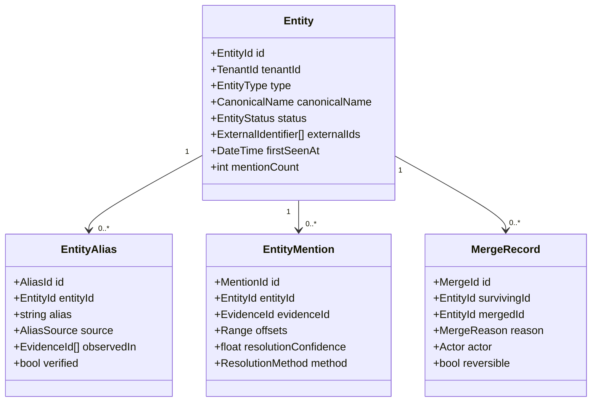
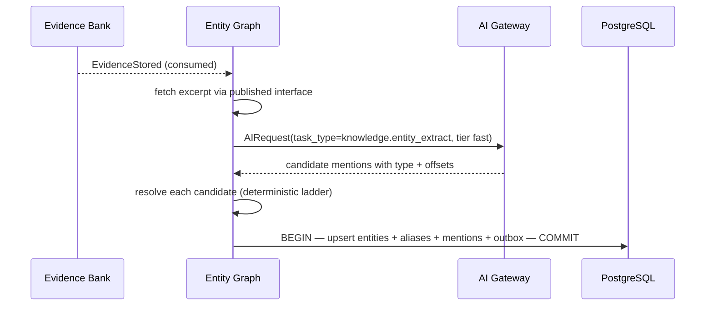

# Entity Graph

> **Status:** v1.0 — complete. New in Phase 7.
> **Scope:** canonical entities, aliases, synonyms, resolution, merge and split rules. It never infers business meaning.

## Overview

**Business purpose.** Content that names things must name them consistently and correctly. "Acme", "Acme Corp", "Acme Corporation", and "ACME Inc." are one company; "Apple" in a nutrition article and "Apple" in a technology article are not the same thing. Getting this wrong produces content that reads as careless — inconsistent product names, conflated companies, a person's credentials attached to the wrong person — and in regulated verticals it produces content that is wrong in a way that matters legally.

Entity resolution is also what makes evidence *aggregatable*. Twelve sources discussing the same product are only useful together if the platform knows they discuss the same product.

**Technical purpose.** Maintain a tenant-scoped registry of canonical entities with their aliases and identifiers, resolve mentions in evidence to canonical entities, and manage merge and split operations without ever losing mention history.

## The single hardest problem here

**Entity resolution is inherently ambiguous, and wrong resolution is worse than no resolution.** Merging two distinct entities silently attributes one company's facts to another; splitting one entity incorrectly fragments evidence that should aggregate. Both failures are invisible in generated content until someone notices a factual absurdity.

Every rule below follows from that: resolution is conservative, merges are reversible, provenance of the merge decision is retained, and ambiguity is surfaced rather than resolved by guessing.

## Entities versus concepts

| | **Entity Graph (here)** | **Knowledge Graph** |
|---|---|---|
| Node | A specific named thing | An idea or topic |
| Example | "Kubernetes", "Acme Corp", "Jane Smith" | "container orchestration", "pricing strategy" |
| Core problem | *"Is this the same thing as that?"* | *"What relates to what?"* |
| Identity | Canonical, anchored to a real-world referent | Semantic, evolves with the corpus |
| Failure mode | Wrong merge or split — factually damaging | Weak structure — degrades suggestions |

They interlink: an entity participates in concepts (`concept_entity_links`, owned by `knowledge-graph.md`). They are not merged because resolution and relationship discovery are different problems with different failure modes.

## Responsibilities

- Canonical entity registry: identity, type, canonical name.
- Aliases and synonyms, with their observed provenance.
- External identifiers where available.
- Mention resolution: linking an occurrence in evidence to a canonical entity.
- Merge and split workflows, with full reversibility.
- Ambiguity surfacing when resolution is not confident.
- Entity-scoped evidence lookup.

## Non-responsibilities

| Not owned | Owner |
|---|---|
| Concepts and topical relationships | `knowledge-graph.md` |
| Embeddings and vector similarity | `embedding-pipeline.md`, `vector-search.md` |
| Evidence storage and provenance | `evidence-bank.md` |
| **Business meaning** — is this entity a competitor, a customer, important? | `05-content-platform/` |
| Whether a stated fact about an entity is true | `05-content-platform/review-engine.md` |
| Brand terminology preferences | `08-ai-platform/ai-memory.md` (ADR-026) |
| Any score | ADR-021 |

**The business-meaning boundary.** This component knows that "Acme Corp" is an organization mentioned in fourteen evidence items with three observed aliases. It does not know whether Acme is a competitor, a partner, or irrelevant — that is workspace context and belongs to the Content Platform. A `competitor` entity type would be a business classification smuggled into infrastructure.

**The terminology boundary.** A workspace preferring "sign-up" over "signup" is a *preference*, stored in AI Memory as personalization (ADR-026). An alias mapping "K8s" to "Kubernetes" is a *fact about the world*, stored here. Preferences shape generation; aliases resolve identity.

## Domain model



### Entity types

A **closed, registry-backed vocabulary** of structural types — deliberately not business classifications.

| Type | Examples |
|---|---|
| `organization` | Companies, institutions, agencies |
| `person` | Named individuals |
| `product` | Products, services, software |
| `location` | Places, regions, markets |
| `technology` | Standards, protocols, frameworks |
| `event` | Named events, releases, incidents |
| `publication` | Named sources, studies, reports |

`competitor`, `customer`, and `partner` are **not** types — they are relationships between an entity and a workspace, and they belong to the Content Platform.

## Resolution

```mermaid
flowchart TB
    A["Mention observed in evidence"] --> B{Exact canonical-name match?}
    B -- yes --> C["Resolved — method: exact, confidence high"]
    B -- no --> D{Verified alias match?}
    D -- yes --> C2["Resolved — method: alias"]
    D -- no --> E{External identifier present and matches?}
    E -- yes --> C3["Resolved — method: external_id, confidence highest"]
    E -- no --> F{Normalized form match? (case, punctuation, legal suffix)}
    F -- yes --> G["Resolved — method: normalized; alias recorded as observed"]
    F -- no --> H{Semantic similarity above threshold AND type-compatible?}
    H -- yes --> I["PROVISIONAL resolution — flagged for review, NOT merged"]
    H -- no --> J["New entity created — provisional status"]
```

**Resolution is deterministic first, semantic last.** External identifier, exact name, and verified alias are certainties; normalization is near-certain; semantic similarity is a *suggestion*, never an automatic merge.

**Semantic similarity never auto-merges.** It produces a provisional link flagged for review. Two organizations with similar names are frequently different organizations, and an automatic merge on similarity would attribute one company's facts to another — silently, and irreversibly in generated content that has already shipped.

**Type compatibility gates every candidate.** A `person` never resolves to an `organization`, regardless of name similarity.

## Merge and split

```mermaid
sequenceDiagram
    participant OP as Operator or automated rule
    participant EG as Entity Graph
    participant KG as Knowledge Graph
    participant PG as PostgreSQL

    OP->>EG: merge(survivingId, mergedId, reason)
    EG->>EG: verify type compatibility + no conflicting external ids
    alt conflict
        EG-->>OP: MergeConflict — external identifiers disagree
    end
    EG->>PG: BEGIN
    EG->>PG: re-point mentions to surviving entity (mention rows RETAINED)
    EG->>PG: absorb aliases; record merged canonical name as an alias
    EG->>PG: write MergeRecord with full prior state
    EG->>PG: mark merged entity 'merged', pointing to surviving
    EG->>PG: outbox EntityMerged
    EG->>PG: COMMIT
    PG-->>KG: EntityMerged consumed → re-point concept-entity links
```

**Merges are reversible.** The `MergeRecord` retains the merged entity's prior canonical name, its aliases, and the mention set that was re-pointed — enough to reconstruct it exactly. An irreversible merge would make a wrong merge permanent, and wrong merges happen.

**Mentions are never deleted.** They are re-pointed, and the re-pointing is recorded. Source history survives every operation (a rule shared with `deduplication.md`).

**Splits** are the inverse and are harder: separating a wrongly-merged entity requires deciding which mentions belong to which side. The workflow supports splitting by evidence source, by date range, or by explicit mention selection, and **defaults to no automatic assignment** — an operator assigns, or the mentions stay with the surviving entity and are flagged.

**External identifier conflict blocks a merge.** Two entities carrying different registered external identifiers are asserting they are different things, and that assertion outranks name similarity.

## Business rules

1. **Resolution is conservative.** Semantic similarity never auto-merges; it flags.
2. **Type compatibility gates every resolution and merge.**
3. **Merges are reversible**, with prior state retained in a `MergeRecord`.
4. **Mentions are never deleted** — only re-pointed, with the operation recorded.
5. **External identifier conflicts block merges.**
6. Every alias records **where it was observed**; an alias with no provenance is unverified and is not used for automatic resolution.
7. **Entities are tenant-scoped absolutely.** A workspace's entity registry is never shared, even within one organization.
8. **No business classification.** Entity types are structural.
9. New entities begin `provisional` and are promoted on reinforcement across distinct sources — the same discipline as the Knowledge Graph.
10. **Ambiguity is surfaced, not resolved by guessing.** A mention with multiple plausible candidates is recorded as ambiguous, and consumers see the ambiguity.
11. **This component produces no Score** (ADR-021). Resolution confidence is an internal signal that never leaves the platform as a quality measure.
12. Evidence retraction removes the mentions it contained; an entity losing all mentions is archived, not deleted.

**Idempotency:** mention resolution is idempotent per `(evidence_id, offsets)`. **Concurrency:** entity creation is keyed on `(tenant_id, type, normalized_name)` with the unique constraint resolving races; merges take a lock on both entities.

## Events

Published through the transactional outbox in the state-changing transaction (ADR-020).

| Event | Producer | Consumers | Payload | Retry / DLQ |
|---|---|---|---|---|
| `EntityCreated` | This component | Knowledge Graph, Read models | `{ entityId, type, canonicalName, tenantId }` | Standard |
| `EntityPromoted` | This component | Read models | `{ entityId, distinctSources }` | Standard |
| `EntityAliasObserved` | This component | Read models | `{ entityId, alias, source }` | Standard |
| `EntityMerged` | This component | **Knowledge Graph (re-point links)**, Retrieval, Read models | `{ survivingId, mergedId, mentionsRepointed, reversible }` | **Critical** |
| `EntitySplit` | This component | Knowledge Graph, Retrieval, Read models | `{ originalId, newEntityId, mentionsMoved }` | **Critical** |
| `EntityAmbiguityDetected` | This component | Notifications (workspace), Read models | `{ mentionId, candidateIds[], evidenceId }` | Standard |
| `EntityArchived` | This component | Knowledge Graph, Retrieval | `{ entityId, reason }` | Standard |

**Consumed:** `EvidenceStored` → extract and resolve mentions; `EvidenceRetracted` → remove its mentions, archive newly-orphaned entities; `WorkspacePurged` → drop the registry.

`EntityMerged` is **critical** because a lost merge event leaves the Knowledge Graph pointing at a merged-away entity — a dangling link that surfaces as missing relationships rather than as an error.

## Extraction



Extraction goes **through the AI Gateway** (ADR-008) with a fast-tier task. This platform holds no prompt, names no model, and imports no provider SDK. Extracted mentions are **candidates**; resolution is deterministic and owned here.

Extracted entities and mentions are **derived data** — rebuildable from evidence, excluded from the authoritative backup set. Merge records and verified aliases, however, encode **human decisions** and are **not** derived; they are backed up as authoritative, because a rebuild cannot reconstruct a curator's judgment.

That distinction — derived extraction, authoritative curation — is the subtlest storage decision in this component.

## Database impact

New tables, additive to Phase 3, extending the `extracted_entities` and `entity_mentions` tables it already defines (`03-database/tables.md` §4). **No schema redesign.**

| Table | Purpose | Notes |
|---|---|---|
| `extracted_entities` | **Existing.** Canonical entity: `tenant_id`, `type`, `canonical_name`, status | `UNIQUE (tenant_id, type, canonical_name)` |
| `entity_mentions` | **Existing.** `tenant_id`, `entity_id`, `evidence_id`, offsets, confidence, method | `UNIQUE (entity_id, evidence_id)` extended with offsets |
| `entity_aliases` | **New.** `tenant_id`, `entity_id`, `alias`, `normalized_alias`, `source`, `verified` | `UNIQUE (tenant_id, normalized_alias, type)` — an alias resolves to one entity per type |
| `entity_external_ids` | **New.** `tenant_id`, `entity_id`, `scheme`, `identifier` | `UNIQUE (tenant_id, scheme, identifier)` — conflict detection |
| `entity_merge_records` | **New.** Full prior state, actor, reason, reversibility | **Append-only**; the authoritative curation record |

**Indexes:** `(tenant_id, normalized_name, type)` for resolution; `(tenant_id, normalized_alias)` for alias lookup; `(evidence_id)` on mentions for retraction propagation; `(entity_id)` for mention aggregation.

## APIs

Published interfaces only (`knowledge-apis.md`).

| Interface | Purpose |
|---|---|
| `EntityGraph.resolve(mention, type?, tenantId) → ResolutionResult` | The core operation |
| `EntityGraph.get(entityId) → Entity` · `.getMany(ids[]) → Entity[]` | Batch-only for multi-fetch |
| `EntityGraph.evidenceFor(entityId, budget) → EvidenceRef[]` | Entity-scoped grounding |
| `EntityGraph.aliasesFor(entityId) → EntityAlias[]` | Consistency checking during generation |
| `EntityGraph.merge(surviving, merged, reason, actor) → MergeRecord` | Elevated permission; audited |
| `EntityGraph.split(entityId, assignment, actor) → SplitResult` | Elevated permission; audited |
| `EntityGraph.ambiguities(tenantId) → AmbiguityRecord[]` | Curation queue |

**REST:** `GET /v1/knowledge/entities` · `GET /v1/knowledge/entities/{id}` · `POST /v1/knowledge/entities/merge` · `POST /v1/knowledge/entities/{id}/split` · `GET /v1/knowledge/entities/ambiguities`.

Merge and split require `research.evidence.retract`-level authority — they alter how evidence aggregates and can change what published content means.

## Security

- **Tenant isolation is absolute.** An entity registry reveals who a workspace researches — competitors, partners, people — and is commercially sensitive.
- Merge and split are **elevated, audited operations** with actor and reason recorded; both can change the meaning of published content.
- Entity extraction sends excerpts to a model through the Gateway, wrapped as data with guardrails applied.
- Entity names may be **personal data** — a `person` entity is by definition about an identifiable individual. Entities are covered by the platform's erasure obligations, and a subject-erasure request purges person entities attributable to that subject (`governance.md`).
- Reference `16-security/`; this component defines no controls of its own.

## Performance

| Concern | Approach |
|---|---|
| Resolution | Deterministic ladder short-circuits: exact match is an index probe, and it handles the large majority |
| Semantic fallback | Invoked only when deterministic paths fail; bounded candidate set |
| Extraction | Asynchronous from `EvidenceStored`; never blocks ingestion |
| Batch fetch | `getMany` only, preventing N+1 during generation |
| Merge | Bounded transaction; large merges re-point mentions in batches |
| Caching | Alias-to-entity map cached per tenant, invalidated on alias or merge change |

Resolution sits on the entity-extraction path for every evidence item, so the deterministic short-circuit is not an optimization — it is what keeps ingestion affordable.

## Observability

- **Metrics:** `entities_total{type,status}`, `entity_resolutions_total{method}`, `entity_resolution_confidence` (histogram), `entity_merges_total`, `entity_splits_total`, `entity_ambiguities_total`, `entity_extraction_duration_seconds`, `alias_cache_hit_ratio`.
- **Tracing:** extraction and resolution are spans consumed from `EvidenceStored`.
- **Logging:** entity ids, types, resolution method, confidence, correlation id — never excerpts.
- **Business KPIs:** share of mentions resolved deterministically (a rising semantic share means the registry is not keeping up) and ambiguity backlog, which is curation debt.
- **Alerts:** `EntityMerged` or `EntitySplit` DLQ entries (**page** — the Knowledge Graph may hold dangling links); ambiguity backlog above threshold; a spike in new provisional entities, which usually indicates an extraction regression producing noise rather than genuine discovery.

## Cross references

- `knowledge-graph.md` — concepts and relationships; the sibling with a different failure mode
- `evidence-bank.md` — the grounding for every mention
- `deduplication.md` — shares the "never lose source history" principle
- `governance.md` — erasure obligations for person entities
- `08-ai-platform/ai-memory.md` — terminology *preferences*, deliberately distinct from aliases (ADR-026)
- `08-ai-platform/ai-gateway.md` — the only path to extraction
- `05-content-platform/writing-engine.md` — consumes aliases for naming consistency
- `05-content-platform/competitor-intelligence.md` — business classification of entities, deliberately elsewhere
- `03-database/tables.md` §4 — `extracted_entities`, `entity_mentions`
