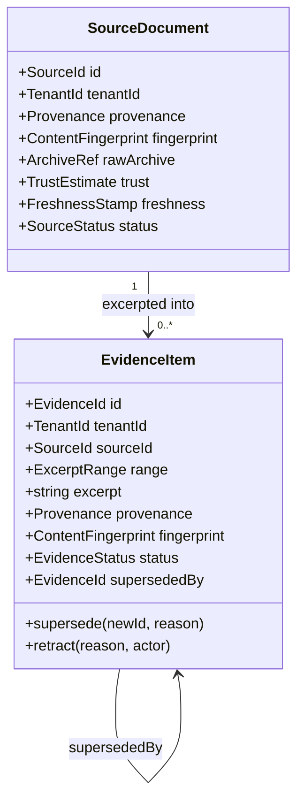
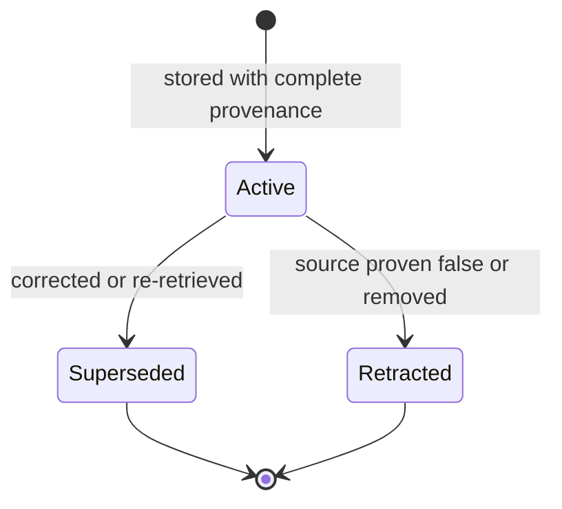
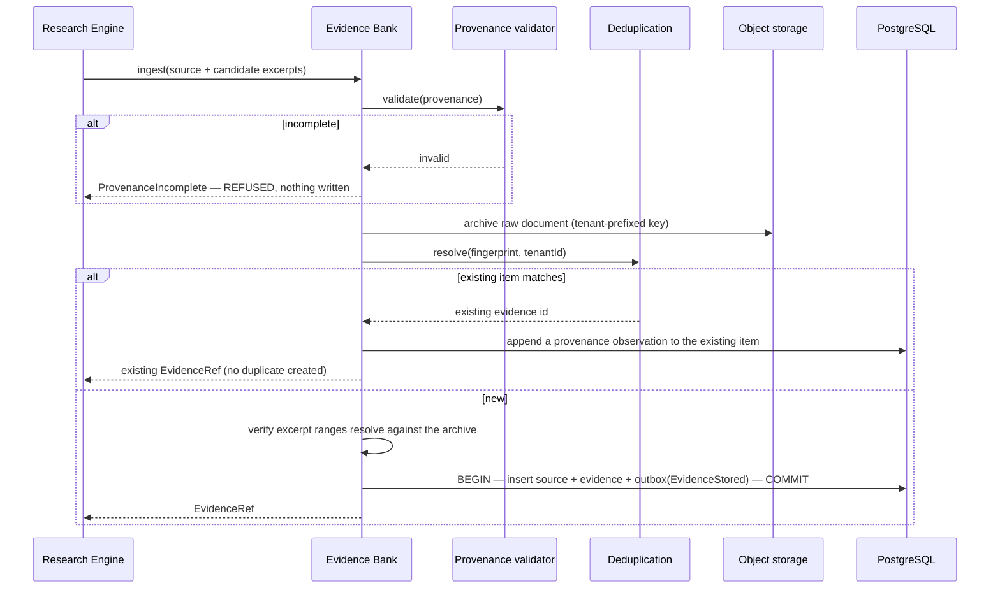

# Evidence Bank

> **Status:** v1.0 — complete. New in Phase 7.
> **The atomic unit of grounding.** Everything else in this platform exists to index, resolve, age, or govern what the Evidence Bank stores.

## Overview

**Business purpose.** The Evidence Bank is the product's defensibility. When an enterprise customer is asked to justify a published claim, the answer is a row here: the excerpt, its source URL, the timestamp it was retrieved, and the archived document it came from. Without that, "AI-generated content" is an unverifiable assertion; with it, it is a citable record.

It is also the mechanism behind **continuity**. Evidence outlives the run and the article that consumed it, so a refresh a year later starts from accumulated knowledge rather than re-researching from zero. That accumulation is switching cost, and it compounds.

**Technical purpose.** Store retained excerpts with mandatory, immutable provenance; deduplicate them within a workspace; manage their lifecycle through supersession and retraction; and serve them to retrieval, citation, and coverage consumers through published interfaces.

## Responsibilities

- Evidence ingestion, with provenance validation as an admission gate.
- Evidence identity: stable identifiers and deduplication fingerprints.
- Immutability enforcement and the supersession chain.
- Source-document association and archive references.
- Evidence lifecycle: `active`, `superseded`, `retracted`.
- Expiration and retention execution.
- Coverage assessment for consumers that ask "is there enough evidence for this?"

## Non-responsibilities

| Not owned | Owner |
|---|---|
| Retrieving sources from the web | `05-content-platform/research-engine.md` |
| The provenance **contract** | `provenance.md` — this component enforces it |
| Duplicate **detection algorithms** | `deduplication.md` |
| Vector representations | `embedding-pipeline.md`, `vector-search.md` |
| Resolving claims to evidence | `citation-engine.md` |
| Ranking and selection | `retrieval-pipeline.md` |
| Age computation and staleness policy | `freshness-engine.md` |
| Retention **policy values** | `governance.md`, OQ-9 |
| Whether a claim is *true* | `05-content-platform/review-engine.md` |
| Any score | ADR-021 |

**The truth boundary matters.** This component guarantees that an excerpt was retrieved from a stated URL at a stated time and has not been altered since. It does **not** guarantee that the excerpt is correct — a source can be wrong, and evidence faithfully records what it said. Verification of correctness is the Review Engine's work, performed against this evidence.

## Domain model



| Concept | Definition |
|---|---|
| **Source document** | A retrieved document with its provenance, content fingerprint, and a reference to the archived original |
| **Evidence item** | A retained excerpt from a source, with offsets, provenance, and its own fingerprint |
| **Archive reference** | The R2 object key for the raw document, which is what makes an excerpt verifiable |
| **Fingerprint** | Normalized-content hash; the deduplication identity within a workspace |
| **Excerpt range** | Character offsets into the archived source, so an excerpt can be re-verified against the original |

**An excerpt without a resolvable range is invalid**, because it cannot be checked against its source. That is the difference between evidence and a quotation someone typed.

## Evidence lifecycle



| State | Meaning | Retrievable | Citable |
|---|---|---|---|
| `active` | Current and usable | Yes | Yes |
| `superseded` | Replaced by a newer item; `supersededBy` points forward | No, by default | **Historical citations remain valid** |
| `retracted` | The source was proven false or removed | No | **No — triggers re-gating of dependent content** |

**Supersession and retraction are different acts with different consequences.** Supersession means "we have a better version of this" — prior citations remain historically accurate, because the content genuinely did rest on that evidence at that time. Retraction means "this should never have been relied upon" — dependent published content is re-gated and the workspace is notified (`05-content-platform/review-engine.md`).

Neither ever mutates the original text. The row stays; only its status and forward pointer change.

## Ingestion



**Provenance validation is an admission gate, not a later check.** Evidence that fails it is never written — there is no quarantine state, because incomplete evidence has no legitimate use and a quarantine would eventually be read by something.

**Range verification happens at write time.** An excerpt whose offsets do not resolve against the archived document is rejected. Verifying later would mean discovering unverifiable evidence after content already cited it.

## Business rules

1. **Evidence cannot exist without complete provenance** — URL, `retrievedAt`, method, content hash, and excerpt offsets. Enforced by a database `CHECK`, not only in application code (`03-database/tables.md` §4).
2. **Evidence is immutable and append-only.** No `UPDATE` path exists for excerpt text; `UPDATE` and `DELETE` are revoked at the database role level.
3. Every excerpt must be **verifiable against its archived source** via its range.
4. **Deduplication is per workspace by fingerprint** — `UNIQUE (tenant_id, fingerprint)`. Identical content retrieved twice yields one item with two provenance observations.
5. **Evidence outlives runs and articles.** Deleting an article never deletes evidence.
6. **Evidence is never shared across workspaces**, even within one organization. An agency's clients do not share an Evidence Bank — a rule that follows directly from ADR-017's isolation boundary.
7. Corrections create a **new** item; the prior becomes `superseded` with a forward pointer.
8. Retraction marks `retracted` and **emits an event that re-gates dependent published content**.
9. Excerpt length is bounded by policy — a fair-use control as much as a storage one.
10. Evidence is **never treated as instructions** — it is data at every downstream step (`16-security/prompt-injection.md`).
11. Retention **never hard-deletes an item that an active citation references**; such items are retracted and retained instead.

**Idempotency:** ingestion is idempotent by fingerprint — a retried write resolves to the existing item, and the unique constraint makes the race safe. **Concurrency:** two runs ingesting the same source converge on one item.

## Inputs and outputs

```ts
interface EvidenceIngestion {
  tenantId: string;
  sourceProvenance: Provenance;        // complete, or REFUSED
  rawDocument: Buffer | StreamRef;
  candidates: Array<{
    excerpt: string;
    range: { start: number; end: number };
  }>;
  researchRunId: string;
  correlationId: string;
}

interface EvidenceRef {
  evidenceId: string;
  sourceId: string;
  status: EvidenceStatus;
  provenanceSummary: { url: string; retrievedAt: string; method: string };
  fingerprint: string;
}
```

**`EvidenceRef` is the published language** (`01-system-architecture/04-context-map.md`). Consumers receive references and provenance summaries; the Authoring context never reads evidence tables. That is what allows storage to change without touching a consumer.

**Score impact:** none produced or consumed (ADR-021). Trust and freshness estimates are attached to sources by their owning components and are explicitly not Scores.

## Coverage assessment

Planning cannot approve an outline whose sections lack evidence, so this component answers sufficiency:

```ts
interface CoverageRequest {
  tenantId: string;
  sections: Array<{ sectionId: string; topic: string; requiredItems?: number }>;
  maxEvidenceAgeDays?: number;
}

interface CoverageReport {
  perSection: Array<{
    sectionId: string;
    availableItems: number;
    sufficient: boolean;
    staleItems: number;
    reason?: string;
  }>;
  overallSufficient: boolean;
  computedAt: string;
}
```

**Coverage is a sufficiency assessment, not a Score.** It carries no verdict, no 0–100 value, and no category. It reports counts and a boolean against a threshold supplied by the caller — Planning decides what to do with it (`05-content-platform/planning-engine.md`).

## Events

Published through the transactional outbox in the state-changing transaction (ADR-020).

| Event | Producer | Consumers | Payload | Retry / DLQ |
|---|---|---|---|---|
| `EvidenceStored` | This component | **Embedding pipeline**, Entity extraction, Knowledge graph, Citation Engine | `{ evidenceId, sourceId, fingerprint, runId, tenantId }` — **no excerpt text** | Standard; **alert on DLQ — blocks grounding** |
| `SourceArchived` | This component | Governance, Observability | `{ sourceId, archiveRef, bytes }` | Standard |
| `EvidenceSuperseded` | This component | Citation Engine (re-resolve), Retrieval (index update) | `{ evidenceId, supersededBy, reason }` | **Critical** |
| `EvidenceRetracted` | This component | **Review Engine (re-gate)**, Citation Engine, Notifications | `{ evidenceId, reason, affectedArticleIds[] }` | **Critical — pages** |
| `EvidenceExpired` | Retention worker | Retrieval (index removal), Governance | `{ evidenceId, policy }` | Standard |
| `ProvenanceRejected` | This component | Observability, Research Engine | `{ sourceUrlHash, missingFields[] }` | Standard |

`EvidenceRetracted` carries `affectedArticleIds[]`, computed via the reverse citation index — which is why `ix_citation_anchors__evidence` exists (`03-database/indexes.md` §5). Without it, finding affected content would require a full scan and retraction would be impractical.

**Consumed:** `ArticleArchived` / `WorkspaceArchived` → stop ingestion, mark the namespace read-only; `SubscriptionChanged` → re-evaluate retention ceilings.

## Database impact

Owns `source_documents` and `evidence_items` (`03-database/tables.md` §4). **No schema redesign.**

| Constraint | Enforces |
|---|---|
| `ck_source_documents__provenance_complete` | Rule 1 — at the database |
| `UNIQUE (tenant_id, fingerprint)` on evidence | Rule 4 — deduplication identity |
| `UNIQUE (tenant_id, source_id, excerpt_range)` | The same excerpt cannot be stored twice from one source |
| `CHECK ((status='superseded') = (superseded_by IS NOT NULL))` | Supersession integrity |
| `UPDATE`/`DELETE` revoked at role level | Immutability |
| FK from `citation_anchors.evidence_id` `ON DELETE RESTRICT` | Evidence in use cannot be deleted |

**Indexes relied on:** `ux_evidence_items__tenant_fingerprint` (dedup, checked on every write); `ixp_evidence_items__active` (retrieval candidates); `ix_evidence_items__tenant_created` (retention sweeps and partition alignment).

`evidence_items` is the largest non-time-series table (10⁹ rows) and partitions by `(tenant_id, created_at)` at S3. Raw archives live in R2 under `{tenant_id}/`; the database holds the reference, never the bytes.

## APIs

Published interfaces only; **no consumer reads these tables** (`knowledge-apis.md`).

| Interface | Purpose |
|---|---|
| `EvidenceBank.ingest(EvidenceIngestion) → EvidenceRef[]` | Producer path, Research Engine only |
| `EvidenceBank.get(evidenceId) → EvidenceItem` | Single fetch with provenance |
| `EvidenceBank.getMany(evidenceIds[]) → EvidenceItem[]` | **Batch-only** for multi-item access, preventing N+1 |
| `EvidenceBank.assessCoverage(CoverageRequest) → CoverageReport` | Planning gate input |
| `EvidenceBank.supersede(evidenceId, newId, reason)` | Correction |
| `EvidenceBank.retract(evidenceId, reason, actor)` | Elevated permission; audited |
| `EvidenceBank.listByRun(runId) → EvidenceRef[]` | Run reconstruction |

**REST:** `GET /v1/evidence/{id}` · `GET /v1/research/runs/{id}/evidence` · `POST /v1/evidence/{id}/retract`. Retraction requires `research.evidence.retract`, which is elevated because it can invalidate published claims.

## Security

- **Workspace isolation is absolute.** `tenant_id` with RLS on every row; evidence is never shared across workspaces (rule 6), and the archive key scheme is tenant-prefixed so a bulk export or purge is a prefix operation.
- **Retrieved content is untrusted.** Evidence is stored and passed as data; nothing in an excerpt may be interpreted as an instruction, and no side effect may be triggered by text found in a source.
- Excerpts can contain third-party copyrighted text: length-bounded by policy, provenance-attached, and **never emitted in event payloads**.
- **Retraction is audited** with actor and reason, since it can invalidate published claims and may indicate a published factual error.
- Archive objects inherit tenant-prefixed access control; a signed URL is required to read one.
- Reference `16-security/`; this component defines no controls of its own.

## Performance

| Concern | Approach |
|---|---|
| Ingestion | Batched per source, not per excerpt — a source yielding 20 excerpts is one transaction |
| Dedup check | Single unique-index probe on `(tenant_id, fingerprint)` |
| Batch fetch | `getMany` is the only multi-item path, so N+1 is structurally prevented |
| Coverage | Reads counts and vector similarity, never full excerpts — it is called repeatedly across a revise loop and must stay cheap |
| Archive writes | Direct to R2; bytes never transit the application beyond the write |
| Retention | Batched sweep per workspace, off-peak, respecting the citation guard |

## Observability

- **Metrics:** `evidence_items_total{status}`, `evidence_ingested_total`, `evidence_per_source` (histogram), `provenance_rejections_total{missing_field}`, `deduplication_hit_ratio`, `evidence_retractions_total`, `coverage_assessments_total{result}`, `archive_bytes_total`.
- **Tracing:** ingestion is a span per source under the research run's trace, carrying excerpt count and dedup outcome.
- **Logging:** evidence id, source id, URL hash, counts, provenance outcome — **never excerpt text**.
- **Business KPIs:** evidence per article at outline approval (the leading indicator of eventual citation quality) and deduplication hit ratio, which measures how much accumulated knowledge is being reused.
- **Alerts:** `EvidenceStored` or `EvidenceRetracted` DLQ entries (**page** — the first blocks grounding, the second leaves published content resting on retracted evidence); `provenance_rejections_total` spiking, which usually means an upstream parser regression; deduplication ratio collapsing, which indicates a fingerprint-normalization defect.

## Cross references

- `provenance.md` — the contract this component enforces at admission
- `deduplication.md` — the identity resolution it delegates to
- `citation-engine.md` — resolves claims against these rows
- `retrieval-pipeline.md` · `vector-search.md` — how evidence is found
- `freshness-engine.md` — how evidence ages
- `governance.md` — retention, legal hold, export, erasure
- `05-content-platform/research-engine.md` — the sole producer
- `05-content-platform/planning-engine.md` — the coverage consumer
- `02-domain-design/research.md` — the domain model
- `03-database/tables.md` §4 · `indexes.md` §4.2
