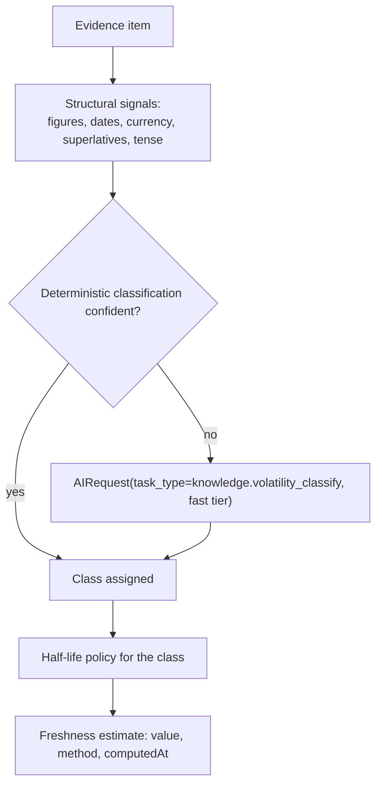
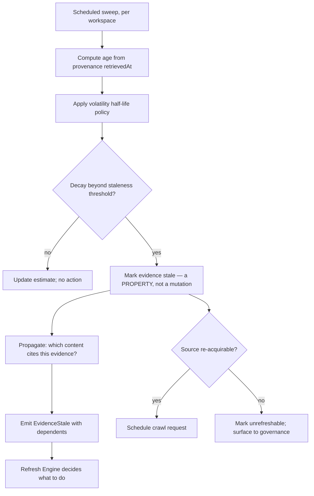
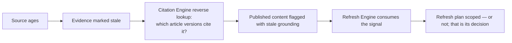

# Freshness Engine

> **Status:** v1.0 — complete. New in Phase 7.
> **It never rewrites evidence.** Staleness is a property recorded *about* evidence; correction is always a new item and a supersession.

## Overview

**Business purpose.** Facts age at wildly different rates. A pricing figure is stale in months; a definition of a chemical process is not stale in decades. Content grounded in aged evidence looks authoritative and is quietly wrong — the most damaging failure mode available to this product, because nothing about the output signals the problem.

This component is also what makes the refresh business model work. `05-content-platform/refresh-engine.md` decides *that* an article needs refreshing; this component supplies the evidence-side truth it reasons from: which sources have aged, by how much, and relative to what expectation.

**Technical purpose.** Compute and maintain source age, classify volatility, detect staleness against expectations, schedule re-acquisition, request downstream re-indexing, and propagate staleness through the dependency chain to the content that relies on it.

**Design posture — signal, never mutate.** This component observes and requests. It does not crawl, does not rewrite, does not re-embed, and does not decide what content should do about it. Every one of those is another component's job, invoked by a request.

## Responsibilities

- Source age computation and maintenance.
- Volatility classification per source and claim type.
- Staleness detection against volatility-adjusted expectations.
- Refresh scheduling and prioritization.
- Crawl requests to the Research Engine.
- Re-index and re-embedding requests.
- Dependency propagation: stale source → stale evidence → affected content.
- Freshness estimates supplied to retrieval ranking.

## Non-responsibilities

| Not owned | Owner |
|---|---|
| **Rewriting or mutating evidence** | Nothing may — evidence is append-only (`evidence-bank.md`) |
| Crawling or fetching | `05-content-platform/research-engine.md` |
| Deciding an article needs refreshing | `05-content-platform/refresh-engine.md` |
| Performing re-embedding | `embedding-pipeline.md` |
| Index maintenance | `vector-search.md` |
| Source trust | Trust and freshness are distinct estimates (see below) |
| Retention and expiry policy | `governance.md` |
| Any score | ADR-021 |

**Freshness is not trust.** A source retrieved this morning from an unreliable site is fresh and untrustworthy; a peer-reviewed study from 2019 may be stale and highly trustworthy. They are independent estimates, computed differently, and combining them into one number would destroy both. Retrieval ranking consumes them separately (`retrieval-pipeline.md` §6).

## Volatility classification

Age alone is meaningless without an expectation to measure it against.

| Class | Half-life scale | Typical content |
|---|---|---|
| `volatile` | Weeks | Pricing, availability, rankings, market share, personnel |
| `seasonal` | Months | Trends, seasonal behaviour, annual statistics |
| `stable` | Years | Methods, definitions, established research, standards |
| `durable` | Effectively permanent | Historical events, mathematical facts, published specifications |

**Classification is per claim type within a source, not per source.** One document can contain a durable definition and a volatile price. Classifying at document level would mark the whole thing stale when only the price aged, forcing unnecessary re-research — or worse, mark it fresh because most of it is durable while the price silently rots.



**Deterministic signals run first.** A passage containing a currency figure and a year is volatile without needing a model to say so. Classification through the AI Gateway handles only the genuinely ambiguous remainder — which keeps this cheap on a path that touches every evidence item.

## Freshness estimates

```ts
interface FreshnessEstimate {
  value: number;                 // decay position, 0–1
  volatilityClass: VolatilityClass;
  sourceAgeDays: number;
  publishedAt?: string;          // the source's own claimed date, when detectable
  retrievedAt: string;           // ALWAYS present — from provenance
  method: string;                // how it was computed
  computedAt: string;            // when — estimates go stale too
  stale: boolean;
  confidence: number;
}
```

**Both dates are retained.** `retrievedAt` is authoritative and comes from provenance; `publishedAt` is the source's own claim, frequently absent, sometimes wrong, and never trusted alone. A source published in 2021 and retrieved yesterday is a 2021 fact we have confirmed still exists — a materially different thing from a source retrieved in 2021.

**Freshness is a labelled estimate, never a Score** (ADR-021). It carries a method and a `computedAt`, has no verdict, no 0–100 normalization, and no registry category. It is an input to retrieval ranking and refresh planning, both owned elsewhere.

## Staleness detection



**Marking evidence stale does not modify the evidence row's content.** Staleness lives in a separate estimate record keyed to the evidence item. The excerpt, its provenance, and its offsets are untouched — which is what preserves the append-only guarantee while still letting the platform know the evidence has aged.

**Unrefreshable sources matter.** A source that has disappeared, moved behind a paywall, or is no longer reachable cannot be refreshed, and content depending on it has a durable weakness. That is surfaced rather than retried indefinitely.

## Refresh scheduling

```mermaid
sequenceDiagram
    participant FE as Freshness Engine
    participant Q as Scheduler
    participant RES as Research Engine
    participant EB as Evidence Bank
    participant EP as Embedding Pipeline
    participant VS as Vector Search

    FE->>FE: sweep detects staleness
    FE->>Q: schedule crawl request (priority = volatility x dependents)
    Q->>RES: CrawlRequested(sourceUrl, originalProvenance)
    RES->>RES: re-acquire through the guarded fetch client
    RES->>EB: ingest — NEW evidence item, full new provenance
    EB->>EB: dedupe by fingerprint
    alt content unchanged
        EB-->>FE: same fingerprint — append a provenance observation only
        FE->>FE: reset age from the new retrievedAt
    else content changed
        EB->>EB: new item; predecessor SUPERSEDED
        EB-->>EP: EvidenceStored → re-embed
        EP-->>VS: index refresh
        EB-->>FE: supersession recorded
    end
```

**Re-acquisition always produces a new evidence item with its own complete provenance.** It is never an update to the existing row. Two outcomes follow naturally from deduplication:

| Outcome | Meaning | Effect |
|---|---|---|
| **Same fingerprint** | The source is unchanged | A new provenance observation is appended; **age resets** — we have confirmed it still says this |
| **Different fingerprint** | The source changed | A new item is created; the predecessor is superseded; downstream re-indexing follows |

The first case is valuable and easy to overlook: re-confirming that a two-year-old source still states what it stated is genuine freshness information, and it costs one fetch rather than a content rewrite.

**Prioritization** weighs volatility class, the number of dependent published articles, and workspace policy — a volatile source underpinning twelve live articles outranks a stable source underpinning none.

## Dependency propagation



Propagation stops at the signal. This component states that published article X rests on evidence that has aged past its expectation; `05-content-platform/refresh-engine.md` decides whether that warrants a refresh, and `05-content-platform/review-engine.md` decides whether it affects a gate.

The reverse lookup depends on `ix_citation_anchors__evidence` — the same index that makes retraction handling tractable (`citation-engine.md`).

## Business rules

1. **Evidence is never rewritten.** Staleness is recorded alongside it; correction is a new item and a supersession.
2. **`retrievedAt` from provenance is the authoritative age basis**; `publishedAt` is a source claim and is never trusted alone.
3. **Volatility is classified per claim type**, not per document.
4. **Freshness is a labelled estimate**, never a Score (ADR-021).
5. **This component never crawls.** It requests; the Research Engine acquires through its guarded client.
6. Re-acquisition always yields **new provenance**; an unchanged fingerprint resets age without creating a duplicate.
7. **Unrefreshable sources are surfaced**, not retried indefinitely.
8. Staleness **propagates to dependent content as a signal**; it never forces a refresh, a re-gate, or an unpublish.
9. Half-lives and thresholds are **versioned policy**, resolved per workspace (ADR-024), never constants.
10. Freshness estimates **carry `computedAt`** — an estimate computed six months ago is itself stale.
11. Re-embedding is **requested**, never performed here.
12. **No business logic.** Whether stale evidence matters commercially is the Content Platform's judgment.

**Idempotency:** sweeps are idempotent per `(evidenceId, sweepWindow)`; a repeated sweep recomputes the same estimate. **Concurrency:** sweeps partition by workspace; crawl requests deduplicate per source URL within a window.

## AI usage

| Task type | Purpose | Tier |
|---|---|---|
| `knowledge.volatility_classify` | Classify claim volatility where deterministic signals are inconclusive | Fast |

Through the AI Gateway (ADR-008). No prompts, routing, providers, or model-specific behaviour here. Deterministic classification handles the majority; the model handles ambiguity only.

## Events

Published through the transactional outbox in the state-changing transaction (ADR-020).

| Event | Producer | Consumers | Payload | Retry / DLQ |
|---|---|---|---|---|
| `EvidenceStale` | This component | **Refresh Engine**, Retrieval (ranking), Read models | `{ evidenceId, volatilityClass, ageDays, dependentArticleVersions[] }` | **Critical** |
| `CrawlRequested` | This component | **Research Engine**, Scheduler | `{ sourceId, url, originalProvenance, priority }` | Critical |
| `SourceUnrefreshable` | This component | Governance, Notifications, Refresh Engine | `{ sourceId, reason, dependentCount }` | Critical |
| `FreshnessConfirmed` | This component | Retrieval (ranking), Read models | `{ evidenceId, newRetrievedAt, fingerprintUnchanged: true }` | Standard |
| `ReEmbeddingRequested` | This component | Embedding Pipeline | `{ evidenceIds[], reason }` | Standard |
| `ReIndexRequested` | This component | Vector Search | `{ scope, reason }` | Standard |

**Consumed:** `EvidenceStored` → classify volatility, initialize the estimate; `EvidenceSuperseded` → transfer staleness tracking to the successor; `EvidenceRetracted` → stop tracking; `SettingsUpdated` → refresh half-life policy.

`EvidenceStale` carries `dependentArticleVersions[]` so the Refresh Engine does not need its own reverse lookup — the same pattern `EvidenceRetracted` uses.

## Database impact

New tables, additive. **No schema redesign.**

| Table | Purpose | Notes |
|---|---|---|
| `freshness_estimates` | `tenant_id`, `evidence_id`, `volatility_class`, `value`, `stale`, `method`, `computed_at`, `source_age_days` | Tenant-scoped with RLS; **upserted** — the current estimate, with history in the sweep log |
| `freshness_sweeps` | Append-only sweep records: scope, items evaluated, items marked stale, duration | 90-day retention |
| `crawl_requests` | `tenant_id`, `source_id`, `url`, `priority`, `state`, `attempts`, `last_outcome` | Deduplicated per source within a window |
| `volatility_policies` | Half-lives and thresholds per class | Reference data (ADR-025 exception class) |

**`source_documents.freshness`** (existing, `03-database/tables.md` §4) holds the source-level summary; `freshness_estimates` holds per-evidence detail. The existing column is a denormalized read optimization for retrieval ranking, refreshed from this table.

**Indexes:** `(tenant_id, stale, computed_at)` for the sweep; `(evidence_id)` unique; `(tenant_id, priority, state)` on crawl requests for the scheduler.

**Freshness estimates are derived** — recomputable from provenance and policy, excluded from the authoritative backup set. Crawl request history is operational, not authoritative.

## APIs

Published interfaces only (`knowledge-apis.md`).

| Interface | Purpose |
|---|---|
| `Freshness.estimate(evidenceIds[]) → FreshnessEstimate[]` | Batch; consumed by retrieval ranking |
| `Freshness.staleEvidence(tenantId, filter) → StaleEvidenceRecord[]` | Refresh Engine input |
| `Freshness.requestCrawl(sourceId, priority) → CrawlRequestRef` | Explicit re-acquisition |
| `Freshness.dependentsOf(evidenceId) → ArticleVersion[]` | Propagation support |
| `Freshness.policyFor(volatilityClass) → VolatilityPolicy` | Transparency for consumers |

**REST:** `GET /v1/knowledge/freshness/stale?projectId=` · `POST /v1/knowledge/sources/{id}/refresh` — workspace-scoped and permission-gated.

## Security

- Tenant isolation on estimates, sweeps, and crawl requests.
- **This component never fetches.** Crawl requests go to the Research Engine's guarded client, so the SSRF surface stays in one place (`05-content-platform/research-engine.md`).
- Crawl requests are rate-limited per source domain — an aggressive refresh schedule against one site is indistinguishable from abuse, and reputationally costly.
- Stale-evidence reports reveal corpus composition and are workspace-scoped.
- Reference `16-security/`; this component defines no controls of its own.

## Performance

| Concern | Approach |
|---|---|
| Sweep shape | Scheduled batch per workspace over an indexed predicate, never a full scan |
| Estimate computation | Deterministic arithmetic from `retrievedAt` and policy; **no I/O per item** |
| Classification | Cached per `(sourceId, claimType)`; a model call runs once per class, not per sweep |
| Ranking reads | `Freshness.estimate` is on the retrieval hot path — batch-only, cached, **p95 < 20 ms** |
| Propagation | Batched reverse lookup, not per evidence item |
| Crawl scheduling | Priority queue with per-domain rate shaping |

**Recomputation is cheap by design.** Age is arithmetic over a stored timestamp, so a sweep evaluating a million evidence items is bounded by I/O rather than by computation — which is what makes daily sweeps affordable.

## Observability

- **Metrics:** `freshness_sweeps_total`, `evidence_stale_total{volatility_class}`, `stale_ratio` (gauge, per workspace), `crawl_requests_total{outcome}`, `freshness_confirmations_total` (unchanged fingerprint), `unrefreshable_sources_total`, `dependent_articles_per_stale_evidence` (histogram), `freshness_estimate_duration_seconds`.
- **Tracing:** sweeps are traced per workspace; crawl requests link to the resulting research run by `correlationId`, so re-acquisition is followable end to end.
- **Logging:** evidence id, volatility class, age, staleness transition, correlation id — never excerpts.
- **Business KPIs:** **`stale_ratio` per workspace** (the honest measure of whether a corpus is being maintained) and freshness-confirmation rate, which shows how much re-acquisition confirms rather than changes — a high rate means the refresh schedule may be too aggressive.
- **Alerts:** `EvidenceStale` DLQ entries (**page** — published content may rest on aged evidence with nobody informed); `stale_ratio` above threshold; `unrefreshable_sources_total` rising (durable grounding weakness); crawl failure rate.

## Cross references

- `evidence-bank.md` — append-only evidence; supersession on change
- `provenance.md` — `retrievedAt` is the authoritative age basis
- `citation-engine.md` — the reverse lookup used for propagation
- `retrieval-pipeline.md` — consumes freshness as a ranking input, separately from trust
- `embedding-pipeline.md` · `vector-search.md` — re-index and re-embedding requests
- `05-content-platform/research-engine.md` — performs every acquisition; owns the guarded fetch client
- `05-content-platform/refresh-engine.md` — decides what staleness means for content
- `04-platform/settings.md` — half-life and threshold policy (ADR-024)
- `01-system-architecture/14-scoring-contract.md` — why freshness is an estimate and not a Score
