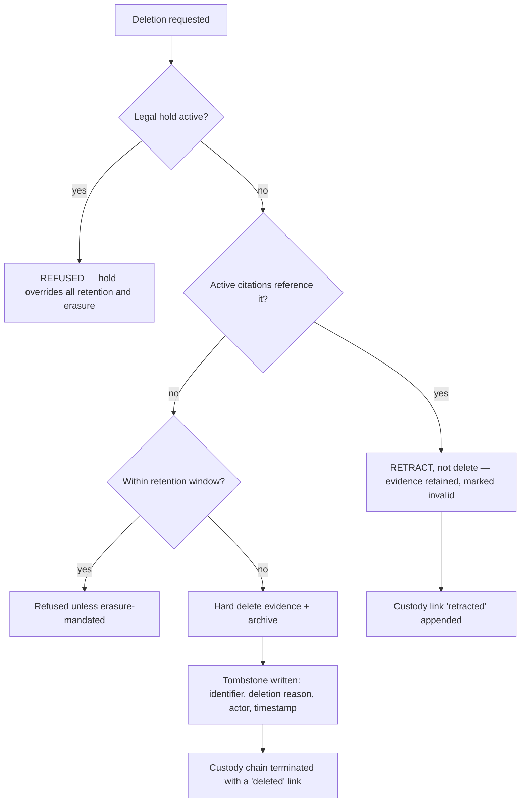
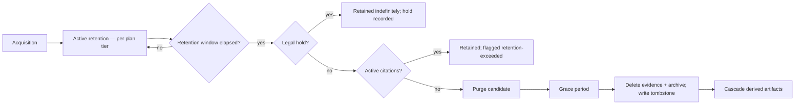
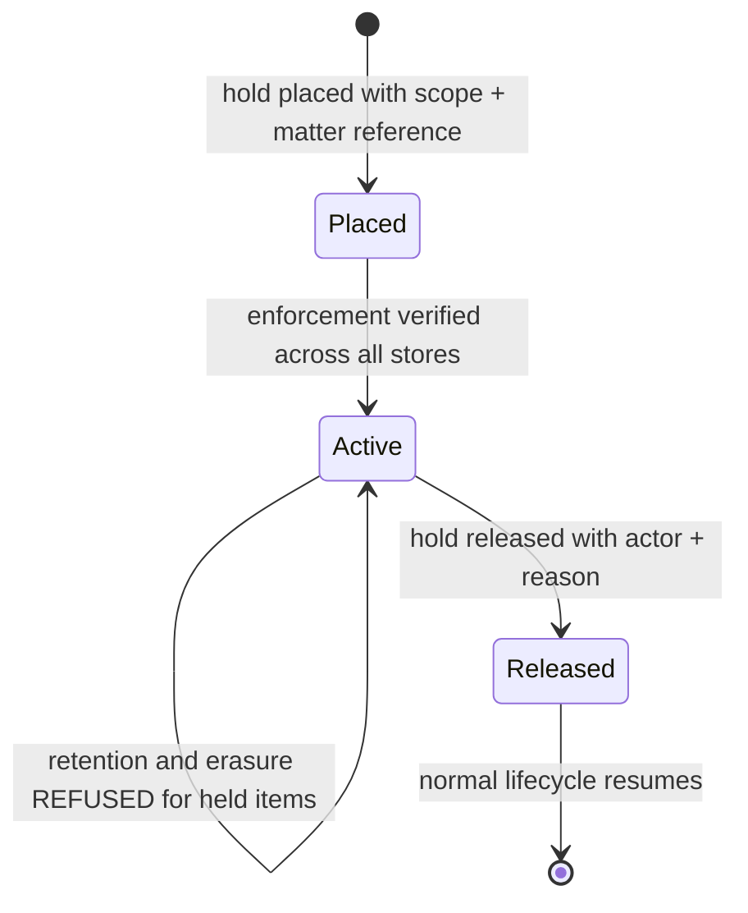
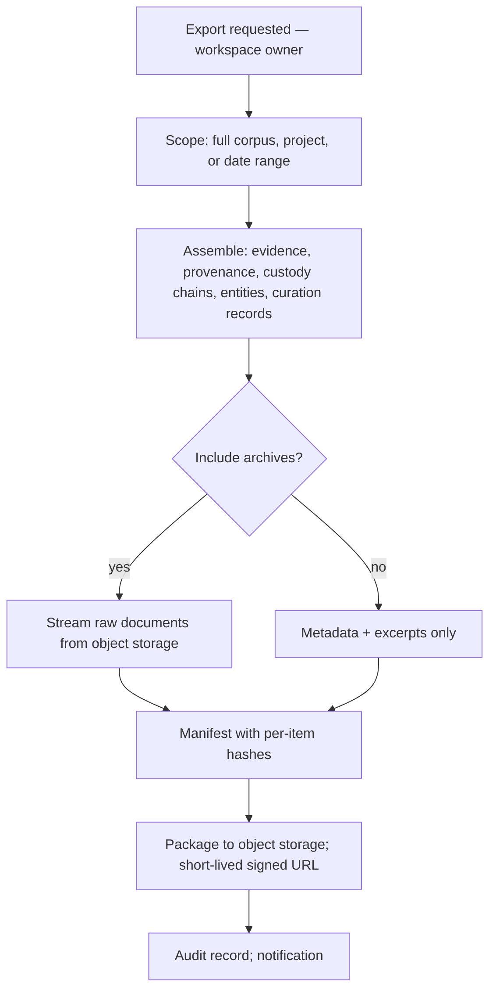

# Knowledge Governance

> **Status:** v1.0 — complete. New in Phase 7.
> **Three rules bind everything here:** evidence ownership never changes silently; deletion never breaks historical auditability; curated knowledge remains attributable.

## Overview

**Business purpose.** A knowledge store that accumulates without governance becomes a liability. It holds third-party copyrighted excerpts, personal data in `person` entities, licensed content under terms nobody recorded, and material subject to legal hold nobody flagged — growing until a subject-access request, a licence audit, or a litigation hold arrives and the platform cannot answer basic questions about what it holds or why.

Governance is also a sales precondition. Enterprise procurement asks for retention schedules, deletion guarantees, export capability, and data-residency posture, and those answers must be structural rather than aspirational.

**Technical purpose.** Own the knowledge lifecycle end to end: what is retained and for how long, what may be deleted and what may never be, how evidence is exported, who owns it, how every governance action is audited, and how legal hold overrides everything else.

## Responsibilities

- Retention policy application across evidence, sources, archives, and derived artifacts.
- Legal hold: placement, scope, enforcement, release.
- Export: workspace-scoped, complete, verifiable.
- Workspace ownership and its immutability.
- The knowledge audit trail.
- Compliance execution: erasure, portability, licence terms.
- Deletion workflow, with the historical-auditability guarantee.
- Access policy at the knowledge layer.
- Stewardship: who is accountable for a workspace's knowledge.

## Non-responsibilities

| Not owned | Owner |
|---|---|
| Platform-wide audit log | `04-platform/audit-logs.md` — this writes to it |
| Retention **values** per plan tier | `04-platform/billing.md` → `settings.md` (OQ-9) |
| User erasure orchestration | `04-platform/users.md` — this executes the knowledge portion |
| Workspace lifecycle | `04-platform/workspaces.md` |
| Backup and restore mechanics | `14-operations/backup-recovery.md` |
| The security threat model | `16-security/` |
| Content retention (articles, revisions) | `05-content-platform/`, `03-database/` |

**This component governs knowledge, not the platform.** It executes the knowledge portion of a platform-wide obligation — an erasure request arrives from `04-platform/users.md`, and this component purges the evidence, entities, and archives attributable to that subject, reporting completion back.

## The three rules

### 1 · Evidence ownership never changes silently

Ownership is fixed at acquisition and recorded in provenance (`provenance.md` §5). There is **no transfer operation** for evidence between workspaces.

| Scenario | Handling |
|---|---|
| A workspace moves between organizations | Not supported for evidence (`02-domain-design/workspace.md`); a data-ownership transfer, not a field update |
| An agency's client takes their workspace | An **export**, then a fresh acquisition under new ownership — never a re-pointing |
| A workspace is archived | Ownership unchanged; evidence becomes read-only |
| A workspace is purged | Evidence is destroyed, not reassigned |

**Silent re-pointing would break provenance.** The record states which workspace acquired the evidence, under what permission basis, at what time. Changing the owner afterward makes that record false, and a false provenance record is worse than none.

### 2 · Deletion never breaks historical auditability

**A tombstone always survives.** After a hard delete, the evidence identifier still resolves — to a record stating that evidence existed, when it was deleted, under what authority, and why. Without it, a citation created before deletion would resolve to nothing, and the audit question *"was there ever evidence here?"* would be unanswerable.

**Tombstones carry no content.** Identifier, timestamps, reason, actor, and the custody chain — never the excerpt, never the URL in full, never anything the deletion was meant to remove.

**Retraction is preferred to deletion wherever citations exist.** Retracted evidence retains its record and its provenance while being marked unusable, which preserves the chain that published content depends on.

### 3 · Curated knowledge remains attributable

Human decisions — verified aliases, entity merges, deduplication merges, negative decisions, stewardship assignments — are **authoritative** and retain their actor permanently.

| Artifact | Class | Attribution retained |
|---|---|---|
| Evidence, provenance | Authoritative | Acquirer and run |
| Verified aliases | Authoritative | Curator |
| Entity merge records | Authoritative | Curator, reason |
| Deduplication merge lineage | Authoritative | Decider, reason |
| Embeddings, mentions, concepts, freshness estimates | **Derived** | None — regenerated |

**Attribution survives user erasure.** When a curator's account is erased, their decisions remain and their identity becomes an anonymized actor reference (`04-platform/users.md`). Deleting the decisions would destroy the knowledge; retaining the raw identity would violate erasure. Anonymized attribution satisfies both, and it is the same reconciliation `04-platform/audit-logs.md` uses.

## Retention

| Class | Retention basis | Notes |
|---|---|---|
| Evidence items | Plan tier (OQ-9), workspace preference within the ceiling | Cannot exceed the plan's allowance |
| Source archives | Same as their evidence; larger, so the dominant storage cost | R2 lifecycle policy |
| Derived artifacts | Follow their evidence automatically | `ON DELETE CASCADE` on embeddings |
| Provenance | **Same as evidence, and never separately deletable** | Deleting provenance while keeping evidence would invalidate it |
| Merge lineage, verified aliases | **Indefinite** | Authoritative curation |
| Tombstones | **Indefinite** | The audit guarantee |
| Governance audit records | Per compliance policy, longer than operational retention | `04-platform/audit-logs.md` |

**Cited evidence is never purged on schedule.** A retention window elapsing on evidence that published content cites produces a `retention_exceeded` flag and a notification, not a deletion. Purging it would break the grounding chain of live content — the customer must decide, typically by unpublishing or by extending retention.

**Archives dominate storage cost**, not evidence rows. A retention policy that keeps excerpts but expires archives is available and explicitly documented as a trade: excerpts remain citable, but they lose byte-level verifiability (`provenance.md` §Verification). That trade is a workspace decision, and the loss of verifiability is stated plainly rather than buried.

## Legal hold

**Legal hold overrides everything**: retention, erasure requests, workspace purge, and plan downgrades.

| Property | Rule |
|---|---|
| Scope | Workspace, project, source domain, date range, or explicit evidence set |
| Placement | Requires elevated authority; audited with a matter reference |
| Enforcement | Every deletion path checks holds **first**, before any other condition |
| Erasure conflict | Hold wins; the erasure request is recorded as **partially deferred**, and the subject is informed |
| Release | Explicit, audited; retention resumes from the original schedule, not from release |
| Verification | Held items are periodically verified as still present |

**A hold conflicting with an erasure request is a real and unavoidable tension.** The platform's position: preservation obligations under legal hold generally supersede erasure requests, the deferral is recorded explicitly, and the subject is informed that data is retained under hold. The alternative — silently honouring one and failing the other — is the only genuinely unacceptable outcome.

**Retention resumes from the original schedule on release.** Evidence held for two years past its window is immediately purge-eligible, not granted a fresh window.

## Export

**Exports include provenance and custody, not only content.** An export of excerpts without provenance is unverifiable and therefore worth little — the value is the record of origin, and it is what allows a customer to take their knowledge elsewhere or defend it independently.

**Derived artifacts are excluded by default.** Embeddings are large, model-specific, and rebuildable; exporting them exports a dependency on a model generation. Entities and concepts are included as **curated** where human decisions exist, excluded where purely extracted.

The export manifest carries **per-item hashes**, so a recipient can verify the export is complete and unaltered — the same integrity property provenance provides internally.

**Export is the mechanism behind two commitments**: data portability under GDPR, and the "what if you go away?" question in enterprise procurement.

## Deletion workflow

| Trigger | Scope | Tombstone | Reversible |
|---|---|---|---|
| Retention elapsed | Individual evidence | Yes | No |
| Subject erasure | Evidence and entities attributable to the subject | Yes | No |
| Workspace purge | Entire tenant namespace and archive prefix | Workspace-level | No, after grace |
| Source takedown | All evidence from a source | Yes | No |
| Operator deletion | Explicit set | Yes | No, after grace |

**Ordering for a workspace purge is fixed and verified**: derived artifacts, then evidence and sources, then archives by prefix, then the tombstone record, then confirmation to the platform. Reversing the order strands objects in R2 with no reference — orphaned storage holding customer data that nothing points at, which is a retention violation that is very hard to detect.

**Deletion is verified, not assumed.** A purge job confirms the archive prefix is empty and reports discrepancies; an unverified purge is indistinguishable from a failed one.

## Access policy

| Operation | Required authority |
|---|---|
| Read evidence, provenance, retrieval | `research.evidence.read` |
| Retract evidence | `research.evidence.retract` — elevated |
| Merge, split, reverse | `research.evidence.retract` — elevated |
| Place or release legal hold | Platform admin plus a matter reference — audited |
| Export | Workspace `owner` — rate-limited, audited |
| Configure retention | Workspace `admin`, within the plan ceiling |
| Cross-tenant knowledge access | **Platform admin, break-glass, audited** — see below |

**Cross-tenant access is break-glass only.** A platform admin investigating an incident may need to read a workspace's evidence; that access requires elevation, a stated reason, and produces its own audit record reviewed after the incident (`04-platform/audit-logs.md`, `14-operations/incident-response.md` §11).

## Stewardship

Every workspace has an accountable steward — by default the workspace owner — responsible for retention configuration, curation decisions, export authorization, and the review queues for deduplication and entity ambiguity.

Stewardship exists because **knowledge decays without an owner**: review queues grow, retention drifts to defaults, ambiguities accumulate, and nobody is accountable. The steward receives governance notifications and appears in knowledge-health reporting.

## Business rules

1. **Ownership never changes silently**; there is no evidence-transfer operation.
2. **Legal hold overrides everything**, checked first on every deletion path.
3. **Deletion always leaves a tombstone**; identifiers remain resolvable.
4. **Cited evidence is never purged on schedule** — flagged and notified instead.
5. **Provenance is never separately deletable** from its evidence.
6. **Curation records are retained indefinitely** with anonymized attribution after erasure.
7. **Exports include provenance and custody**, with per-item hashes.
8. **Purge ordering is fixed and verified.**
9. Retention **cannot exceed the plan ceiling**; a downgrade clamps with notification, never silently.
10. **Every governance action is audited** with actor, reason, and scope.
11. **Erasure deferred by legal hold is recorded and disclosed**, never silently skipped.
12. Derived artifacts follow their evidence automatically.

**Idempotency:** deletion and purge operations are idempotent by target; a repeated purge confirms rather than errors. **Concurrency:** holds are checked within the deletion transaction, so a hold placed concurrently with a purge wins.

## AI usage

**None.** Governance is deterministic: policy evaluation, hold checks, scope resolution, deletion, verification.

A model has no role in deciding what to delete or retain, and introducing one would make governance decisions probabilistic and unexplainable — the opposite of what a compliance function requires.

## Scoring

Per **ADR-021**: no categories produced or consumed.

## Events

Published through the transactional outbox in the state-changing transaction (ADR-020).

| Event | Producer | Consumers | Payload | Retry / DLQ |
|---|---|---|---|---|
| `RetentionPolicyApplied` | This component | Observability, Notifications | `{ tenantId, evaluated, purged, flagged }` | Standard |
| `EvidencePurged` | This component | Derived-artifact consumers, Audit | `{ evidenceId, reason, tombstoneId }` | **Critical** |
| `RetentionExceededWithCitations` | This component | **Notifications (steward)**, Read models | `{ tenantId, evidenceCount, affectedArticleVersions[] }` | Critical |
| `LegalHoldPlaced` / `LegalHoldReleased` | This component | All deletion paths, Audit, Notifications | `{ holdId, scope, matterRef, actor }` | **Critical** |
| `KnowledgeExportCompleted` | This component | Notifications, Audit | `{ exportId, tenantId, itemCount, manifestHash }` | Standard |
| `ErasureExecuted` | This component | `04-platform/users.md`, Erasure log, Audit | `{ subjectRef, evidencePurged, entitiesPurged, deferredUnderHold }` | **Critical** |
| `PurgeVerificationFailed` | Purge worker | **Governance — pages**, Notifications | `{ tenantId, expectedEmpty, observed }` | **Critical** |

**Consumed:** `WorkspacePurged` → execute the knowledge portion; `UserErased` → purge attributable evidence and person entities; `SubscriptionChanged` → re-evaluate retention ceilings; `EvidenceRetracted` → adjust retention treatment.

`ErasureExecuted` reports `deferredUnderHold` explicitly — a partial erasure that reported success would be a compliance misstatement.

## Database impact

New tables, additive. **No schema redesign.**

| Table | Purpose | Notes |
|---|---|---|
| `knowledge_retention_policies` | Per-workspace retention within the plan ceiling | Tenant-scoped with RLS |
| `legal_holds` | Scope, matter reference, placed/released, actor | **Append-only**; authoritative |
| `evidence_tombstones` | Identifier, deletion reason, actor, timestamp, custody terminus | **Append-only, indefinite**; **no content** |
| `knowledge_exports` | Export records, manifest hash, scope, actor | Audited |
| `stewardship_assignments` | Workspace steward | Tenant-scoped |

Reads and executes against `evidence_items`, `source_documents`, and all derived tables. Writes to `04-platform/audit-logs.md` for every governance action.

**Indexes:** `(tenant_id, active)` on holds — checked on every deletion, so it must be fast; `(evidence_id)` unique on tombstones; `(tenant_id, evaluated_at)` on retention runs.

**Tombstones and legal holds are authoritative and backed up.** They are the audit guarantee, and losing them would make past deletions unprovable.

## APIs

Published interfaces only (`knowledge-apis.md`).

| Interface | Purpose |
|---|---|
| `Governance.applyRetention(tenantId, dryRun?) → RetentionResult` | Scheduled; `dryRun` for review before a first application |
| `Governance.placeLegalHold(scope, matterRef, actor) → LegalHold` | Elevated; audited |
| `Governance.releaseLegalHold(holdId, actor, reason) → void` | Elevated; audited |
| `Governance.export(tenantId, scope, options) → ExportRef` | 202 + handle |
| `Governance.purgeWorkspace(tenantId, actor) → PurgeResult` | Platform admin; verified |
| `Governance.executeErasure(subjectRef, actor) → ErasureResult` | Reports deferrals |
| `Governance.tombstoneFor(evidenceId) → Tombstone` | Audit resolution |
| `Governance.holdsAffecting(evidenceId) → LegalHold[]` | Pre-deletion check |

**REST:** `GET/PATCH /v1/workspaces/{id}/knowledge/retention` · `POST /v1/workspaces/{id}/knowledge/export` · `GET /v1/knowledge/evidence/{id}/tombstone` · `POST /internal/v1/knowledge/legal-holds`.

## Security

- **Legal hold is a security control** as much as a legal one: it prevents evidence destruction during an investigation, including by an insider.
- **Break-glass cross-tenant access** is elevated, reason-required, and audited, with the audit reviewed post-incident.
- Exports are the **highest-value exfiltration target** in the platform — a complete knowledge corpus with provenance. `owner`-only, rate-limited, audited, and delivered via short-lived signed URLs.
- Tombstones deliberately carry **no content**, so the audit trail cannot become a shadow copy of deleted material.
- Erasure verification is required: an unverified erasure is a compliance exposure, not merely an operational one.
- Reference `16-security/compliance.md`; this component executes obligations defined there.

## Performance

| Concern | Approach |
|---|---|
| Hold check | Indexed lookup on every deletion path; **p95 < 5 ms** |
| Retention sweep | Batched per workspace, off-peak, on a **replica** for evaluation |
| Purge | Batched deletes; archive removal by prefix, not key-by-key |
| Export | Streamed to object storage; **never buffered in memory** — a corpus export can be very large |
| Verification | Sampled for retention, exhaustive for workspace purge |
| Cascade | Derived artifacts cascade at the database level, avoiding application-side fan-out |

## Observability

- **Metrics:** `retention_runs_total{outcome}`, `evidence_purged_total{reason}`, `retention_exceeded_with_citations` (gauge), `legal_holds_active` (gauge), `knowledge_exports_total`, `export_duration_seconds`, `erasure_executions_total{deferred}`, `purge_verification_failures_total`, `tombstones_total`.
- **Tracing:** retention and purge runs traced per workspace; erasure links by `correlationId` to the originating platform request.
- **Logging:** structured, immutable — actor, action, scope, counts, correlation id. Never content.
- **Business KPIs:** storage per workspace against plan allowance, and `retention_exceeded_with_citations`, which is the signal that a customer's retention policy conflicts with their published content.
- **Alerts:** any `PurgeVerificationFailed` (**page** — customer data may persist after a purge); `ErasureExecuted` DLQ entries (**page** — compliance exposure); legal hold verification failure; retention runs failing repeatedly, which means over-retention is accumulating silently.

## Cross references

- `provenance.md` — ownership, permission basis, and custody, all governed here
- `evidence-bank.md` — the lifecycle governance operates on
- `deduplication.md` — merge lineage as authoritative curation
- `entity-graph.md` — person entities and their erasure obligations
- `04-platform/users.md` — erasure orchestration; anonymized attribution
- `04-platform/workspaces.md` — workspace purge ordering
- `04-platform/audit-logs.md` — where every governance action is recorded
- `14-operations/backup-recovery.md` §11 — erasure-log replay on restore
- `16-security/compliance.md` — GDPR, retention, and licence obligations
- `99-open-questions.md` — OQ-9 (retention per plan tier)
