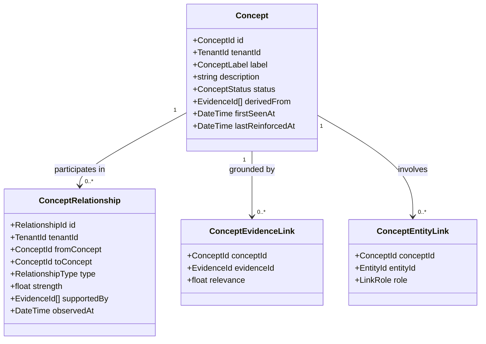
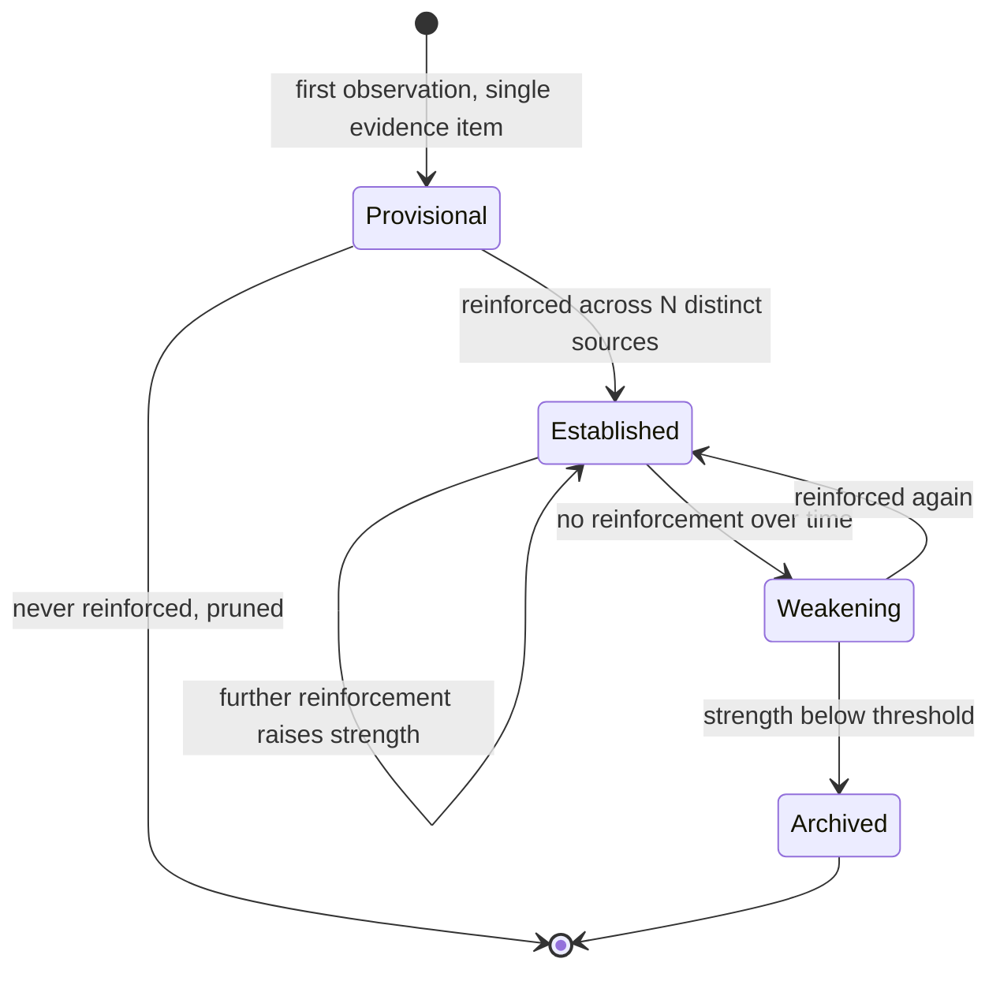

# Knowledge Graph

> **Status:** v1.0 — complete. New in Phase 7.
> **Scope:** concepts, relationships, semantic links, and topic hierarchy. It never owns embeddings — those are `vector-search.md` and `embedding-pipeline.md`.

## Overview

**Business purpose.** Evidence alone is a pile of excerpts. The Knowledge Graph is what turns a workspace's accumulated research into a *structure* — this concept relates to that one, this topic sits under that pillar, this subject is adjacent to a subject we already covered. That structure is what lets the platform propose internal links that make sense, detect that two articles are competing for the same territory, and identify that a cluster has a hole in it.

It is also what makes accumulated knowledge compound rather than merely accumulate. The hundredth article in a workspace should be cheaper and better than the first because the platform knows the domain.

**Technical purpose.** Maintain a tenant-scoped graph of **concepts** and **typed relationships** derived from evidence, supporting traversal, neighbourhood queries, and topical-coverage assessment — without storing vectors and without inferring business meaning.

## Concepts versus entities

The distinction that keeps this component and `entity-graph.md` from collapsing into each other:

| | **Knowledge Graph (here)** | **Entity Graph** |
|---|---|---|
| Node | A **concept** — an idea, topic, or subject | An **entity** — a specific named thing |
| Example | "container orchestration", "subscription pricing" | "Kubernetes", "Acme Corp", "Jane Smith" |
| Identity | Semantic; may be merged as understanding improves | Canonical; resolution and aliasing are its core problem |
| Question | *"What relates to what?"* | *"Is this the same thing as that?"* |
| Stability | Evolves with the corpus | Anchored to real-world referents |

A concept is what an article is *about*. An entity is what it *mentions*. "Pricing strategy" is a concept; "Stripe" is an entity. They interlink — an entity participates in concepts — but resolving *"is this Stripe the payments company or a different Stripe?"* is a fundamentally different problem from *"does pricing strategy relate to churn?"*, and merging them produces a component that does neither well.

## Responsibilities

- Concept nodes: identity, labels, descriptions derived from evidence.
- Typed relationships between concepts, with strength and provenance.
- Topic hierarchy: broader, narrower, and sibling structure.
- Semantic links between concepts and evidence, and between concepts and entities.
- Cross-reference support: which articles, evidence, and entities touch a concept.
- Traversal and neighbourhood queries for consumers.
- Topical-coverage assessment across a workspace's corpus.

## Non-responsibilities

| Not owned | Owner |
|---|---|
| **Embeddings and vector similarity** | `embedding-pipeline.md`, `vector-search.md` |
| Canonical entity identity, aliases, resolution | `entity-graph.md` |
| Evidence storage and provenance | `evidence-bank.md` |
| Ranking retrieval results | `retrieval-pipeline.md` |
| **Business meaning** — is this topic commercially valuable? | `05-content-platform/` |
| Topic clusters as a content *plan* | `05-content-platform/planning-engine.md` |
| Internal-link *recommendations* | `05-content-platform/seo-engine.md` |
| Any score | ADR-021 |

**The business-meaning boundary is the important one.** This component can state that "subscription pricing" and "churn reduction" co-occur strongly across a workspace's evidence, and that one is narrower than the other. It cannot state that writing about churn reduction is a good idea — that requires search volume, competition, and commercial context, which are Discovery's inputs and Planning's decision.

Similarly, this component supplies the graph the SEO Engine traverses to find internal-link candidates; it does not decide which links to place.

## Domain model



### Relationship types

A **closed, registry-backed vocabulary**. Free-form relationship types produce an unqueryable graph.

| Type | Meaning | Directional |
|---|---|---|
| `broader` / `narrower` | Hierarchical containment | Yes, inverse pair |
| `related_to` | General semantic adjacency | No |
| `part_of` / `has_part` | Compositional | Yes, inverse pair |
| `prerequisite_of` | Understanding dependency | Yes |
| `contrasts_with` | Meaningful opposition or alternative | No |
| `co_occurs_with` | Statistical co-occurrence in evidence | No |

**Every relationship is grounded.** `supportedBy` references the evidence items in which the relationship was observed. A relationship with no supporting evidence cannot be created — the graph is derived from what the workspace actually knows, not from general world knowledge a model happens to hold.

That rule is what keeps the graph auditable: "why does the platform think these relate?" resolves to specific excerpts.

## Graph construction

```mermaid
sequenceDiagram
    participant EB as Evidence Bank
    participant KG as Knowledge Graph
    participant AIGW as AI Gateway
    participant EG as Entity Graph
    participant PG as PostgreSQL

    EB-->>KG: EvidenceStored (consumed)
    KG->>KG: fetch evidence excerpt via published interface
    KG->>AIGW: AIRequest(task_type=knowledge.concept_extract, tier fast)
    AIGW-->>KG: candidate concepts + candidate relationships
    KG->>KG: match candidates against existing concepts
    KG->>EG: resolve any entity references
    KG->>KG: reinforce existing / create new; attach evidence support
    KG->>PG: BEGIN — upsert concepts + relationships + outbox — COMMIT
```

**Extraction goes through the AI Gateway** (ADR-008) with `task_type = knowledge.concept_extract`. This platform issues an `AIRequest` exactly as any engine would — it holds no prompt, names no model, and imports no provider SDK. The extracted concepts are **candidates**; they become graph nodes only after matching and grounding.

**Concept matching is deterministic first, semantic second.** Exact label match and registered-alias match run before any similarity comparison, so the common case costs nothing and the graph does not drift on near-duplicates that a simple match would have caught.

### Reinforcement and decay



**A single observation is not knowledge.** A concept or relationship seen in one source is `provisional` and is not returned to consumers by default. Promotion requires reinforcement **across distinct sources** — not repeated occurrences within one document, which would let a single verbose source manufacture structure.

Strength grows with independent reinforcement and decays without it, so a graph built from evidence that has since aged reflects that.

## Traversal and queries

```ts
interface NeighbourhoodQuery {
  tenantId: string;
  conceptId: string;
  depth: number;                       // bounded — see rules
  relationshipTypes?: RelationshipType[];
  minStrength?: number;
  includeProvisional?: boolean;        // default false
}

interface NeighbourhoodResult {
  center: Concept;
  nodes: Concept[];
  edges: ConceptRelationship[];
  truncated: boolean;                  // depth or breadth limit reached
}
```

| Query | Consumer | Purpose |
|---|---|---|
| Neighbourhood | SEO Engine | Internal-link candidate discovery |
| Hierarchy path | Planning Engine | Where a topic sits in the workspace's structure |
| Coverage gaps | Planning, Refresh | Concepts related to covered ones that have no content |
| Concept → evidence | Retrieval | Grounding a concept-scoped retrieval |
| Concept → articles | SEO, Analytics | Which content addresses a concept |

**Traversal depth is bounded and truncation is reported.** An unbounded graph walk on a mature workspace is a query that never returns; silently truncating one is worse, because the consumer treats a partial neighbourhood as complete.

## Business rules

1. **Every concept and relationship is grounded** in at least one evidence item; ungrounded structure cannot be created.
2. **Relationship types come from a closed registry.** An unregistered type is rejected.
3. **Promotion from `provisional` requires reinforcement across distinct sources.**
4. Strength **decays** without reinforcement; archived structure is retained, not deleted, so re-emergence is recognized rather than re-learned.
5. **The graph is tenant-scoped absolutely.** Concepts are never shared across workspaces, even within one organization — a workspace's topical structure reveals its strategy.
6. **No business meaning is inferred.** Commercial value, priority, and intent belong to the Content Platform.
7. Traversal is **depth-bounded**, and truncation is always reported.
8. Relationships are **directional where the type says so**, and inverse pairs are maintained together — creating `broader` without its `narrower` inverse produces a graph that traverses correctly in only one direction.
9. **Evidence retraction propagates**: a relationship losing its last supporting evidence is demoted to `provisional`, and if it has none, archived.
10. **This component produces no Score** (ADR-021). Strength is an internal graph weight, not a quality measure, and never leaves the platform as one.

**Idempotency:** construction from an evidence item is idempotent — re-processing reinforces rather than duplicating. **Concurrency:** concept upserts are keyed on `(tenant_id, normalized_label)` with the unique constraint resolving races.

## Events

Published through the transactional outbox in the state-changing transaction (ADR-020).

| Event | Producer | Consumers | Payload | Retry / DLQ |
|---|---|---|---|---|
| `ConceptCreated` | This component | Read models, Observability | `{ conceptId, label, tenantId, derivedFromCount }` | Standard |
| `ConceptPromoted` | This component | Read models, Planning (coverage) | `{ conceptId, distinctSources }` | Standard |
| `RelationshipObserved` | This component | Read models | `{ fromConcept, toConcept, type, strength }` | Standard |
| `ConceptArchived` | This component | Read models, Retrieval (index update) | `{ conceptId, reason }` | Standard |
| `TopicalCoverageGapDetected` | Coverage analyzer | Planning, Refresh, Notifications | `{ conceptId, relatedCoveredConcepts[], tenantId }` | Standard |
| `KnowledgeGraphRebuildRequired` | This component | Rebuild worker, Observability | `{ tenantId, reason }` | Standard |

**Consumed:** `EvidenceStored` → extract and link; `EvidenceRetracted` → demote or archive dependent structure; `EntityMerged` → re-point concept-entity links (`entity-graph.md`); `WorkspacePurged` → drop the tenant's graph.

**Payloads carry identifiers, labels, and counts — never evidence excerpts.**

## Database impact

New tables, additive to Phase 3. **No schema redesign.**

| Table | Purpose | Notes |
|---|---|---|
| `concepts` | `tenant_id`, `label`, `normalized_label`, `description`, `status`, `first_seen_at`, `last_reinforced_at` | Tenant-scoped with RLS; `UNIQUE (tenant_id, normalized_label)` |
| `concept_relationships` | `tenant_id`, `from_concept_id`, `to_concept_id`, `type`, `strength`, `observed_at` | `UNIQUE (tenant_id, from_concept_id, to_concept_id, type)`; `CHECK` on type |
| `concept_evidence_links` | `tenant_id`, `concept_id`, `evidence_id`, `relevance` | `UNIQUE (concept_id, evidence_id)`; FK to evidence `ON DELETE RESTRICT` |
| `concept_entity_links` | `tenant_id`, `concept_id`, `entity_id`, `role` | `UNIQUE (concept_id, entity_id, role)` |
| `relationship_type_registry` | Closed vocabulary with directionality and inverse pairs | Reference data (ADR-025 exception class) |

**Indexes:** `(tenant_id, normalized_label)` unique; `(tenant_id, from_concept_id, type)` and `(tenant_id, to_concept_id, type)` for bidirectional traversal; `(evidence_id)` on links for retraction propagation; partial `(tenant_id, status) WHERE status = 'established'` for the default query path.

**The graph is derived data.** It is rebuildable from evidence and is excluded from the authoritative backup set — the same classification as embeddings (`14-operations/backup-recovery.md` §3.1). Losing it degrades link suggestion and coverage analysis; it compromises no fact.

**Storage choice:** PostgreSQL with adjacency tables, not a graph database. At the depth and breadth these queries need — bounded traversal, two or three hops — recursive CTEs on indexed adjacency perform well, and adding a graph database would mean a second store to operate, secure, back up, and keep tenant-isolated. Revisiting that is a documented future consideration, not a v1 need.

## APIs

Published interfaces only (`knowledge-apis.md`).

| Interface | Purpose |
|---|---|
| `KnowledgeGraph.neighbourhood(query) → NeighbourhoodResult` | Bounded traversal |
| `KnowledgeGraph.hierarchy(conceptId) → HierarchyPath` | Broader/narrower path |
| `KnowledgeGraph.conceptsForEvidence(evidenceIds[]) → Concept[]` | Reverse link |
| `KnowledgeGraph.evidenceForConcept(conceptId, budget) → EvidenceRef[]` | Concept-scoped grounding |
| `KnowledgeGraph.coverageGaps(tenantId, scope) → CoverageGap[]` | Planning and refresh input |
| `KnowledgeGraph.relatedConcepts(conceptIds[], minStrength) → Concept[]` | Batch adjacency |

**REST:** `GET /v1/knowledge/concepts` · `GET /v1/knowledge/concepts/{id}/neighbourhood` · `GET /v1/knowledge/coverage-gaps`. All workspace-scoped and permission-gated.

## Security

- **Tenant isolation is absolute.** A workspace's concept graph is a map of its content strategy; cross-tenant leakage would be commercially damaging in a way that is hard to detect and impossible to undo.
- Concept extraction sends evidence excerpts to a model through the Gateway, where they are **wrapped as data** and subject to the platform's guardrails (`08-ai-platform/guardrails.md`).
- Concept labels are derived from customer evidence and are treated as customer data: never in event payloads beyond the label, never in cross-tenant aggregates.
- Graph queries are permission-gated at the workspace level.
- Reference `16-security/`; this component defines no controls of its own.

## Performance

| Concern | Approach |
|---|---|
| Construction | Asynchronous, consumed from `EvidenceStored`; never blocks ingestion |
| Extraction cost | Fast-tier, batched per evidence item; the graph is a background beneficiary of research, not a cost centre in the pipeline |
| Traversal | Recursive CTE with depth bound and breadth cap; **p95 < 150 ms** at depth 2 |
| Caching | Neighbourhoods cached per `(conceptId, depth, minStrength)` with invalidation on relationship change |
| Coverage analysis | Scheduled batch per workspace, not on demand |
| Rebuild | Full rebuild from evidence is a bounded batch job with a known cost |

**Graph construction never blocks the content pipeline.** A run completes when evidence is committed; concepts and relationships materialize shortly after, and their absence degrades link suggestion rather than stalling anything.

## Observability

- **Metrics:** `concepts_total{status}`, `relationships_total{type}`, `concept_promotions_total`, `concept_archives_total`, `graph_traversal_duration_seconds{depth}`, `graph_traversal_truncations_total`, `concept_extraction_duration_seconds`, `coverage_gaps_detected_total`, `graph_rebuild_duration_seconds`.
- **Tracing:** construction is a span consumed from `EvidenceStored`, carrying candidate and accepted counts; traversal is a span within its consumer's trace.
- **Logging:** concept ids, labels, counts, correlation id — never excerpts.
- **Business KPIs:** internal-link candidates surfaced per article (the graph's most direct product contribution) and coverage-gap conversion — how often a detected gap becomes a published article.
- **Alerts:** traversal truncation rate rising (depth bounds too tight, or a runaway hub concept); extraction failure rate; graph rebuild required unexpectedly, which usually indicates a link-integrity defect.

## Cross references

- `entity-graph.md` — the sibling: canonical named things, not concepts
- `evidence-bank.md` — the grounding for every node and edge
- `vector-search.md` · `embedding-pipeline.md` — semantic similarity, deliberately not owned here
- `retrieval-pipeline.md` — consumes concept-scoped evidence selection
- `05-content-platform/planning-engine.md` — cluster maps as a content *plan*, distinct from this graph
- `05-content-platform/seo-engine.md` — internal-link recommendations built on these traversals
- `08-ai-platform/ai-gateway.md` — the only path to concept extraction
- `14-operations/backup-recovery.md` §3.1 — why the graph is derived and rebuildable
- `01-system-architecture/14-scoring-contract.md` — why strength is not a Score
