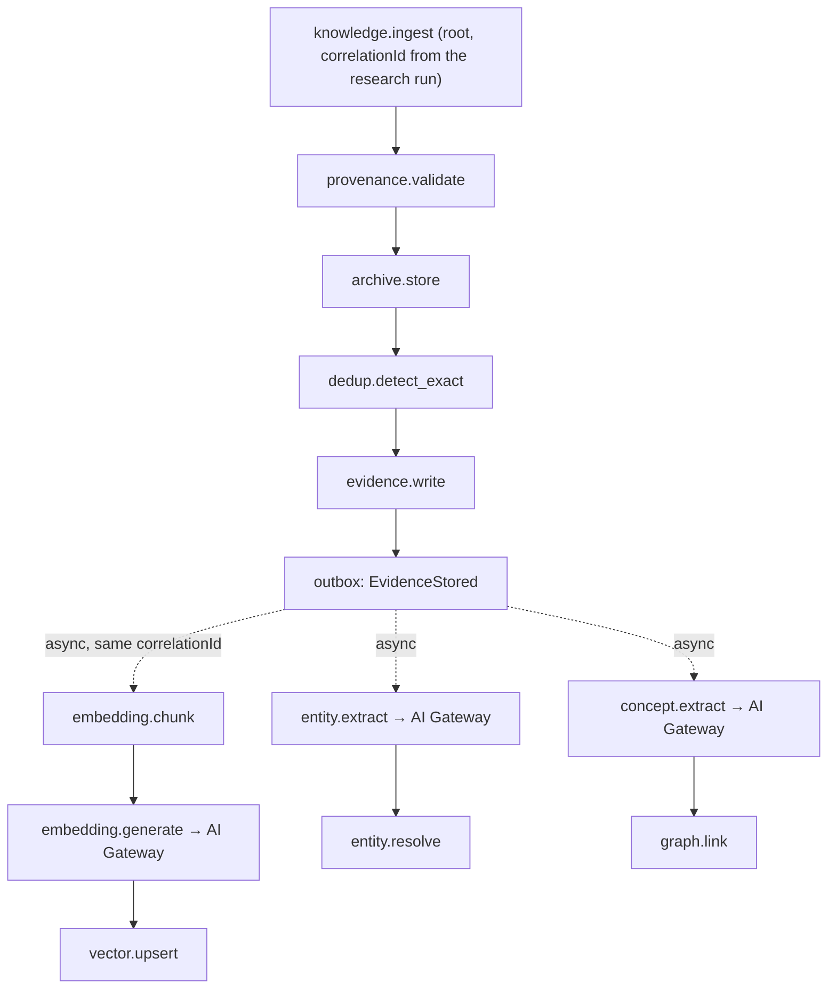
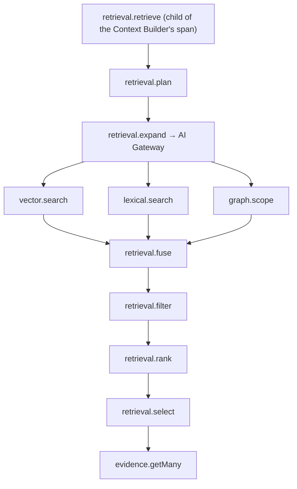
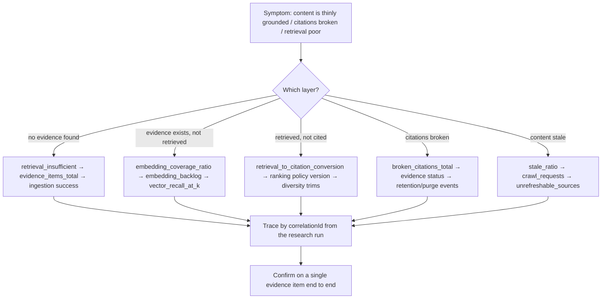

# Knowledge Platform Observability

> **Status:** v1.0 — complete. New in Phase 7.
> **Scope boundary:** knowledge-specific telemetry. Platform-wide SLOs, the telemetry pipeline, dashboards, and alert routing are `14-operations/monitoring.md`; this document feeds them.

## Overview

**Business purpose.** The Knowledge Platform fails silently by nature. Evidence stops being retrievable because an embedding backlog grew. Grounding quality degrades because recall drifted. Citations break because retention deleted referenced evidence. A source aged past relevance and nothing noticed. **None of these produce an error** — they produce worse content, discovered by a customer weeks later.

**Technical purpose.** Instrument the knowledge lifecycle so that degradation in *what the platform knows* and *what it can find* is detectable within hours, and attributable to a specific cause rather than to a general sense that quality slipped.

**The design principle:** knowledge failures are **absences**, and absences are invisible unless measured deliberately. Every metric below exists because something can go missing without complaining.

## Invariants versus SLOs

Two knowledge properties have **no error budget**. They are not degradations to be tuned — they are breaches.

| Invariant | Target | Why it is not an SLO |
|---|---|---|
| **Provenance integrity** | 100% | Evidence whose archive no longer matches its record cannot support the claims citing it. There is no acceptable rate of unverifiable evidence |
| **Cross-tenant isolation** | Zero events | One workspace's evidence inside another's content is a breach, not a degradation. A "0.1% acceptable rate" is not a coherent position |

Both **page immediately**, both are treated as SEV1 candidates, and neither is reported as a percentage against a budget — a percentage implies an acceptable failure rate, and there is none.

Everything else in this document is an ordinary SLI with a budget.

## Metric catalogue

Organized by the question each group answers.

### Evidence growth and health

| Metric | Type | Dimensions |
|---|---|---|
| `evidence_items_total` | gauge | `status`, `tenant_top_n` |
| `evidence_ingested_total` | counter | `tenant_top_n` |
| `evidence_per_source` | histogram | — |
| `evidence_growth_rate` | gauge | `tenant_top_n` |
| `source_documents_total` | gauge | `status` |
| `archive_bytes_total` | gauge | `tenant_top_n` |
| `evidence_retractions_total` | counter | `reason` |

**Growth rate is a leading cost signal.** Archives dominate storage, and a workspace whose evidence growth accelerates is one whose retention policy will matter sooner than anyone planned for.

### Provenance and integrity — invariant territory

| Metric | Type | Dimensions |
|---|---|---|
| `provenance_validations_total` | counter | `outcome` |
| `provenance_rejections_total` | counter | `missing_component` |
| **`integrity_verification_failures_total`** | **counter** | `failure_type` — **invariant** |
| `verification_sweep_coverage_ratio` | gauge | — |
| `custody_links_total` | counter | `event` |

**`provenance_rejections_total{missing_component}` is a diagnostic, not just a count.** A rejection rate rising on one component points directly at an acquirer defect — a parser that stopped emitting offsets, a fetch path that lost the timestamp — rather than at a vague ingestion problem.

**Verification coverage is a compliance signal.** Knowing what share of the corpus has been integrity-checked recently is what makes "our evidence is verifiable" a measured claim rather than an assertion.

### Citation integrity

| Metric | Type | Dimensions |
|---|---|---|
| `citation_resolutions_total` | counter | `outcome` |
| `citation_coverage_ratio` | histogram | — |
| `broken_citations_total` | counter | `failure` |
| **`fabricated_citations_total`** | **counter** | — |
| `citation_integrity_sweeps_total` | counter | `outcome` |
| `dependent_articles_per_retraction` | histogram | — |

`fabricated_citations_total` sits alongside the invariants: a citation naming evidence that was never in context is a grounding breach, and it feeds the evaluation harness as a blocking case (`10-testing/ai-evaluation.md`).

### Retrieval

| Metric | Type | Dimensions |
|---|---|---|
| `retrievals_total` | counter | `strategy`, `outcome` |
| `retrieval_duration_seconds` | histogram | `strategy` |
| `retrieval_candidates` | histogram | `source` (semantic / lexical / graph) |
| `retrieval_filtered_total` | counter | `reason` |
| `retrieval_insufficient_total` | counter | `strategy` |
| `evidence_items_selected` | histogram | `strategy` |
| `retrieval_cache_hit_ratio` | gauge | — |
| **`retrieval_to_citation_conversion`** | gauge | — |
| `vector_recall_at_k` | gauge | — |

**`retrieval_to_citation_conversion` is the truest quality measure in the platform** — the share of retrieved evidence that ends up cited in published content. Precision metrics measure whether retrieval found *plausible* evidence; conversion measures whether it found *usable* evidence, which is the only thing that matters.

**`vector_recall_at_k` is measured against ground-truth probes, not inferred.** HNSW recall degrades silently as a corpus grows and parameters stay fixed — there is no error, only worse answers, which is exactly the failure mode this whole document exists to catch.

### Freshness

| Metric | Type | Dimensions |
|---|---|---|
| `stale_ratio` | gauge | `tenant_top_n`, `volatility_class` |
| `evidence_stale_total` | counter | `volatility_class` |
| `crawl_requests_total` | counter | `outcome` |
| `freshness_confirmations_total` | counter | — |
| `unrefreshable_sources_total` | gauge | — |
| `dependent_articles_per_stale_evidence` | histogram | — |

**`freshness_confirmations_total` measures re-acquisitions that found unchanged content.** A high rate means the refresh schedule is too aggressive — the platform is paying to confirm what it already knew.

### Embedding and index

| Metric | Type | Dimensions |
|---|---|---|
| **`embedding_backlog`** | gauge | — |
| `embedding_coverage_ratio` | gauge | `tenant_top_n` |
| `embedding_jobs_total` | counter | `outcome` |
| `embedding_failures_total` | counter | `reason` |
| `reembedding_progress_ratio` | gauge | `version` |
| `vector_index_size_bytes` | gauge | `store` |
| `vector_search_duration_seconds` | histogram | `store` |

**`embedding_coverage_ratio` — evidence with vectors divided by active evidence — is the single best indicator that grounding is quietly degrading.** Evidence ingested but unembedded is invisible to semantic retrieval and presents as thin grounding rather than as an error.

### Graph consistency

| Metric | Type | Dimensions |
|---|---|---|
| `concepts_total` | gauge | `status` |
| `entities_total` | gauge | `type`, `status` |
| `entity_resolutions_total` | counter | `method` |
| `entity_ambiguities_total` | gauge | — |
| **`graph_dangling_references_total`** | gauge | `reference_type` |
| `graph_traversal_duration_seconds` | histogram | `depth` |
| `graph_traversal_truncations_total` | counter | — |

**`graph_dangling_references_total` is the graph-corruption detector.** A concept-entity link pointing at a merged-away entity, or a concept-evidence link pointing at purged evidence, produces missing relationships rather than errors. A periodic consistency sweep counts them, and non-zero is a defect.

### Deduplication and governance

| Metric | Type | Dimensions |
|---|---|---|
| `deduplication_hit_ratio` | gauge | — |
| `duplicate_review_backlog` | gauge | — |
| `merge_reversals_total` | counter | — |
| `retention_runs_total` | counter | `outcome` |
| `evidence_purged_total` | counter | `reason` |
| `retention_exceeded_with_citations` | gauge | `tenant_top_n` |
| `legal_holds_active` | gauge | — |
| `knowledge_exports_total` | counter | — |
| `purge_verification_failures_total` | counter | — |

**`deduplication_hit_ratio` collapsing is a normalization regression**, near-certainly caused by a parser change altering how content is canonicalized. It is one of the few metrics whose sudden movement has an almost singular cause.

### API

| Metric | Type | Dimensions |
|---|---|---|
| `knowledge_api_duration_seconds` | histogram | `interface`, `operation` |
| `knowledge_api_requests_total` | counter | `interface`, `operation`, `outcome` |
| `knowledge_api_batch_size` | histogram | `operation` |

**`knowledge_api_batch_size` catches N+1 patterns.** A batch interface consistently called with size 1 means a consumer is looping — which is why `getMany` exists and why its distribution is watched.

## Cardinality

`tenant_id` appears on **every trace and log line** but on **almost no metric** — unbounded tenant labels on high-frequency knowledge metrics would make the metrics store cost more than the corpus it observes.

| Dimension | Metrics | Traces | Logs |
|---|---|---|---|
| `tenant_id` | **Top-N only**, curated | Always | Always |
| `evidence_id` | Never | Always | Always |
| `strategy`, `status`, `outcome`, `reason` | Yes — bounded | Yes | Yes |
| `correlationId` | Never (exemplars only) | Always | Always |

Per-tenant and per-item investigation happens in traces and logs, where retention bounds cardinality naturally. The label allowlist is enforced at the collector.

## Tracing

Two lifecycle traces matter, and both must be followable end to end.

### Ingestion lifecycle



**Asynchronous continuations carry the originating `correlationId`.** Embedding, entity extraction, and concept linking happen minutes after ingestion, and without the shared correlation they would be untraceable back to the research run that caused them — which is exactly when you need the link, since a backlog manifests long after ingestion.

### Retrieval flow



**Retrieval nests inside the Context Builder's span**, which nests inside the engine's, which nests inside the workflow's — so a slow grounded generation decomposes to a specific retrieval stage rather than appearing as one opaque block.

**Mandatory span attributes:** `correlationId`, `tenant_id`, plus `evidence_id` on evidence-lifecycle spans, `strategy` and `embedding_version` on retrieval spans, `volatility_class` on freshness spans.

**Sampling:** 10% for routine retrieval; **100% for** ingestion, any provenance rejection, any integrity failure, any cross-tenant assertion, any governance action, and any retrieval marked insufficient.

## Logging

Structured JSON only. **Immutable audit events** for governance actions are written to `04-platform/audit-logs.md` in the same transaction as the change, never as an operational log line.

```json
{
  "level": "info",
  "event": "knowledge.evidence.stored",
  "correlation_id": "01J8...",
  "tenant_id": "01J7...",
  "evidence_id": "01J9...",
  "source_url_hash": "sha256:a3f...",
  "provenance_complete": true,
  "dedup_outcome": "new",
  "excerpt_length": 842,
  "run_id": "01J8..."
}
```

**Prohibited without exception:** excerpt text, source URLs in full, entity names beyond identifiers, concept labels in bulk, vectors, query text, export contents.

**Source URLs are logged as hashes.** URLs frequently embed session tokens, identifiers, and query parameters that constitute personal data — and they are recorded fully in provenance where access is governed, so the operational log does not need them.

## SLIs and SLOs

| SLI | Target | Window |
|---|---|---|
| Retrieval latency, `hybrid_balanced` | p95 < 400 ms | 7 d |
| Coverage probe latency | p95 < 80 ms | 7 d |
| Evidence ingestion success rate | ≥ 99.5% | 7 d |
| Embedding coverage ratio | ≥ 98% | 7 d |
| Citation resolution latency | p95 < 200 ms | 7 d |
| Knowledge API availability | ≥ 99.9% | 30 d |
| Vector recall@k against ground truth | ≥ baseline − 5% | 30 d |
| **Provenance integrity** | **100%** | **Always — invariant** |
| **Cross-tenant isolation** | **Zero events** | **Always — invariant** |

## Alerting

| Alert | Severity | Condition |
|---|---|---|
| **Integrity verification failure** | **Page** | Any occurrence — invariant breach |
| **Cross-tenant retrieval attempted** | **Page** | Any occurrence — invariant breach |
| **Fabricated citation detected** | **Page** | Any occurrence — grounding breach |
| **Citation integrity compromised** | **Page** | Published content resting on retracted evidence |
| **Purge verification failed** | **Page** | Customer data may persist after purge |
| **Erasure execution failed** | **Page** | Compliance exposure |
| `EvidenceStored` in DLQ | **Page** | Grounding pipeline stalled |
| Embedding backlog above threshold | Page | Grounding degrading silently |
| Embedding coverage below SLO | Investigate | Corpus partially invisible to retrieval |
| Graph dangling references non-zero | Investigate | Graph corruption |
| Vector recall below baseline | Investigate | Retrieval quality drifting |
| Deduplication hit ratio collapse | Investigate | Normalization regression |
| Provenance rejection rate spike | Investigate | Acquirer defect |
| Retention exceeded with citations | Investigate | Customer policy conflicts with live content |
| Stale ratio above threshold | Investigate | Corpus not being maintained |
| Merge reversal occurred | Notify | A bad merge reached evidence |
| Duplicate review backlog | Notify | Curation debt accumulating |

**Six alerts page, and five of them are invariant or compliance breaches.** That ratio is deliberate: the Knowledge Platform's operational failures degrade quality and can wait for business hours; its integrity failures cannot.

## Incident diagnostics



**The diagnostic order follows the pipeline backwards**, because knowledge symptoms present at the far end. "The article is thinly grounded" could be a research failure, an embedding backlog, a retrieval regression, or a retention purge — and the metrics distinguish them in that order.

**Always confirm on a single item.** Aggregates identify a pattern; one evidence item traced from acquisition through embedding, retrieval, and citation confirms the mechanism. An investigation that stops at aggregates produces plausible theories.

## Events

This component consumes signals rather than producing domain events. Two exceptions, both about telemetry itself:

| Event | Producer | Consumers | Payload |
|---|---|---|---|
| `KnowledgeQualityDegraded` | Detector job | Notifications, Evaluation harness | `{ signal, tenantScope, baseline, observed }` |
| `GraphConsistencySweepCompleted` | Consistency sweep | Observability, Notifications | `{ danglingReferences, repaired, scope }` |

Both through the outbox (ADR-020).

## Database impact

**This component owns no tables.** It reads from every other component's tables via replicas and from the telemetry pipeline. Governance audit events are written by `governance.md` to `04-platform/audit-logs.md`.

One derived table:

| Table | Purpose |
|---|---|
| `knowledge_health_snapshots` | Periodic per-workspace rollup: evidence count, coverage ratio, stale ratio, backlog, dangling references | Rebuildable; powers steward reporting without repeated aggregation |

Analytical queries run on a **replica**; a dashboard must never contend with the ingestion path.

## Security

- **No content in telemetry** — the prohibition list is enforced by the logging serializer, which redacts by key at any depth (`10-testing/unit-testing.md` §11).
- Source URLs are hashed in logs; full URLs live only in governed provenance.
- **Cross-tenant assertions route to the security channel**, not only to observability.
- Per-tenant knowledge metrics reveal research volume and corpus composition; dashboards carrying them require operator roles and are audited.
- Trace and log retention follows platform policy; knowledge telemetry is not retained longer, since identifiers alone are sensitive.
- Reference `16-security/`; this component defines no controls of its own.

## Performance

| Concern | Approach |
|---|---|
| Instrumentation overhead | < 3% of operation latency; sampled, batched, non-blocking |
| Health snapshots | Scheduled rollups, not on-demand aggregation |
| Ground-truth probes | Fixed synthetic corpus per workspace class, run off-peak |
| Consistency sweep | Batched per workspace; bounded by index scans, not full table reads |
| Cardinality | Collector-enforced allowlist |
| Failure isolation | Telemetry buffers and drops; **the knowledge path never fails because observability failed** |

## Cross references

- `14-operations/monitoring.md` — the platform telemetry pipeline and alert routing this feeds
- `14-operations/incident-response.md` — playbook P5 (cross-tenant exposure) consumes these signals
- `08-ai-platform/observability.md` — the AI-side counterpart; embedding and extraction cost appear there
- `provenance.md` · `citation-engine.md` — the two invariant sources
- `embedding-pipeline.md` · `retrieval-pipeline.md` · `freshness-engine.md` — the degradation signals
- `deduplication.md` · `governance.md` — curation and compliance signals
- `10-testing/ai-evaluation.md` — fabricated citations as blocking evaluation cases
- `04-platform/audit-logs.md` — where immutable governance events are written
