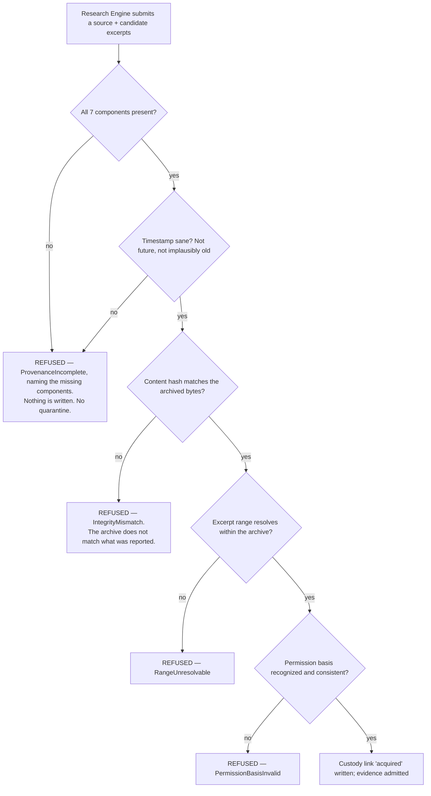
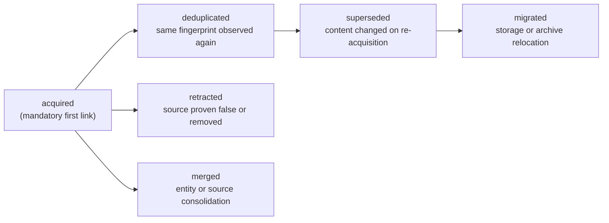
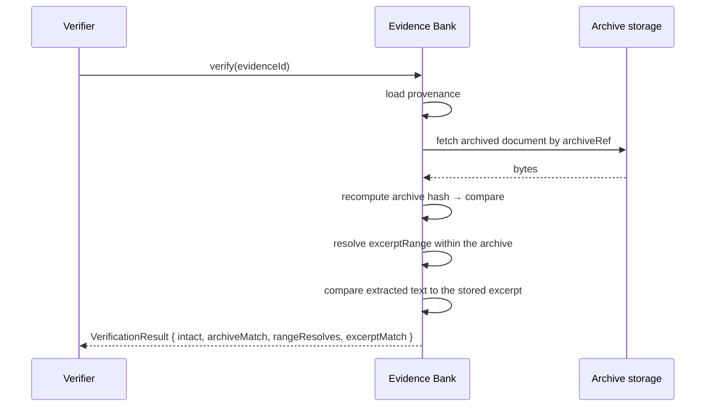

# Provenance

> **Status:** v1.0 — complete. New in Phase 7.
> **The foundational contract of the platform.** Evidence without complete provenance is not weak evidence — it is **invalid**, and it is refused at admission.

## Overview

**Business purpose.** Provenance is what separates ContentOS from a text generator. When a customer is asked to justify a published claim, provenance is the answer: this excerpt, from this URL, retrieved at this moment, by this method, verifiable against this archived copy. Everything the product sells — grounding, defensibility, audit-readiness, regulated-vertical viability — reduces to whether this record exists and can be trusted.

**Technical purpose.** Define the mandatory provenance contract, enforce it as an admission gate, guarantee its immutability, and maintain an unbroken chain of custody across every operation that touches evidence.

**The property that cannot be recovered later.** Provenance is capturable **only at acquisition**. If a URL, timestamp, and content hash were not recorded when a document was fetched, they cannot be reconstructed afterward — the page may have changed, the timestamp is unknowable, and the hash proves nothing about what was actually retrieved. This is why provenance is an admission gate rather than a later enrichment step: there is no later.

## The mandatory record

Every authoritative evidence item permanently records seven components. All are required; a record missing any one is invalid.

```ts
interface Provenance {
  // 1 — Origin
  origin: {
    url: string;                    // canonical, normalized
    domain: string;
    sourceType: SourceType;         // web | upload | api | feed
    publishedAt?: string;           // the source's OWN claim — never trusted alone
  };

  // 2 — Acquisition method
  acquisition: {
    method: AcquisitionMethod;      // fetch | parse | upload | api_response
    adapter: string;                // which Provider Layer adapter — NOT a vendor SDK detail
    userAgent: string;
    robotsRespected: boolean;
    accessConstraints: AccessConstraint[];   // paywall | login | rate_limited | none
  };

  // 3 — Acquisition timestamp
  retrievedAt: string;              // ISO 8601 UTC — AUTHORITATIVE age basis

  // 4 — Integrity metadata
  integrity: {
    contentHash: string;            // hash of the retrieved document as received
    excerptRange: { start: number; end: number };   // absolute offsets into the archive
    archiveRef: string;             // object key — the verifiable copy
    archiveHash: string;            // hash of the stored archive
    encoding: string;
    byteLength: number;
  };

  // 5 — Workspace ownership
  ownership: {
    tenantId: string;               // the workspace — ADR-017
    organizationId: string;
    acquiredForRunId: string;
  };

  // 6 — Permission context
  permission: {
    basis: PermissionBasis;         // public_web | licensed | user_uploaded | api_licensed
    licenseRef?: string;
    excerptPolicy: string;          // which fair-use bound applied
    restrictions: string[];         // no_redistribution | attribution_required | ...
  };

  // 7 — Chain of custody
  custody: CustodyLink[];           // append-only, ordered
}

interface CustodyLink {
  event: CustodyEvent;              // acquired | deduplicated | superseded | retracted | merged | migrated
  occurredAt: string;
  actor: ActorRef;                  // system component or authenticated human
  correlationId: string;
  priorEvidenceId?: string;
  reason?: string;
}
```

### Why each component exists

| Component | Answers | Without it |
|---|---|---|
| **Origin** | Where did this come from? | The claim is unattributable |
| **Acquisition method** | How did we get it, and were we entitled to? | Legal and reputational exposure; no robots record |
| **Timestamp** | When was this true? | Freshness is uncomputable; the entire refresh model collapses |
| **Integrity** | Is this what we actually retrieved? | An excerpt cannot be verified against its source |
| **Ownership** | Whose is it? | Tenant isolation and export obligations are unenforceable |
| **Permission** | May we use it this way? | Fair-use and licensing posture is undocumented |
| **Chain of custody** | What has happened to it since? | Deduplication and supersession become untraceable |

**`publishedAt` is deliberately optional and deliberately distrusted.** Sites lie about dates, omit them, or auto-update them. `retrievedAt` is a fact the platform observed; `publishedAt` is a claim the source made. Both are retained, and only one is authoritative (`freshness-engine.md`).

## Admission gate



**There is no quarantine state.** Incomplete-provenance evidence has no legitimate use, and a quarantine would eventually be read by something — a coverage count, a retrieval fallback, a debugging query that became a feature. Refusal is total.

**Integrity is verified at admission, not asserted.** The content hash is recomputed from the archived bytes and compared to what the acquirer reported. A mismatch means the archive and the claim disagree, and evidence whose archive cannot be trusted cannot support a verifiable excerpt.

**Refusal is a recorded outcome, not a silent drop.** `ProvenanceRejected` names the missing or failing components, so a systematic acquirer defect is visible rather than presenting as unexplained thin coverage.

## Immutability

**Provenance is written once and never modified.** Not corrected, not enriched, not backfilled.

| Attempted change | Correct handling |
|---|---|
| A field was wrong at acquisition | Retract the evidence; re-acquire; new item, new provenance |
| The source has been re-fetched | **New** evidence item with its own complete provenance (`freshness-engine.md`) |
| The same content was found again | A **custody link** is appended; the original record is untouched |
| Ownership must change | Not supported — evidence belongs to the workspace that acquired it |
| A permission basis was misclassified | Retract and re-acquire under the correct basis |

Enforcement is at the database role level: `UPDATE` and `DELETE` are revoked on `evidence_items` and `source_documents` for application roles (`03-database/tables.md` §4). The `custody` array is append-only within the record.

**Mutable provenance would be worthless provenance.** A record that can be edited proves nothing about what was originally retrieved, and the entire audit value of the platform rests on the record being unalterable after the fact.

## Chain of custody

Provenance records acquisition; custody records everything after.



| Custody event | Recorded when | Preserves |
|---|---|---|
| `acquired` | Admission — always the first link | The original acquisition context |
| `deduplicated` | The same fingerprint is retrieved again | That the content was independently re-observed, and when |
| `superseded` | Re-acquisition found changed content | The forward link and the reason |
| `retracted` | A source is proven false or removed | Actor and reason — a human decision |
| `merged` | Source consolidation | Both prior identities |
| `migrated` | Archive relocation, storage migration | That bytes moved without changing |

**Deduplication appends rather than discards.** When the same content is retrieved a second time, a `deduplicated` custody link records the second acquisition's URL and timestamp on the existing item. That is genuinely valuable: two independent retrievals of the same content, weeks apart, is stronger evidence than one — and it is what lets `freshness-engine.md` reset age without creating a duplicate.

**Custody survives every operation.** `deduplication.md`'s rule that source history is never lost is implemented here: merging, superseding, and consolidating all append links rather than rewriting the record.

## Permission context

The component most often omitted from provenance designs, and the one with the sharpest legal consequence.

| Basis | Means | Constraints recorded |
|---|---|---|
| `public_web` | Publicly accessible, robots-respecting fetch | Fair-use excerpt bound; attribution expectations |
| `licensed` | Acquired under a data licence | Licence reference; redistribution and retention terms |
| `user_uploaded` | Supplied by the workspace | The workspace asserts rights; retained with the upload record |
| `api_licensed` | Retrieved through a licensed provider API | Provider terms; caching and retention limits |

**Excerpt bounds are recorded, not merely applied.** Knowing that an excerpt was taken under a specific fair-use policy version means a later policy change can identify affected evidence, rather than leaving the platform unable to answer what rules it operated under.

**Access constraints are recorded even when acquisition succeeded.** A source behind a paywall that was reachable anyway is a different legal posture from one that was open, and the record must show which.

**`robotsRespected` is a permanent field, not a runtime check.** It records what the platform did at acquisition — the only moment the answer is knowable.

## Verification

Provenance is checkable after the fact, which is what makes it credible:



**Verification is available on demand and runs periodically as a sweep.** A sample of evidence is verified continuously, so archive corruption, storage migration errors, or excerpt drift surface as a metric rather than as an audit failure.

**Verification never modifies anything.** A failed verification is recorded and escalated; it does not repair, because a repair would be a mutation of the record whose immutability is the point.

## Business rules

1. **Evidence without complete provenance is invalid** and is refused at admission. Enforced by a database `CHECK` in addition to service-level validation.
2. **Provenance is immutable.** No update path exists at any authority level.
3. **All seven components are mandatory.**
4. **`retrievedAt` is the authoritative age basis**; `publishedAt` is a source claim.
5. **Integrity is verified at admission** by recomputing the archive hash.
6. **Excerpt ranges must resolve** within the archive at admission.
7. **Custody is append-only** and every operation touching evidence appends a link.
8. **Deduplication appends a custody link**; it never discards an acquisition observation.
9. **Permission basis is recorded**, including access constraints encountered.
10. **Ownership is fixed at acquisition.** Evidence belongs to the acquiring workspace and is never transferred.
11. **Correction is retraction plus re-acquisition**, never editing.
12. **Verification never repairs.**
13. Provenance is **authoritative data** — backed up, never classed as derived (`14-operations/backup-recovery.md` §3.1).

**Idempotency:** validation is a pure function. **Concurrency:** custody links are appended under the evidence item's row lock, so ordering is total per item.

## AI usage

**None.** Provenance validation is deterministic: field presence, hash comparison, range resolution, timestamp sanity, enum membership.

A model has no role here and would be actively harmful — a probabilistic judgment about whether provenance is adequate would undermine the one guarantee the platform makes without qualification. This is the only component in the Knowledge Platform that issues no `AIRequest` of any kind.

## Scoring

Per **ADR-021**: no categories produced or consumed.

Provenance completeness is **binary** — valid or refused — and deliberately not a score. A "provenance quality score" would imply that partially-provenanced evidence is usable at some threshold, which is precisely the position this platform rejects.

## Events

Published through the transactional outbox in the state-changing transaction (ADR-020).

| Event | Producer | Consumers | Payload | Retry / DLQ |
|---|---|---|---|---|
| `ProvenanceRecorded` | This component | Governance (audit), Observability | `{ evidenceId, sourceType, method, permissionBasis }` | Standard |
| `ProvenanceRejected` | This component | **Research Engine**, Observability | `{ sourceUrlHash, missingComponents[], reason }` | Standard — **alert on sustained** |
| `CustodyLinkAppended` | This component | Governance (audit) | `{ evidenceId, event, actor, correlationId }` | Standard |
| `IntegrityVerificationFailed` | Verification sweep | **Governance — pages**, Notifications, Security monitoring | `{ evidenceId, failure, archiveRef }` | **Critical** |
| `PermissionBasisFlagged` | This component | Governance, Legal review queue | `{ evidenceId, basis, constraints[] }` | Standard |

`IntegrityVerificationFailed` pages: evidence whose archive no longer matches its record cannot support the claims citing it, and published content may depend on it.

**Consumed:** every evidence lifecycle event — dedup, supersession, retraction, merge, migration — appends a custody link.

**Payloads carry hashes and classifications, never URLs in full or excerpt content.**

## Database impact

Provenance lives in the `provenance JSONB` columns on `source_documents` and `evidence_items` (`03-database/tables.md` §4). **No schema redesign.**

| Enforcement | Mechanism |
|---|---|
| Completeness | `ck_source_documents__provenance_complete` — a `CHECK` requiring the mandatory keys and a sane `retrievedAt` |
| Immutability | `UPDATE`/`DELETE` revoked at the role level |
| Custody | Append-only array within the record, plus `evidence_custody_links` for queryable history |

One new table:

| Table | Purpose |
|---|---|
| `evidence_custody_links` | Queryable, append-only custody history: `tenant_id`, `evidence_id`, `event`, `actor`, `occurred_at`, `correlation_id`, `prior_evidence_id`, `reason` |

The array within the JSONB record is the authoritative copy; the table is a normalized projection for querying — an audit asking "every retraction last quarter" cannot scan JSONB across 10⁹ rows.

**Indexes:** `(tenant_id, evidence_id, occurred_at)`; `(event, occurred_at)` for audit sweeps.

**Provenance is authoritative and is backed up**, unlike embeddings, entities, and freshness estimates. It is the one thing in this platform that cannot be rebuilt.

## APIs

Published interfaces only (`knowledge-apis.md`).

| Interface | Purpose |
|---|---|
| `Provenance.validate(record) → ValidationResult` | The admission gate |
| `Provenance.get(evidenceId) → Provenance` | Full record with custody chain |
| `Provenance.verify(evidenceId) → VerificationResult` | On-demand integrity check |
| `Provenance.appendCustody(evidenceId, link) → void` | Internal; called by lifecycle operations |
| `Provenance.chainFor(evidenceId) → CustodyLink[]` | Audit and support |

**REST:** `GET /v1/evidence/{id}/provenance` · `POST /v1/evidence/{id}/verify` · `GET /v1/evidence/{id}/custody`. Workspace-scoped; provenance is customer-facing because it is what makes their content defensible.

## Security

- **Tenant ownership is part of the record**, so provenance itself carries the isolation claim rather than depending only on the row's `tenant_id`.
- **Integrity metadata is a tamper-detection mechanism.** A modified archive fails verification; a modified provenance record is impossible at the role level.
- **Permission context is a compliance record** and is retained under legal hold with the evidence it describes (`governance.md`).
- URLs may embed session tokens or identifiers; they are normalized at admission and logged as hashes.
- Verification results are audit evidence and are retained accordingly.
- **Provenance is the record that makes erasure auditable** — proving what was deleted requires knowing what was held.
- Reference `16-security/`; this component defines no controls of its own.

## Performance

| Concern | Approach |
|---|---|
| Admission validation | **p95 < 15 ms** — field checks plus one hash comparison |
| Hash verification at admission | Computed over already-in-memory bytes; no extra I/O |
| Custody append | Single row insert plus a JSONB array append under the item's lock |
| Verification sweep | Sampled, off-peak, against a replica; fetches archives from object storage |
| Chain retrieval | Indexed; bounded by an item's operation count, typically fewer than ten links |

**Admission validation is on the ingestion path** for every evidence item, so it is deliberately cheap — deterministic checks over data already loaded, with no additional storage round-trip.

## Observability

- **Metrics:** `provenance_validations_total{outcome}`, `provenance_rejections_total{missing_component}`, `custody_links_total{event}`, `integrity_verifications_total{outcome}`, `verification_sweep_coverage_ratio`, `provenance_validation_duration_seconds`, `permission_basis_distribution`.
- **Tracing:** validation is a span within evidence ingestion, carrying outcome and rejected components.
- **Logging:** evidence id, source URL **hash**, outcome, missing components, correlation id — never full URLs or excerpts.
- **Business KPIs:** provenance rejection rate by component (a rising rate on one component points at a specific acquirer defect) and verification sweep coverage — what share of the corpus has been integrity-checked recently.
- **Alerts:** any `IntegrityVerificationFailed` (**page** — evidence may no longer support the claims citing it); rejection rate spiking (an acquirer regression); verification coverage falling below policy; custody append failures, which would break the audit chain.

## Cross references

- `evidence-bank.md` — enforces this contract at admission; owns the lifecycle custody describes
- `deduplication.md` — appends custody links rather than discarding acquisitions
- `freshness-engine.md` — `retrievedAt` is the authoritative age basis it computes from
- `citation-engine.md` — a citation is only meaningful because provenance makes it verifiable
- `governance.md` — retention, legal hold, export, and erasure all operate on provenance
- `05-content-platform/research-engine.md` — the acquirer that must supply a complete record
- `03-database/tables.md` §4 — the `CHECK` constraint and role-level immutability
- `14-operations/backup-recovery.md` §3.1 — why provenance is authoritative and always backed up
- `16-security/compliance.md` — permission basis and retention obligations
