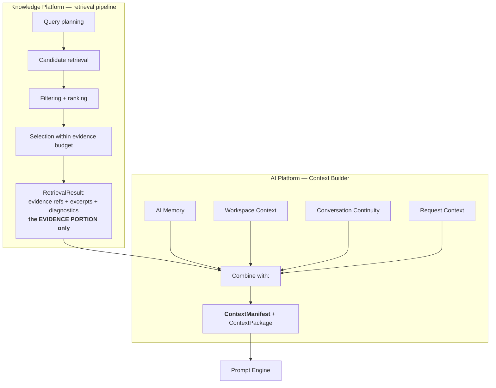
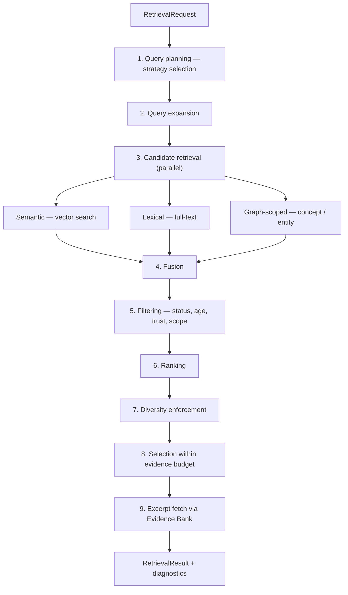
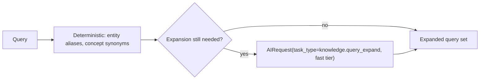

# Retrieval Pipeline

> **Status:** v1.0 — complete. New in Phase 7.
> **It returns evidence.** It never returns prompt context, generated text, AI Memory, or workspace context — those belong to the AI Platform's Context Builder.

## Overview

**Business purpose.** Grounding quality is decided here. The Evidence Bank may hold ten thousand items relevant to a workspace; a generation request can afford perhaps twenty. Which twenty determines whether the resulting content is well-supported or superficially plausible — and that selection is invisible in the output, which makes it the most consequential quality decision nobody sees.

**Technical purpose.** Plan a retrieval, expand the query, gather candidates through semantic and lexical paths, filter by policy, rank by relevance and evidence quality, select within a budget, and return **evidence references with retrieval diagnostics**.

**Design posture — diagnosability.** Every stage records what it did and what it discarded. Retrieval failures present as thin grounding rather than as errors, so without diagnostics a quality regression is untraceable.

## The Context Manifest boundary — mandatory

This is the boundary most likely to be blurred, and it is normative.



| Component | Produces |
|---|---|
| **Retrieval pipeline (here)** | The **evidence portion**: which evidence, why, what was rejected, at what cost |
| **Context Builder (`08-ai-platform/`)** | The **final `ContextManifest`**, combining retrieved evidence with AI Memory, workspace context, conversation continuity, and request context |

This component **never sees** AI Memory, workspace settings, conversation history, or the prompt. It receives a retrieval request and returns evidence. That is what keeps the source of truth (this platform) and the derived, non-authoritative sources (memory, preferences) assembled by a component that marks each segment's provenance — ADR-026's separation enforced structurally rather than by discipline.

## Responsibilities

- Query planning: determining the retrieval strategy for a request.
- Query expansion.
- Candidate retrieval through semantic, lexical, and graph-scoped paths.
- Filtering by status, age, trust, source, concept, and entity scope.
- Ranking: combining relevance with evidence-quality signals.
- Selection within an evidence budget.
- Retrieval diagnostics and the evidence-portion manifest.

## Non-responsibilities

| Not owned | Owner |
|---|---|
| **The final `ContextManifest`** | `08-ai-platform/context-builder.md` |
| **AI Memory, workspace context, continuity** | `08-ai-platform/` — never touched here |
| Prompt assembly or rendering | `08-ai-platform/prompt-engine.md` |
| **Generating any text** | Nothing here generates |
| ANN index configuration and execution | `vector-search.md` |
| Producing embeddings | `embedding-pipeline.md` |
| Evidence storage and provenance | `evidence-bank.md` |
| Trust and freshness *computation* | `freshness-engine.md`, source trust scoring |
| Token budgeting for the *whole* context | `08-ai-platform/context-builder.md` — this component budgets the evidence portion only |
| Any score | ADR-021 |

## Retrieval stages



### 1 · Query planning

The strategy depends on what the caller is grounding:

| Strategy | Used when | Approach |
|---|---|---|
| `semantic_broad` | Open topical grounding | Vector-led, wide `k`, diversity-weighted |
| `lexical_precise` | Named things, statistics, quoted terms | Lexical-led, exact-match priority |
| `hybrid_balanced` | Default for section drafting | Both paths, fused |
| `concept_scoped` | Grounding a known concept | Graph-scoped candidate set, then ranked |
| `entity_scoped` | Grounding claims about a named entity | Entity mentions as the candidate set |
| `coverage_probe` | Planning's sufficiency check | Counts and thresholds; **no excerpt fetch** |

**`coverage_probe` deliberately skips excerpt fetching.** Planning calls it repeatedly across a revise loop and needs counts, not content — fetching excerpts would make an inexpensive check expensive.

### 2 · Query expansion



**Deterministic expansion runs first** — verified entity aliases and registered concept synonyms from the graphs. That handles the common case at zero cost and with perfect precision.

Semantic expansion goes **through the AI Gateway** with `task_type = knowledge.query_expand`. No prompt content, routing, or model identity is owned here.

**Expansion is additive and recorded.** Original and expanded terms are both retained in the diagnostics, so a retrieval that surfaced unexpected evidence is explicable.

### 5 · Filtering

Applied after fusion, before ranking, so filtering is never confused with relevance:

| Filter | Default | Notes |
|---|---|---|
| Tenant | **Mandatory** | Already enforced in vector search; re-asserted here |
| Status | `active` only | `superseded` and `retracted` excluded; inclusion requires an explicit audit flag |
| Age | Per caller's `maxEvidenceAgeDays` | Sourced from refresh scope or workspace policy |
| Trust | Optional floor | Trust is a labelled **estimate**, never a Score |
| Source | Optional include/exclude | Workspace exclusions honoured |
| Scope | Optional concept or entity restriction | Graph-derived |

**Filtering is not ranking.** A filtered item is excluded regardless of relevance; a low-ranked item is present but unselected. Conflating them makes it impossible to tell whether evidence was unavailable or merely unpreferred — a distinction that matters when diagnosing thin grounding.

### 6 · Ranking

Combines relevance with evidence-quality signals:

| Input | Source | Nature |
|---|---|---|
| Fused rank | `vector-search.md` | Semantic and lexical rank provenance |
| Freshness | `freshness-engine.md` | Age relative to the topic's volatility class |
| Source trust | Source trust estimate | Labelled estimate with method and `computedAt` |
| Corroboration | Count of distinct sources supporting a similar claim | Computed here |
| Specificity | Presence of concrete figures, dates, named entities | Structural |

**Weighting is versioned policy, not constants.** A `rankingPolicyVersion` is recorded on every result, so a retrieval-quality change is attributable to a policy edit exactly as a generation change is attributable to a prompt version.

**None of these is a Score.** Trust and freshness are labelled estimates about *sources*; rank is an ordering. None carries a verdict, a 0–100 normalization, or a registry category (ADR-021).

### 7 · Diversity

Ranking alone returns near-duplicates: five chunks from one document, all highly similar, all scoring well.

| Rule | Reasoning |
|---|---|
| Cap per source document | One source cannot monopolize the evidence budget |
| Cap per near-duplicate cluster | Uses `vector-search.neighbours` to detect clustering |
| Prefer corroboration across distinct sources | Three sources agreeing outrank one source stated three ways |

**Corroboration across distinct sources is a grounding-quality property**, not a stylistic preference. A claim supported by three independent sources is materially better grounded than one supported by three passages of the same document.

### 8 · Selection and evidence budget

```ts
interface EvidenceBudget {
  maxTokens: number;          // supplied BY the Context Builder for the evidence segment
  maxItems?: number;
  minItems?: number;          // below this, grounding is insufficient
}
```

**The budget is supplied by the Context Builder**, which owns the whole-context allocation. This component fills the evidence share and reports what it could not fit.

Selection trims at **excerpt boundaries, never mid-claim** — the same rule the Context Builder applies to its own trimming, and for the same reason: a half-quoted statistic is worse than an omitted one.

**Below `minItems`, the result is marked `groundingSufficient: false`.** This component does not decide what to do about it — the Context Builder returns `ContextInsufficient` and the caller decides whether to request more research (`05-content-platform/planning-engine.md`).

## Output

```ts
interface RetrievalResult {
  evidence: Array<{
    evidenceId: string;
    sourceId: string;
    excerpt: string;              // omitted for coverage_probe
    range: { start: number; end: number };
    provenanceSummary: { url: string; retrievedAt: string; method: string };
    rank: number;
    rankProvenance: RankProvenance;
  }>;
  groundingSufficient: boolean;
  evidenceTokens: number;
  diagnostics: RetrievalDiagnostics;
  rankingPolicyVersion: string;
  retrievedAt: string;
}

interface RetrievalDiagnostics {
  strategy: RetrievalStrategy;
  expandedTerms: string[];
  candidatesBySource: { semantic: number; lexical: number; graph: number };
  fusedCandidates: number;
  filtered: Array<{ reason: FilterReason; count: number }>;
  diversityTrimmed: number;
  budgetOmitted: number;
  embeddingVersion: string;
}
```

**Diagnostics are not optional.** "Retrieval returned four items" is unactionable; "sixty candidates, forty-one filtered on age, twelve diversity-trimmed, three omitted for budget" identifies the cause immediately.

**Every item carries its provenance summary**, so the Context Builder can mark the segment `source_of_truth` and the Citation Engine can later resolve against the same identifiers.

## Business rules

1. **Returns evidence only.** Never prompt context, generated text, AI Memory, or workspace context.
2. **Produces the evidence portion of the manifest**; the Context Builder composes the final `ContextManifest`.
3. **Tenant scoping is mandatory** at every stage.
4. `retracted` evidence is excluded by default; inclusion requires an explicit audit flag.
5. **Filtering and ranking are distinct stages**, reported separately.
6. **Cross-embedding-version candidates are never ranked together** (`vector-search.md`); `embeddingVersion` is reported.
7. Trimming happens at **excerpt boundaries, never mid-claim**.
8. Diversity caps prevent single-source monopolization.
9. **Diagnostics are always returned**, including on the sufficiency path.
10. `rankingPolicyVersion` is recorded on every result.
11. **Nothing here generates.** Query expansion produces terms, never prose.
12. **No Score is produced** (ADR-021); trust and freshness remain labelled estimates.
13. `coverage_probe` returns counts without excerpts.

**Idempotency:** retrieval is a pure read; identical inputs against identical corpus state produce identical results. **Concurrency:** stateless; candidate paths run in parallel.

## AI usage

| Task type | Purpose | Tier |
|---|---|---|
| `knowledge.query_expand` | Generate semantically adjacent query terms when deterministic expansion is insufficient | Fast |
| `knowledge.embed_query` | Embed the query for semantic retrieval | Fast |

Both go **through the AI Gateway** (ADR-008). No prompts, routing, providers, or model-specific behaviour exist here.

**Reranking with a model is deliberately not used at v1.** Cross-encoder reranking improves precision but adds a per-candidate model call to the hot path of every grounded generation — a large cost increase for a gain the corroboration and diversity rules capture much of. It is a documented future consideration with a measurable trigger (§Future in `knowledge-apis.md`).

## Events

Published through the transactional outbox where durable (ADR-020); per-retrieval diagnostics are transient telemetry.

| Event | Producer | Consumers | Payload |
|---|---|---|---|
| `RetrievalInsufficient` | This component | Observability, Research Engine (signal) | `{ strategy, candidatesFound, minRequired, tenantId }` |
| `RetrievalPolicyChanged` | Admin | All instances (cache refresh), Observability | `{ rankingPolicyVersion, changedWeights[] }` |
| `RetrievalQualityDegraded` | Drift monitor | **Observability — alert** | `{ metric, baseline, observed }` |

**Consumed:** `EmbeddingVersionChanged` → switch the serving version per tenant; `EvidenceRetracted` → invalidate cached retrievals referencing it.

## Database impact

**This component owns no tables.** It reads through published interfaces:

| Interface | Owner |
|---|---|
| `VectorSearch.similar` · `.hybrid` · `.neighbours` | `vector-search.md` |
| `EvidenceBank.getMany` | `evidence-bank.md` |
| `KnowledgeGraph.evidenceForConcept` | `knowledge-graph.md` |
| `EntityGraph.evidenceFor` | `entity-graph.md` |
| Freshness and trust estimates | `freshness-engine.md` |

One new reference table:

| Table | Purpose |
|---|---|
| `retrieval_policies` | Versioned ranking weights, diversity caps, strategy defaults | Reference data (ADR-025 exception class) |

**Caching:** results cached by `(tenantId, queryDigest, filters, budget, rankingPolicyVersion, embeddingVersion, corpusStateVersion)`. The corpus version is what makes the cache correct — new evidence invalidates it rather than serving a stale candidate set.

**No schema redesign.**

## APIs

Published interfaces only (`knowledge-apis.md`).

| Interface | Purpose |
|---|---|
| `Retrieval.retrieve(request) → RetrievalResult` | The primary path, called by the Context Builder |
| `Retrieval.probe(request) → CoverageProbeResult` | Counts without excerpts, for Planning |
| `Retrieval.explain(requestId) → RetrievalDiagnostics` | Post-hoc diagnosis |

**No REST surface.** Retrieval is internal; exposing it would allow a caller to extract a workspace's evidence corpus through repeated queries.

## Security

- **Tenant scoping is asserted at every stage**, not inherited — defence in depth behind RLS and the vector filter.
- Excerpts are fetched through the Evidence Bank's governed path, so retrieval cannot bypass evidence-level access control.
- **Retrieved content is untrusted** and is returned as data with its provenance; the Context Builder wraps it in a data block and guardrails apply framing (`08-ai-platform/guardrails.md`).
- Query text may contain customer-sensitive terms; queries are logged as digests, never in full.
- Retrieval diagnostics reveal corpus characteristics and are workspace-scoped.
- Reference `16-security/`; this component defines no controls of its own.

## Performance

| Concern | Approach |
|---|---|
| Latency | **p95 < 400 ms** for `hybrid_balanced` at typical `k` |
| Parallelism | Semantic, lexical, and graph paths run concurrently |
| Excerpt fetch | Single batched `getMany` after selection — never per candidate |
| Caching | Corpus-version-keyed; a revise loop with unchanged evidence reuses results |
| `coverage_probe` | **p95 < 80 ms** — counts only, no excerpt fetch |
| Budget | Bounded candidate sets at every stage; no unbounded retrieval path exists |

**Fetching excerpts only after selection** is the significant efficiency decision: candidate sets are large, selected sets are small, and fetching content for candidates that will be discarded is the most common way retrieval becomes slow.

## Observability

- **Metrics:** `retrievals_total{strategy,outcome}`, `retrieval_duration_seconds{strategy}`, `retrieval_candidates` (histogram by source), `retrieval_filtered_total{reason}`, `retrieval_diversity_trimmed_total`, `retrieval_budget_omitted_total`, `retrieval_insufficient_total{strategy}`, `evidence_items_selected` (histogram), `retrieval_cache_hit_ratio`, `retrieval_to_citation_conversion`.
- **Tracing:** retrieval is a span within the Context Builder's span, with child spans per candidate path — so a slow grounded generation attributes to semantic search, lexical search, or excerpt fetch specifically.
- **Logging:** strategy, counts by stage, filter reasons, policy version, correlation id — **never query text or excerpts**.
- **Business KPIs:** **retrieval-to-citation conversion** — the share of retrieved evidence that ends up cited in published content, which is the truest measure of selection quality — and `evidence_items_selected`, a leading indicator of citation coverage.
- **Alerts:** `retrieval_insufficient_total` rising for a task family (usually upstream research degradation, not a retrieval defect); conversion ratio declining (selection quality regression); cache hit ratio dropping; `RetrievalQualityDegraded`.

## Cross references

- **`08-ai-platform/context-builder.md` — the mandatory boundary: this component supplies the evidence portion; that one composes the `ContextManifest`**
- `vector-search.md` — candidate retrieval and fusion primitives
- `embedding-pipeline.md` — query-side embedding and version coexistence
- `evidence-bank.md` — excerpt fetch and coverage
- `knowledge-graph.md` · `entity-graph.md` — scoped candidate sets
- `freshness-engine.md` — age and staleness inputs to ranking
- `08-ai-platform/ai-gateway.md` — the only path to expansion and query embedding
- `05-content-platform/planning-engine.md` — the `coverage_probe` consumer
- `01-system-architecture/14-scoring-contract.md` — why rank and trust are not Scores
