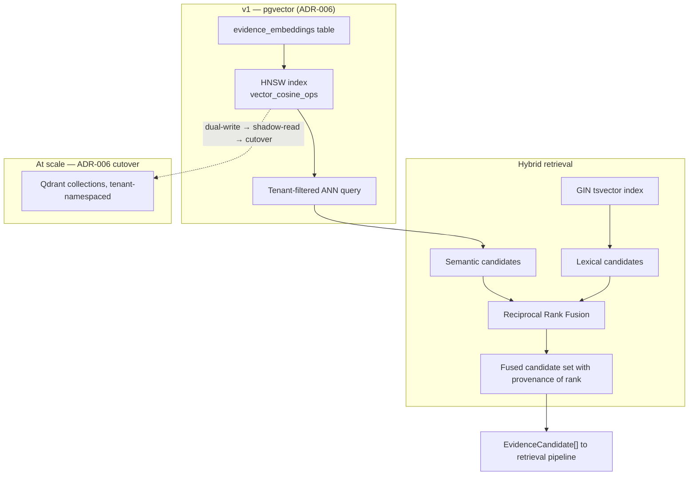
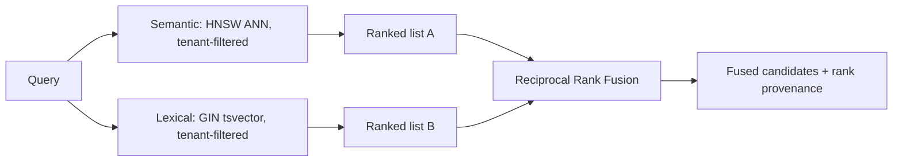
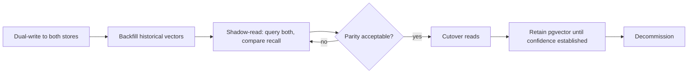

# Vector Search

> **Status:** v1.0 — complete. New in Phase 7.
> **Authority:** ADR-006 (`pgvector` first, Qdrant at scale). **It never generates answers** — it returns candidates.

## Overview

**Business purpose.** Grounding requires finding the right evidence, and the right evidence is frequently phrased nothing like the query. A section about "reducing customer churn" must surface a source discussing "subscriber retention" — lexical search cannot do that, and without semantic retrieval the platform would ground content only in sources that happened to use matching vocabulary.

**Technical purpose.** Maintain approximate-nearest-neighbour indexes over evidence embeddings, execute tenant-filtered similarity search, and support hybrid retrieval by combining semantic and lexical candidate sets — returning **evidence references with scores**, never text and never answers.

**The isolation problem this component owns.** Vector search is the **one retrieval path Row-Level Security cannot fully protect**. An ANN index returns approximate nearest neighbours across everything it contains; the tenant predicate is applied to what the index already traversed. Every rule below treats that as the primary concern.

## Responsibilities

- Vector index configuration, construction, and maintenance.
- Tenant-filtered similarity search.
- Hybrid retrieval: combining semantic and lexical candidate sets.
- Ranking inputs — distances and fusion positions supplied to the retrieval pipeline.
- Index health monitoring and rebuild coordination.
- The abstraction that makes the vector store swappable.

## Non-responsibilities

| Not owned | Owner |
|---|---|
| **Generating answers or text of any kind** | Nothing here generates; the AI Platform does |
| Producing embeddings | `embedding-pipeline.md` |
| Query expansion, filtering policy, final selection | `retrieval-pipeline.md` |
| Evidence storage and provenance | `evidence-bank.md` |
| Deciding what the caller does with results | The caller |
| Token budgeting | `retrieval-pipeline.md`, `08-ai-platform/context-builder.md` |
| Any score in the ADR-021 sense | Nothing here — similarity is a distance, not a Score |

**Distance is not a Score.** A cosine distance of 0.23 is a geometric fact about two vectors. It has no verdict, no 0–100 normalization, no confidence, and no category in the registry. It is an input to ranking, and ranking is an input to selection. Presenting similarity as a quality measure would be a category error with real consequences — a highly similar source is not necessarily a trustworthy one.

## Index architecture



| Parameter | v1 value | Reasoning |
|---|---|---|
| Index type | **HNSW** | Better recall-per-latency than IVFFlat, and no training step — the corpus grows continuously rather than being bulk-loaded |
| Distance | Cosine | Embeddings are normalized; the standard for text similarity |
| `m`, `ef_construction` | Per `03-database/indexes.md` §10 | Provisional until measured against the real corpus (OQ-11) |
| `ef_search` | Set per query | Raised for high-stakes retrieval, lowered for bulk operations |

**`ef_search` is a per-query parameter, not a global setting.** Fact verification wants recall and can afford latency; a bulk coverage sweep wants speed. Fixing it globally forces one trade-off on both.

## Tenant isolation — the rule that matters most

```sql
SELECT e.id, emb.embedding <=> $1 AS distance
FROM evidence_embeddings emb
JOIN evidence_items e ON e.id = emb.evidence_id
WHERE emb.tenant_id = $2          -- MANDATORY, never optional, never inferred
  AND e.status = 'active'
ORDER BY emb.embedding <=> $1
LIMIT $3;
```

**Every similarity query carries an explicit `tenant_id` predicate.** RLS does apply to these tables, but an ANN search is not a filtered scan: the index returns approximate neighbours from everything it holds, and the predicate is applied afterward. Without the explicit filter, recall degrades unpredictably for the correct tenant *and* the query wastes work traversing other tenants' vectors.

`tenant_id` is **denormalized onto `evidence_embeddings`** precisely so this predicate needs no join (`03-database/tables.md` §4).

Three independent layers protect this path:

| Layer | Control |
|---|---|
| 1 | RLS policy on `evidence_embeddings` |
| 2 | **Mandatory explicit tenant predicate** in every query, enforced by the search interface's signature — `tenantId` is a required parameter with no default |
| 3 | A dedicated **cross-tenant nearest-neighbour test** asserting zero foreign results, which fails the build (`10-testing/integration-testing.md` §8) |

Three layers because the failure is unrecoverable: a cross-tenant retrieval places one customer's evidence inside another's generated content, and by the time anyone notices, it has been published.

## Hybrid retrieval

Semantic search alone misses exact terms — product names, statistics, proper nouns, error codes. Lexical search alone misses paraphrase. Both are needed.



**Reciprocal Rank Fusion is used deliberately**: it merges two ranked lists using *positions* rather than scores, which sidesteps the problem that a cosine distance and a text-search rank are incomparable quantities. Normalizing them against each other would require a mapping nobody can justify.

**Rank provenance is retained** — each candidate records whether it came from the semantic list, the lexical list, or both, and at what position. That is what lets the retrieval pipeline reason about *why* something surfaced, and what makes a retrieval-quality regression diagnosable rather than mysterious.

Fusion weighting is a **retrieval-pipeline concern**; this component supplies both lists and the fusion primitive.

## Interfaces

```ts
interface SimilaritySearch {
  tenantId: string;                    // REQUIRED — no default, no inference
  queryVector: number[];
  filters: {
    status?: EvidenceStatus[];         // default: ['active']
    sourceIds?: string[];
    maxAgeDays?: number;
    conceptIds?: string[];
    entityIds?: string[];
  };
  k: number;
  efSearch?: number;
  minSimilarity?: number;
}

interface EvidenceCandidate {
  evidenceId: string;
  chunkIndex: number;
  distance: number;                    // raw geometric distance
  rankProvenance: {
    semanticRank?: number;
    lexicalRank?: number;
    fusedRank: number;
  };
  embeddingVersion: string;            // which embedding generation produced this
}
```

**`embeddingVersion` on every candidate** is what makes a mid-migration index safe to query: candidates from two embedding generations are distinguishable, and the retrieval pipeline can refuse to compare across them.

**Candidates carry references, never content.** Text is fetched from the Evidence Bank by the retrieval pipeline through its published interface, which keeps excerpt access on one governed path.

## Business rules

1. **`tenantId` is a required parameter** with no default and no inference. The interface makes an untenanted search unrepresentable.
2. **Every query filters on tenant explicitly**, in addition to RLS.
3. **Distance is never presented as a quality measure** and never leaves the platform as a Score (ADR-021).
4. **Nothing here generates.** No summarization, no answer construction, no text synthesis.
5. Candidates carry **references and ranks**, not excerpts.
6. **Cross-generation comparison is refused.** Candidates from different `embeddingVersion` values are not ranked against each other; the pipeline handles a mixed corpus explicitly (`embedding-pipeline.md`).
7. Search **excludes `retracted` evidence** by default; including it requires an explicit filter and is used only for audit paths.
8. `ef_search` is per query, and index parameters are policy, not constants.
9. **The vector store is abstracted.** No consumer knows whether results came from `pgvector` or Qdrant.
10. Index rebuilds are **online**; search degrades in recall during a rebuild but never becomes unavailable.

**Idempotency:** search is a pure read. **Concurrency:** reads scale horizontally on replicas; index maintenance is coordinated by `embedding-pipeline.md`.

## Store abstraction and the Qdrant path

```ts
interface VectorStore {
  search(query: SimilaritySearch): Promise<EvidenceCandidate[]>;
  upsert(vectors: VectorRecord[]): Promise<void>;
  delete(evidenceIds: string[]): Promise<void>;
  health(): Promise<IndexHealth>;
  stats(tenantId?: string): Promise<IndexStats>;
}
```

One interface, two implementations. Cutover criteria are ADR-006 and `14-operations/scaling-strategy.md` §8 — **any two of**: index above 50 GB, query p95 above 200 ms at target recall, more than 50M embeddings, or measurable contention with transactional load (OQ-6, still open).



**The fallback is always "rebuild from evidence," never "restore from backup."** Embeddings are derived data (`14-operations/backup-recovery.md` §3.1), which is what makes this migration low-risk: a failed cutover is recoverable by rebuilding, and the authoritative evidence never moved.

**Tenant isolation must be re-established, not assumed, in Qdrant.** Per-tenant collections or a mandatory payload filter — the shadow-read phase includes a cross-tenant assertion, because a new store means the isolation proof starts over.

## Events

Published through the transactional outbox where durable (ADR-020).

| Event | Producer | Consumers | Payload | Retry / DLQ |
|---|---|---|---|---|
| `VectorIndexHealthDegraded` | This component | **Observability — alert**, Retrieval pipeline | `{ store, metric, observed, threshold }` | Critical |
| `VectorIndexRebuildStarted` / `Completed` | This component | Observability, Retrieval (recall expectation) | `{ store, tenantScope, vectorCount }` | Standard |
| `CrossTenantRetrievalAttempted` | This component | **Security monitoring — pages**, Audit | `{ requestingTenant, correlationId }` | **Critical** |
| `VectorStoreCutoverPhaseChanged` | Migration coordinator | Observability, Notifications | `{ phase, parityMetrics }` | Standard |

`CrossTenantRetrievalAttempted` fires if a search reaches this component without a tenant predicate — which should be impossible given the interface signature, and is therefore treated as evidence of a defect or an attack rather than as a filtered request.

**Consumed:** `EvidenceStored` → expect vectors from the embedding pipeline; `EvidenceRetracted` → remove from index; `EmbeddingVersionChanged` → begin coexistence handling.

## Database impact

Owns the vector index over `evidence_embeddings` (`03-database/tables.md` §4). **No schema redesign.**

| Aspect | Detail |
|---|---|
| Table | `evidence_embeddings` — `tenant_id` denormalized, `evidence_id` FK `ON DELETE CASCADE` (the only cascade in the schema, because embeddings are derived) |
| Vector index | `ixv_evidence_embeddings__hnsw` — HNSW, cosine (`03-database/indexes.md` §10) |
| Lexical index | `ixg_evidence_items__fts` — GIN on `to_tsvector`, for the hybrid path |
| Supporting | `ux_evidence_embeddings__evidence_chunk` — idempotent writes |
| Dimension | `VECTOR(n)` fixed by the embedding model — **migration `0019` remains blocked on OQ-11** |

**HNSW build is the most expensive index operation in the platform**, which is why embedding writes are batched and asynchronous, and why rebuilds are scheduled rather than triggered casually.

## APIs

Published interfaces only (`knowledge-apis.md`).

| Interface | Purpose |
|---|---|
| `VectorSearch.similar(query: SimilaritySearch) → EvidenceCandidate[]` | Semantic candidates |
| `VectorSearch.hybrid(query, lexicalQuery, fusion) → EvidenceCandidate[]` | Fused candidates |
| `VectorSearch.neighbours(evidenceId, k) → EvidenceCandidate[]` | Similar-to-this, used by deduplication |
| `VectorSearch.health() → IndexHealth` | Operational |
| `VectorSearch.stats(tenantId?) → IndexStats` | Capacity and cutover monitoring |

**No REST surface.** Vector search is internal; exposing it would let a caller extract a workspace's evidence distribution through repeated probing.

## Security

- **The mandatory tenant predicate is this component's defining control** — three independent layers, because RLS alone cannot protect an ANN path.
- `neighbours` is a **cross-tenant inference risk if unfiltered**: repeated similarity probes could reveal whether a workspace holds evidence resembling a probe. It is tenant-scoped like every other query.
- Query vectors are derived from caller-supplied text and are treated as untrusted input for validation purposes, though they carry no injection risk — they are numbers.
- Candidates carry references; excerpt access goes through the Evidence Bank's governed path, so retrieval cannot bypass evidence-level controls.
- Index statistics are aggregate and platform-admin scoped; per-tenant vector counts reveal activity volume.
- Reference `16-security/`; this component defines no controls of its own.

## Performance

| Concern | Approach |
|---|---|
| Query latency | **p95 < 120 ms** at `k = 50` with tenant filter |
| Recall | Tuned via `ef_search` per query class; measured, not assumed |
| Read scaling | Replicas; vector reads never contend with the transactional write path |
| Index maintenance | Batched upserts; HNSW build cost is amortized |
| Filter selectivity | The tenant predicate is highly selective and leads the index — the single most important performance property |
| Hybrid overhead | Lexical and semantic run in parallel; fusion is O(n log n) on a bounded candidate set |

**Recall is measured, not assumed.** A ground-truth set per workspace class is retrieved periodically and recall@k tracked, because HNSW recall degrades silently as a corpus grows and parameters stay fixed — there is no error to observe, only worse answers.

## Observability

- **Metrics:** `vector_search_duration_seconds{store}`, `vector_search_candidates_returned` (histogram), `vector_recall_at_k` (gauge, from ground-truth probes), `vector_index_size_bytes`, `vector_index_vectors_total{tenant_top_n}`, `hybrid_fusion_overlap_ratio`, `vector_search_errors_total`, `cross_tenant_attempts_total`.
- **Tracing:** search is a span within the retrieval pipeline's span, carrying `k`, `ef_search`, filter selectivity, and candidate count.
- **Logging:** tenant, k, filters, latency, candidate count, correlation id — never query text or vectors.
- **Business KPIs:** recall@k trend (the honest measure of whether retrieval is degrading) and `hybrid_fusion_overlap_ratio` — when semantic and lexical lists overlap heavily, hybrid is adding little and the cost may not be justified.
- **Alerts:** any `cross_tenant_attempts_total` (**page**); `vector_recall_at_k` below threshold (retrieval quality degrading silently); index size crossing a cutover threshold (ADR-006 trigger); query p95 above budget.

## Cross references

- `embedding-pipeline.md` — produces and maintains the vectors indexed here
- `retrieval-pipeline.md` — the sole consumer of candidates; owns expansion, filtering, and selection
- `evidence-bank.md` — the authoritative rows candidates reference
- `deduplication.md` — uses `neighbours` for near-duplicate detection
- `01-system-architecture/13-adr-log.md` — ADR-006, the pgvector→Qdrant decision
- `03-database/indexes.md` §10 — HNSW configuration and the isolation rule
- `12-storage-platform/qdrant.md` — the migration target
- `14-operations/scaling-strategy.md` §8 — cutover criteria
- `10-testing/integration-testing.md` §8 — the cross-tenant assertion that fails the build
- `99-open-questions.md` — OQ-6 (cutover), OQ-11 (embedding model fixes the dimension)
