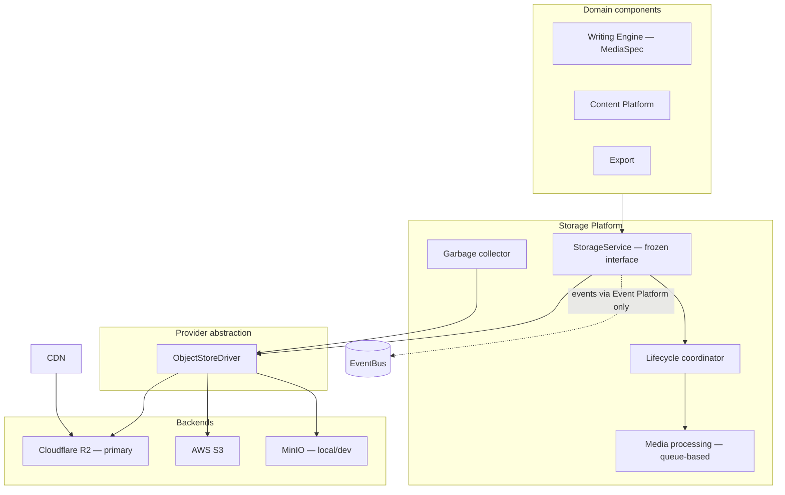
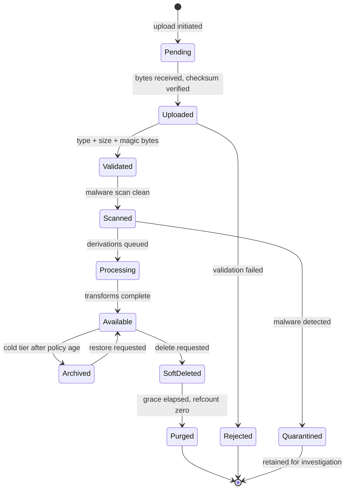

# Storage Platform

> **Status:** v1.0 — complete. New in Phase 10.
> **This platform owns bytes.** Objects, blobs, media, uploads, downloads, CDN delivery, lifecycle, backup, and recovery. It never owns what those bytes mean.

## Overview

**Business purpose.** ContentOS produces and consumes binary artifacts: generated images and diagrams for articles, uploaded brand assets, exported content bundles, research PDFs, and the backups that make all of it recoverable. Every one is large, immutable, expensive to move, and governed by retention and erasure obligations that a database row is not.

**Technical purpose.** Provide a provider-independent binary storage layer with a frozen interface, a defined object lifecycle from upload through cryptographic erasure, queue-based media processing, CDN delivery, and a backup and recovery strategy with stated RPO and RTO.

**The organizing rule: storage stores, it does not interpret.** The platform knows an object is 2.4 MB, `image/webp`, belongs to tenant X, and was derived from object Y. It does not know the object is a hero image for an article about espresso machines. That knowledge lives in the Content Platform, and keeping it there is what lets storage be replaced, sharded, or re-tiered without touching a domain component.

## Responsibilities

- Object storage: buckets, namespaces, keys, versioning, integrity.
- Upload: validation, multipart, streaming, checksums.
- Blob lifecycle: validation → scan → processing → publication → archival → deletion.
- Media processing: images, documents, audio, video, thumbnails, extraction.
- Provider abstraction across S3-compatible backends.
- CDN delivery, signed URLs, invalidation.
- Backup, disaster recovery, restore validation.
- Retention, legal hold, garbage collection, reference counting.

## Non-responsibilities

| Not owned | Owner |
|---|---|
| **What an object means** | The owning domain component |
| Media *generation intent* (`MediaSpec`) | `05-content-platform/writing-engine.md` — ADR-018 |
| Article, brief, keyword metadata | `05-content-platform/` |
| Knowledge entities, evidence, embeddings | `11-knowledge-platform/` |
| AI model invocation | `08-ai-platform/` |
| **Permissions and access decisions** | `16-security/authorization.md` |
| Tenant isolation policy | `16-security/tenant-isolation.md` |
| Encryption keys and KMS | `16-security/encryption.md` |
| Event delivery | `13-event-platform/` |
| **Any business rule** | The owning domain component |

**ADR-018 is the boundary that matters most here.** The Writing Engine decides *that* an image is needed, what it should depict, and where it belongs — expressed as a `MediaSpec` with a nullable `asset_ref`. The Storage Platform stores the resulting bytes, derives transforms, and serves them. Neither reaches into the other: storage never reads a `MediaSpec`, and the Writing Engine never constructs an object key.

**Storage defines no security controls.** Tenant prefixes, presigned URL lifetimes, and SSE-KMS configuration are specified in `16-security/` and implemented here. Where this folder states a security rule, it is restating a decision made there and says so.

## Architecture



**One interface, several drivers, zero vendor SDKs in application code.** A domain component calls `StorageService`; the driver translates to whichever backend is configured. This is the same swap-point discipline applied to the event bus (`13-event-platform/event-bus.md`) and the KMS (`16-security/encryption.md`).

**Cloudflare R2 is the primary backend** (ADR-016), chosen for zero egress fees — decisive for a platform serving media through a CDN. MinIO backs local development and CI so tests run against real S3 semantics rather than a mock.

## Core invariants

1. **Objects are immutable.** An object key is written once. Changing content produces a new object; there is no in-place update.
2. **Metadata may evolve.** Tags, processing status, and reference counts change; bytes never do.
3. **Internal storage paths are never exposed.** Callers receive opaque object ids and presigned URLs, never bucket names or key structures.
4. **Every object key is tenant-prefixed** and server-constructed (`16-security/tenant-isolation.md`).
5. **Every object has a checksum** recorded at write and verifiable on read.
6. **Buckets are never public.** All access is presigned or CDN-signed.
7. **Events are published only through the Event Platform**, never by direct messaging.
8. **Deletion is reference-counted**; an object with live references is not collected.
9. **Cryptographic erasure is the deletion guarantee** for tenant data (`16-security/encryption.md`).

**Immutability is the invariant everything else rests on.** It makes CDN caching safe with long TTLs, makes checksums meaningful, makes versioning tractable, and makes concurrent readers correct without locking. A mutable object would require cache invalidation on every write, and a stale CDN edge would serve a checksum that no longer matches.

**Immutability is why "update" is absent from the frozen interface** (`storage-apis.md`). It is not an omission to be filled in later.

## Object identity

```
{bucket}/{tenantId}/{resourceType}/{resourceId}/{objectId}.{ext}
```

**This key format is fixed by `16-security/tenant-isolation.md` and is restated, not redefined.** Tenant id is the first segment, which makes per-tenant bucket policies expressible, makes a tenant's objects enumerable for erasure, and makes a traversal into another tenant's prefix structurally impossible when the key is server-constructed.

**Callers never see this.** The public identifier is an opaque `objectId` (UUIDv7). The mapping from id to key lives in `media_assets` and is never returned to a client. Exposing the key would leak the tenant id, the resource type, and the internal layout — and would couple every client to a path structure that must remain changeable.

## The lifecycle



**An object is not readable until it is `Available`.** Uploaded-but-unscanned bytes are unreachable by any read path — no presigned URL is issued, no CDN entry exists. Serving an object before its malware scan completes turns the platform into a malware distribution channel with a trusted domain.

**Quarantined objects are retained, not deleted.** A detected threat is evidence: it may indicate a compromised customer account or a targeted attack, and destroying it removes the ability to investigate (`16-security/incident-response.md`).

Full specification in `blob-lifecycle.md`.

## Document map

| Document | Owns |
|---|---|
| `object-storage.md` | Buckets, namespaces, keys, versioning, multipart, integrity |
| `blob-lifecycle.md` | State machine from upload to cryptographic erasure |
| `media-processing.md` | Derivations, thumbnails, extraction, scanning, queueing |
| `storage-abstraction.md` | `ObjectStoreDriver`, provider independence, capability negotiation |
| `cdn.md` | Caching, signed URLs, invalidation, public/private assets |
| `backups.md` | Snapshot strategy, verification, restore testing, integrity |
| `disaster-recovery.md` | RPO, RTO, region loss, corruption, validated restore |
| `retention.md` | Lifecycle policies, legal hold, soft/hard delete, GC, refcounting |
| `storage-observability.md` | Metrics, growth, latency, hit ratio, corruption, alerts |
| `storage-apis.md` | **Frozen canonical interfaces** |

## Relationship to other platforms

| Platform | Interaction |
|---|---|
| **Security** | Provides tenant isolation, key management, presigned URL policy, audit. Storage implements; it defines nothing. |
| **Event** | Storage publishes `ObjectUploaded`, `ObjectProcessed`, `ObjectDeleted` **through the outbox only** (ADR-020) |
| **Content** | Consumes storage for media and exports; owns all metadata about meaning |
| **AI** | Never touches storage directly; generated media is handed to the Writing Engine, which routes it here (ADR-018) |
| **Knowledge** | Stores source documents; owns evidence and provenance, not bytes |
| **Database** | `media_assets` holds the id-to-key mapping and processing status (`03-database/tables.md`) |

**Storage never publishes an event directly to Redis or any transport.** Every event goes through the transactional outbox in the same transaction as the metadata write, so an object recorded as `Available` and its notification cannot diverge (`13-event-platform/transactional-outbox.md`).

**Storage never calls an AI model**, and no AI component calls storage. Generated media flows AI → Writing Engine → Storage, which keeps ADR-018's ownership split intact and prevents the AI Platform from acquiring a storage dependency it would then need to mock in every test.

## Scope note — three referenced documents outside Phase 10

**Phases 4 through 9 reference three sibling documents that Phase 10 does not create:**

| Referenced | References | Subject |
|---|---|---|
| `12-storage-platform/redis.md` | 13 | Cache, locks, heartbeats, lease state |
| `12-storage-platform/postgresql.md` | 6 | Connection pooling, replicas, tuning |
| `12-storage-platform/qdrant.md` | 3 | Vector store (superseded — Phase 1 selected pgvector) |

**These are recorded here rather than silently dropped.** Phase 10's mandate is binary object storage, and this folder is scoped accordingly; the three documents above concern *data stores*, which earlier phases assumed would live in this folder. Until they exist or the references are redirected, those 22 cross-references do not resolve.

**The `qdrant.md` references are additionally stale**: the stack decision selected PostgreSQL 17 with pgvector, so a Qdrant document would document a component the architecture does not use. Those three references belong to the Knowledge Platform's vector storage instead.

**This is a documentation gap, not an architectural one.** No decision is blocked; the specifications those references point to simply have no home yet. Resolving it is a structural choice — create the documents, redirect the references, or scope a separate folder — and the structure is frozen except where you instruct otherwise.

## Reading order

**Implementing:** `storage-abstraction.md` → `object-storage.md` → `blob-lifecycle.md` → `storage-apis.md`. The abstraction and key model come first; everything else assumes them.

**Operating:** `backups.md` → `disaster-recovery.md` → `storage-observability.md`.

**Reviewing compliance:** `retention.md`, then `16-security/compliance.md` for the obligations it satisfies.

## Cross references

- `16-security/tenant-isolation.md` — object key format, presigned URL policy
- `16-security/encryption.md` — SSE-KMS, per-tenant DEK, cryptographic erasure
- `16-security/api-security.md` — upload validation, magic-byte detection, separate serving origin
- `16-security/compliance.md` — retention, legal hold, erasure obligations
- `16-security/audit.md` — audited storage operations
- `13-event-platform/transactional-outbox.md` — the only event publication path
- `05-content-platform/writing-engine.md` — `MediaSpec` and ADR-018
- `03-database/tables.md` — `media_assets`, `media_specs`
- `14-operations/backup-recovery.md` — operational restore procedures
- `01-system-architecture/13-adr-log.md` — ADR-016, ADR-018, ADR-020
