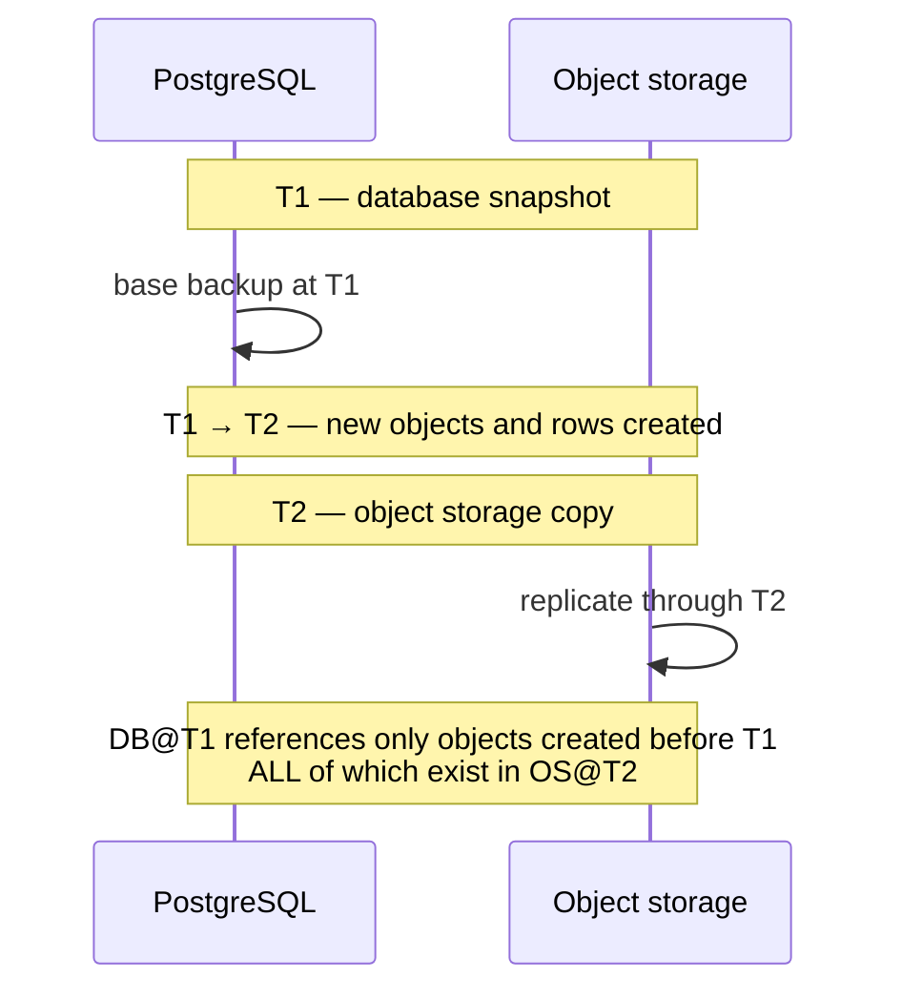
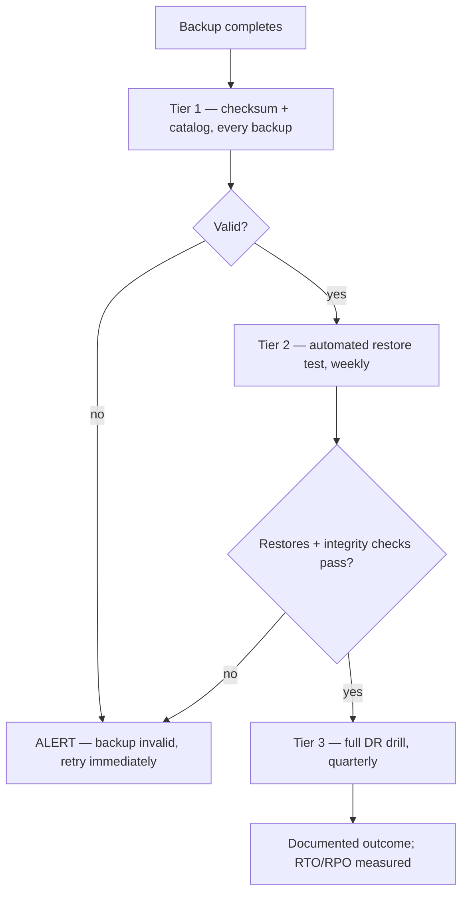

# Backups

> **Status:** v1.0 — complete. New in Phase 10.
> **A completed backup is not a valid backup.** Completion means bytes were written; validity means they can be restored into a working system. Only one of those is worth anything, and only verification tells them apart.

## Overview

**Business purpose.** Object stores are extraordinarily durable — R2 and S3 both target eleven nines — so backups here are not protection against disk failure. They protect against the failures that actually destroy data: a bug that deletes the wrong rows, an operator running a purge with the wrong filter, ransomware, and a corrupted migration. Every one of those is faithfully replicated to every durable copy within seconds.

**Technical purpose.** Specify what is backed up, in what order, how metadata and object consistency is guaranteed across two independent systems, how backups are verified, and how restore testing is scheduled and enforced.

**Two systems, one consistency problem.** `media_assets` rows live in PostgreSQL; the bytes they reference live in an object store. Backing them up independently creates a window where one references something the other lacks. The ordering rule below resolves it.

## Responsibilities

- Database backup strategy and cadence.
- Object storage backup and cross-region copies.
- Cross-system metadata consistency.
- Backup integrity and encryption.
- Verification and restore testing.
- The backup catalog.
- Retention windows.

## Non-responsibilities

| Not owned | Owner |
|---|---|
| Recovery execution and sequencing | `disaster-recovery.md` |
| Retention of *live* data | `retention.md` |
| Key management | `16-security/encryption.md` |
| Legal hold | `16-security/compliance.md` |
| Operational restore runbooks | `14-operations/backup-recovery.md` |
| Audit archive retention | `16-security/audit.md` |

## What is backed up

| Asset | Method | Frequency | Retention |
|---|---|---|---|
| **PostgreSQL — WAL** | Continuous streaming | Continuous | 7 days |
| **PostgreSQL — full** | Base backup | Daily | 35 days |
| **Object storage** | Cross-region copy | Continuous replication | 35 days |
| **Object versioning** | Provider-native | Always on | 30 days noncurrent |
| **Audit archive** | Monthly export, Object Lock | Monthly | **7 years** |
| **Secrets and keys** | KMS-managed | Provider | Per KMS policy |
| **Derived assets** | **Not backed up** | — | Rebuildable |

**Derived assets are deliberately excluded**, following the derived-versus-authoritative distinction from Phase 7 (`11-knowledge-platform/provenance.md`). Thumbnails and format variants are reproducible from the original and its transform spec (`media-processing.md`), so backing them up multiplies storage for data that can be regenerated — and creates more copies that erasure must reach.

**The original is always backed up**, because it is authoritative and cannot be regenerated.

**Restoring derived assets is a re-derivation, not a restore.** After a recovery, missing variants are re-queued through the normal pipeline, and objects serve in `Degraded` state until they complete (`blob-lifecycle.md`).

## Ordering — the consistency rule

**The database is snapshotted first. Object storage second. This order is not interchangeable.**



**Database first is safe; object storage first is not.**

| Order | Result |
|---|---|
| **DB at T1, objects at T2 > T1** | DB references only pre-T1 objects, all present at T2. **Consistent.** |
| Objects at T1, DB at T2 > T1 | DB references objects created in (T1, T2] that are absent from the object backup. **Dangling references.** |

**The guarantee holds because objects are immutable and deletion is delayed.** An object referenced by the T1 database snapshot cannot have changed by T2 — immutability (`object-storage.md`) — and cannot have been purged, because purge requires a 30-day grace period that vastly exceeds the backup window (`retention.md`).

**The reverse error is a real and common one.** Backing up "the big slow thing" first feels natural and produces a database that references objects nobody kept. The failure is invisible until a restore, when a fraction of media is unrecoverable with no record of what was lost.

**A restored system may contain objects with no database row** — objects created in the T1→T2 window. These are orphans, they are harmless, and the orphan sweep collects them (`retention.md`). Extra bytes are recoverable; missing bytes are not.

## Object storage backup

**Cross-region replication, not a snapshot.** Object stores have no snapshot primitive; the backup is a continuously replicated copy in a second region.

| Control | Purpose |
|---|---|
| **Versioning** | Overwrites and deletes are recoverable |
| **Object Lock (compliance mode)** | **Immutable — cannot be deleted even by the account root** |
| Separate credentials | Backup bucket credentials differ from primary and are not held by application services |
| Separate region | Survives regional loss |
| Delete replication **disabled** | A delete in primary does **not** propagate |

**Object Lock in compliance mode is the ransomware control.** Versioning alone is defeated by an attacker with credentials who deletes versions. Compliance mode makes objects undeletable for their retention period by anyone, including the account owner — which is the point, and also why the retention window must be chosen carefully, since it cannot be shortened.

**Delete replication is disabled deliberately.** Replicating deletions would faithfully propagate the exact accident backups exist to survive. A deletion in primary leaves the backup copy intact until its own retention expires.

**`contentos-backups` has no application read path** (`object-storage.md`). Restore access is break-glass, individually approved, and audited — a restored copy is the least-protected form the data takes, since RLS does not apply to it (`16-security/row-level-security.md`).

## Encryption

**Backups are encrypted before leaving the source host** (`16-security/encryption.md`).

| Property | Rule |
|---|---|
| Algorithm | AES-256-GCM via the standard ciphertext envelope |
| Key | Dedicated **backup DEK**, distinct from tenant DEKs |
| Key storage | KMS-wrapped, **never co-located with backups** |
| Key retention | **Outlives backup retention** — never destroyed while a referencing backup exists |
| Cryptographic erasure | Tenant DEK destruction renders that tenant's data unreadable **in every backup** |

**The backup DEK is separate from tenant DEKs, and both matter.** The backup DEK protects the archive as a whole. Tenant DEKs remain the erasure mechanism: destroying one makes that tenant's ciphertext unreadable inside every backup without touching the backup itself — the only tractable way to satisfy erasure against immutable snapshots (`16-security/compliance.md`).

**Storing a key alongside the data it protects defeats the control**, which is why key storage location is stated as a rule rather than left to deployment.

## The backup catalog

```ts
interface BackupRecord {
  readonly backupId: string;
  readonly kind: 'database-full' | 'database-wal' | 'object-replication' | 'audit-archive';
  readonly startedAt: Date;
  readonly completedAt: Date | null;
  readonly consistencyPoint: Date;        // the T1/T2 marker
  readonly sizeBytes: number;
  readonly objectCount: number | null;
  readonly sha256: string;
  readonly encryptionKeyId: string;
  readonly region: string;
  readonly verification: VerificationRecord | null;
  readonly expiresAt: Date;
  readonly legalHoldIds: readonly string[];
}

interface VerificationRecord {
  readonly verifiedAt: Date;
  readonly method: 'checksum' | 'restore-test' | 'full-restore';
  readonly outcome: 'valid' | 'invalid';
  readonly rowCounts: Readonly<Record<string, number>> | null;
  readonly referentialIntegrity: boolean | null;
  readonly detail: string;
}
```

**A backup without a `VerificationRecord` is not counted as a backup.** The catalog reports *verified* backups, and alerting is driven by the age of the newest verified one — not the newest completed one. This is the mechanism behind "completion is not validity."

**`consistencyPoint` records the ordering marker** so a restore can pair a database snapshot with an object copy taken after it.

**`legalHoldIds` blocks expiry.** A backup covered by a hold is retained past `expiresAt` (`16-security/compliance.md`), and Object Lock enforces it independently at the storage layer.

## Verification

**Three tiers, escalating in cost and confidence.**



| Tier | Frequency | Asserts |
|---|---|---|
| **1 · Checksum** | Every backup | Bytes written match bytes intended; catalog complete |
| **2 · Restore test** | **Weekly** | Backup restores into a scratch environment and the result is coherent |
| **3 · DR drill** | **Quarterly** | Full recovery sequence works and meets RTO/RPO (`disaster-recovery.md`) |

**Tier 2 is the one that catches real problems**, and it is mandatory. A restore test performs:

| Check | Detail |
|---|---|
| Restore completes | Into an isolated scratch environment, never production |
| Schema matches | Expected migration version |
| Row counts | Within tolerance of the source at `consistencyPoint` |
| **Referential integrity** | Every `media_assets.object_key` resolves in the paired object copy |
| Checksum sample | Random objects re-hashed and compared to `media_assets` |
| RLS intact | Policies present, `FORCE` enabled, exception count exactly five (`16-security/row-level-security.md`) |
| Application boot | A service starts against the restored database |

**The referential-integrity check is what validates the ordering rule.** If the database were snapshotted after objects, dangling references would appear here — weekly — rather than during an incident.

**The RLS check is included because a restore that loses policies is a restore into an unprotected database.** Policy objects are schema, and a restore path that recreated tables without them would produce a working system with no tenant isolation.

**Restore tests run against real infrastructure**, never a simulation. A simulated restore verifies the simulation.

**A failed verification alerts immediately and triggers an out-of-cycle backup.** Between a failed verification and a successful one, the platform's effective RPO is the age of the last verified backup, and that number is what appears on the dashboard.

## Cross-region copies

| Copy | Region | Purpose |
|---|---|---|
| Primary | Deployment region | Live |
| Database backup | **Second region** | Regional loss |
| Object replica | **Second region** | Regional loss |
| Audit archive | Second region, Object Lock, 7 years | Evidence |

**Cross-region copies exist for regional loss, and the residency implications are disclosed.** A customer requiring strict single-region residency cannot have cross-region backups; that is a contractual choice, recorded per organization rather than assumed (`16-security/compliance.md`). v1 is single-region by default with cross-region copies enabled only where the contract permits.

**Replication lag is monitored and bounds RPO** (`disaster-recovery.md`). A replica hours behind is not the RPO the platform advertises, and the gap must be visible before an incident rather than discovered during one.

## Retention windows

| Backup | Window | Rationale |
|---|---|---|
| WAL | 7 days | Point-in-time recovery granularity |
| Database full | 35 days | Covers a monthly cycle plus margin |
| Object replica | 35 days | Matches database |
| Noncurrent versions | 30 days | Matches soft-delete grace (`retention.md`) |
| **Audit archive** | **7 years** | Regulatory (`16-security/audit.md`) |

**35 days is chosen to exceed the 30-day soft-delete grace period.** A backup shorter than the grace window could not restore an object that was soft-deleted and then needed back — the backup would have expired before the grace did.

**Expiry is blocked by legal hold**, enforced both in the catalog and by Object Lock, so a hold survives a bug in the expiry job.

## Business rules

1. **The database is snapshotted before object storage.** Never the reverse.
2. **Backups are immutable** — versioning plus Object Lock in compliance mode.
3. **Delete replication is disabled.**
4. **Completion is not validity**; only verified backups count.
5. **Restore testing is mandatory and weekly.**
6. **DR drills are quarterly** and produce a documented outcome.
7. **Restore tests run against real infrastructure**, into an isolated environment.
8. **Referential integrity across database and objects is verified** every test.
9. **RLS policy presence is verified** on every restore test.
10. **Backups are encrypted before leaving the source host** with a dedicated backup DEK.
11. **Backup keys are never co-located with backups** and outlive backup retention.
12. **Derived assets are not backed up**; they are re-derived.
13. **Backup retention exceeds the soft-delete grace period.**
14. **Legal hold blocks expiry** at both the catalog and storage layers.
15. **A failed verification alerts and triggers an out-of-cycle backup.**
16. **Restore access is break-glass**, individually approved, and audited.

## Interfaces

```ts
interface BackupService {
  initiate(kind: BackupKind, actor: string): Promise<BackupRecord>;
  catalog(query: BackupQuery): Promise<Page<BackupRecord>>;
  verify(backupId: string, method: VerificationMethod): Promise<VerificationRecord>;
  latestVerified(kind: BackupKind): Promise<BackupRecord | null>;
  expiryEligibility(backupId: string): Promise<ExpiryEligibility>;
}

type ExpiryEligibility =
  | { eligible: true }
  | { eligible: false; blockers: readonly ExpiryBlocker[] };

type ExpiryBlocker =
  | { kind: 'legal-hold'; holdIds: readonly string[] }
  | { kind: 'object-lock'; retainUntil: Date }
  | { kind: 'newest-verified'; detail: string };
```

**`latestVerified` is the method operators and dashboards call — not `latest`.** There is deliberately no `latest` that ignores verification, so a caller cannot accidentally report an unverified backup as the recovery point.

**`newest-verified` is an expiry blocker**, preventing the last known-good backup from expiring even if its window elapsed while newer backups were failing verification. Without it, a run of failed verifications silently erodes the platform's actual recoverability.

## Database impact

**No new tables and no schema change.** The backup catalog is operational metadata stored outside tenant scope, alongside other operational records (`14-operations/backup-recovery.md`). It contains no tenant data — backup ids, sizes, checksums, and verification outcomes only.

## Security

- **`contentos-backups` has no application read path**; restore is break-glass, approved, and audited (`16-security/audit.md`).
- **Backups contain every tenant's data and RLS does not apply to a restored copy** — the reason restore access is the most tightly controlled operation in the platform (`16-security/row-level-security.md`).
- Backup bucket credentials are distinct from primary and are held only by the backup process (`16-security/secrets-management.md`).
- **Object Lock prevents deletion by any principal**, including a compromised root credential.
- Every backup, verification, restore, and expiry decision is audited.
- Cross-region copies are disclosed per organization for residency (`16-security/compliance.md`).

## Performance

| Operation | Target |
|---|---|
| WAL streaming lag | **< 30 s** |
| Daily full backup | Completes within a 4-hour window |
| Object replication lag | **p95 < 5 min** |
| Tier 1 verification | Within 15 min of completion |
| Tier 2 restore test | Completes within 6 hours |
| Catalog query | p95 < 200 ms |

**Replication lag is the practical RPO for object data**, and it is measured continuously rather than assumed from the configuration.

## Observability

- **Metrics:** `backups_total{kind,outcome}`, `backup_duration_seconds{kind}`, `backup_size_bytes{kind}`, `backup_age_seconds{kind}` (gauge), **`verified_backup_age_seconds{kind}`** (gauge), `verification_total{tier,outcome}`, `restore_tests_total{outcome}`, `restore_test_duration_seconds`, `replication_lag_seconds` (gauge), `wal_lag_seconds` (gauge), `referential_integrity_failures_total`, `backup_expiry_blocked_total{blocker}`.
- **Logging:** backup id, kind, consistency point, size, outcome, verification result — never tenant data.
- **Alerts:** **`verified_backup_age_seconds` exceeding the window (page)** — the primary backup alert, since an unverified backup is not a backup; `referential_integrity_failures_total` non-zero (**page** — the ordering rule or replication has broken); restore test failure (**page**); `replication_lag_seconds` above RPO (the advertised recovery point is not being met); `wal_lag_seconds` sustained; missed DR drill; expiry blocked by `newest-verified` (verifications are failing).

**`verified_backup_age_seconds` is the metric on the dashboard, not `backup_age_seconds`.** Alerting on completion age would report green through a week of backups that restore into nothing.

## Cross references

- `disaster-recovery.md` — RPO, RTO, recovery sequencing, drills
- `retention.md` — soft-delete grace the retention window must exceed
- `object-storage.md` — immutability, versioning, the backup bucket
- `media-processing.md` — re-derivation of unbacked-up variants
- `storage-abstraction.md` — Object Lock as a required driver capability
- `storage-observability.md` — backup and restore signals
- `16-security/encryption.md` — backup DEK, key retention, cryptographic erasure
- `16-security/compliance.md` — legal hold, residency, retention obligations
- `16-security/row-level-security.md` — why restore access is break-glass
- `16-security/audit.md` — audited backup and restore operations
- `11-knowledge-platform/provenance.md` — derived versus authoritative
- `14-operations/backup-recovery.md` — operational procedures
