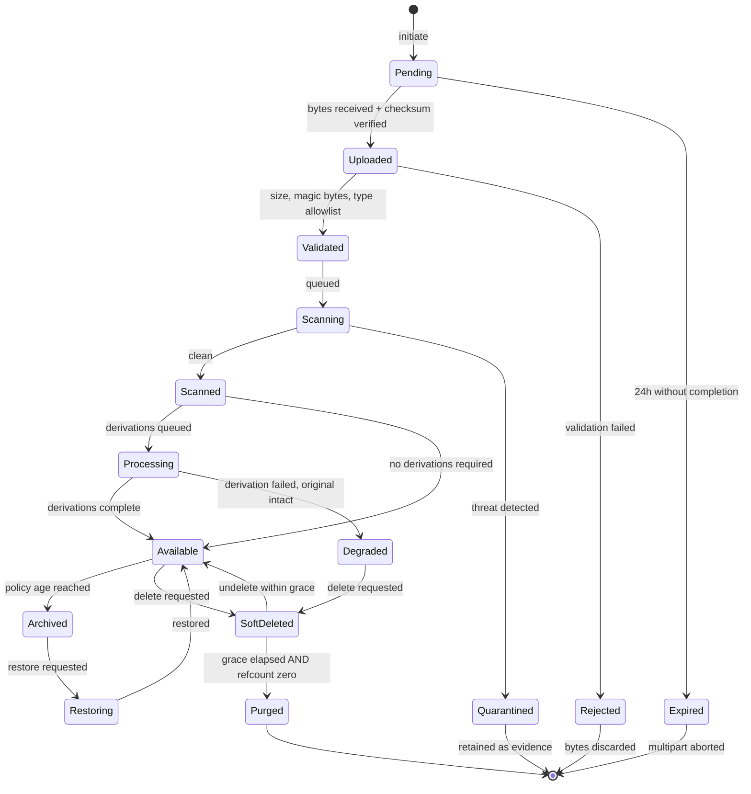
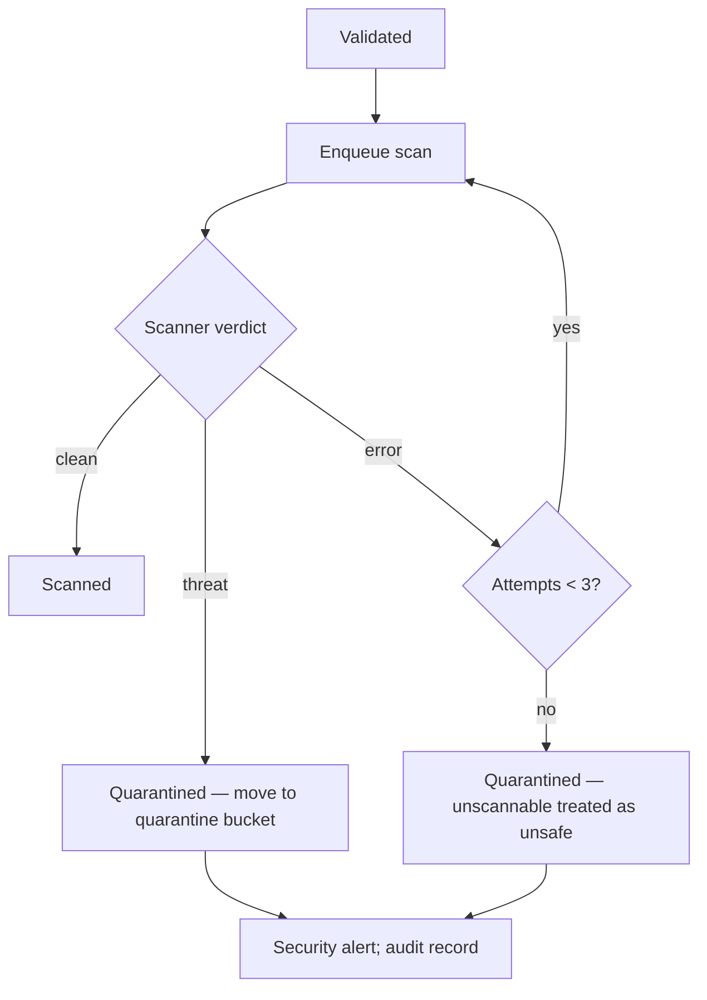
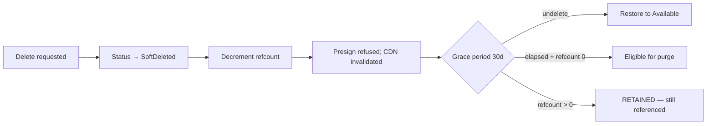

# Blob Lifecycle

> **Status:** v1.0 — complete. New in Phase 10.
> **An object is unreadable until it has been validated, scanned, and processed.** No presigned URL is issued, no CDN entry exists, and no domain component can reference it. Serving bytes before that gate is how a trusted domain becomes a malware distribution channel.

## Overview

**Business purpose.** Every binary entering the platform is untrusted — an uploaded brand asset, a research PDF, a model-generated image. Each must be checked before it is served to a browser, and each must eventually be deleted with a guarantee strong enough to satisfy an erasure request.

**Technical purpose.** Specify the object state machine: every state, every transition, what triggers it, what happens on failure, which event is published, and how the whole sequence remains correct under retry.

**The lifecycle is durable, not in-memory.** State lives in `media_assets.status` and advances through queue-driven steps, so a worker crash mid-processing resumes rather than stranding an object in an unknown condition.

## Responsibilities

- The object state machine and its transitions.
- Upload acceptance and validation gating.
- Malware scanning and quarantine.
- Processing coordination and publication.
- Archival and restoration.
- Soft delete, hard delete, and cryptographic erasure.

## Non-responsibilities

| Not owned | Owner |
|---|---|
| Transform algorithms | `media-processing.md` |
| Key construction and integrity | `object-storage.md` |
| Retention policy values | `retention.md` |
| Reference counting mechanics | `retention.md` |
| Provider API differences | `storage-abstraction.md` |
| Key destruction | `16-security/encryption.md` |
| **What an object means** | The owning domain component |

## The state machine



**Readable states are `Available`, `Degraded`, and `Archived` (after restore).** Every other state is unreachable by any read path — `presign` returns a 404-equivalent, and the CDN has no entry to serve.

**`Degraded` exists because a failed thumbnail should not withhold the original.** If a derivation fails, the source object is intact and serveable; withholding it because a 200×200 preview could not be generated punishes the user for a background failure. The object is available, the missing derivation is recorded, and regeneration is retried.

## Upload

```mermaid
sequenceDiagram
    participant C as Client
    participant API as Storage API
    participant DB as media_assets
    participant S as Object store

    C->>API: initiate(size, declaredType, resourceRef)
    API->>API: authorize; check size + type allowlist
    API->>DB: INSERT status='pending' (+ outbox event, same tx)
    API-->>C: uploadId + presigned URL(s)
    C->>S: PUT bytes directly
    C->>API: complete(uploadId, parts)
    API->>S: verify checksum + size
    API->>DB: status='uploaded' (+ outbox)
    API->>API: enqueue validation
```

**Pre-flight checks happen at `initiate`, before a single byte is transferred.** Declared size beyond the limit and a disallowed declared type are rejected immediately — no point accepting 4 GB to reject it afterwards. The declared values are advisory and re-checked against reality at validation.

**`Pending` rows expire after 24 hours**, matching the multipart abort lifecycle rule (`object-storage.md`). An abandoned upload leaves a `pending` row and orphaned parts; both are cleaned by the same schedule.

**The row and the outbox event commit together** (`13-event-platform/transactional-outbox.md`). An object recorded as uploaded whose notification was lost would never be validated — it would sit in `uploaded` forever, invisible to both the user and the operator.

## Validation

| Check | Rule | Failure |
|---|---|---|
| Size | ≤ 25 MB uploads; ≤ 5 GB internal | `Rejected` |
| **Magic bytes** | Detected type in the allowlist | `Rejected` |
| Declared vs detected | Mismatch recorded; executable-adjacent mismatch rejects | `Rejected` |
| Checksum | Recomputed and compared | `Rejected` |
| Structural | Type-specific parse (image decodes, PDF header valid) | `Rejected` |

**Validation trusts nothing the client said** (`16-security/api-security.md`). The declared content type is attacker-controlled; magic-byte inspection reads what the file actually is.

**Structural validation catches malformed files that pass magic-byte checks.** A truncated JPEG has a valid header and crashes the transform pipeline; rejecting it at validation converts a worker crash into a clean user-facing error.

**Rejected bytes are discarded, not quarantined.** A rejection is a format failure, not a threat. Retaining every malformed upload accumulates junk with no investigative value.

## Malware scanning

**Every object is scanned before it becomes readable. There is no exemption, including for platform-generated media.**



**An unscannable object is quarantined, not released.** Scanner timeouts, encrypted archives, and corrupt containers all mean the same thing: the platform cannot assert the object is safe. Defaulting to release would make "break the scanner" a bypass.

**Platform-generated media is scanned too.** Model-generated images are produced from provider responses, and a compromised or manipulated provider response is a real path (`16-security/threat-model.md`, T-14). Exempting internal content assumes exactly the trust the boundary exists to withhold.

**Quarantined objects are retained as evidence** and moved to `contentos-quarantine`, readable only by security operators. A detection may indicate a compromised customer account; deleting it removes the investigation (`16-security/incident-response.md`).

**A detection publishes a security event and an audit record**, and the uploading subject is notified that the file was rejected — without disclosing the specific threat signature, which would let an attacker iterate against the scanner.

## Processing and publication

**Derivations are queued, never inline.** Generating five image sizes takes seconds to minutes; holding an HTTP request open for it would tie up a connection and fail at the first timeout.

| Step | Behaviour |
|---|---|
| Enqueue | Derivation jobs published as events (`media-processing.md`) |
| Execute | Workers produce derived objects, each with its own `objectId` |
| Record | Transform manifest written to `media_assets.transforms` |
| Complete | All required derivations present → `Available` |
| Partial | Required set incomplete after retries → `Degraded` |

**Required versus optional derivations are declared per object kind.** A thumbnail is required for a gallery image; an AVIF variant is optional. Only missing *required* derivations produce `Degraded`.

**`ObjectAvailable` is published when the object becomes readable**, and that is the event domain components wait on. The Writing Engine binds a `MediaSpec.asset_ref` on receiving it (ADR-018), which is why publication must be an event rather than a synchronous callback — the two components must not be coupled in time.

**Transitions are idempotent on `(objectId, targetState)`.** A redelivered processing event finds the object already `Available` and returns without acting, which is what makes at-least-once delivery safe here (`13-event-platform/idempotency.md`).

## Archival

**Archival moves cold objects to cheaper storage, and its availability is provider-dependent.**

| Provider | Cold tier | Behaviour |
|---|---|---|
| AWS S3 | Glacier Instant / Flexible | Real transition; restore may take minutes to hours |
| **Cloudflare R2** | **None** | Archival is a **recorded no-op**; the object stays in standard storage |
| MinIO | None | No-op |

**R2 having no cold tier is stated plainly rather than papered over.** R2's pricing model — zero egress, flat storage — removes most of the incentive for tiering, so the absence is not a gap in practice. But the interface must not pretend a transition occurred: `archive()` records the intent and reports `no-op` where the driver lacks the capability (`storage-abstraction.md`).

**Objects in `Archived` are not directly readable.** A read triggers `Restoring`, and the caller receives a restore handle rather than bytes. Where the driver reports archival as a no-op, `Archived` behaves as `Available` and restore returns immediately.

**Archival policy is age-based per object kind** and is specified in `retention.md`.

## Deletion

**Three distinct operations with three different guarantees.**

| Operation | Effect | Reversible | Guarantee |
|---|---|---|---|
| **Soft delete** | Status → `SoftDeleted`; unreadable | **Yes**, within grace | Hidden |
| **Hard delete (purge)** | Bytes removed from the store | No | Removed from primary storage |
| **Cryptographic erasure** | Tenant DEK destroyed | No | **Unreadable everywhere, including backups** |

### Soft delete



**CDN invalidation happens at soft delete, not at purge.** An object hidden in the database but still cached at an edge is still being served — the deletion has not taken effect where it matters (`cdn.md`).

**An object with a non-zero reference count is never purged**, even after the grace period. The same derived image may be referenced by several article revisions; deleting it because one revision was removed would break the others (`retention.md`).

### Hard delete

**Purge requires three conditions, all checked inside the deleting transaction:**

1. Grace period elapsed.
2. Reference count is zero.
3. **No legal hold covers the object, its tenant, or its organization.**

**The legal hold check is inside the transaction, not a pre-flight.** A hold placed between a pre-check and the delete would be missed, and destroying evidence under hold is unrecoverable (`16-security/compliance.md`).

**Purge deletes the object and all its derivations**, since derivations have no independent meaning. Each is removed with its own reference-count check — a derivation shared across sources is retained.

### Cryptographic erasure

**Tenant erasure destroys the tenant's data encryption key** (`16-security/encryption.md`). Every object encrypted under it becomes permanently unreadable *wherever it exists* — primary storage, replicas, and every backup — immediately, without enumerating or rewriting a single object.

**This is the only deletion guarantee that reaches backups.** Backups are immutable snapshots; selectively removing one tenant's objects from them is not possible. Key destruction makes the ciphertext meaningless, which is a stronger guarantee than deletion and takes effect the moment it happens.

**Object purge follows as cleanup**, reclaiming storage. The erasure guarantee does not wait for it.

## Failure handling

| Failure | Behaviour |
|---|---|
| Upload incomplete | Expires at 24 h; multipart aborted by lifecycle rule |
| Validation fails | `Rejected`; bytes discarded; user informed |
| Scanner unavailable | Retried 3×; then `Quarantined` — **never released** |
| Derivation fails | Retried; then `Degraded` — original remains readable |
| Store unavailable | Transition retried by the Event Platform's retry engine |
| Worker crash mid-processing | State is durable; redelivery resumes idempotently |
| Purge fails | Object stays `SoftDeleted`; retried next sweep |

**No failure path releases an unverified object**, and no failure path deletes bytes that were not confirmed eligible. Both directions fail safe.

**Transition retry is delegated to the Event Platform**, not reimplemented (`13-event-platform/retry-engine.md`). A validation failure is terminal and dead-letters; a store timeout is transient and retries.

## Business rules

1. **An object is unreadable until `Available`.** No presign, no CDN entry.
2. **Every object is scanned**, including platform-generated media.
3. **Unscannable objects are quarantined**, never released.
4. **Quarantined objects are retained as evidence.**
5. **Rejected bytes are discarded**; rejection is not quarantine.
6. **Content type is detected, never declared.**
7. **Derivations are queued, never inline.**
8. **A failed optional derivation yields `Degraded`**, not unavailability.
9. **Transitions are idempotent** on `(objectId, targetState)`.
10. **Every transition publishes through the outbox** in the same transaction.
11. **CDN invalidation occurs at soft delete.**
12. **Purge requires grace elapsed, refcount zero, and no legal hold** — all checked in-transaction.
13. **Purge cascades to derivations**, each refcount-checked.
14. **Cryptographic erasure is the guarantee that reaches backups.**
15. **`Pending` uploads expire at 24 h.**
16. **No failure path releases an unverified object or deletes ineligible bytes.**

## Interfaces

```ts
interface LifecycleCoordinator {
  transition(ctx: TenantContext, objectId: string, to: ObjectState, tx: Transaction): Promise<TransitionResult>;
  softDelete(ctx: TenantContext, objectId: string, actor: string): Promise<void>;
  undelete(ctx: TenantContext, objectId: string, actor: string): Promise<UndeleteResult>;
  purgeEligibility(ctx: TenantContext, objectId: string): Promise<PurgeEligibility>;
}

type ObjectState =
  | 'pending' | 'uploaded' | 'validated' | 'scanning' | 'scanned'
  | 'processing' | 'available' | 'degraded' | 'archived' | 'restoring'
  | 'soft-deleted' | 'purged' | 'rejected' | 'quarantined' | 'expired';

type TransitionResult =
  | { outcome: 'transitioned'; from: ObjectState }
  | { outcome: 'already-in-state' }          // idempotent no-op
  | { outcome: 'invalid-transition'; from: ObjectState };

type PurgeEligibility =
  | { eligible: true }
  | { eligible: false; blockers: PurgeBlocker[] };

type PurgeBlocker =
  | { kind: 'grace-period'; eligibleAt: Date }
  | { kind: 'references'; count: number }
  | { kind: 'legal-hold'; holdIds: string[] };
```

**`transition` requires a `Transaction`**, so a state change and its outbox event cannot be committed separately — the same structural guarantee as event publication (`13-event-platform/transactional-outbox.md`).

**`TransitionResult` distinguishes `already-in-state` from `invalid-transition`.** The first is the normal outcome of a redelivered event and is not an error; the second is a genuine bug. Collapsing them would make idempotent redelivery indistinguishable from a state-machine violation.

**`PurgeEligibility` returns *all* blockers**, so an operator does not clear a legal hold only to discover the reference count also blocks.

## Database impact

**No new tables and no schema change.** Lifecycle state uses `media_assets.status` and `transforms JSONB` (`03-database/tables.md`), with a CHECK constraint restricting `status` to the enumerated states.

| Constraint | Purpose |
|---|---|
| `CHECK (status IN (...))` | A sixteenth state cannot be introduced by an application bug |
| `UNIQUE (tenant_id, object_key)` | Key collision impossible at the database level |
| Partial index on `status` where `status <> 'available'` | Lifecycle sweeps scan only in-flight objects |

**The partial index matters at scale.** Nearly every object is `available`; sweeps for pending, scanning, or purgeable objects would otherwise scan the full table on a 10⁸-row projection.

## Security

- Objects are unreadable until scanned — the gate that prevents malware distribution (`16-security/threat-model.md`).
- Quarantined objects are readable only by security operators and are audited on access.
- **Delete, undelete, and purge are audited** with actor and reason (`16-security/audit.md`).
- Legal hold is enforced inside the delete transaction (`16-security/compliance.md`).
- Cryptographic erasure delegates entirely to `16-security/encryption.md`; storage never handles key material.
- Scanner verdicts are recorded but threat signatures are not disclosed to the uploader.

## Performance

| Operation | Target |
|---|---|
| Initiate | p95 < 50 ms |
| Complete + verify | p95 < 200 ms |
| Validation | p95 < 500 ms — streamed, no full buffer |
| Scan | Provider-bound; **p95 < 30 s** |
| Time to `Available` (image) | **p95 < 60 s** from upload completion |
| Soft delete | p95 < 100 ms including CDN invalidation dispatch |
| Purge sweep | Batched, rate-limited, yields to production |

**Time to `Available` is the user-visible number** and is dominated by scanning and derivation, not by transfer. It is the SLO the lifecycle is tuned against.

## Observability

- **Metrics:** `lifecycle_transitions_total{from,to}`, `objects_by_state{state}` (gauge), `time_to_available_seconds`, `validation_rejections_total{reason}`, `scan_results_total{verdict}`, `quarantined_total`, `degraded_total{missing_derivation}`, `purge_blocked_total{blocker}`, `purges_total`, `undeletes_total`.
- **Logging:** object id, tenant id, from-state, to-state, outcome — never bytes, keys, or presigned URLs.
- **Alerts:** `scan_results_total{verdict="threat"}` non-zero (**page** — malware uploaded); unscannable rate rising (scanner degraded — objects are stalling); `objects_by_state{state="scanning"}` growing (queue backed up, nothing becoming available); `degraded_total` rising (derivation pipeline failing); `purge_blocked_total{blocker="legal-hold"}` non-zero without a known hold; time to `Available` p95 breaching SLO.

**A growing `scanning` backlog is the alert most likely to be noticed by users first.** Nothing errors — objects simply never become available, and uploads appear to hang indefinitely.

## Cross references

- `object-storage.md` — keys, checksums, multipart, immutability
- `media-processing.md` — derivation execution and the transform manifest
- `retention.md` — grace periods, reference counting, archival policy, GC
- `cdn.md` — invalidation on soft delete
- `storage-abstraction.md` — archival capability negotiation
- `storage-apis.md` — the frozen public interface
- `16-security/compliance.md` — legal hold and erasure obligations
- `16-security/encryption.md` — cryptographic erasure
- `16-security/audit.md` — audited lifecycle operations
- `16-security/threat-model.md` — malware and upload abuse
- `13-event-platform/transactional-outbox.md` · `retry-engine.md` · `idempotency.md`
- `05-content-platform/writing-engine.md` — `MediaSpec.asset_ref` binding (ADR-018)
- `03-database/tables.md` — `media_assets`
