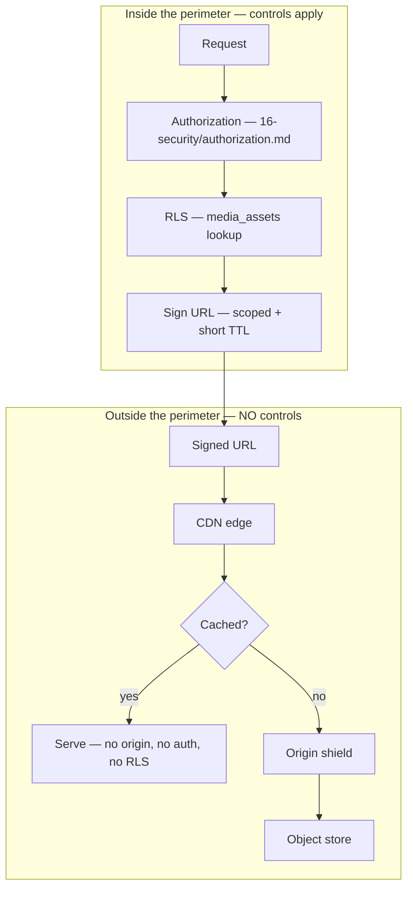
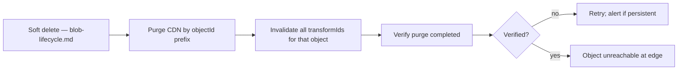
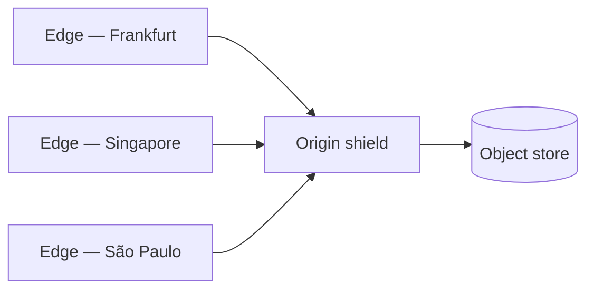

# CDN

> **Status:** v1.0 — complete. New in Phase 10.
> **The edge sits outside the tenant isolation perimeter.** Once a URL is signed, no RLS policy and no authorization check runs again — the edge serves bytes. Every control therefore happens *before* the URL exists.

## Overview

**Business purpose.** Articles carry images, and images dominate page weight. Serving them from origin means transatlantic round trips on every render; serving them from an edge means tens of milliseconds. The CDN is what makes generated media viable at article scale.

**Technical purpose.** Specify the delivery layer: how public and private assets are distinguished, how URLs are signed and scoped, how cache keys avoid cross-tenant collision, and how invalidation interacts with a lifecycle where objects are immutable.

**The CDN owns no storage.** It caches bytes fetched from origin and nothing else. It holds no authoritative copy, no metadata, and no state the platform depends on. A total CDN loss degrades latency, never correctness.

## Responsibilities

- Public and private asset classification.
- Signed URL generation and scoping.
- Cache key construction.
- Cache-Control policy and the immutable asset strategy.
- Invalidation.
- Edge behaviour: conditional requests, ranges, compression, streaming.
- Origin shielding.

## Non-responsibilities

| Not owned | Owner |
|---|---|
| Object storage and durability | `object-storage.md` |
| Access decisions | `16-security/authorization.md` |
| Tenant isolation policy | `16-security/tenant-isolation.md` |
| Derivation of variants | `media-processing.md` |
| Lifecycle state | `blob-lifecycle.md` |
| Provider differences | `storage-abstraction.md` |
| **What an asset means** | The owning domain component |

## The perimeter problem



**Authorization happens at signing time and never again.** This is the defining property of CDN delivery and the source of every rule below. An edge cannot consult PostgreSQL, cannot evaluate a policy, and cannot know which tenant a viewer belongs to. It verifies a signature and serves.

**Therefore: a signed URL is a bearer credential.** Anyone holding it has access for its lifetime, which is why lifetimes are short, scope is single-object, and URLs are never logged (`16-security/tenant-isolation.md`).

**Therefore: private assets are authorized before the URL is generated, without exception.** There is no path that signs first and checks later, and no method that returns a URL without a `TenantContext`.

## Asset classes

| Class | Examples | Signed | Cache-Control | Edge cacheable |
|---|---|---|---|---|
| **Public** | Published article images, derived variants | **Yes**, long TTL | `public, max-age=31536000, immutable` | Yes |
| **Private** | Drafts, uploads pre-publication, brand assets | **Yes**, short TTL | `private, no-store` | **No** |
| **Restricted** | Exports, backups, quarantine | **Never CDN** — presigned origin only | `no-store` | No |

**"Public" means published, not unauthenticated.** A published article's hero image is served to anonymous readers on the customer's website — the asset is public because the *content* is public. It is still signed, because an unsigned URL is guessable-adjacent and permanently valid, and because signing is what lets the platform revoke delivery.

**Private assets are never edge-cached.** A cached draft image would be served from an edge after the draft was deleted, and would be served to anyone holding the URL regardless of whether their access was revoked. `private, no-store` forces every request to origin, where the signature TTL is short enough to bound exposure.

**Restricted assets never touch the CDN at all.** Exports and backups are delivered by presigned origin URLs only (`object-storage.md`). Putting a data export behind a caching layer creates copies the platform cannot enumerate for erasure.

## URL structure

```
https://cdn.contentos.ai/o/{objectId}/{transformId}?exp={ts}&sig={hmac}
```

| Segment | Purpose |
|---|---|
| `objectId` | Opaque UUIDv7 — the only public identifier |
| `transformId` | Which derived variant (`media-processing.md`) |
| `exp` | Expiry timestamp, covered by the signature |
| `sig` | HMAC-SHA256 over path + expiry + scope |

**The internal storage key never appears in a URL.** The key is `{tenantId}/{resourceType}/{resourceId}/{objectId}.{ext}` — exposing it would leak the tenant id, the owning resource, and the internal layout, and would freeze a structure that must stay changeable (`object-storage.md`).

**Mapping from `objectId` to storage key happens at the edge**, via an edge function holding a signed, short-lived mapping token, or by origin rewrite. Either way the translation is server-side and the client never sees a key.

**The signature covers the expiry**, so a client cannot extend a URL by editing the timestamp. It also covers the transform id, so a URL for a 200 px thumbnail cannot be repointed at the 1920 px original.

| Class | TTL |
|---|---|
| Public (published) | 7 days |
| Private | **15 minutes** |
| Restricted (origin presign) | 15 minutes |

**Public TTLs are long because the content is public and the asset is immutable.** Re-signing every render would put a signing call on every image on every page load for no security gain — the viewer is anonymous and the content is already published.

**Private TTLs match the presigned URL policy in `16-security/tenant-isolation.md`** and are not extended for convenience.

## Cache keys

**The cache key is the full path plus the transform, and deliberately excludes the signature.**

```
cache_key = /o/{objectId}/{transformId} + Vary-relevant headers
```

**Excluding `sig` and `exp` from the cache key is required for the cache to work at all.** Including them would make every signed URL a distinct cache entry with a 0% hit ratio — every request would reach origin, and the CDN would be a pure cost with no benefit.

**Excluding them is safe because `objectId` is a UUIDv7 and the signature is verified before the cache is consulted.** The edge validates the HMAC and expiry first; only a request that passes lookup is served from cache. An expired or forged signature never reaches a cached object.

**Cross-tenant cache collision is impossible because `objectId` is globally unique.** Two tenants cannot produce the same object id, so two tenants cannot share a cache entry — the CDN inherits tenant isolation from the identifier space rather than needing to understand tenancy (`16-security/tenant-isolation.md`).

**`Vary` is minimal and explicit:** `Accept` for format negotiation, `Accept-Encoding` for compression. `Vary: Cookie` or `Vary: Authorization` would fragment the cache per user and is never set — private assets are `no-store` instead.

## The immutable asset strategy

**Objects are immutable, so cached bytes can never be stale.**

```
Cache-Control: public, max-age=31536000, immutable
```

**`immutable` tells the browser not to revalidate even on reload**, which removes the conditional-request round trip that otherwise fires on every navigation. It is only safe because the platform genuinely never mutates an object — a mutable object with this header would serve stale content for a year with no recovery path (`object-storage.md`).

**Content changes produce a new `objectId`, therefore a new URL.** Cache invalidation is not needed for updates — the old URL keeps serving the old bytes, which are still correct, and nothing references them. This is the single largest operational benefit of immutability.

**Invalidation is needed only for deletion**, which is a correctness requirement rather than a freshness one.

## Invalidation



**Invalidation happens at soft delete, not at purge** (`blob-lifecycle.md`). An object hidden in the database while still cached at an edge is still being served — the deletion has not taken effect where it matters. Waiting for the 30-day grace period would leave deleted content publicly available for a month.

**Invalidation is by `objectId` prefix**, removing every derived variant in one operation rather than enumerating transform ids that may have grown since.

**Purge completion is verified, not assumed.** A purge API returning 202 means accepted, not applied; propagation across edges takes seconds to minutes. A verification probe confirms the object is gone, and persistent failure alerts — because the alternative is believing deleted content is unreachable when it is not.

**Cryptographic erasure makes invalidation failure survivable** but does not replace it. Destroying the tenant DEK renders the origin ciphertext unreadable, but an edge holding already-decrypted bytes continues serving them until they expire (`16-security/encryption.md`). Invalidation is the primary control; erasure is the backstop.

## Edge behaviour

| Feature | Configuration |
|---|---|
| **Conditional requests** | `ETag` = object SHA-256 prefix; `If-None-Match` → 304 |
| **Range requests** | Supported; required for video seeking and PDF page fetch |
| **Compression** | Brotli then gzip for text-like types; **never for images or video** |
| **Streaming** | Chunked pass-through; the edge never buffers whole objects |
| **HTTP** | HTTP/2 and HTTP/3 |
| **TLS** | 1.3 minimum (`16-security/encryption.md`) |
| **`X-Content-Type-Options`** | `nosniff` on every response |
| **`Content-Disposition`** | `inline` for images; **`attachment` for documents, archives, and SVG** |

**`ETag` is derived from the object's SHA-256**, not from a provider ETag. Provider ETags are not content hashes for multipart uploads — they are hashes of part hashes, which differ between providers for identical bytes and would break conditional requests across a migration (`storage-abstraction.md`).

**Compression is disabled for already-compressed types.** Gzipping a JPEG spends CPU to produce a slightly larger payload; the exclusion list is explicit rather than heuristic.

**`Content-Disposition: attachment` on SVG is a security control, not a preference.** SVG is XML with script support; served inline it executes in the response's origin. Combined with serving user content from a separate origin, this prevents stored XSS from reaching application cookies (`media-processing.md`, `16-security/api-security.md`).

## Origin shielding



**A single shield tier sits between edges and origin.** Without it, a cold asset requested simultaneously in fifty locations produces fifty origin fetches; with it, one fetch is shared.

**The shield matters most on publication.** A newly published article's images are cold everywhere and requested by many readers at once — the exact thundering-herd shape a shield exists to absorb.

**Request coalescing at the shield** collapses concurrent misses for the same key into a single origin fetch.

**Origin egress is nearly free on R2** (ADR-016), so shielding here is about origin load and latency rather than cost — but the platform does not depend on that, since the S3 driver pays egress and the shield keeps it bounded.

## Business rules

1. **Private assets are authorized before URL generation**, without exception.
2. **A signed URL is a bearer credential** — short-lived, single-object, never logged.
3. **Signatures cover expiry and transform id.**
4. **Internal storage keys never appear in a URL.**
5. **Private assets are never edge-cached** (`private, no-store`).
6. **Restricted assets never touch the CDN.**
7. **Cache keys exclude the signature** and are collision-free via globally unique `objectId`.
8. **`Vary` is minimal**; never `Cookie` or `Authorization`.
9. **Public immutable assets carry `max-age=31536000, immutable`.**
10. **Content changes produce a new URL**; no invalidation for updates.
11. **Invalidation occurs at soft delete**, by `objectId` prefix, and is **verified**.
12. **`ETag` derives from the platform SHA-256**, never a provider ETag.
13. **Compression is disabled for pre-compressed types.**
14. **Documents, archives, and SVG are served `attachment` with `nosniff`.**
15. **CDN loss degrades latency only**, never correctness.

## Interfaces

```ts
interface CdnService {
  publicUrl(ctx: TenantContext, objectId: string, transformId: string): Promise<SignedUrl>;
  privateUrl(ctx: TenantContext, objectId: string, transformId: string): Promise<SignedUrl>;
  invalidate(ctx: TenantContext, objectId: string): Promise<InvalidationResult>;
  verifyInvalidation(invalidationId: string): Promise<InvalidationStatus>;
}

interface SignedUrl {
  readonly url: string;
  readonly expiresAt: Date;
  readonly class: 'public' | 'private';
  // NO key. NO bucket. NO tenant id in any component.
}

type InvalidationResult =
  | { outcome: 'accepted'; invalidationId: string; variantCount: number }
  | { outcome: 'unsupported'; reason: string };

type InvalidationStatus = 'pending' | 'completed' | 'failed';
```

**Both URL methods require a `TenantContext`**, so signing without tenant scope does not typecheck. `privateUrl` additionally performs the authorization check internally — there is no unchecked signing path (`16-security/authorization.md`).

**`SignedUrl` carries no key, bucket, or tenant id**, matching `ObjectRef` in `object-storage.md`. Path exposure is prevented by the type rather than by caller discipline.

**`InvalidationResult` and `InvalidationStatus` are separate** because acceptance is not completion. A single return type conflating them would let a caller treat 202 as done — the precise mistake that leaves deleted content served from an edge.

## Database impact

**No new tables and no schema change.** URL signing reads `media_assets` for the object's key, transform manifest, and status (`03-database/tables.md`). Invalidation records are transient and live in Redis with a TTL covering the verification window.

**A URL is only signed for an object in a readable state** — `available`, `degraded`, or restored `archived`. Signing for any other state is refused, which is the mechanism behind "unreadable until Available" (`blob-lifecycle.md`).

## Security

- **Authorization precedes signing for private assets**, always (`16-security/authorization.md`).
- **Signed URLs are never logged** in application logs, traces, metrics, or error reports (`16-security/tenant-isolation.md`).
- Signing keys are managed by `16-security/secrets-management.md` and rotate with an overlap window so URLs signed under the previous key remain valid for their TTL.
- **Cross-tenant cache collision is structurally impossible** — `objectId` is globally unique.
- The CDN never receives tenant credentials and makes no access decisions.
- User content is served from a **separate origin** so stored XSS cannot reach application cookies (`16-security/api-security.md`).
- TLS 1.3 minimum; HSTS with preload (`16-security/encryption.md`).

## Performance

| Metric | Target |
|---|---|
| Edge hit latency | **p95 < 50 ms** |
| Shield hit latency | p95 < 150 ms |
| Origin fetch | p95 < 400 ms |
| **Cache hit ratio (public)** | **> 95%** |
| URL signing | **p95 < 5 ms** — local HMAC, no network |
| Invalidation propagation | p95 < 60 s |

**A hit ratio below 95% on public assets means something is wrong with the cache key**, not with traffic. The usual causes are a signature leaking into the key or an over-broad `Vary`.

**Signing is local HMAC computation**, which is what allows a page with forty images to sign forty URLs without adding measurable latency.

## Observability

- **Metrics:** `cdn_requests_total{class,status}`, `cdn_cache_hit_ratio{class}` (gauge), `cdn_origin_fetches_total`, `cdn_bytes_served_total{class}`, `cdn_edge_latency_seconds`, `signed_urls_total{class}`, `signature_verification_failures_total`, `invalidations_total{outcome}`, `invalidation_verification_failures_total`, `cdn_5xx_total`.
- **Tracing:** signing is a span with object id and class; **URLs are never span attributes**.
- **Logging:** object id, transform id, class, cache status, bytes — never URLs, signatures, or keys.
- **Alerts:** `invalidation_verification_failures_total` non-zero (**page** — deleted content may still be served from an edge); `cdn_cache_hit_ratio` below 90% for public assets (cache key defect — origin load will follow); `signature_verification_failures_total` spike (forgery attempts or a rotation that did not propagate); `cdn_5xx_total` above baseline; origin fetch latency rising (shield ineffective or origin degraded).

**Invalidation verification failure is the alert that matters most here**, because it is the one CDN failure with a correctness consequence rather than a latency one.

## Cross references

- `object-storage.md` — immutability, keys, SHA-256 backing the ETag
- `blob-lifecycle.md` — readable states; invalidation at soft delete
- `media-processing.md` — the derived variants served; SVG handling
- `storage-abstraction.md` — provider-independent origin
- `retention.md` — deletion flow that triggers invalidation
- `storage-apis.md` — the frozen public interface
- `16-security/tenant-isolation.md` — presigned URL policy, key confidentiality
- `16-security/authorization.md` — the check preceding every private signature
- `16-security/encryption.md` — TLS, signing key rotation, erasure as backstop
- `16-security/api-security.md` — separate serving origin, `nosniff`, disposition
- `03-database/tables.md` — `media_assets`
