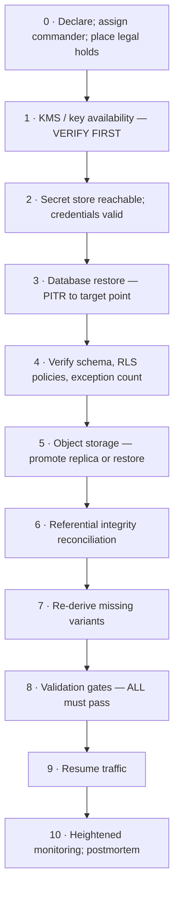
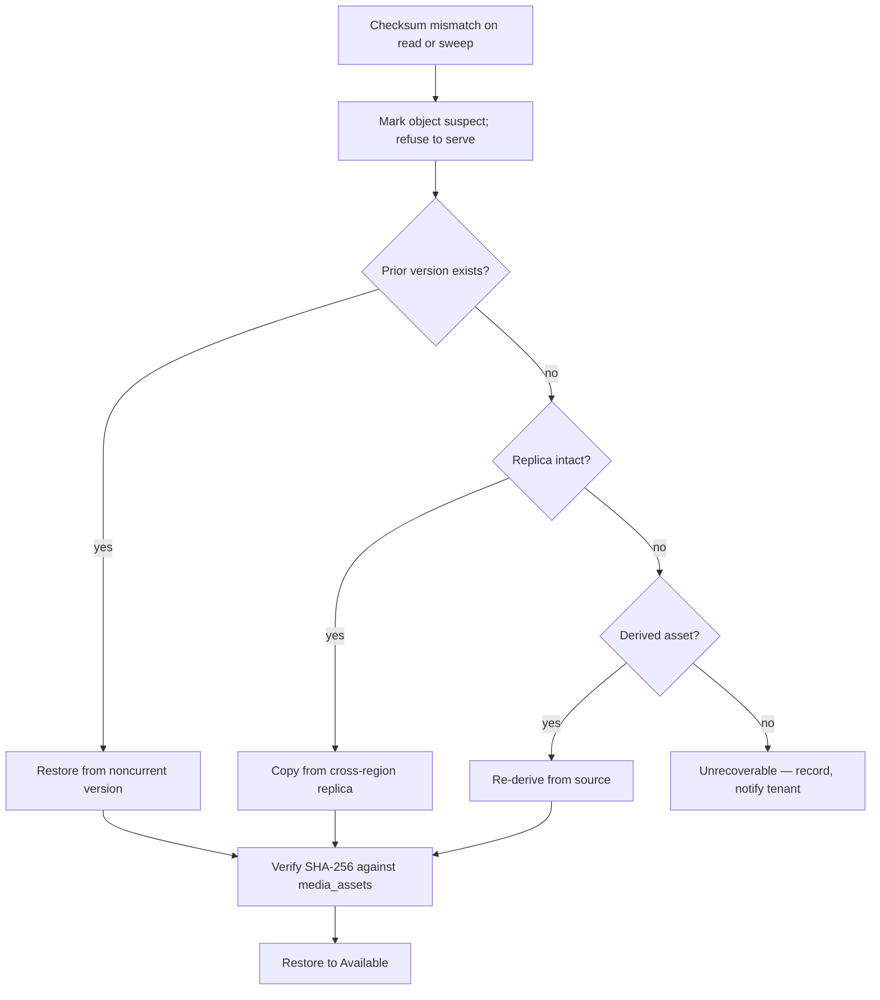

# Disaster Recovery

> **Status:** v1.0 — complete. New in Phase 10.
> **Keys are restored before data, because data without keys is noise.** Recovery sequencing is not a preference — get it wrong and a restore produces a running system full of unreadable ciphertext.

## Overview

**Business purpose.** A region loss, a corrupted migration, or a mistaken bulk delete each end the same way: customers cannot reach their content. What separates a four-hour incident from a four-day one is whether the recovery sequence was written down and rehearsed before it was needed.

**Technical purpose.** Define RPO and RTO per failure scenario, the recovery sequence and why its order is fixed, validation gates before traffic resumes, failover and failback, and the drill schedule that keeps the procedure honest.

**Recovery never weakens a control.** Not RLS, not audit, not tenant isolation, not authorization. A restore that disables a control to move faster converts a recoverable incident into a security incident (`16-security/incident-response.md`).

## Responsibilities

- RPO and RTO targets per scenario.
- Recovery sequencing and its ordering constraints.
- Corruption detection and repair: bucket, object, metadata.
- Failover and failback.
- Recovery validation gates.
- Drill schedule and outcomes.

## Non-responsibilities

| Not owned | Owner |
|---|---|
| Backup creation and verification | `backups.md` |
| Security incident procedure | `16-security/incident-response.md` |
| Operational runbooks | `14-operations/backup-recovery.md` |
| Key management | `16-security/encryption.md` |
| Event replay for projections | `13-event-platform/replay.md` |

## Objectives

| Scenario | RPO | RTO | Mechanism |
|---|---|---|---|
| **Single object corrupted** | 0 | **< 15 min** | Restore from version or replica |
| **Object metadata mismatch** | 0 | < 1 h | Reconciliation sweep |
| **Bucket corruption / bulk delete** | **< 5 min** | < 4 h | Versioning + replica restore |
| **Database corruption** | **< 30 s** | < 2 h | PITR from WAL |
| **Region loss** | **< 5 min** | **< 8 h** | Cross-region failover |
| **Tenant-scoped accidental delete** | 0 | < 30 min | Undelete within grace (`retention.md`) |

**RPO is bounded by the slowest replication in the path.** Database WAL streams continuously (< 30 s); object replication is asynchronous (p95 < 5 min). The composite RPO is therefore the object figure, and quoting the database number alone would overstate the guarantee.

**RTO for region loss is 8 hours, not minutes.** The platform runs active-passive: a warm standby database and a replicated object store, but no live traffic in the second region. Active-active would cut RTO to minutes and requires multi-region write coordination, cross-region event delivery, and per-region key hierarchies — a substantially different architecture. That trade is stated rather than implied, and changing it would need an ADR.

**Objects are the long pole in region recovery**, not the database. A database restores in under two hours; repointing object storage, validating referential integrity, and re-deriving variants dominates the remaining time.

## Recovery sequencing

**The order is fixed. Each step depends on the one before it.**



**Step 1 comes first because every other step is meaningless without it.** Column-encrypted data, backup archives, and tenant credentials are all unreadable without the KMS. A recovery that restored a database into a region where the KMS is unavailable produces a running system serving errors for every encrypted field — and the failure surfaces only after the restore appears to have succeeded.

**The KMS must therefore be multi-region, and this is a hard prerequisite** (`16-security/encryption.md`). A single-region KMS makes the platform's stated regional RTO unachievable regardless of how well data is replicated.

**Step 4 gates on RLS before any data is exposed.** A restore that recreated tables without policies produces a working database with **no tenant isolation** — every query returns every tenant's rows. The conformance suite runs here, and a failure blocks the sequence (`16-security/row-level-security.md`).

**Step 6 exists because the two systems were backed up at different points.** The database snapshot precedes the object copy (`backups.md`), so the restored database may reference objects present in the replica, and the replica may hold objects with no row. Reconciliation classifies both.

**Step 7 re-derives rather than restores variants**, since derived assets are not backed up. Objects serve in `Degraded` state until derivations complete, which is why traffic can resume before step 7 finishes for non-critical variants (`blob-lifecycle.md`).

## Corruption scenarios

### Object corruption



**A corrupted object is never served.** The read fails rather than returning bytes that do not match the recorded digest, which prevents corruption propagating into caches, exports, and published pages (`object-storage.md`).

**Recovery is tiered by cost**: version restore is instant, replica copy is a cross-region transfer, re-derivation costs CPU. Unrecoverable loss is recorded per object and disclosed to the affected tenant — silently serving a placeholder would hide data loss the customer needs to know about.

### Metadata corruption

**Three mismatch classes, each with a defined resolution:**

| Class | Meaning | Resolution |
|---|---|---|
| **Orphan object** | Bytes exist, no `media_assets` row | Collected by the orphan sweep after a safety window (`retention.md`) |
| **Dangling reference** | Row exists, no object | Attempt replica restore; else mark `unrecoverable` and notify |
| **Checksum divergence** | Row and object disagree | Object treated as corrupt; the row is authoritative for expected digest |

**The database is authoritative for the *expected* checksum; the object store is authoritative for *bytes*.** When they disagree, the bytes are wrong — a row is a small, transactionally-written record, while an object passed through more layers and more transfer. Trusting the object would mean accepting silent corruption as the new truth.

**Orphans wait through a safety window before collection**, because an object created during recovery may legitimately have no row yet. Collecting immediately would delete data mid-restore (`retention.md`).

### Bucket corruption or bulk delete

**Versioning is the first line, not the backup.** A bulk delete creates delete markers; removing them restores every object instantly, with no data transfer. This turns the most likely bulk-loss scenario into a minutes-long recovery.

**Object Lock protects the replica** even against an attacker with credentials (`backups.md`). Where versions are also destroyed, the cross-region replica is the source, and delete replication being disabled is what guarantees it survived.

## Failover

```mermaid
sequenceDiagram
    participant OPS as Commander
    participant SEC as Security controls
    participant DB as Standby database
    participant OS as Replica bucket
    participant DNS as Traffic

    OPS->>OPS: declare; assign; place legal holds
    OPS->>SEC: verify KMS + secret store in target region
    OPS->>DB: promote standby; PITR if needed
    OPS->>SEC: run RLS conformance — BLOCKING GATE
    OPS->>OS: promote replica to primary
    OPS->>OPS: reconcile references
    OPS->>OPS: run validation gates — BLOCKING
    OPS->>DNS: shift traffic
    OPS->>OPS: re-derive variants in background
```

**Failover is a deliberate human decision, never automatic.** An automatic trigger on health-check failure risks split-brain — two regions accepting writes — which is far more damaging than the outage it would shorten. The decision is made by a named commander (`16-security/incident-response.md`).

**Writes are stopped in the failing region before the standby is promoted**, accepting a brief total outage rather than risking divergent writes that must later be reconciled by hand.

**Traffic shifts only after every validation gate passes.** Resuming service into an unvalidated restore risks serving one tenant's data to another — an incident strictly worse than continued downtime.

## Validation gates

**All gates are blocking. None is skippable under time pressure.**

| Gate | Check | Failure |
|---|---|---|
| **Keys** | KMS reachable; a sample decrypt succeeds | **Stop** |
| **Isolation** | RLS conformance suite passes; exactly five exception tables | **Stop** |
| **Audit** | `audit_log` present; append-only trigger active; **chain verifies** | **Stop** |
| **Integrity** | Referential reconciliation within tolerance; checksum sample matches | **Stop** |
| **Authorization** | Role bindings intact; a permission probe returns expected denials | **Stop** |
| **Application** | Services boot; health checks green | Stop |
| **Data currency** | Restored point matches the intended recovery point | Stop |

**Audit chain verification is a gate because a restore is exactly when tampering would be hidden.** If the chain does not verify, the platform cannot assert what happened before the incident, and the incident's severity rises (`16-security/audit.md`).

**The permission probe is a positive and negative test.** It confirms an authorized subject is allowed *and* an unauthorized one is denied. A restore that granted everything to everyone would pass a positive-only check.

**Gates are automated and produce a signed record** appended to the incident. An operator cannot mark a gate passed by assertion.

## Failback


**Failback is planned, never urgent.** The platform is running correctly in the DR region; returning is an optimization, and rushing it risks a second outage for no availability gain.

**Every validation gate runs again on failback.** The original region's data was reconstructed by reverse replication and has had no traffic — treating it as trusted because it was primary yesterday is how a second incident starts.

**Failback is only initiated after the postmortem identifies why the original region failed.** Returning to an unexplained failure invites its recurrence.

## Drills

| Drill | Frequency | Scope |
|---|---|---|
| Single object restore | Monthly, automated | Version and replica paths |
| **Database PITR** | **Weekly** (`backups.md` tier 2) | Restore to scratch, full integrity |
| **Full region failover** | **Quarterly** | Complete sequence, measured |
| Failback | Semi-annually | Return path |
| Key unavailability | Annually | KMS loss handling |

**Quarterly full drills measure actual RTO and RPO against the targets**, and the measured numbers replace the aspirational ones in this document when they diverge. A published RTO that has never been achieved is a fiction.

**Drills run against production-equivalent infrastructure with production-scale data volume.** A drill on a 1 GB dataset proves nothing about restoring 4 TB.

**A missed drill is an alert.** Drill discipline decays silently, and the first missed quarter is never the last.

**Every drill produces a written outcome** with measured timings, failures found, and remediation items tracked to closure — the same discipline as an incident postmortem (`16-security/incident-response.md`).

## Business rules

1. **Keys are verified available before any data restore.** The KMS must be multi-region.
2. **Recovery sequencing is fixed**; steps are not reordered or parallelized past their dependencies.
3. **RLS conformance is a blocking gate** before data is exposed.
4. **Audit chain verification is a blocking gate.**
5. **Recovery never bypasses audit, security, authorization, or tenant isolation.**
6. **Failover is a human decision**, never automatic.
7. **Writes stop before promotion** to prevent split-brain.
8. **Traffic resumes only after all gates pass.**
9. **A corrupted object is never served.**
10. **The database is authoritative for expected checksums; the object store for bytes.**
11. **Orphans wait a safety window** before collection.
12. **Unrecoverable loss is recorded and disclosed** to affected tenants.
13. **Derived variants are re-derived, not restored.**
14. **All gates run again on failback.**
15. **Quarterly drills measure real RTO/RPO**, and measured values supersede targets.
16. **Every drill and recovery produces a documented outcome.**

## Interfaces

```ts
interface RecoveryCoordinator {
  declare(scenario: RecoveryScenario, actor: string): Promise<RecoveryRun>;
  step(runId: string, step: RecoveryStep, actor: string): Promise<StepResult>;
  runGates(runId: string): Promise<GateReport>;
  reconcile(runId: string): Promise<ReconciliationReport>;
  resumeTraffic(runId: string, actor: string): Promise<ResumeResult>;
}

type ResumeResult =
  | { outcome: 'resumed'; at: Date }
  | { outcome: 'blocked'; failedGates: readonly GateFailure[] };

interface ReconciliationReport {
  readonly orphanObjects: number;
  readonly danglingReferences: number;
  readonly checksumDivergences: number;
  readonly unrecoverable: readonly string[];      // objectIds
  readonly withinTolerance: boolean;
}
```

**`resumeTraffic` returns `blocked` with the failing gates rather than throwing.** A thrown error invites a retry loop or a catch that swallows it; an explicit blocked result naming which gates failed cannot be mistaken for success, and there is **no force parameter** — the gates are not overridable.

**`ReconciliationReport` lists `unrecoverable` object ids explicitly**, because those are the disclosure obligation. A count alone would not let anyone tell affected customers what was lost.

## Database impact

**No new tables and no schema change.** Recovery runs are operational records stored outside tenant scope (`14-operations/backup-recovery.md`); reconciliation reads `media_assets` and object listings (`03-database/tables.md`).

**Reconciliation is read-only until an operator approves resolutions.** An automated sweep deleting objects it classified as orphans during a partially-completed restore would destroy legitimate data — the classification is automatic, the action is not.

## Security

- **Recovery never disables a control.** RLS, audit, authorization, and encryption are verified as gates, not suspended for speed.
- **Restore access is break-glass**, individually approved, time-boxed, and audited (`16-security/row-level-security.md`).
- **Legal holds are placed at declaration** for any recovery involving potential data loss (`16-security/compliance.md`).
- Every recovery step, gate result, and resolution is audited with actor (`16-security/audit.md`).
- A restored environment contains **every tenant's data with no RLS applied until policies are verified** — the reason step 4 blocks.
- Forensic evidence is preserved before repair where a security cause is suspected (`16-security/incident-response.md`).

## Performance

| Operation | Target |
|---|---|
| Single object restore | **< 15 min** |
| Database PITR (production scale) | < 2 h |
| Replica promotion | < 30 min |
| Referential reconciliation | < 1 h for 10⁸ rows, batched |
| Gate suite | < 20 min |
| Variant re-derivation | Background; hours, non-blocking |

**Reconciliation is batched and streaming**, comparing sorted key ranges rather than loading either side fully. A naive full-set comparison at 10⁸ objects exhausts memory before it produces an answer.

## Observability

- **Metrics:** `recovery_runs_total{scenario,outcome}`, `recovery_duration_seconds{scenario,step}`, `rpo_actual_seconds` (gauge), `rto_actual_seconds`, `gate_results_total{gate,outcome}`, `reconciliation_orphans_total`, `reconciliation_dangling_total`, `unrecoverable_objects_total`, `drills_completed_total{kind}`, `drill_overdue_days{kind}` (gauge).
- **Logging:** run id, scenario, step, actor, gate outcomes — never tenant data.
- **Alerts:** any gate failure during recovery (**page**); `unrecoverable_objects_total` non-zero (**page** — permanent data loss requiring disclosure); `rpo_actual_seconds` exceeding target (the advertised recovery point is not being met); `drill_overdue_days` above zero; `reconciliation_dangling_total` non-zero outside a recovery (the ordering rule has broken in normal operation — see `backups.md`).

**Dangling references outside a recovery are the most informative alert here.** They mean backup ordering or replication is broken *right now*, and the next real recovery would lose data — discovered in advance rather than during the incident.

## Cross references

- `backups.md` — what is restored, verification, the ordering rule
- `retention.md` — orphan safety window, undelete within grace
- `object-storage.md` — versioning, checksums, corruption detection
- `blob-lifecycle.md` — `Degraded` state during re-derivation
- `media-processing.md` — variant re-derivation
- `storage-observability.md` — recovery signals
- `16-security/encryption.md` — multi-region KMS prerequisite
- `16-security/row-level-security.md` — the isolation gate
- `16-security/audit.md` — the chain verification gate
- `16-security/compliance.md` — legal hold at declaration
- `16-security/incident-response.md` — command structure, evidence preservation
- `13-event-platform/replay.md` — projection rebuild after recovery
- `14-operations/backup-recovery.md` — operational runbooks
