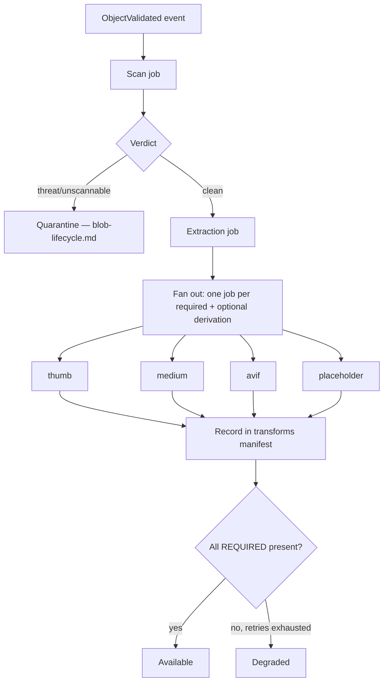

# Media Processing

> **Status:** v1.0 — complete. New in Phase 10.
> **Processing extracts technical facts and produces derived bytes. It never interprets content.** Dimensions, duration, and page count are storage's business; what an image depicts is not.

## Overview

**Business purpose.** A generated hero image must be served as a 400 KB WebP to a phone and a 1.2 MB AVIF to a desktop, with a thumbnail in the media library and a blur placeholder while it loads. Producing those variants on demand is slow and expensive; producing them once at upload is neither.

**Technical purpose.** Specify the derivation pipeline: which variants each media kind produces, how transforms are identified deterministically, how processing is sandboxed and resource-bounded, and what metadata is extracted.

**All processing is queue-based.** Nothing happens inside a request. Derivations are triggered by events, executed by workers, and completed asynchronously (`13-event-platform/workers.md`).

## Responsibilities

- Derivation specifications per media kind.
- Deterministic transform identity.
- Technical metadata extraction.
- Malware scanning execution.
- Structural content validation.
- Sandboxing and resource limits.
- Queue-based orchestration.

## Non-responsibilities

| Not owned | Owner |
|---|---|
| **What media depicts** | `08-ai-platform/` via the Writing Engine |
| Alt text and captions | `05-content-platform/writing-engine.md` — ADR-018 |
| Whether media is needed | Writing Engine — `MediaSpec` |
| Lifecycle state transitions | `blob-lifecycle.md` |
| Object keys and checksums | `object-storage.md` |
| Delivery and format negotiation | `cdn.md` |
| Queue mechanics | `13-event-platform/` |

**The ADR-018 line runs directly through this document.** The Writing Engine decides an image is needed and what it should show; the AI Platform generates it; this component resizes, optimizes, and extracts its dimensions. Alt text is authored by the Writing Engine because it is content. Processing produces `width: 1920`, never `depicts: espresso machine`.

## Media kinds and derivations

| Kind | Derivations | Extracted metadata |
|---|---|---|
| **Image** | `thumb` 200px, `small` 480px, `medium` 1024px, `large` 1920px; WebP + AVIF; LQIP placeholder | Dimensions, colour space, orientation, animation, has-alpha |
| **Document** | Page-1 thumbnail, page count | Page count, page dimensions, producer, encryption flag |
| **Audio** | Waveform peaks JSON | Duration, sample rate, channels, bitrate, codec |
| **Video** | Poster frame at 10%, `thumb` 200px | Duration, dimensions, frame rate, codec, has-audio |
| **Archive/other** | **None** | Size and detected type only |

**Video transcoding is explicitly out of scope for v1.** Producing multiple renditions requires a dedicated encoding fleet, costs an order of magnitude more than image processing, and serves a use case ContentOS does not have — the product publishes articles, and video appears as embedded third-party content far more often than as uploaded assets. Poster frames and metadata are produced; renditions are not. Adding transcoding later is additive: a new derivation set and a driver capability.

**Required versus optional derivations are declared per kind.** For images, `thumb` and `medium` are required; AVIF is optional. Only a missing required derivation produces `Degraded` (`blob-lifecycle.md`) — an AVIF failure should not withhold a working image.

**LQIP placeholders are generated at upload** — a 20×20 blurred WebP, inlined as a data URI. Generating it on demand would defeat the purpose, since the placeholder must arrive before the image it stands in for.

## Deterministic transform identity

```ts
interface TransformSpec {
  readonly kind: 'resize' | 'format' | 'thumbnail' | 'poster' | 'waveform' | 'placeholder';
  readonly params: Record<string, string | number>;   // sorted, canonical
  readonly version: number;                            // transform algorithm version
}

function transformId(spec: TransformSpec): string {
  return sha256(canonicalJson(spec)).slice(0, 16);
}
```

**A transform's identity is a hash of its specification, not a generated id.** The same source object and the same spec always yield the same `transformId` — which makes derivation idempotent without any coordination.

**This is what makes redelivery safe.** A retried derivation event computes the same `transformId`, finds the derived object already present in `media_assets.transforms`, and returns without re-encoding. No lock, no dedupe table, no coordination — the identity function does the work (`13-event-platform/idempotency.md`).

**`version` is part of the spec deliberately.** Improving the thumbnail algorithm bumps the version, which changes every `transformId`, which causes new derivations to be produced without touching existing ones. Old derivations remain valid and referenced until something regenerates them — no migration, no invalidation storm.

**The transform manifest lives in `media_assets.transforms JSONB`**, mapping `transformId` to the derived `objectId`, its size, and its parameters (`03-database/tables.md`).

## Pipeline



**Each derivation is an independent job.** A failing AVIF encoder does not block the thumbnail, and each retries under its own policy (`13-event-platform/retry-engine.md`).

**Extraction runs before derivation** because derivation needs its output: an image's orientation determines whether width and height are swapped, and a document's page count determines whether a page-1 thumbnail is possible.

**Completion is evaluated after each derivation records**, not by a coordinator waiting on all of them. The last job to complete finds the required set satisfied and transitions the object — so there is no coordinator to crash and no barrier to stall.

**All jobs are dispatched via the Event Platform**, never by direct queue writes (`13-event-platform/transactional-outbox.md`).

## Sandboxing

**Media parsers are among the most exploited code in any system**, and the platform feeds them untrusted bytes by design.

| Control | Rule |
|---|---|
| **Process isolation** | Every transform runs in a separate process, not in the worker |
| **No network** | The transform process has no egress; it cannot exfiltrate or call out |
| **Filesystem** | Read-only except a per-job temp directory, wiped after |
| **User** | Unprivileged, no capabilities |
| **Timeout** | 60 s per transform; killed hard |
| **Memory** | 512 MB hard cap; OOM kills the process, not the worker |
| **Coder allowlist** | Only enabled formats; SVG, PS, and MSL decoders **disabled** |

**A crash or compromise in a transform kills a process, not a worker.** In-process image decoding means an ImageMagick vulnerability compromises a worker that holds database credentials and processes other tenants' objects. Process isolation bounds it to a job with no network and no persistent state.

**SVG processing is disabled entirely.** SVG is XML: it supports external entity references, embedded scripts, and remote resource loading — an SSRF and XSS vector wearing an image extension (`16-security/threat-model.md`, T-13). SVGs are stored and served with `Content-Disposition: attachment` and `nosniff`, never rendered or transformed.

**Decompression bombs are rejected before decode.** A 10 KB PNG can declare dimensions expanding to tens of gigabytes:

```ts
const MAX_PIXELS = 100_000_000;       // 100 megapixels
const header = readImageHeader(stream);   // header only — no decode
if (header.width * header.height > MAX_PIXELS) reject('pixel-limit');
```

**The check reads the header, never the image.** Decoding to discover the size is the attack — the memory is allocated before any limit can be applied.

## Metadata extraction

**Only technical metadata. Never semantic.**

```ts
interface ExtractedMetadata {
  readonly dimensions?: { width: number; height: number };
  readonly durationMs?: number;
  readonly pageCount?: number;
  readonly colorSpace?: string;
  readonly hasAlpha?: boolean;
  readonly hasAudio?: boolean;
  readonly codec?: string;
  readonly frameRate?: number;
  // NO description. NO tags. NO detected objects. NO transcription.
}
```

**Semantic extraction is deliberately absent.** Object detection, OCR, and transcription are AI capabilities; putting them here would give the Storage Platform a model dependency and duplicate the AI Platform's guardrails, cost accounting, and provider abstraction. Where the product needs them, the Writing Engine requests them through the AI Gateway and stores results as content (ADR-018).

**EXIF is stripped from every derivation and from the stored original.**

| Field | Action | Reason |
|---|---|---|
| GPS coordinates | **Removed** | Discloses where a photo was taken |
| Device serial, owner name | **Removed** | Personal data |
| Orientation | **Applied, then removed** | Baked into pixels so viewers agree |
| Colour profile | Retained | Required for correct rendering |
| Timestamps | Removed | Personal data; the platform records its own |

**Stripping EXIF is a privacy control, not an optimization.** A brand asset uploaded from a phone carries the coordinates of the office it was photographed in, and publishing it to a CDN publishes that. Removal is unconditional and applies to the original as stored, since the original is servable.

**Orientation is applied before stripping.** Removing the orientation tag without rotating the pixels displays the image sideways — the most common EXIF-stripping bug.

## Content validation

Beyond magic bytes (`blob-lifecycle.md`), each kind gets a structural check:

| Kind | Check |
|---|---|
| Image | Header parses; dimensions within limits; frame count bounded |
| PDF | Header valid; **encrypted PDFs rejected** — unscannable |
| Audio/Video | Container parses; duration present and bounded |
| All | Declared size matches actual |

**Encrypted PDFs are rejected because they cannot be scanned.** An encrypted container is opaque to the malware scanner, and the platform's rule is that unscannable means unsafe (`blob-lifecycle.md`).

**Animated images are bounded by frame count.** A GIF with 100,000 frames is a resource attack that passes every size and pixel check, since each frame is individually small.

## Malware scanning

**Execution lives here; the policy lives in `blob-lifecycle.md`.**

| Property | Value |
|---|---|
| Engine | ClamAV with daily signature updates |
| Invocation | Streamed; the object is never written to a shared filesystem |
| Timeout | 30 s |
| Retries | 3, then quarantine |
| Isolation | Same sandbox constraints as transforms |
| Signature currency | **Age is monitored and alerted** |

**Stale signatures are a silent failure.** A scanner running with three-month-old definitions reports clean on everything current and produces no error. Signature age is a monitored metric with an alert, because the scanner cannot report its own blindness.

## Resource management

| Constraint | Value |
|---|---|
| Concurrency per worker | 2 transforms |
| Memory per transform | 512 MB hard |
| CPU | 1 core per transform |
| Timeout | 60 s (300 s for video poster extraction) |
| Queue priority | User uploads above generated media |

**Concurrency is low because transforms are CPU- and memory-bound**, unlike the I/O-bound handlers most workers run. Two per worker with a 512 MB cap keeps a worker's footprint predictable; raising it trades throughput for OOM risk on the largest inputs.

**User uploads are prioritized over platform-generated media.** A person waiting on their upload notices a delay; a generated hero image is already part of an asynchronous pipeline where seconds do not show.

## Business rules

1. **All processing is queue-based**; nothing runs inside a request.
2. **`transformId` is a hash of the spec** — derivation is idempotent without coordination.
3. **Transform version is part of the identity**, so algorithm changes produce new derivations without migration.
4. **Every transform runs in an isolated process** with no network.
5. **SVG is never processed or rendered.**
6. **Pixel limits are checked from the header**, before decode.
7. **Encrypted PDFs are rejected** as unscannable.
8. **EXIF is stripped**, with orientation applied first.
9. **Only technical metadata is extracted**; semantic extraction belongs to the AI Platform.
10. **Required and optional derivations are declared per kind**; only missing required ones cause `Degraded`.
11. **Each derivation is an independent job** with independent retry.
12. **Completion is evaluated per job**, with no coordinator.
13. **Scanner signature age is monitored and alerted.**
14. **Video transcoding is out of scope for v1**; poster frames and metadata only.
15. **Jobs are dispatched through the Event Platform**, never directly.

## Interfaces

```ts
interface MediaProcessor {
  extract(ctx: TenantContext, objectId: string): Promise<ExtractedMetadata>;
  derive(ctx: TenantContext, objectId: string, spec: TransformSpec): Promise<DerivationResult>;
  scan(ctx: TenantContext, objectId: string): Promise<ScanVerdict>;
  requiredTransforms(kind: MediaKind): readonly TransformSpec[];
  optionalTransforms(kind: MediaKind): readonly TransformSpec[];
}

type DerivationResult =
  | { outcome: 'derived'; transformId: string; objectId: string; sizeBytes: number }
  | { outcome: 'already-present'; transformId: string; objectId: string }
  | { outcome: 'unsupported'; reason: string };

type ScanVerdict =
  | { verdict: 'clean'; engine: string; signatureDate: Date }
  | { verdict: 'threat'; engine: string; signatureDate: Date }   // signature NOT returned
  | { verdict: 'unscannable'; reason: string };
```

**`ScanVerdict` never carries the threat signature.** Returning it would let an uploader iterate against the scanner until a payload passes — the detection detail goes to the audit record and the security alert, not to the caller (`16-security/audit.md`).

**`already-present` is a distinct outcome, not an error.** It is the normal result of a redelivered derivation event and must be distinguishable from a failure that should retry.

**`unsupported` covers driver and format gaps honestly** — an unrecognised codec returns a reason rather than failing as though something broke.

## Database impact

**No new tables and no schema change.** Derivations are recorded in `media_assets.transforms JSONB`; extracted metadata is stored on the asset row (`03-database/tables.md`).

**Each derived object is itself a row in `media_assets`** with a reference to its source, which is what lets reference counting and purge cascade correctly (`retention.md`).

## Security

- **Process isolation, no network, unprivileged user, bounded memory and time** for every transform and scan.
- **SVG, PostScript, and MSL decoders disabled**; SVG served as an attachment, never rendered.
- Pixel and frame limits enforced from headers, before allocation.
- **EXIF stripping removes GPS and device identifiers** from originals and derivations.
- Scanning follows `16-security/threat-model.md`; quarantine follows `blob-lifecycle.md`.
- Transform processes hold **no credentials** and no database access; they receive bytes and return bytes.
- Threat detections are audited and alerted (`16-security/audit.md`).

## Performance

| Operation | Target |
|---|---|
| Extraction | **p95 < 500 ms** — headers only |
| Image derivation (single variant) | p95 < 2 s |
| Full image set (6 variants) | **p95 < 10 s** parallel |
| PDF page-1 thumbnail | p95 < 5 s |
| Video poster | p95 < 30 s |
| Scan | p95 < 30 s |
| Placeholder (LQIP) | p95 < 300 ms |

**Extraction is fast because it reads headers, not content.** Decoding a 4 GB video to learn its duration would make extraction the pipeline's bottleneck; container metadata gives the same answer in milliseconds.

## Observability

- **Metrics:** `derivations_total{kind,transform,outcome}`, `derivation_duration_seconds{kind,transform}`, `extraction_duration_seconds{kind}`, `scan_duration_seconds`, `scan_signature_age_days` (gauge), `transform_oom_total`, `transform_timeout_total`, `pixel_limit_rejections_total`, `sandbox_violations_total`, `derivation_queue_depth` (gauge).
- **Logging:** object id, tenant id, kind, transform id, duration, outcome — never bytes or extracted content.
- **Alerts:** `scan_signature_age_days` > 2 (**page** — the scanner is blind and reporting clean); `sandbox_violations_total` non-zero (**page** — a transform attempted network or filesystem access it should not have); `transform_oom_total` spike (a resource attack or a pathological input); `derivation_queue_depth` growing (nothing is becoming available); `pixel_limit_rejections_total` spike (decompression bomb attempts).

**Stale scanner signatures page rather than warn.** Every other alert here fires on something happening; this one fires on a control silently ceasing to work while continuing to report success.

## Cross references

- `blob-lifecycle.md` — states, quarantine policy, degraded semantics
- `object-storage.md` — derived objects are ordinary immutable objects
- `retention.md` — reference counting across derivations
- `cdn.md` — format negotiation over the derived variants
- `storage-abstraction.md` — driver capability for archival and transforms
- `storage-apis.md` — the frozen public interface
- `16-security/threat-model.md` — parser exploitation, decompression bombs, SVG
- `16-security/audit.md` — threat detection records
- `13-event-platform/workers.md` · `retry-engine.md` · `idempotency.md`
- `05-content-platform/writing-engine.md` — `MediaSpec`, alt text (ADR-018)
- `03-database/tables.md` — `media_assets.transforms`
