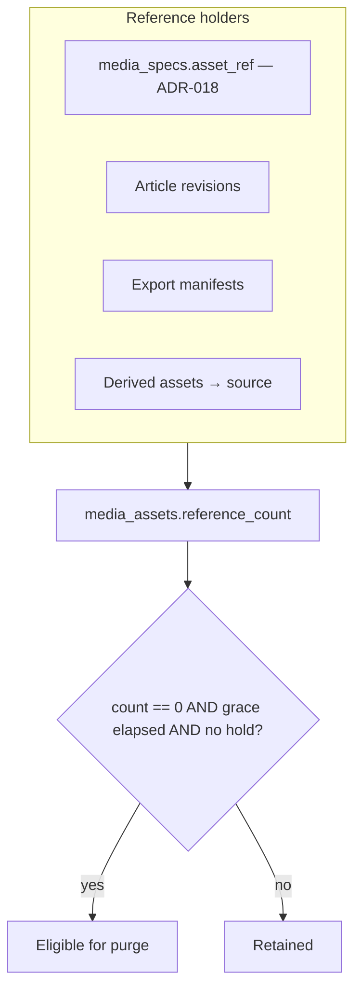
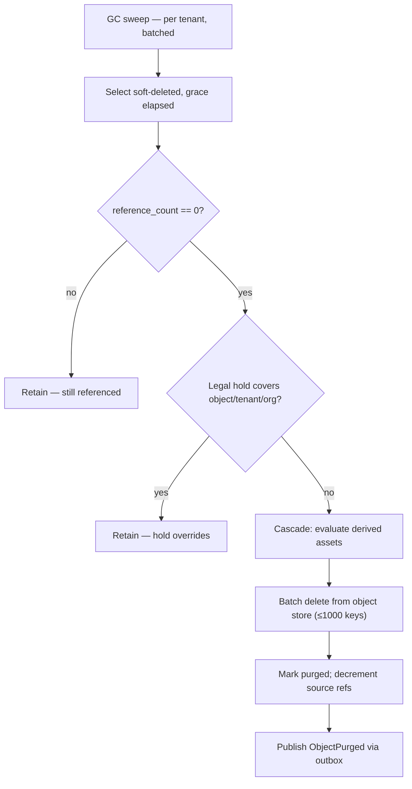
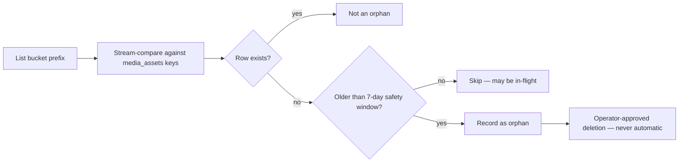

# Retention

> **Status:** v1.0 — complete. New in Phase 10.
> **Counters drift, so the platform verifies them.** Reference counting decides what may be deleted, and a reconciliation sweep independently recomputes it — because a decremented-twice counter deletes data that is still in use, silently.

## Overview

**Business purpose.** Storage grows monotonically unless something removes things, and unbounded growth is both a cost problem and a compliance one — data retained past its purpose is a liability. Retention is what makes deletion happen reliably, and reference counting is what stops it from happening too soon.

**Technical purpose.** Specify lifecycle policies per object class, the reference counting model and its verification, garbage collection, orphan detection, and the three deletion guarantees.

**The hard part is not deleting — it is knowing what is safe to delete.** One derived thumbnail may be referenced by six article revisions and two exports. Deleting it because one revision was removed breaks the other eight.

## Responsibilities

- Lifecycle policies and archival ages per object class.
- Reference counting and its reconciliation.
- Soft delete, hard delete, cryptographic erasure.
- Garbage collection.
- Orphan and expired-upload detection.
- Temporary object expiry.
- Derived asset cascade.

## Non-responsibilities

| Not owned | Owner |
|---|---|
| Lifecycle state transitions | `blob-lifecycle.md` |
| Legal hold definition and precedence | `16-security/compliance.md` |
| Key destruction | `16-security/encryption.md` |
| Backup retention windows | `backups.md` |
| Audit record retention | `16-security/audit.md` |
| **Whether content should be kept** | The owning domain component |

**Retention enforces policy; it never decides it.** Whether an article's media should be kept for two years is a product and contractual question answered by the Content Platform and the customer's plan. This component executes the resulting schedule.

## Object classes and policies

| Class | Archival | Soft-delete grace | Notes |
|---|---|---|---|
| **Source media** | 365 days | **30 days** | Authoritative; backed up |
| **Derived assets** | Never | Cascades with source | Rebuildable; not backed up |
| **Uploads (pre-attachment)** | — | 7 days if unattached | Orphaned by abandoned workflows |
| **Exports** | Never | **7 days hard TTL** | Temporary by nature |
| **Preview renders** | Never | **24 h hard TTL** | Ephemeral |
| **Quarantined** | Never | **Never auto-deleted** | Evidence (`blob-lifecycle.md`) |
| **Pending uploads** | — | **24 h** | Matches multipart abort rule |

**Exports and preview renders have hard TTLs, not grace periods.** They are derived artifacts of a request, regenerable on demand, and each is a copy of tenant data that erasure would otherwise have to reach. A short, unconditional expiry keeps the copy count bounded.

**Unattached uploads expire at 7 days.** A user who uploads an image and abandons the article leaves an object referenced by nothing. Seven days covers a realistic return; beyond that it is storage nobody asked for.

**Quarantined objects are never automatically deleted.** They are security evidence and are removed only by explicit operator action (`16-security/incident-response.md`).

## Reference counting



**References are incremented and decremented inside the transaction that creates or removes them.** A revision binding a `MediaSpec.asset_ref` increments in the same transaction as the binding; removing the revision decrements in the same transaction as the delete. A counter updated afterwards diverges the moment a transaction rolls back.

```sql
UPDATE media_assets
   SET reference_count = reference_count + 1
 WHERE id = $1 AND tenant_id = current_setting('app.tenant_id', true)::uuid;
```

**The `CHECK (reference_count >= 0)` constraint makes double-decrement a loud failure.** Without it, an over-decremented counter silently reaches zero and the object is collected while still referenced — data loss with no error and no obvious cause. The constraint converts a subtle corruption into an immediate transaction failure at the point of the bug.

### Reconciliation

**Counters drift. The platform assumes they will and verifies them.**

| Property | Value |
|---|---|
| Frequency | Daily, batched by tenant |
| Method | Recompute from all reference sources; compare to stored count |
| Divergence | **Corrected upward immediately; downward only after a second confirming pass** |
| Alerting | Any divergence is recorded; sustained divergence pages |

**Corrections are asymmetric deliberately.** Raising a count is safe — the worst outcome is retaining an object longer. Lowering a count makes an object eligible for deletion, so it requires two independent passes agreeing, because a reconciliation running concurrently with a reference being created would otherwise under-count and delete live data.

**Reconciliation is the control that makes counters trustworthy.** A refcount system without verification is a system that deletes referenced data eventually, and the first symptom is a broken image in a published article.

## The three deletion guarantees

| Operation | Effect | Reversible | Reaches backups |
|---|---|---|---|
| **Soft delete** | Unreadable; CDN invalidated | **Yes**, within grace | No |
| **Hard delete (purge)** | Bytes removed from primary | No | No |
| **Cryptographic erasure** | Tenant DEK destroyed | No | **Yes** |

**Only cryptographic erasure reaches backups**, because backups are immutable snapshots from which one tenant's objects cannot be selectively removed. Destroying the tenant's DEK renders their ciphertext meaningless everywhere it exists, immediately (`16-security/encryption.md`, `16-security/compliance.md`).

**Purge follows as cleanup and reclaims storage.** The erasure guarantee does not wait for it.

## Garbage collection



**All three conditions are checked inside the deleting transaction**, never as a pre-flight. A legal hold placed between a pre-check and the delete would be missed, and destroying data under hold is unrecoverable (`16-security/compliance.md`).

**Deletion is idempotent.** Purging an already-purged object returns success, not an error:

```ts
type PurgeOutcome =
  | { outcome: 'purged'; bytesReclaimed: number }
  | { outcome: 'already-purged' }          // idempotent — NOT an error
  | { outcome: 'retained'; blockers: readonly PurgeBlocker[] };
```

**Idempotency matters because GC is event-driven and events are at-least-once.** A redelivered purge event finds the object gone and returns cleanly; treating that as an error would dead-letter routine redeliveries and fill the DLQ with non-problems (`13-event-platform/idempotency.md`).

**Object-store deletes are batched at 1,000 keys** — the provider maximum (`storage-abstraction.md`). Deleting individually is 1,000 round trips per batch, which is the difference between a sweep that keeps pace with deletion volume and one that falls permanently behind.

**GC is rate-limited and yields to production traffic.** A sweep saturating the object store's request budget degrades uploads and CDN origin fetches — retention work is never urgent enough to do that.

## Derived asset cascade

**Derived assets never outlive their source unless explicitly configured.**

| Case | Behaviour |
|---|---|
| Source soft-deleted | Derivations soft-deleted with it |
| Source purged | Derivations purged, **each refcount-checked** |
| Derivation referenced elsewhere | **Retained** — its own refcount is non-zero |
| Explicitly pinned derivation | Retained; requires a recorded reason |

**Each derivation is refcount-checked individually rather than blindly cascaded.** Two source images that produce an identical derivation — the same transform of the same bytes yields the same `transformId` (`media-processing.md`) — share it. Purging one source must not remove a derivation the other still uses.

**Pinning exists for a narrow case**: a derivation embedded in a published, immutable export whose source has been removed. It requires a recorded reason so pinned objects are auditable rather than accumulating silently.

## Orphan detection

**An orphan is bytes with no `media_assets` row.**

| Cause | Frequency |
|---|---|
| Upload completed, row write failed | Rare — the transaction should prevent it |
| Objects created in the backup consistency window | Expected after a restore (`backups.md`) |
| Recovery reconciliation | Expected after a failover (`disaster-recovery.md`) |
| Direct bucket write | Should be impossible; investigated if seen |



**Orphans are never deleted automatically.** An object with no row may be mid-upload, mid-recovery, or evidence that something is writing outside the mediated path — and that last case is a finding, not garbage. Automatic collection would destroy the evidence and the data.

**The comparison streams sorted key ranges**, never loading either side fully. At 10⁸ objects a full-set comparison exhausts memory before producing an answer (`disaster-recovery.md`).

**The 7-day safety window exceeds any legitimate in-flight window**, which is at most 24 hours for a pending multipart upload.

**Orphan growth is a monitored trend.** A steady rise means a write path is failing to record metadata, which is a bug worth finding before the storage bill finds it.

## Legal hold

**Hold always overrides retention** (`16-security/compliance.md`).

| Scope | Effect |
|---|---|
| Object | That object is never purged |
| Tenant | No object for that tenant is purged |
| Organization | Applies across all its tenants |

**A held erasure request is queued and disclosed, never executed** — deferred, not silently dropped. Executing erasure under hold destroys evidence, a more serious failure than a delayed erasure.

**Holds are released, never deleted**, so the release is itself part of the record.

## Business rules

1. **Deletion is idempotent**; `already-purged` is a success outcome.
2. **Reference counts are updated inside the referencing transaction.**
3. **`CHECK (reference_count >= 0)`** makes double-decrement fail loudly.
4. **Reconciliation runs daily**; upward corrections are immediate, downward require two passes.
5. **Purge requires refcount zero, grace elapsed, and no hold** — all checked in-transaction.
6. **Derived assets never outlive their source** unless explicitly pinned with a reason.
7. **Each derivation is refcount-checked individually**, never blindly cascaded.
8. **Orphans are never deleted automatically**; deletion is operator-approved.
9. **The orphan safety window is 7 days.**
10. **Object-store deletes are batched** at the provider maximum.
11. **GC is rate-limited and yields to production traffic.**
12. **Exports and previews have hard TTLs**, not grace periods.
13. **Quarantined objects are never auto-deleted.**
14. **Legal hold overrides every retention rule.**
15. **Only cryptographic erasure reaches backups.**
16. **Every purge publishes through the outbox** in the same transaction.

## Interfaces

```ts
interface RetentionService {
  addReference(ctx: TenantContext, objectId: string, holder: ReferenceHolder, tx: Transaction): Promise<void>;
  removeReference(ctx: TenantContext, objectId: string, holder: ReferenceHolder, tx: Transaction): Promise<void>;
  purgeEligibility(ctx: TenantContext, objectId: string): Promise<PurgeEligibility>;
  purge(ctx: TenantContext, objectId: string, actor: string): Promise<PurgeOutcome>;
  reconcile(ctx: TenantContext): Promise<ReconciliationReport>;
  detectOrphans(prefix: string, olderThan: Date): Promise<Page<OrphanCandidate>>;
  approveOrphanDeletion(candidateIds: readonly string[], actor: string, reason: string): Promise<number>;
}

interface ReferenceHolder {
  readonly kind: 'media-spec' | 'article-revision' | 'export' | 'derived-from' | 'pin';
  readonly id: string;
}

type PurgeBlocker =
  | { kind: 'grace-period'; eligibleAt: Date }
  | { kind: 'references'; count: number; holders: readonly ReferenceHolder[] }
  | { kind: 'legal-hold'; holdIds: readonly string[] }
  | { kind: 'quarantined' };
```

**`addReference` and `removeReference` require a `Transaction`**, so a reference change cannot be committed separately from the state change that caused it — the same structural guarantee used for event publication (`13-event-platform/transactional-outbox.md`).

**`PurgeBlocker` for references names the *holders*, not just a count.** An operator investigating why an object will not delete needs to know what is holding it; a bare count sends them hunting.

**`approveOrphanDeletion` requires an actor and a reason** and takes an explicit candidate list — there is no "delete all orphans" call, because the one time that is wrong is during a partially-completed restore.

## Database impact

**No new tables and no schema change.** Retention uses `media_assets` (`03-database/tables.md`) with:

| Element | Purpose |
|---|---|
| `reference_count INTEGER NOT NULL DEFAULT 0` | The counter |
| `CHECK (reference_count >= 0)` | Double-decrement fails loudly |
| `deleted_at TIMESTAMPTZ NULL` | Soft-delete marker and grace clock |
| Partial index on `(tenant_id, deleted_at)` where `deleted_at IS NOT NULL` | GC scans only deleted rows |

**The partial index is what makes GC affordable at scale.** Nearly every row is live; scanning 10⁸ rows to find the deleted fraction would make the sweep a full-table scan on every run.

**Reference holders are recorded in a JSONB column on `media_assets`**, not a join table. Holder sets are small, read together with the asset, and never queried independently — a join table would add a lookup to every reference change for no benefit.

## Security

- Purge, undelete, and orphan approval are **audited with actor and reason** (`16-security/audit.md`).
- **Legal hold is enforced inside the delete transaction** (`16-security/compliance.md`).
- **Cryptographic erasure delegates entirely** to `16-security/encryption.md`; retention never handles key material.
- GC operates under `TenantContext` per tenant, using the RLS-enforced role — never a cross-tenant sweep (`16-security/tenant-isolation.md`).
- Orphan listing requires an operator capability; results carry object keys and are access-controlled.
- CDN invalidation at soft delete prevents deleted content from being served (`cdn.md`).

## Performance

| Operation | Target |
|---|---|
| Reference add/remove | **p95 < 5 ms** — one indexed update |
| Purge eligibility | p95 < 10 ms |
| GC batch (1,000 objects) | p95 < 5 s |
| Daily reconciliation | Batched per tenant; yields to production |
| Orphan sweep | Streaming comparison; hours at 10⁸ scale |
| Purge sweep throughput | Rate-limited to a fraction of store capacity |

**GC throughput must exceed deletion volume or storage grows despite deletion.** The sweep rate is tuned against the observed soft-delete rate, and a growing backlog is an alert rather than a tuning exercise deferred.

## Observability

- **Metrics:** `references_added_total{holder_kind}`, `references_removed_total{holder_kind}`, `reference_count_divergences_total{direction}`, `purges_total{outcome}`, `purge_blocked_total{blocker}`, `bytes_reclaimed_total`, `gc_backlog` (gauge), `gc_batch_duration_seconds`, `orphan_candidates_total` (gauge), `orphans_deleted_total`, `expired_uploads_total`, `soft_deletes_total`, `undeletes_total`.
- **Logging:** object id, tenant id, holder kind, outcome, blockers — never bytes or keys.
- **Alerts:** `reference_count_divergences_total` sustained (**page** — counters are unreliable, so purge decisions are unsafe); `gc_backlog` growing for 24 h (deletion is not keeping pace; storage will grow regardless of policy); `orphan_candidates_total` trending up (a write path is failing to record metadata); `purge_blocked_total{blocker="legal-hold"}` without a known hold; `bytes_reclaimed_total` flat while `soft_deletes_total` rises (GC has stalled silently).

**The last alert catches the failure with no error.** Soft deletes succeed, users see content disappear, and nothing is ever reclaimed — visible only as a storage bill that does not fall.

## Cross references

- `blob-lifecycle.md` — soft delete, purge conditions, quarantine
- `object-storage.md` — batch delete, versioning, immutability
- `media-processing.md` — shared derivations and `transformId` identity
- `cdn.md` — invalidation at soft delete
- `backups.md` — why retention must exceed the grace period
- `disaster-recovery.md` — orphans and dangling references after recovery
- `storage-abstraction.md` — batch delete limits
- `storage-apis.md` — the frozen public interface
- `16-security/compliance.md` — legal hold, erasure obligations
- `16-security/encryption.md` — cryptographic erasure
- `16-security/audit.md` — audited deletion operations
- `16-security/tenant-isolation.md` — per-tenant GC scoping
- `13-event-platform/idempotency.md` — why purge must be idempotent
- `03-database/tables.md` — `media_assets`
