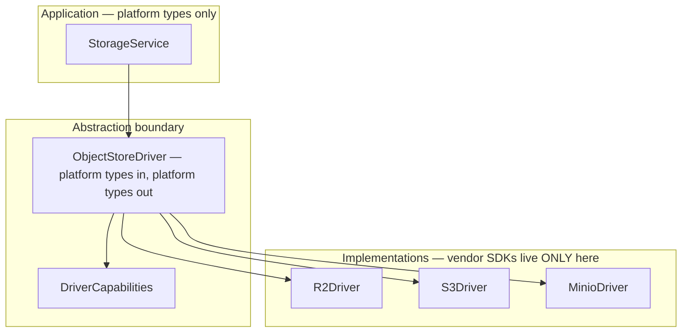
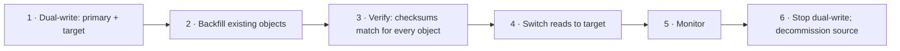

# Storage Abstraction

> **Status:** v1.0 — complete. New in Phase 10.
> **No vendor SDK type ever appears outside the driver.** Applications depend on `ObjectStoreDriver`; the driver depends on a provider. Where providers genuinely differ, capabilities are declared rather than assumed — the platform never pretends a backend can do something it cannot.

## Overview

**Business purpose.** Storage is the hardest dependency to leave once it is entrenched: terabytes of data, millions of references, and vendor-specific code in every service. Egress fees, regional requirements, or a pricing change can each make migration necessary, and the cost of that migration is decided years earlier by whether the abstraction exists.

**Technical purpose.** Define `ObjectStoreDriver`, the platform-owned types crossing it, the capability model handling real provider differences, and the testing strategy that keeps drivers honest.

**Cloudflare R2 is primary** (ADR-016) for zero egress fees — decisive for a media platform behind a CDN. AWS S3 is the alternate. MinIO backs local development and CI, so tests exercise real S3 protocol semantics rather than a mock.

## Responsibilities

- The `ObjectStoreDriver` contract.
- Platform-owned types at the boundary.
- Capability declaration and negotiation.
- Provider-specific behaviour containment.
- Error normalization.
- Driver conformance testing.
- Provider migration.

## Non-responsibilities

| Not owned | Owner |
|---|---|
| Key construction | `object-storage.md` |
| Lifecycle state | `blob-lifecycle.md` |
| Transform algorithms | `media-processing.md` |
| CDN configuration | `cdn.md` |
| Credentials | `16-security/secrets-management.md` |
| Encryption keys | `16-security/encryption.md` |
| **Any business rule** | The owning domain component |

## The rule



**A vendor SDK type crossing the boundary is a lint error, not a review comment.** `PutObjectCommandOutput`, `S3ServiceException`, and `@aws-sdk/*` imports are banned outside driver packages by an enforced rule. One leaked type in a shared interface re-couples the entire codebase, and it happens by accident — an error type propagating up through a `catch`, a response object returned "temporarily".

**Errors are normalized at the boundary.** A driver never rethrows a provider exception; it maps to a platform error whose type callers can branch on. Otherwise retry logic in the Event Platform would need to understand three vendors' error taxonomies (`13-event-platform/retry-engine.md`).

```ts
type StorageError =
  | { kind: 'not-found'; objectKey: string }
  | { kind: 'already-exists'; objectKey: string }      // conditional write failed
  | { kind: 'precondition-failed'; detail: string }
  | { kind: 'access-denied'; detail: string }
  | { kind: 'rate-limited'; retryAfterMs: number | null }
  | { kind: 'transient'; detail: string }               // retryable
  | { kind: 'integrity'; expected: string; actual: string }
  | { kind: 'unsupported'; capability: string };
```

**The `transient` versus everything-else split is what the retry engine needs.** `access-denied` and `already-exists` are terminal; retrying them burns budget and hides the real problem. Classification happens in the driver, which is the only layer that knows what a given provider's error codes mean.

## The driver contract

```ts
interface ObjectStoreDriver {
  readonly capabilities: DriverCapabilities;

  put(req: PutRequest): Promise<PutResult>;
  get(key: ObjectKey, range?: ByteRange): Promise<ReadableStream>;
  head(key: ObjectKey): Promise<StoredObjectMetadata>;
  delete(key: ObjectKey): Promise<void>;
  deleteBatch(keys: ObjectKey[]): Promise<BatchDeleteResult>;
  copy(from: ObjectKey, to: ObjectKey): Promise<CopyResult>;
  list(prefix: string, cursor?: string, limit?: number): Promise<ListPage>;

  createMultipart(req: MultipartRequest): Promise<MultipartHandle>;
  presignPart(handle: MultipartHandle, partNumber: number, ttl: number): Promise<string>;
  completeMultipart(handle: MultipartHandle, parts: PartRef[]): Promise<PutResult>;
  abortMultipart(handle: MultipartHandle): Promise<void>;

  presignGet(key: ObjectKey, ttl: number, options?: PresignOptions): Promise<string>;
  presignPut(key: ObjectKey, ttl: number, constraints: UploadConstraints): Promise<string>;

  setStorageClass(key: ObjectKey, cls: StorageClass): Promise<ClassChangeResult>;
  restore(key: ObjectKey, tier: RestoreTier): Promise<RestoreHandle>;
}
```

**Sixteen methods, and no method exists that only one provider supports.** A `putWithGlacierTransition` would be an S3 method wearing an interface — capability differences are handled by declaration, not by interface bloat.

**There is no `update`.** Objects are immutable (`object-storage.md`), and the interface says so.

**`put` uses conditional write by default.** `PutRequest` carries `ifNoneMatch: true`, so writing an existing key returns `already-exists` rather than silently overwriting. Relying on application discipline to never reuse a key fails on the first retry.

## Capabilities

```ts
interface DriverCapabilities {
  readonly storageClasses: readonly StorageClass[];   // [] means no tiering
  readonly versioning: boolean;
  readonly objectLock: boolean;
  readonly conditionalWrite: boolean;
  readonly serverSideCopy: boolean;
  readonly batchDelete: { supported: boolean; maxKeys: number };
  readonly checksumAlgorithms: readonly ChecksumAlgorithm[];
  readonly minPartSizeBytes: number;
  readonly maxPartCount: number;
  readonly lifecycleRules: boolean;
  readonly presignMaxTtlSeconds: number;
}
```

| Capability | R2 | AWS S3 | MinIO |
|---|---|---|---|
| Storage classes | **None** | Standard, IA, Glacier tiers | None |
| Versioning | Yes | Yes | Yes |
| Object Lock | Yes | Yes | Yes |
| Conditional write | Yes | Yes | Yes |
| Server-side copy | Yes | Yes | Yes |
| Batch delete | Yes, 1,000 | Yes, 1,000 | Yes, 1,000 |
| Native SHA-256 checksum | Partial | Yes | Yes |
| Min part size | 5 MB | 5 MB | 5 MB |
| Lifecycle rules | Simplified | Rich | ILM |
| Max presign TTL | 7 days | 7 days | 7 days |

**Capabilities are declared and queried, never assumed from a provider name.** Code branching on `provider === 'r2'` breaks the moment R2 adds a feature or a fourth backend appears. Code branching on `capabilities.storageClasses.length > 0` stays correct.

**Missing capabilities degrade explicitly, never silently.** Archival on R2 returns `{ outcome: 'no-op', reason: 'driver-lacks-storage-classes' }` — recorded, surfaced in metrics, and visible in the lifecycle record (`blob-lifecycle.md`). Silently succeeding would let an operator believe cold-tier savings were being realised when nothing moved.

**Native checksum support varies, so the platform always computes SHA-256 itself** (`object-storage.md`). Depending on provider-computed digests would make integrity guarantees vary by backend — the one property that must not.

## Provider event notifications — deliberately unused

**S3, R2, and MinIO all offer bucket event notifications. The platform uses none of them.**

| Reason | Detail |
|---|---|
| **Bypasses the outbox** | A provider notification is not in the metadata transaction; an object could be announced without its `media_assets` row, or vice versa (ADR-020) |
| **No tenant context validation** | Provider events carry a key, not a validated `TenantContext` (`16-security/tenant-isolation.md`) |
| **Different delivery semantics** | Ordering, retry, and DLQ behaviour would differ per provider |
| **Couples to the provider** | The abstraction's purpose is defeated if events arrive vendor-shaped |

**Every storage event is published through the transactional outbox** in the same transaction as the metadata write (`13-event-platform/transactional-outbox.md`). This is the single most important consistency decision in the Storage Platform: the object's recorded state and its notification cannot diverge, because they commit together.

**The cost is that a direct-to-bucket write would produce no event.** That is acceptable because there is no such path — all writes are mediated, and the driver is not reachable outside `StorageService`.

## Platform-owned types

```ts
type ObjectKey = string & { readonly __brand: 'ObjectKey' };

interface PutRequest {
  readonly key: ObjectKey;
  readonly body: ReadableStream;
  readonly contentType: string;
  readonly contentLength: number;
  readonly sha256: string;
  readonly ifNoneMatch: boolean;
  readonly systemMetadata: Readonly<Record<string, string>>;
  readonly encryption: { kmsKeyId: string };
}

interface StoredObjectMetadata {
  readonly sizeBytes: number;
  readonly contentType: string;
  readonly etag: string;
  readonly sha256: string | null;
  readonly storageClass: StorageClass | null;
  readonly lastModified: Date;
}
```

**`ObjectKey` is a branded type**, so an arbitrary string cannot be passed where a key is expected. Key construction is centralized and validated (`object-storage.md`); the brand makes bypassing that a compile error rather than a review catch.

**`systemMetadata` is `Readonly` and small.** Mutable metadata lives in PostgreSQL because changing object metadata requires rewriting the object (`object-storage.md`).

**`encryption.kmsKeyId` is required on every write.** An unencrypted object is not constructible — the field has no default and no nullable variant (`16-security/encryption.md`).

## Configuration and credentials

```ts
interface DriverConfig {
  readonly provider: 'r2' | 's3' | 'minio';
  readonly endpoint: string;
  readonly region: string;
  readonly buckets: Readonly<Record<BucketRole, string>>;
  readonly kmsKeyId: string;
  // NO credentials — resolved from the secret store at runtime
}
```

**Credentials are never in configuration.** The driver resolves them from the secret store per its workload identity, and refreshes on rotation without a redeploy (`16-security/secrets-management.md`). A config object carrying an access key would be logged, serialized into diagnostics, and eventually committed.

**Bucket names are configuration, not constants**, so environments use distinct buckets and a misconfigured staging deployment cannot write to production storage.

## Conformance testing

**One test suite runs against every driver.**

| Property | Asserted |
|---|---|
| Round trip | Bytes written are bytes read, for empty, small, and multipart sizes |
| Immutability | Conditional write to an existing key returns `already-exists` |
| Integrity | Corrupted stream fails; checksum mismatch surfaces as `integrity` |
| Range reads | Partial reads return the correct bytes |
| Multipart | Complete, abort, and resume behave identically |
| Listing | Prefix, pagination, and cursor stability |
| Errors | Each provider error maps to the correct `StorageError` kind |
| Presign | URLs work, expire, and honour upload constraints |
| **Capabilities** | Every declared capability actually works; undeclared ones return `unsupported` |

**Tests run against real MinIO in CI, never a mock.** A mocked object store asserts the test author's model of S3, not S3's actual behaviour — and the discrepancies that matter (conditional write semantics, multipart minimums, listing consistency) are exactly the ones a mock gets wrong.

**The capability test is the one that prevents dishonest declarations.** A driver claiming `objectLock: true` must demonstrate it; a driver declaring `storageClasses: []` must return `unsupported` rather than silently succeeding. Without it, a capability flag is an assertion nobody checks.

**R2 and S3 drivers are additionally exercised against real endpoints** in a scheduled integration run, because provider behaviour drifts and MinIO's compatibility is close but not complete.

## Provider migration



**Migration is possible because keys are provider-independent and references are opaque ids.** No stored reference contains a bucket, an endpoint, or a provider — so switching backends changes configuration, not data (`object-storage.md`).

**Verification compares SHA-256 for every object**, not a sample. A migration that silently dropped or corrupted objects would surface months later as unrenderable media with no way to determine what was lost.

**Reads switch before writes stop**, so a rollback is a configuration change rather than a second migration.

## Business rules

1. **No vendor SDK type crosses the driver boundary**, enforced by lint.
2. **Errors are normalized** to `StorageError` at the boundary.
3. **Capabilities are declared and queried**, never inferred from a provider name.
4. **Missing capabilities degrade explicitly** with a recorded reason.
5. **No interface method exists that only one provider supports.**
6. **There is no `update`** — objects are immutable.
7. **`put` is conditional by default.**
8. **SHA-256 is always computed by the platform**, never delegated.
9. **Provider bucket notifications are never used**; events go through the outbox.
10. **`ObjectKey` is branded**; arbitrary strings cannot be keys.
11. **Credentials are never in configuration.**
12. **Bucket names are configuration**, distinct per environment.
13. **One conformance suite runs against every driver**, against real MinIO.
14. **Declared capabilities are tested**, not asserted.
15. **Encryption key id is required on every write.**

## Interfaces

The driver contract above is the boundary. `StorageService` composes it into the public API (`storage-apis.md`):

```ts
interface DriverRegistry {
  active(): ObjectStoreDriver;
  forBucket(role: BucketRole): ObjectStoreDriver;
  capabilities(): DriverCapabilities;
  requireCapability(name: keyof DriverCapabilities): void;   // throws at startup
}
```

**`requireCapability` is called at startup, not at use.** A deployment configured with a driver lacking Object Lock while backups require it fails to boot with a named capability — rather than failing at the first backup, weeks later, when it matters.

## Database impact

**No new tables and no schema change.** The driver is stateless; object metadata lives in `media_assets` (`03-database/tables.md`).

**No stored data references a provider.** `media_assets.object_key` holds the provider-independent key; endpoint and bucket are resolved from configuration at access time — which is what makes migration a configuration change.

## Security

- **Credentials resolve from the secret store** per workload identity and refresh on rotation (`16-security/secrets-management.md`).
- **Every write specifies a KMS key**; unencrypted writes are not constructible (`16-security/encryption.md`).
- Presigned URLs are bearer credentials — TTL-bounded, single-object, **never logged** (`16-security/tenant-isolation.md`).
- `presignPut` carries **content-type and size constraints** enforced by the provider, so a presigned upload slot cannot be used to store something else.
- Drivers hold no tenant context and make no access decisions; authorization happens above them (`16-security/authorization.md`).
- Driver errors are normalized before propagation, so **provider internals never reach a response** (`16-security/api-security.md`).

## Performance

| Operation | Target |
|---|---|
| `presignGet` / `presignPut` | **p95 < 5 ms** — local signature, no provider call |
| `head` | p95 < 40 ms — avoided on hot paths via `media_assets` |
| `put` (small object) | p95 < 150 ms |
| `deleteBatch` (1,000) | p95 < 500 ms |
| `list` page | p95 < 100 ms |
| Connection reuse | Keep-alive pool per driver |

**Presigning is local computation.** Nothing contacts the provider, which is why it can sit on the render path for every media reference without adding latency.

**Batch delete is used wherever more than one key is removed.** Deleting 1,000 objects individually is 1,000 round trips; batched, it is one — the difference between a purge sweep that keeps up and one that falls behind (`retention.md`).

## Observability

- **Metrics:** `driver_operations_total{provider,operation,outcome}`, `driver_operation_duration_seconds{provider,operation}`, `driver_errors_total{provider,kind}`, `driver_rate_limited_total{provider}`, `capability_degradations_total{capability}`, `conformance_test_failures_total{provider}`.
- **Logging:** provider, operation, key **hash** (never the key), duration, outcome — never credentials or presigned URLs.
- **Alerts:** `driver_errors_total{kind="access-denied"}` non-zero (**page** — credentials rotated without propagation, or a policy change); `driver_rate_limited_total` sustained (provider throttling — uploads will fail); `capability_degradations_total` rising unexpectedly (a driver silently lost a capability); conformance failure in CI (**page** — a driver no longer honours the contract); operation latency p99 divergence between providers during a migration.

**`access-denied` pages because it is never transient.** It means credentials, policy, or bucket configuration changed, and every storage operation is failing until someone acts.

## Cross references

- `object-storage.md` — keys, immutability, checksums, multipart
- `blob-lifecycle.md` — archival degradation on driverless-tier providers
- `media-processing.md` — derived objects written through the same driver
- `cdn.md` — delivery configuration per provider
- `backups.md` — Object Lock capability requirement
- `storage-apis.md` — the frozen public interface composing this driver
- `16-security/secrets-management.md` — credential resolution and rotation
- `16-security/encryption.md` — KMS key on every write
- `16-security/api-security.md` — provider internals never in responses
- `13-event-platform/transactional-outbox.md` — why bucket notifications are unused
- `13-event-platform/retry-engine.md` — the transient/terminal classification drivers produce
- `01-system-architecture/13-adr-log.md` — ADR-016, ADR-020
