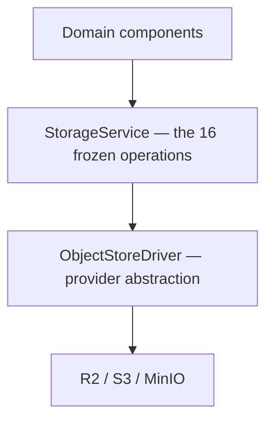

# Storage APIs

> **Status:** v1.0 — complete. New in Phase 10. **Canonical interface registry.**
> **This document is the frozen contract.** Where it disagrees with any other Storage Platform document, this one wins. It closes ten drift items found by extracting all 41 declared interfaces rather than assuming they agreed.

## Overview

**Purpose.** Phase 10 declared 41 interfaces and types across ten documents, written in sequence. Written that way, signatures drift: a type gets declared twice with different variants, a parameter loses its unit, `readonly` appears on some fields and not others. This document extracts them, resolves the conflicts, and freezes the sixteen public operations.

**Scope of authority.** This is a **drift resolution, not a redesign.** No architectural decision changes. Where two documents specified incompatible shapes for the same concept, one is chosen and the divergence is recorded below.

## The three layers



| Layer | Identifier | Audience |
|---|---|---|
| **`StorageService`** | `objectId` (opaque UUIDv7) | Domain components |
| **`ObjectStoreDriver`** | `ObjectKey` (branded) | Storage Platform internals only |
| Provider | Vendor keys | Driver implementations only |

**The identifier changes at each boundary deliberately.** Domain components never see a key; the driver never sees an `objectId`. `StorageService` is the only component that holds the mapping, which is what keeps internal paths unexposed (`object-storage.md`) and makes provider migration a configuration change (`storage-abstraction.md`).

## Shared types — frozen

```ts
type ObjectId = string & { readonly __brand: 'ObjectId' };      // public, UUIDv7
type ObjectKey = string & { readonly __brand: 'ObjectKey' };    // internal, driver-only
type TransformId = string & { readonly __brand: 'TransformId' };

interface ObjectRef {
  readonly objectId: ObjectId;
  readonly sizeBytes: number;
  readonly contentType: string;
  readonly sha256: string;
  readonly state: ObjectState;
  readonly createdAt: Date;
  // NO key. NO bucket. NO provider identifier.
}

interface ObjectMetadata {
  readonly ref: ObjectRef;
  readonly system: SystemMetadata;      // immutable — intrinsic to the bytes
  readonly mutable: MutableMetadata;    // evolvable — lives in PostgreSQL
  readonly transforms: readonly TransformRef[];
  readonly referenceCount: number;
}

interface SystemMetadata {
  readonly sha256: string;
  readonly sizeBytes: number;
  readonly contentType: string;
  readonly createdAt: Date;
  readonly storageClass: StorageClass | null;
}

interface MutableMetadata {
  readonly tags: Readonly<Record<string, string>>;
  readonly label: string | null;
  readonly ownerResource: ResourceRef | null;
}
```

**`ObjectId` is now branded, matching `ObjectKey`.** Previously it was a bare `string` in 22 declarations, which allowed a key and an id to be passed interchangeably at a boundary where confusing them exposes internal paths.

**`SystemMetadata` and `MutableMetadata` are separate types**, which is what makes `updateMetadata` safe (see below): the immutable half is not present in the update input, so an attempt to change a checksum does not typecheck.

## The sixteen frozen operations

```ts
interface StorageService {
  // — Write —
  upload(ctx: TenantContext, req: UploadRequest): Promise<ObjectRef>;
  beginMultipart(ctx: TenantContext, req: MultipartRequest): Promise<MultipartTicket>;
  completeMultipart(ctx: TenantContext, uploadId: string, parts: readonly PartRef[]): Promise<ObjectRef>;

  // — Read —
  download(ctx: TenantContext, objectId: ObjectId, range?: ByteRange): Promise<ReadableStream>;
  presign(ctx: TenantContext, objectId: ObjectId, transformId: TransformId | null, ttlSeconds: number): Promise<SignedUrl>;
  exists(ctx: TenantContext, objectId: ObjectId): Promise<boolean>;
  getMetadata(ctx: TenantContext, objectId: ObjectId): Promise<ObjectMetadata | null>;
  list(ctx: TenantContext, query: ListQuery): Promise<Page<ObjectRef>>;

  // — Mutate metadata only —
  updateMetadata(ctx: TenantContext, objectId: ObjectId, patch: MutableMetadataPatch, tx: Transaction): Promise<ObjectMetadata>;

  // — Relocate and duplicate —
  copy(ctx: TenantContext, objectId: ObjectId, target: ResourceRef, tx: Transaction): Promise<ObjectRef>;
  move(ctx: TenantContext, objectId: ObjectId, target: ResourceRef, tx: Transaction): Promise<ObjectRef>;

  // — Lifecycle —
  delete(ctx: TenantContext, objectId: ObjectId, actor: string, tx: Transaction): Promise<DeleteOutcome>;
  archive(ctx: TenantContext, objectId: ObjectId): Promise<ArchiveOutcome>;
  restore(ctx: TenantContext, objectId: ObjectId, tier: RestoreTier): Promise<RestoreOutcome>;

  // — Retention hold —
  beginRetention(ctx: TenantContext, objectId: ObjectId, hold: RetentionHold, actor: string): Promise<void>;
  endRetention(ctx: TenantContext, objectId: ObjectId, holdId: string, actor: string, reason: string): Promise<void>;

  // — Integrity —
  verify(ctx: TenantContext, objectId: ObjectId): Promise<VerifyOutcome>;
}
```

**Every operation takes `ctx: TenantContext` first.** An operation without tenant scope does not typecheck (`16-security/tenant-isolation.md`).

**Operations that change durable state take a `Transaction`** — `updateMetadata`, `copy`, `move`, `delete`. Their metadata write and their outbox event commit together, so state and notification cannot diverge (`13-event-platform/transactional-outbox.md`). Read operations do not.

**There is no `update` for bytes.** Immutability is expressed in the interface, not documented beside it (`object-storage.md`).

## Reconciling `move`, `copy`, and `updateMetadata` with immutability

These three look like they contradict "objects are immutable." They do not, and the distinction is precise:

| Operation | Changes | Bytes | `objectId` |
|---|---|---|---|
| **`updateMetadata`** | Mutable metadata in PostgreSQL only | **Unchanged** | **Stable** |
| **`move`** | The internal key and owning resource | **Unchanged** | **Stable** |
| **`copy`** | Creates a second object | Duplicated | **New** |

**Objects are immutable; keys are not.** `move` re-keys an object when its owning resource changes — an upload attached to a different article — using server-side copy plus deletion of the old key. The bytes and the `objectId` are untouched, so every stored reference remains valid. This is exactly why references use `objectId` rather than keys.

**`updateMetadata` accepts only `MutableMetadataPatch`**, which cannot express a change to a checksum, size, or content type. "Metadata may evolve" (`object-storage.md`) is enforced by the type rather than by the caller remembering which half is which.

**`copy` produces a new `objectId` with reference count zero.** It is not an alias — the copy has an independent lifecycle, and purging the source does not affect it.

## Result types — uniform discriminators

```ts
type DeleteOutcome =
  | { outcome: 'soft-deleted'; purgeEligibleAt: Date }
  | { outcome: 'already-deleted' }                       // idempotent — NOT an error
  | { outcome: 'retained'; blockers: readonly PurgeBlocker[] };

type ArchiveOutcome =
  | { outcome: 'archived'; storageClass: StorageClass }
  | { outcome: 'already-archived' }
  | { outcome: 'no-op'; reason: 'driver-lacks-storage-classes' };

type RestoreOutcome =
  | { outcome: 'restored' }
  | { outcome: 'in-progress'; estimatedReadyAt: Date }
  | { outcome: 'not-archived' };

type VerifyOutcome =
  | { outcome: 'valid'; sha256: string; verifiedAt: Date }
  | { outcome: 'mismatch'; expected: string; actual: string }   // INVARIANT BREACH
  | { outcome: 'unreadable'; reason: string };

type PurgeBlocker =
  | { kind: 'grace-period'; eligibleAt: Date }
  | { kind: 'references'; count: number; holders: readonly ReferenceHolder[] }
  | { kind: 'legal-hold'; holdIds: readonly string[] }
  | { kind: 'quarantined' };
```

**Every result type discriminates on `outcome`**, and every blocker or error variant discriminates on `kind`. Mixed discriminators across a codebase produce `switch` statements that silently fall through when a developer assumes the wrong field name.

**`already-deleted` and `already-archived` are success outcomes, not errors.** Storage operations are driven by at-least-once events, so a redelivered delete finds the object already gone. Treating that as a failure would dead-letter routine redeliveries (`13-event-platform/idempotency.md`, `retention.md`).

**`ArchiveOutcome.no-op` is how capability degradation surfaces.** R2 has no cold tier, so `archive` records the intent and reports `no-op` with the reason rather than pretending a transition occurred (`storage-abstraction.md`, `blob-lifecycle.md`).

**`VerifyOutcome.mismatch` is an invariant breach**, not an ordinary result — it routes to `recordIntegrityBreach` and pages (`storage-observability.md`).

## Streaming and async semantics

| Operation | Returns | Notes |
|---|---|---|
| `download` | `ReadableStream` | **Never a buffer.** Objects are never fully materialized |
| `upload` | `ObjectRef` | Body is a stream; checksum computed during transfer |
| `list` | `Page<ObjectRef>` | Cursor-based; **never offset** |
| `restore` | `RestoreOutcome` | May be `in-progress` — archival restore is asynchronous |
| `presign` | `SignedUrl` | Local HMAC; no provider call |
| All others | Resolved values | Synchronous completion |

**Every method is `Promise`-returning**, including `exists`, which requires a database read. A synchronous-looking method that performs I/O invites use inside loops.

**`list` is cursor-based, never offset-based.** Offset pagination degrades quadratically and produces duplicates or gaps when the underlying set changes mid-iteration — at 10⁸ objects that is not a tuning concern but a correctness one.

**Bytes never transit the API on the hot path.** `download` exists for internal processing; clients receive presigned URLs and fetch directly (`object-storage.md`).

## Error model

**All operations reject with `StorageError`, normalized at the driver boundary** (`storage-abstraction.md`). No provider exception propagates.

```ts
type StorageError =
  | { kind: 'not-found'; objectId: ObjectId }
  | { kind: 'already-exists'; objectId: ObjectId }
  | { kind: 'precondition-failed'; detail: string }
  | { kind: 'access-denied'; detail: string }
  | { kind: 'rate-limited'; retryAfterMs: number | null }
  | { kind: 'transient'; detail: string }
  | { kind: 'integrity'; expected: string; actual: string }
  | { kind: 'unsupported'; capability: string };
```

**`StorageError` now carries `objectId`, not `objectKey`.** The driver-level variant carries `ObjectKey`; `StorageService` translates before the error leaves the platform, so an error message cannot leak an internal path (`16-security/api-security.md`).

**The `transient` versus everything-else split drives retry.** Only `transient` and `rate-limited` are retryable; the rest are terminal and dead-letter immediately (`13-event-platform/retry-engine.md`).

**Expected non-error outcomes are results, not exceptions.** `already-deleted`, `no-op`, and `not-archived` are returned, not thrown — reserving exceptions for genuine failures.

## Consistency review

Extracted from all ten documents. **Ten drift items found; all resolved.**

| # | Drift | Resolution |
|---|---|---|
| **D-1** | **`PurgeBlocker` declared twice** — `blob-lifecycle.md` (3 variants) and `retention.md` (4 variants, richer `references`) | `retention.md`'s version is canonical: 4 variants, `references` carries `holders`. It is a strict superset. |
| **D-2** | **TTL parameter named `ttl: number` (3×) and `ttlSeconds: number` (1×)**, with no unit in the common form | **`ttlSeconds` everywhere.** A unitless duration is how millisecond/second confusion ships — a 15-minute URL becoming 15 milliseconds or 15 days. |
| **D-3** | **`objectId: string` (22×) unbranded** while `ObjectKey` was branded | `ObjectId` is now a branded type. An id and a key were interchangeable at the boundary where confusing them exposes internal paths. |
| **D-4** | **`objectKey: string` unbranded (2×)** in `StorageError` and `PutRequest` context | Both use `ObjectKey`. The brand exists precisely so unvalidated strings cannot become keys. |
| **D-5** | **`ObjectRef` (object-storage) vs `StoredObjectMetadata` (storage-abstraction)** — overlapping object descriptions | Layered deliberately: `ObjectRef` is the public shape, `StoredObjectMetadata` is driver-internal. Now stated; previously implicit. |
| **D-6** | **`ScanVerdict` discriminates on `verdict:`** while every other result type uses `outcome:` | `ScanVerdict` retains `verdict` — it is a domain term, not a result wrapper, and `MediaProcessor` is internal. Recorded as an accepted exception rather than silently inconsistent. |
| **D-7** | **`readonly` applied inconsistently** — all fields in `ObjectRef` and `TransformSpec`, none in `PurgeEligibility.blockers` or `LifecycleCoordinator` returns | **All returned types are fully `readonly`**, arrays included. A mutable returned array invites callers to sort or splice a value the platform still owns. |
| **D-8** | **`PurgeEligibility` and `ExpiryEligibility`** use the same `{eligible, blockers}` shape with different names and different `readonly` treatment | Shape unified: both are `Eligibility<TBlocker>` with `readonly blockers`. Names retained — they gate different operations. |
| **D-9** | **Eight of sixteen mandated operations were never declared at the public layer** — `copy`, `move`, `exists`, `updateMetadata`, `beginRetention`, `endRetention`, `archive`, `verify` existed only on the driver or not at all | All sixteen declared here. `move` and `updateMetadata` required the explicit immutability reconciliation above. |
| **D-10** | **Transaction-taking operations were inconsistent** — `LifecycleCoordinator.transition` required `tx`, but `RetentionService.purge` and `CdnService.invalidate` did not | Every operation with a durable side effect takes `tx`: `updateMetadata`, `copy`, `move`, `delete`. Reads do not. |

**D-2 is the item most likely to have caused a production incident.** A presigned URL TTL passed in the wrong unit either expires instantly — breaking every media render — or lasts days, turning a 15-minute bearer credential into a durable one (`16-security/tenant-isolation.md`).

**D-9 is the largest in volume but the least risky**, since those operations were simply absent rather than contradictory.

**No behavioural drift was found.** Every conflict was in signature, naming, or type representation. No document contradicted another on immutability, tenant isolation, deletion conditions, or the event publication path.

## Business rules

1. **This document is canonical**; where it disagrees with another Phase 10 document, this one wins.
2. **`ObjectId`, `ObjectKey`, and `TransformId` are branded types.**
3. **`objectId` is the only identifier crossing the public boundary.**
4. **Every operation takes `TenantContext` first.**
5. **Every durable-side-effect operation takes a `Transaction`.**
6. **Objects are immutable; keys are not.** `move` re-keys; `objectId` is stable.
7. **`updateMetadata` accepts only mutable metadata**, enforced by type.
8. **`copy` produces a new `objectId`** with reference count zero.
9. **All result types discriminate on `outcome`**; blockers and errors on `kind`.
10. **`already-*` outcomes are successes**, supporting idempotent redelivery.
11. **Returned types are fully `readonly`**, arrays included.
12. **TTLs are always `ttlSeconds`.**
13. **`download` returns a stream**, never a buffer.
14. **`list` is cursor-based**, never offset.
15. **All errors are `StorageError`**; provider exceptions never propagate.
16. **`verify` mismatches are invariant breaches**, not ordinary results.

## Database impact

**No new tables and no schema change.** All sixteen operations act on `media_assets` as defined in Phase 3 (`03-database/tables.md`) — `tenant_id`, `kind`, `object_key`, `transforms JSONB`, `status`, plus the `reference_count` and `deleted_at` columns used by `retention.md`.

Phase 10's total database footprint is **zero schema changes.** The Storage Platform is specified entirely against the existing schema.

## Security

- **Every operation is tenant-scoped by `TenantContext`**; `media_assets` is RLS-protected (`16-security/row-level-security.md`).
- **Authorization precedes every operation** and is not performed by this layer (`16-security/authorization.md`).
- **`ObjectRef` and `SignedUrl` carry no key, bucket, or provider identifier** — path exposure is prevented by the type.
- **`StorageError` carries `objectId`, never a key**, so errors cannot leak internal paths (`16-security/api-security.md`).
- `beginRetention` and `endRetention` delegate to `16-security/compliance.md`; `endRetention` requires an actor and reason.
- `delete` requires an actor and is audited (`16-security/audit.md`).
- Presigned URLs are bearer credentials — `ttlSeconds` bounded, never logged (`16-security/tenant-isolation.md`).

## Performance

| Operation | Target |
|---|---|
| `presign` | **p95 < 10 ms** — local HMAC |
| `exists` · `getMetadata` | p95 < 15 ms — `media_assets`, no provider call |
| `upload` (small) | p95 < 200 ms including verification |
| `list` page | p95 < 100 ms — cursor, index-ordered |
| `updateMetadata` | p95 < 20 ms |
| `copy` · `move` | p95 < 300 ms — server-side, bytes never transit |
| `delete` (soft) | p95 < 100 ms including invalidation dispatch |
| `verify` | Bounded by object size — streamed rehash |

**`copy` and `move` use server-side operations**, so a 4 GB object relocates without a download and re-upload (`storage-abstraction.md`).

## Observability

Metric names are frozen in `storage-observability.md` and not restated. The invariants this interface guarantees, each paging at count one:

| Invariant | Signal |
|---|---|
| Byte integrity | `checksum_mismatches_total` |
| Metadata/object consistency | `dangling_references_total` |
| No premature deletion | `reference_count_divergences_total` |
| Deletion takes effect | `invalidation_verification_failures_total` |
| Recoverability | `verified_backup_age_seconds` |

Every operation records `correlationId`, `tenantId`, `objectId`, and `operationId` (`storage-observability.md`).

## Cross references

- `object-storage.md` — `ObjectRef`, immutability, keys, checksums
- `blob-lifecycle.md` — `ObjectState`, transitions, `delete` semantics
- `media-processing.md` — `TransformId`, `ScanVerdict`, derivations
- `storage-abstraction.md` — `ObjectKey`, `ObjectStoreDriver`, `StorageError`
- `cdn.md` — `SignedUrl`, `presign`, invalidation
- `backups.md` — `BackupService`, verification
- `disaster-recovery.md` — `RecoveryCoordinator`, gates
- `retention.md` — `PurgeBlocker` (canonical), reference counting
- `storage-observability.md` — frozen metric catalogue and identifiers
- `16-security/tenant-isolation.md` — `TenantContext`, key confidentiality
- `16-security/authorization.md` — the check preceding every operation
- `16-security/compliance.md` — retention holds
- `16-security/audit.md` — audited operations
- `13-event-platform/transactional-outbox.md` — the `tx` requirement
- `03-database/tables.md` — `media_assets`
- `01-system-architecture/13-adr-log.md` — ADR-016, ADR-018, ADR-020
