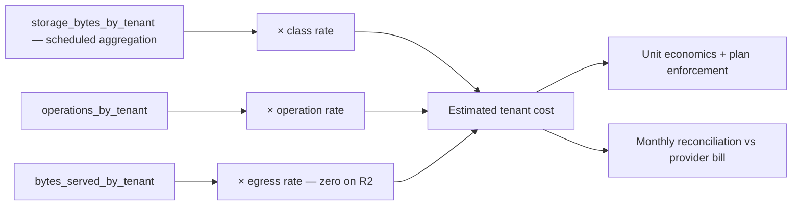

# Storage Observability

> **Status:** v1.0 — complete. New in Phase 10.
> **Storage fails quietly and expensively.** A stalled garbage collector produces no error — only a bill. A corrupted object produces no error until someone reads it. The signals here exist because the failures do not announce themselves.

## Overview

**Business purpose.** Storage is the platform's largest recurring cost and holds its least replaceable data. Growth without attribution becomes a margin problem; corruption without detection becomes data loss discovered by a customer.

**Technical purpose.** Define the storage metric catalogue, the four-identifier trace model, alert routing, and the SLIs the platform is operated against.

**The boundary.** `14-operations/monitoring.md` owns metrics infrastructure. `16-security/security-observability.md` owns security signals. **This document owns storage semantics** — what the numbers mean and which combinations indicate a problem.

## Responsibilities

- The storage metric catalogue with frozen names.
- Trace identifiers and propagation.
- Cost attribution.
- Alert classification.
- Storage SLIs and SLOs.

## Non-responsibilities

| Not owned | Owner |
|---|---|
| Metrics infrastructure | `14-operations/monitoring.md` |
| Security signals | `16-security/security-observability.md` |
| Event platform signals | `13-event-platform/observability.md` |
| Incident procedure | `16-security/incident-response.md` |
| Cost *policy* and plan limits | `04-platform/billing.md` |

## Two signal classes

| | **Invariant** | **Operational** |
|---|---|---|
| Target | **Zero** | Threshold or trend |
| Examples | Checksum mismatches, dangling references, unscoped keys | Latency, hit ratio, growth |
| Alerting | **Page at count one** | Threshold and duration |
| Meaning | Data integrity has broken | Performance or cost attention |

**Storage has fewer invariants than the Security Platform but they are absolute.** A checksum mismatch means the platform is holding bytes that are not what it recorded — there is no acceptable rate.

## Metric catalogue

Names are **frozen**. No component emits an alternate name for a catalogued concept.

### Volume and cost

| Metric | Type | Labels |
|---|---|---|
| `storage_bytes_total` | gauge | `bucket`, `class`, `storage_class` |
| `storage_objects_total` | gauge | `bucket`, `class` |
| `storage_growth_bytes_per_day` | gauge | `bucket` |
| `storage_bytes_by_tenant` | gauge | **`tenant_bucket`** — see below |
| `storage_cost_usd_estimated` | gauge | `bucket`, `component` |
| `bytes_reclaimed_total` | counter | `reason` |

**Per-tenant bytes use a bucketed label, not a tenant id.** `tenant_bucket` groups tenants by magnitude (`<1GB`, `1-10GB`, `10-100GB`, `>100GB`), keeping cardinality bounded. Exact per-tenant figures come from a scheduled database aggregation, not from time series — the same cardinality discipline applied across the tree (`13-event-platform/observability.md`).

**Cost is estimated in-platform, not read from a provider bill.** A provider bill arrives monthly; a runaway sweep or a derivation loop needs to surface in hours. The estimate is `bytes × class rate + operations × operation rate`, reconciled against the actual bill monthly, and the reconciliation gap is itself a metric — a widening gap means the model has drifted from reality.

### Transfer

| Metric | Type | Labels |
|---|---|---|
| `upload_initiated_total` | counter | `kind` |
| `upload_completed_total` | counter | `kind`, `outcome` |
| `upload_duration_seconds` | histogram | `kind`, `size_bucket` |
| `upload_failures_total` | counter | `kind`, `reason` |
| `download_duration_seconds` | histogram | `source` (`edge`/`shield`/`origin`) |
| `multipart_aborted_total` | counter | `reason` |
| `bytes_uploaded_total` · `bytes_served_total` | counter | `class` |

**Upload duration is labelled by size bucket, not raw size.** A 40 KB thumbnail and a 4 GB video have nothing to say to each other in one histogram; bucketing keeps the percentiles meaningful.

**`upload_failures_total` distinguishes reasons** — `validation`, `checksum`, `size`, `type`, `transient`, `quota`. A spike in `validation` is a broken client; a spike in `transient` is a provider problem. One aggregate number cannot tell them apart.

### Processing

| Metric | Type | Labels |
|---|---|---|
| `time_to_available_seconds` | histogram | `kind` |
| `scan_duration_seconds` | histogram | — |
| `scan_results_total` | counter | `verdict` |
| `scan_signature_age_days` | gauge | — |
| `derivations_total` | counter | `kind`, `transform`, `outcome` |
| `derivation_duration_seconds` | histogram | `kind`, `transform` |
| `transform_failures_total` | counter | `kind`, `transform`, `reason` |
| `derivation_queue_depth` | gauge | — |
| `objects_by_state` | gauge | `state` |

**`time_to_available_seconds` is the user-visible number** — upload completion to readable. It is dominated by scanning and derivation, not transfer, and it is the SLO the pipeline is tuned against (`blob-lifecycle.md`).

**`objects_by_state` is the pipeline health gauge.** A growing `scanning` or `processing` count means objects are entering and not emerging — the failure users notice first, because uploads appear to hang with no error anywhere.

### Delivery

| Metric | Type | Labels |
|---|---|---|
| `cdn_requests_total` | counter | `class`, `status`, `cache_status` |
| `cdn_cache_hit_ratio` | gauge | `class` |
| `cdn_origin_fetches_total` | counter | — |
| `cdn_edge_latency_seconds` | histogram | — |
| `signed_urls_total` | counter | `class` |
| `invalidations_total` | counter | `outcome` |
| **`invalidation_verification_failures_total`** | **invariant** | — |

### Integrity and lifecycle

| Metric | Type | Class |
|---|---|---|
| **`checksum_mismatches_total`** | counter | **invariant** |
| **`dangling_references_total`** | gauge | **invariant** |
| `orphan_candidates_total` | gauge | trend |
| `verification_sweep_objects_total` | counter | `outcome` |
| `unrecoverable_objects_total` | counter | **invariant** |
| `reference_count_divergences_total` | counter | `direction` |
| `gc_backlog` | gauge | trend |
| `purges_total` · `purge_blocked_total` | counter | `outcome` / `blocker` |
| `soft_deletes_total` · `undeletes_total` | counter | — |

**`dangling_references_total` is an invariant with a target of zero outside recovery.** A non-zero value in normal operation means the backup ordering rule or replication has broken *now*, and the next recovery would lose data (`backups.md`).

### Backup and recovery

| Metric | Type |
|---|---|
| **`verified_backup_age_seconds`** | gauge — **the primary backup metric** |
| `backup_age_seconds` | gauge |
| `backups_total{kind,outcome}` | counter |
| `restore_tests_total{outcome}` | counter |
| `restore_duration_seconds{scenario}` | histogram |
| `recovery_runs_total{scenario,outcome}` | counter |
| `replication_lag_seconds` · `wal_lag_seconds` | gauge |
| `rpo_actual_seconds` | gauge |
| `drill_overdue_days{kind}` | gauge |

**Dashboards show `verified_backup_age_seconds`, never `backup_age_seconds`.** Alerting on completion age reports green through a week of backups that restore into nothing (`backups.md`).

## Trace identifiers

**Every storage operation carries four identifiers.**

```ts
interface StorageOperationContext {
  readonly correlationId: string;   // the originating request — spans services
  readonly tenantId: string;        // span attribute and log field, NEVER a metric label
  readonly objectId: string | null; // null before an id is assigned (upload initiate)
  readonly operationId: string;     // THIS storage operation — unique per attempt
}
```

| Identifier | Scope | Answers |
|---|---|---|
| `correlationId` | The whole request chain | "What user action caused this?" |
| `tenantId` | The customer | "Who is affected?" |
| `objectId` | One object across its lifetime | "What happened to this file?" |
| `operationId` | **One attempt at one operation** | "Which retry was this?" |

**`operationId` is distinct from `correlationId` and both are needed.** A single upload produces one `correlationId` and many `operationId`s — initiate, each part, complete, scan, six derivations, each retry. Without `operationId`, a retried derivation is indistinguishable from a duplicate, and multipart part failures cannot be attributed.

**`objectId` is the lifetime pivot.** From upload through derivation, delivery, soft delete, and purge, one identifier joins every record — which is how a support question about a broken image becomes a single query rather than an archaeology exercise.

**`tenantId` is never a metric label**, following the cardinality rule applied across the platform. It appears on spans and in logs, where per-tenant analysis is performed on demand.

## Cost attribution



**Cost attribution serves two purposes and one of them is product.** Unit economics per tenant reveals which plans are unprofitable; plan enforcement needs storage consumption per workspace (`04-platform/billing.md`).

**Egress is zero on R2 and non-zero on S3** (`storage-abstraction.md`), so the model is driver-aware. A cost model assuming R2 pricing would understate an S3 deployment by the largest line item.

**Reconciliation against the actual bill runs monthly**, and the divergence is tracked. A model drifting from reality is worse than no model, because decisions get made on it.

## Alerts

### Page immediately

| Alert | Condition | Meaning |
|---|---|---|
| **Storage unavailable** | `driver_errors_total{kind="transient"}` sustained, or health probe failing | Uploads and origin fetches failing |
| **Corruption detected** | `checksum_mismatches_total` > 0 | Bytes do not match the record |
| **Metadata/object mismatch** | `dangling_references_total` > 0 outside recovery | Backup ordering or replication broken |
| **Unrecoverable loss** | `unrecoverable_objects_total` > 0 | Permanent loss requiring customer disclosure |
| **Restore failure** | `restore_tests_total{outcome="failed"}` or a recovery gate failing | Recoverability is unproven or broken |
| **Backup unverified** | `verified_backup_age_seconds` past window | The effective recovery point has degraded |
| **Invalidation unverified** | `invalidation_verification_failures_total` > 0 | Deleted content may still be served |
| **Scanner blind** | `scan_signature_age_days` > 2 | Scanning reports clean while unable to detect |
| **Access denied** | `driver_errors_total{kind="access-denied"}` > 0 | Credentials or policy broke; never transient |

### Threshold and trend

| Alert | Condition |
|---|---|
| Upload failure spike | `upload_failures_total` rate above baseline by reason |
| GC backlog | `gc_backlog` growing 24 h — storage grows despite deletion |
| CDN degradation | `cdn_cache_hit_ratio` < 90% public, or edge latency p95 above target |
| Pipeline stall | `objects_by_state{state="scanning"\|"processing"}` growing |
| Transform failures | `transform_failures_total` rate above baseline |
| Orphan growth | `orphan_candidates_total` trending up — a write path is losing metadata |
| Refcount drift | `reference_count_divergences_total` sustained |
| Replication lag | `replication_lag_seconds` above RPO |
| Cost anomaly | `storage_growth_bytes_per_day` deviating from content creation rate |
| **Silent GC** | `bytes_reclaimed_total` flat while `soft_deletes_total` rises |

**"Silent GC" catches the failure with no error at all.** Soft deletes succeed, users see content disappear, and nothing is ever reclaimed — visible only as a bill that does not fall. Every other alert fires on something happening; this one fires on something *not* happening, the same silence-detection principle used for consumer groups in `13-event-platform/observability.md`.

**Cost anomaly compares growth to content creation.** Storage growing while article and media creation is flat means something is generating objects nobody asked for — a derivation loop, a retry storm, or a sweep that stopped.

## SLIs and SLOs

| SLI | SLO |
|---|---|
| **Data integrity** | **100%** — zero checksum mismatches, zero unrecoverable loss |
| **Durability** | 11 nines (provider) + versioning + cross-region replica |
| Upload success | > 99.5% excluding client validation failures |
| **Time to available** (image) | **p95 < 60 s** |
| CDN hit ratio (public) | **> 95%** |
| Edge latency | p95 < 50 ms |
| Presign latency | p95 < 10 ms |
| Verified backup age | < 26 h |
| Restore test success | **100%** |
| RPO actual | < 5 min |
| RTO — region loss | < 8 h |

**Integrity and restore-test success are invariants, listed here so their absence from percentile treatment is explicit.** A 99.9% restore-test success rate would mean one in a thousand backups is unrestorable and nobody knows which.

**Upload success excludes client validation failures** deliberately — a user uploading a 60 MB file to a 25 MB limit is the control working, not the platform failing. Counting those would make the SLI track user behaviour instead of platform health.

## Business rules

1. **Metric names are frozen.**
2. **Invariant metrics target zero** and page at count one.
3. **`tenantId` is never a metric label**; per-tenant figures come from scheduled aggregation.
4. **All four identifiers accompany every storage operation.**
5. **`operationId` is unique per attempt**, distinct from `correlationId`.
6. **Dashboards use `verified_backup_age_seconds`**, never completion age.
7. **Cost is estimated in-platform and reconciled monthly**; divergence is tracked.
8. **The cost model is driver-aware** (egress differs by provider).
9. **Upload SLI excludes client validation failures.**
10. **Keys, presigned URLs, and payload bytes never appear** in metrics, logs, or traces.
11. **Silence alerts are mandatory** for GC and the processing pipeline.
12. **Upload failures are labelled by reason**, never aggregated.

## Interfaces

```ts
interface StorageTelemetry {
  recordOperation(ctx: StorageOperationContext, op: StorageOperationKind, outcome: OperationOutcome, durationMs: number): void;
  recordIntegrityBreach(breach: IntegrityBreach): void;
  costEstimate(period: DateRange, tenantId?: string): Promise<CostEstimate>;
}

interface IntegrityBreach {
  readonly kind: 'checksum-mismatch' | 'dangling-reference' | 'unrecoverable'
               | 'invalidation-unverified' | 'refcount-divergence';
  readonly objectId: string | null;
  readonly tenantId: string;
  readonly correlationId: string;
  readonly detail: string;      // NEVER keys, URLs, or bytes
}
```

**`recordIntegrityBreach` is separate from `recordOperation`** so an integrity failure cannot be reported as an ordinary outcome. It always pages, always logs at `error`, and never samples — the same separation used for security invariant breaches (`16-security/security-observability.md`).

**`costEstimate` accepts an optional tenant** so the same code path serves platform-wide reporting and per-tenant billing input, without a second implementation that could diverge.

## Database impact

**No new tables and no schema change.** Aggregations read `media_assets` (`03-database/tables.md`); metrics and traces export via OpenTelemetry (`14-operations/monitoring.md`).

**Per-tenant aggregation runs on a schedule against a read replica**, not per request. Computing a tenant's storage footprint on demand would scan their entire asset set on every dashboard load.

## Security

- **Object keys, presigned URLs, and bytes never appear** in metrics, logs, traces, or alerts (`16-security/tenant-isolation.md`).
- Log fields carry object ids and key **hashes**, never keys.
- Metric labels are bounded, enumerated values — never user-supplied strings and never raw tenant ids.
- Scan verdicts are recorded; **threat signatures are not** (`media-processing.md`).
- Cost and usage data is tenant-scoped and requires appropriate authorization to read.
- Integrity breaches route to security review where corruption may be deliberate (`16-security/incident-response.md`).

## Performance

| Concern | Approach |
|---|---|
| Metric recording | In-process counters; **< 0.1 ms**, no hot-path I/O |
| Cardinality | Bucketed labels; no tenant id, object id, or key |
| Per-tenant aggregation | Scheduled, on a replica |
| Cost estimation | Precomputed hourly |
| Integrity breach path | Bypasses sampling and batching |

## Observability of the observability

- `telemetry_pipeline_failures_total`, `metric_staleness_seconds{metric}` (gauge), `cost_model_divergence_ratio`.
- **A metric that stops reporting is itself an alert.** `checksum_mismatches_total` reading zero because nothing is wrong and reading zero because the emitting code was removed are indistinguishable without a liveness signal.

## Cross references

- `object-storage.md` — checksums and the integrity model
- `blob-lifecycle.md` — states behind `objects_by_state` and time-to-available
- `media-processing.md` — derivation and scan signals
- `cdn.md` — delivery and invalidation signals
- `backups.md` — verified backup age, restore tests
- `disaster-recovery.md` — RPO/RTO actuals, gate results
- `retention.md` — GC backlog, refcount divergence, orphan growth
- `storage-abstraction.md` — driver errors and the cost model's provider awareness
- `16-security/security-observability.md` — security signals and the invariant-breach pattern
- `13-event-platform/observability.md` — cardinality discipline and silence alerts
- `14-operations/monitoring.md` — metrics infrastructure
- `04-platform/billing.md` — cost policy and plan limits
