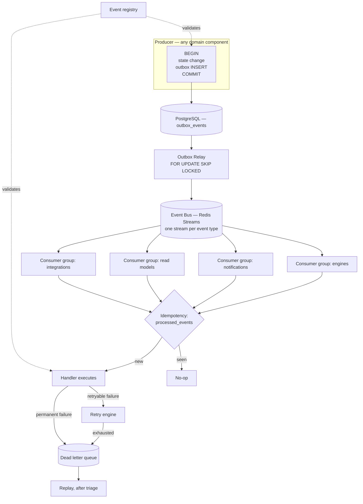

# 13 — Event Platform

The asynchronous backbone of ContentOS AI. It **transports, persists, retries, orders, and delivers** events. It never evaluates what they mean.

## Relationship to ADR-020

This phase **implements** ADR-020; it does not redesign it. The decision fixed four things, and every document here treats them as given:

| ADR-020 fixed | This folder specifies |
|---|---|
| Producers write a **transactional outbox row inside the state-changing transaction** | The table, the publisher signature, the atomicity guarantee |
| An **Outbox Relay** publishes committed rows to the bus | Dispatch mechanics, ordering, failure recovery |
| **Redis Streams** with consumer groups at v1, behind an `EventBus` interface | The abstraction, routing, topic resolution, the Kafka/NATS path |
| Consumers deduplicate by `eventId` for **exactly-once effect** | Key derivation, storage, windows, side-effect prevention |

> **ADR-020 is still `Proposed`** (OQ-22). Phases 3 through 7 are written against it and this entire folder implements it, which makes it the most load-bearing unaccepted decision in the tree. Acceptance is not a formality at this point — a change here would ripple across seven folders.

## The defining rule

**Business events belong to domain components. This platform only moves them.**

A domain component decides that `ArticlePublished` is worth emitting, what it contains, and who cares. This platform guarantees that if the transaction committed, the event will be delivered, in order per aggregate, exactly once in effect, with a full record of what happened if it could not be.

No component here parses a payload, branches on an event type's business meaning, or decides whether an event matters. `event_type` is a routing key and a registry lookup — nothing more.

## Documents

| # | Document | Owns |
|---|---|---|
| 1 | `event-bus.md` | Publish, subscribe, delivery, fan-out, routing, topic resolution |
| 2 | `transactional-outbox.md` | The outbox table, atomic writes, publisher, dispatcher, delivery guarantees, recovery |
| 3 | `event-registry.md` | Canonical registry: names, versions, producers, consumers, schemas, deprecation |
| 4 | `consumer-groups.md` | Scaling, partition ownership, leases, rebalancing, parallelism |
| 5 | `workers.md` | Background execution, scheduling, heartbeats, cancellation, graceful shutdown |
| 6 | `retry-engine.md` | Retry policy, backoff, classification, circuit-breaker integration, budgets |
| 7 | `dead-letter-queue.md` | Poison events, quarantine, inspection, replay eligibility |
| 8 | `replay.md` | Event, range, and consumer replay; snapshot coordination |
| 9 | `idempotency.md` | The canonical implementation: keys, windows, storage, side-effect prevention |
| 10 | `ordering.md` | Partition versus global ordering, causal ordering, sequence guarantees |
| 11 | `versioning.md` | Event evolution, compatibility, schema migration, deprecation |
| 12 | `observability.md` | Publish and delivery latency, lag, DLQ depth, failure taxonomy |
| 13 | `event-apis.md` | Canonical interface consolidation and the Phase 8 consistency review |

## Golden rules

| Rule | Consequence |
|---|---|
| **No business logic** | No component branches on an event type's meaning |
| **No infrastructure leaks upward** | Domain services see `EventBus`, never Redis, never a stream key |
| **Publishing requires a transaction** | The publisher's signature takes a transaction handle; there is no overload that does not |
| **Every event is registered** | An unregistered event type is rejected at publish |
| **Nothing is silently discarded** | Exhausted retries go to the DLQ with full context |
| **Replay never duplicates side effects** | Idempotency is the platform's responsibility, not each consumer's discipline |
| **Global ordering is not offered** | Per-aggregate ordering is guaranteed; global ordering is deliberately refused |
| **Permanent failures are never retried** | Classification is explicit; a poison event does not consume retry budget forever |

## Architecture

## Delivery guarantees

Stated once, binding on every document:

| Property | Guarantee | Mechanism |
|---|---|---|
| **Durability** | An event exists **if and only if** its transaction committed | Outbox in the same transaction |
| **Delivery** | At-least-once | Relay plus consumer-group acknowledgement |
| **Effect** | **Exactly-once** | Consumer-side deduplication by `eventId` |
| **Ordering** | **Per aggregate** | One stream per event type; relay preserves insertion order; consumers key on `aggregateId` |
| **Global ordering** | **Not guaranteed — deliberately** | It costs throughput and is never required here |
| **Latency** | p95 under 2 s from commit to consumer | Relay poll interval and batch size |
| **Loss** | **None.** An event can be late; it cannot be lost | Outbox rows persist until published; the bus is transport, not truth |

That last row is the platform's central claim. **Redis is transport; PostgreSQL is truth.** If the bus loses stream entries, the relay republishes from the outbox. Nothing about correctness depends on the bus being durable.

## What this platform is not

| Not owned | Owner |
|---|---|
| Any business event's meaning, payload, or consumers | The producing domain component |
| Durable workflow execution, human waits, signals | Temporal (`05-content-platform/orchestration.md`) |
| The distinction between events and signals | `01-system-architecture/10-event-flow.md` |
| Audit logging | `04-platform/audit-logs.md` — synchronous, in-transaction, not an event |
| Customer-facing webhooks | Integration events, produced here but shaped by their domain |
| Request-path idempotency | `01-system-architecture/09-request-flow.md` — a related but distinct mechanism |

**Events notify; signals advance.** A Temporal workflow is never driven by an event, because a lost message would strand a paid run indefinitely. Signals come from the gateway or from a service that owns the decision (`05-content-platform/orchestration.md` rule 5). This platform carries notifications, and only notifications.

**Audit is not an event.** An audit row is written synchronously inside the caller's transaction, because an asynchronous audit write is droppable under exactly the load conditions where it matters most (`04-platform/audit-logs.md`).

## Database ownership

Two tables from Phase 3, **not redesigned here** (`03-database/tables.md` §8):

| Table | Purpose |
|---|---|
| `outbox_events` | Append-only, one mutable column (`published_at`); no foreign keys by design |
| `processed_events` | PK `(consumer_group, event_id)` — the exactly-once-effect guarantee |

Additional tables introduced by this phase are additive and named in their owning documents. Bus state, consumer-group offsets, and lease records live in Redis.

## Cross references

- `01-system-architecture/10-event-flow.md` — ADR-020's specification; the taxonomy and envelope this folder implements
- `01-system-architecture/13-adr-log.md` — ADR-020 (Proposed), ADR-004 (Temporal), ADR-021, ADR-026
- `03-database/tables.md` §8 · `indexes.md` §8 — the outbox schema and the pending-row partial index
- `04-platform/` · `05-content-platform/` · `08-ai-platform/` · `11-knowledge-platform/` — every producer and consumer
- `12-storage-platform/redis.md` — bus and lease state
- `14-operations/monitoring.md` — where these signals land
- `16-security/` — payload restrictions and tenant context in consumers
- `99-open-questions.md` — OQ-22 (ADR-020 acceptance)
