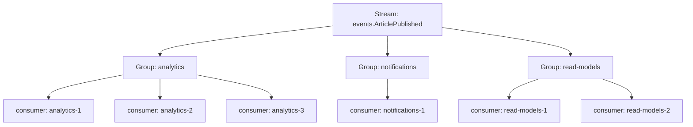
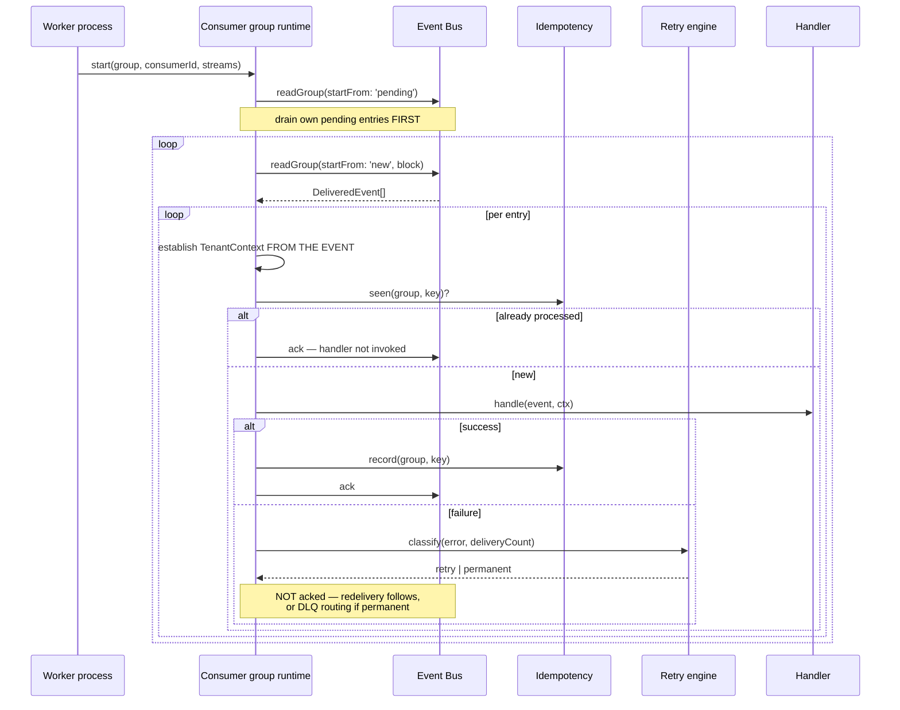
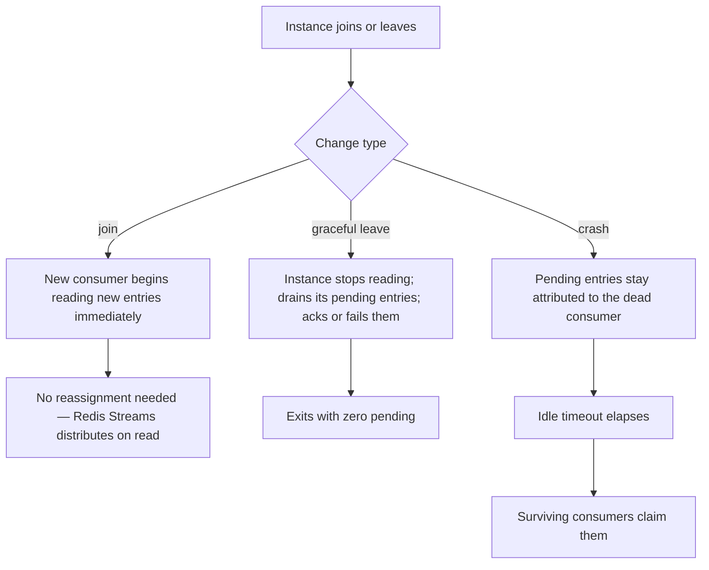

# Consumer Groups

> **Status:** v1.0 — complete. New in Phase 8.
> **It owns delivery distribution.** It never owns retries — a failed handler is `retry-engine.md`'s concern, and this component only knows that an entry was not acknowledged.

## Overview

**Business purpose.** Fan-out is what makes the platform extensible: analytics, notifications, read models, and integrations each react to `ArticlePublished` without the Publishing Engine knowing any of them exist. Consumer groups are the mechanism, and their isolation property is what makes it safe — a read-model projector falling an hour behind must not delay a customer's notification that their article went live.

**Technical purpose.** Distribute delivery across instances within a group, maintain ownership of in-flight entries, rebalance when instances join or leave, scale parallelism against lag, and re-establish tenant context on every delivery.

**Design posture — a group is a unit of isolation.** Its lag, failures, restarts, and backlog are its own. Nothing a group does can affect another group, and that guarantee is what lets a new subscriber be added without risk assessment.

## Responsibilities

- Group registration and membership.
- Partition ownership within a group.
- Lease management for in-flight entries.
- Rebalancing on instance join, leave, or failure.
- Parallelism and scaling against lag.
- Tenant-context re-establishment on every delivery.
- Lag measurement and reporting.

## Non-responsibilities

| Not owned | Owner |
|---|---|
| **Retry policy, backoff, classification** | `retry-engine.md` |
| Duplicate suppression | `idempotency.md` |
| Poison-event quarantine | `dead-letter-queue.md` |
| Transport, streams, acknowledgement mechanics | `event-bus.md` |
| Handler business logic | The consuming domain component |
| Process lifecycle, heartbeats, shutdown | `workers.md` |
| Ordering guarantees | `ordering.md` |

**The retry boundary is worth stating precisely.** This component delivers an entry and observes whether it was acknowledged. If it was not, the entry remains pending and becomes eligible for redelivery — that is all this component knows. *Whether* to retry, *when*, and *whether the failure is permanent* are decided by the retry engine before acknowledgement is withheld. Merging them would put failure classification in a component whose job is distribution.

## Group model



| Level | Property |
|---|---|
| **Stream** | One per event type; every group sees every event on it |
| **Group** | An independent subscription with its own position, lag, and failure domain |
| **Consumer** | One instance within a group; entries are distributed across instances |

**Within a group, each entry goes to exactly one consumer.** Across groups, every entry goes to every group. That distinction is the whole mechanism: scaling a group adds throughput, adding a group adds a subscriber.

**Groups are registry-declared** (`event-registry.md`). A consumer starting with an undeclared group fails at boot rather than silently creating a subscription nobody knows about.

## Consumer identity

```ts
interface ConsumerIdentity {
  group: string;                 // from the registry
  consumerId: string;            // STABLE across restarts of this instance
  instanceRef: string;           // pod or process identity
}
```

**`consumerId` must be stable across restarts.** Redis Streams attributes pending entries to a consumer name; a restarting instance with a new name orphans its own pending entries, which then wait for the idle timeout before another instance can claim them. A stable identity lets the instance reclaim its own work immediately.

Stability comes from the deployment identity — an ordinal in a stateful set, or a persisted identity file for a plain deployment — not from a random value generated at boot.

## The delivery loop



**Draining own pending entries before reading new ones** is the crash-recovery path. An instance that died mid-batch left entries attributed to it; reading `'new'` first would leave them idle until another instance claimed them after the timeout.

**Tenant context is established from the event, never inherited.** This is the single most important line in the loop.

## Tenant context — the isolation rule

```ts
// The only correct shape
async function deliver(entry: DeliveredEvent) {
  const ctx = TenantContext.fromEvent(entry.event);   // tenantId, organizationId, correlationId
  await withTenantContext(ctx, async () => {
    await handler.handle(entry.event, ctx);
  });
}
```

**A consumer runs outside any request.** There is no ambient tenant context, no session, no gateway-resolved identity — only what the envelope carries. A handler that read tenancy from anything else would either fail or, far worse, process one tenant's event under another tenant's context, producing a **cross-tenant write**.

Three properties enforce it:

| Property | Mechanism |
|---|---|
| Context comes from the envelope | `TenantContext.fromEvent` is the only constructor available in a consumer |
| The database session variable is set per delivery | Same mechanism as the request path, so RLS applies identically |
| Workers use the **RLS-enforced application role** | Background work cannot bypass tenant isolation (`01-system-architecture/07-c4-container.md`) |

**Workers using the same restricted role as the request path is deliberate and easy to get wrong.** A background process granted broader access "because it processes all tenants" is how cross-tenant leaks happen in systems that otherwise enforce isolation correctly. The relay is the one documented exception, and it does nothing but move rows (`transactional-outbox.md`).

## Leases and in-flight ownership

```mermaid
stateDiagram-v2
    [*] --> Delivered: read by consumer X
    Delivered --> Pending: entry attributed to X, lease starts
    Pending --> Acked: X acknowledges
    Pending --> Claimable: idle beyond timeout
    Claimable --> Pending: another consumer claims; deliveryCount increments
    Claimable --> DLQ: deliveryCount above threshold
    Acked --> [*]
```



| Property | Value | Reasoning |
|---|---|---|
| Lease duration | Per group, longer than the slowest expected handler | A legitimately slow handler must not be raced |
| Idle timeout before claim | Lease duration plus margin | Avoids claiming work still in progress |
| Claim behaviour | Increments `deliveryCount` | The redelivery signal |
| Claim threshold to DLQ | Per group | An entry claimed repeatedly and never acknowledged is poison |

**The lease is implicit in the pending-entry list**, not a separate lock. Redis Streams tracks which consumer holds which entry and for how long; the platform reads that rather than maintaining a parallel lease table, which would need its own consistency guarantees.

**Long-running handlers need a lease longer than their work.** A handler that legitimately takes four minutes with a two-minute lease is claimed mid-flight by a peer, and both process the same event — safe because of idempotency, but wasteful and confusing. Groups whose handlers are slow declare a longer lease; groups that are fast keep it short so genuine failures recover quickly.

## Rebalancing



**Rebalancing is largely implicit.** Redis Streams distributes entries to whichever consumer reads next, so scaling out requires no partition reassignment and no coordination protocol — a new instance simply starts reading. That is a significant operational simplification over partition-assignment models, and it is one reason Redis Streams suits v1.

**Graceful shutdown drains pending entries before exiting** (`workers.md`). An instance that exits with pending entries forces the cluster to wait out the idle timeout before recovering them, turning a clean deploy into a latency spike.

**Crash recovery costs one idle timeout.** That is the price of not maintaining an external lease table, and it is why the timeout is tuned per group rather than set globally — a group with a one-second handler recovers in seconds, and one with a four-minute handler does not need to.

## Scaling and parallelism

| Signal | Action |
|---|---|
| `bus_consumer_lag_seconds` above target | Scale out the group |
| Lag near zero and instances idle | Scale in — slowly |
| Pending entries high, lag low | Handlers are slow; investigate rather than scale |
| Lag rising with instances saturated | A downstream dependency is the constraint |

**Scaling is per group.** A read-model projector falling behind is scaled independently of the notification group on the same stream, which is the operational payoff of group isolation.

**Scale-in is slower than scale-out**, for the same reason it is in the platform's worker fleets: terminating a consumer mid-handler forces a lease timeout and redelivery, and while idempotency makes that safe, it wastes work and adds latency (`14-operations/scaling-strategy.md`).

**Parallelism within a group is bounded by ordering requirements.** A group consuming an event type where `orderingRequired` is true must not process two events for the same aggregate concurrently. The mechanism — aggregate-keyed serialization within a group — is specified in `ordering.md`; this component enforces the concurrency bound the registry declares.

## Group configuration

```ts
interface ConsumerGroupConfig {
  group: string;
  streams: string[];              // resolved from the registry
  concurrency: number;            // handlers in flight per instance
  batchSize: number;
  leaseDurationMs: number;
  idleClaimTimeoutMs: number;
  maxDeliveryCount: number;       // beyond this → DLQ
  orderingMode: 'unordered' | 'per_aggregate';
  startPosition: 'new' | 'earliest';   // for a newly-registered group
}
```

**`startPosition` matters when a group is first registered.** `'new'` begins at the stream head — correct for a notification consumer, which should not fire alerts for last week's events. `'earliest'` backfills — correct for a read-model projector, which must process history to be complete. Choosing wrongly produces either a projection with a hole or a flood of retroactive notifications, and the choice is registry-declared rather than left to a deploy-time flag.

## Business rules

1. **Groups are registry-declared**; an undeclared group fails at startup.
2. **Tenant context is established from the event**, never inherited or assumed.
3. **Consumers use the RLS-enforced application role** — background work never bypasses isolation.
4. **`consumerId` is stable across restarts.**
5. **Own pending entries are drained before new entries are read.**
6. **This component never decides retry policy**; it observes acknowledgement.
7. **Acknowledgement follows the idempotency record**, never precedes it.
8. **Entries exceeding `maxDeliveryCount` are routed to the DLQ**, not redelivered indefinitely.
9. **Group isolation is absolute** — one group's lag, failure, or backlog affects no other.
10. **Ordering-required groups serialize per aggregate** (`ordering.md`).
11. **Graceful shutdown drains pending entries.**
12. **No component here inspects a payload's business meaning.**

**Idempotency:** delivery is at-least-once; the effect is exactly-once through the idempotency check. **Concurrency:** bounded by group configuration and by ordering mode.

## Interfaces

```ts
interface ConsumerGroupRuntime {
  start(config: ConsumerGroupConfig, handler: EventHandler): Promise<void>;
  stop(graceful: boolean): Promise<void>;
  status(): Promise<GroupStatus>;
}

interface EventHandler {
  eventType: string;
  version: number;
  handle(event: DomainEvent<unknown>, ctx: TenantContext): Promise<void>;
}

interface GroupStatus {
  group: string;
  consumerId: string;
  pendingCount: number;
  lagSeconds: number;
  processedTotal: number;
  lastProcessedAt: string;
}
```

**`handle` receives `TenantContext` explicitly.** It is not available ambiently in a consumer, which makes the isolation requirement visible in the handler's own signature rather than being a runtime property a handler author must remember.

## Database impact

**This component owns no PostgreSQL tables.** Group state, pending-entry lists, and consumer attribution live in Redis, managed by Redis Streams (`12-storage-platform/redis.md`).

It reads `processed_events` through `idempotency.md` and writes nothing else. **No schema redesign.**

Group configuration is registry reference data (`event-registry.md`).

## Security

- **Tenant context from the envelope is the isolation control.** A consumer processing under the wrong tenant is a cross-tenant write, and the mechanism that prevents it is that no other source of tenancy is available inside a consumer.
- **Consumers use the same restricted database role as the request path**, so RLS applies identically to background work.
- Group configuration is registry-controlled and deployed, not runtime-editable — a group cannot be pointed at a different stream without review.
- Consumer instances hold no credentials beyond their database and Redis connections.
- Event payloads carry no content, so a compromised consumer gains no direct access to customer data beyond what its own database role permits.
- Reference `16-security/`; this component defines no controls of its own.

## Performance

| Concern | Approach |
|---|---|
| Read | Long-poll with block, so idle consumers do not spin |
| Batch size | Per group; larger batches raise throughput and coarsen failure granularity |
| Concurrency | Per instance, bounded by ordering mode |
| Lag | The primary scaling signal, per group |
| Claim overhead | Only on crash recovery, bounded by the idle timeout |
| Context setup | One session-variable set per delivery — negligible, and non-negotiable |

**Batch size and failure granularity trade off directly.** A batch of 100 that fails at entry 60 leaves 40 unprocessed but pending, which is safe; a batch of 1000 makes the redelivery set correspondingly larger. Groups with expensive handlers use small batches.

## Observability

- **Metrics:** `consumer_group_lag_seconds{group,event_type}` (the headline scaling signal), `consumer_group_pending{group}`, `consumer_group_processed_total{group,outcome}`, `consumer_group_instances{group}` (gauge), `consumer_claims_total{group}`, `consumer_delivery_count` (histogram), `handler_duration_seconds{group,event_type}`, `consumer_rebalance_total{group}`.
- **Tracing:** delivery **starts a new trace linked to the producing trace by `correlationId`** — a consumer's work is causally related to the producer's but is not part of the same synchronous operation. Nesting would produce traces that never close, since a producer's span ends at commit.
- **Logging:** group, consumer id, event type, event id, tenant id, delivery count, outcome, correlation id — never payloads.
- **Business KPIs:** per-group lag distribution, and consumer utilization — a group consistently idle is over-provisioned, and one consistently saturated is the next scaling action.
- **Alerts:** `consumer_group_lag_seconds` above the group's target (**page for `critical` groups**, investigate otherwise); `consumer_claims_total` rising (instances crashing mid-handler); delivery-count histogram shifting right (handlers failing before acknowledgement); zero instances for a registered group (**page** — a subscription silently stopped).

**Zero instances for a registered group is the alert most worth having.** A consumer that fails to deploy produces no errors anywhere — events simply accumulate unconsumed, and the capability it powers silently stops working.

## Cross references

- `event-bus.md` — the transport and acknowledgement mechanics
- `event-registry.md` — group declaration, ordering requirement, criticality
- `retry-engine.md` — the boundary: this component observes acknowledgement, that one decides retry
- `idempotency.md` — the check that precedes acknowledgement
- `dead-letter-queue.md` — where entries exceeding delivery count go
- `ordering.md` — the aggregate-serialization requirement this component enforces
- `workers.md` — the process lifecycle hosting these runtimes
- `01-system-architecture/07-c4-container.md` — workers use the RLS-enforced role
- `14-operations/scaling-strategy.md` — lag-driven scaling and slow scale-in
- `12-storage-platform/redis.md` — group state and pending-entry lists
