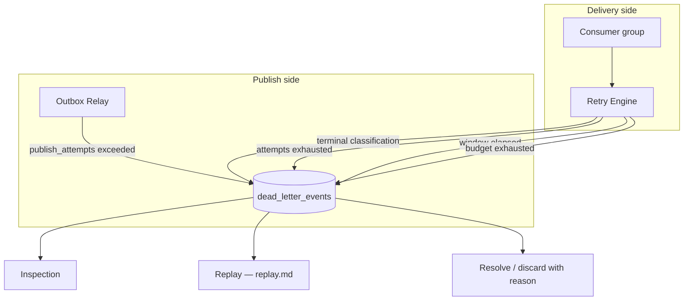
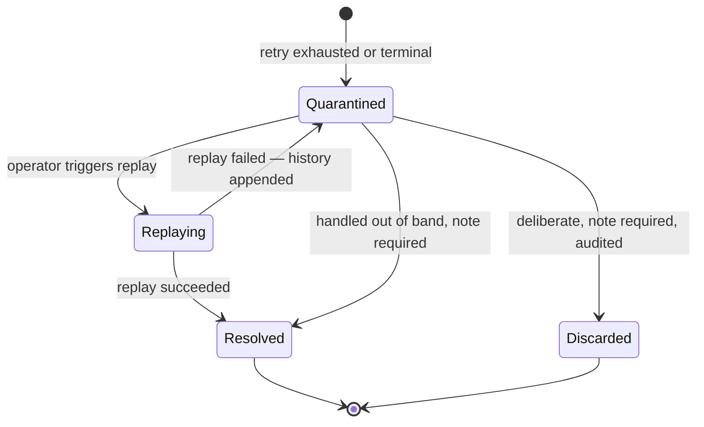
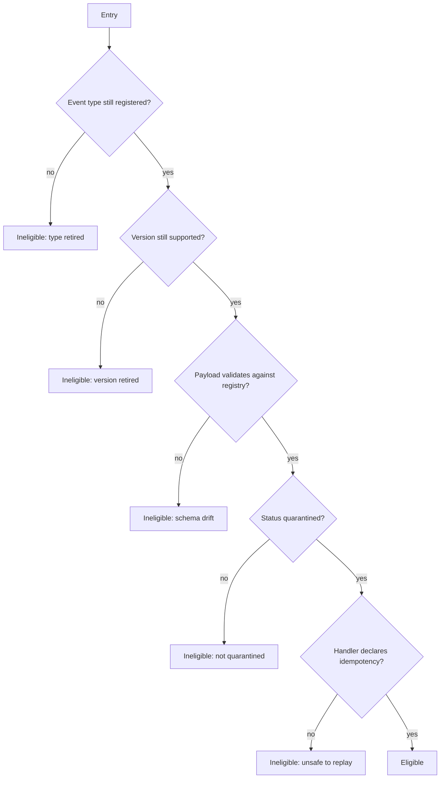

# Dead Letter Queue

> **Status:** v1.0 — complete. New in Phase 8.
> **Nothing is discarded.** An event that cannot be published or cannot be handled becomes a durable, inspectable, replayable record. The DLQ is where the platform's "no silent loss" guarantee is actually implemented.

## Overview

**Business purpose.** When an event fails permanently, something a customer expects did not happen: an article was published but never indexed, credits were consumed but the ledger projection never updated, a run finished but no notification was sent. The DLQ makes those failures visible, attributable, and recoverable rather than leaving them as a discrepancy someone notices weeks later.

**Technical purpose.** Provide durable quarantine for events that exhausted retry or failed terminally, retaining enough context — producer, consumer, correlation, full retry history, failure reason — to diagnose the cause and replay once the cause is fixed.

**The DLQ is a queue by name and a table by nature.** It is stored in PostgreSQL, not Redis, because a dead-lettered event may sit for days awaiting a fix, must survive Redis eviction entirely, and must be queryable by operators along dimensions a stream cannot support. **Redis is transport; PostgreSQL is truth** (`README.md`) applies with particular force to the records that exist precisely because transport failed.

## Responsibilities

- Quarantine of poison and exhausted events.
- Failure metadata retention: producer, consumer, reason, retry history.
- Inspection and operator query surfaces.
- Replay eligibility determination.
- Manual intervention: resolve, discard-with-reason, replay.
- Alerting by registry criticality.

## Non-responsibilities

| Not owned | Owner |
|---|---|
| Deciding *whether* to retry | `retry-engine.md` |
| Executing a replay | `replay.md` |
| Suppressing duplicate effects on replay | `idempotency.md` |
| Fixing the underlying defect | The owning domain component |
| Interpreting the event's business meaning | The owning domain component |
| Bus retention and trimming | `event-bus.md` |

**The DLQ never interprets what an event means.** It records that `ArticlePublished` failed in the `search-index` group with a `DependencyTimeout` after five attempts. It does not know what publishing is, and it does not decide what should happen to the article as a result — that judgement belongs to the owning component (`README.md`).

## Entry sources



| Source | Meaning | Typical cause |
|---|---|---|
| **Publish-side** | The event never reached the bus | Oversized payload, unresolvable stream, sustained bus failure |
| **Delivery-side** | The event reached a consumer and could not be handled | Handler defect, dependency outage, contract mismatch, guardrail refusal |

**The two sources need different responses and are labelled distinctly.** A publish-side entry means *no consumer saw the event* — replaying it delivers to every subscriber. A delivery-side entry means *one group failed while others may have succeeded* — replaying it must target that group alone, or the successful consumers receive a duplicate they must suppress (`replay.md`).

**Publish-side quarantine is what keeps the relay alive.** The relay claims in `id` order, so an event that always fails to publish blocks everything behind it — a platform-wide outage caused by one bad row. Quarantining after `publish_attempts` exceeds its threshold unblocks the queue while preserving the event (`transactional-outbox.md`).

## Record structure

```ts
interface DeadLetterEntry {
  id: string;
  eventId: string;                 // the immutable event identity
  tenantId: string;
  organizationId: string;

  // Origin
  source: 'publish' | 'delivery';
  producer: string;                // component that published
  consumerGroup: string | null;    // null for publish-side
  eventType: string;
  eventVersion: number;
  aggregateType: string;
  aggregateId: string;
  correlationId: string;
  causationId: string | null;

  // Failure
  failureReason: ExhaustionReason;
  failureCode: string;             // classification code
  failureMessage: string;          // sanitised
  retryHistory: RetryAttemptRecord[];

  // Payload
  payload: unknown;                // the original, byte-identical

  // Lifecycle
  status: 'quarantined' | 'replaying' | 'resolved' | 'discarded';
  occurredAt: Date;
  deadLetteredAt: Date;
  resolvedAt: Date | null;
  resolvedBy: string | null;
  resolutionNote: string | null;
}

interface RetryAttemptRecord {
  attempt: number;
  attemptedAt: Date;
  classification: FailureClass;
  code: string;
  message: string;
  delayBeforeMs: number;
}
```

**Every mandated field is present and none is nullable where it matters:** `correlationId`, `producer`, `consumerGroup` (delivery-side), `failureReason`, and `retryHistory` are required by the platform contract and enforced as `NOT NULL` where the source permits.

**The payload is stored byte-identical.** Replay must produce the *same* event, not a reconstruction — events are immutable, and a re-serialised payload is a different event that would defeat idempotency keys derived from content (`idempotency.md`).

**`retryHistory` is captured, not reconstructed.** It is written by the Retry Engine at each attempt and handed over intact at exhaustion. Log retention is shorter than DLQ residency, so a history assembled from logs would be incomplete exactly when an operator most needs it (`retry-engine.md`).

## Lifecycle



| Transition | Requirement |
|---|---|
| → `Replaying` | Entry must be replay-eligible; actor recorded |
| → `Resolved` | Resolution note mandatory |
| → `Discarded` | Note mandatory; written to the audit log; **never automatic** |

**`Discarded` exists and is deliberately hard to reach.** Some events genuinely should not be replayed — a test-tenant event, a duplicate from a botched migration, an event whose aggregate has since been deleted. Pretending otherwise would push operators toward deleting rows directly, which loses the record entirely. Discard is therefore an explicit, attributed, audited decision with a mandatory reason.

**No automatic transition to `Discarded` exists.** Nothing in the platform may move an entry to `Discarded` without a named actor. This is the mechanism behind "no event is silently discarded" — silence is impossible because a human name and a reason are required columns.

## Replay eligibility



**Registry validation is re-run at replay time and cannot be bypassed.** An entry that sat for a week may reference a version since retired or a schema since narrowed; replaying it unvalidated would inject a payload into a consumer that no longer accepts its shape. The registry is the gate on the way in and on the way back in (`event-registry.md`, `replay.md`).

**Ineligibility is a stable, explained state, not an error.** The reason is surfaced to the operator so the correct action — restore the version, fix the consumer, or discard with a note — is obvious rather than guessed.

## Inspection

```ts
interface DeadLetterQuery {
  tenantId?: string;
  eventType?: string;
  consumerGroup?: string;
  failureCode?: string;
  correlationId?: string;
  status?: DeadLetterEntry['status'];
  deadLetteredAfter?: Date;
  deadLetteredBefore?: Date;
  limit: number;
  cursor?: string;
}
```

**`correlationId` is the highest-value inspection dimension.** A single failing operation typically dead-letters several events across different groups; querying by correlation reconstructs the whole failure rather than presenting five unrelated-looking entries.

Grouped inspection — by `(eventType, failureCode)` with counts — turns a 4,000-entry DLQ from a wall of rows into three distinct incidents, which is the difference between triage and archaeology.

## Manual intervention

| Action | Effect | Guardrails |
|---|---|---|
| **Inspect** | Read entry with full history | Tenant-scoped by RLS |
| **Replay one** | Re-deliver a single event | Eligibility checked; idempotency applies |
| **Replay filtered** | Re-deliver a matched set | Bounded and confirmed; see `replay.md` |
| **Resolve** | Mark handled out of band | Note mandatory |
| **Discard** | Mark deliberately not replayed | Note mandatory; audited |

**Every intervention is attributed and audited.** DLQ operations are administrative actions on tenant data and are written to `audit_log` synchronously in the same transaction, exactly like any other privileged operation (`04-platform/audit-logs.md`).

**Bulk replay is bounded and confirmed.** Replaying 40,000 entries at once floods consumers with a backlog that competes with live traffic; bulk replay is rate-limited and treated as an operator-initiated load event (`replay.md`).

## Business rules

1. **No event is silently discarded.** Every failed event becomes a durable record.
2. **Every entry retains `correlationId`, producer, consumer, failure reason, and full retry history.**
3. **The payload is stored byte-identical**; replay reproduces the original event exactly.
4. **Publish-side and delivery-side entries are labelled distinctly** and replay differently.
5. **Replay always re-validates against the registry.** No bypass exists.
6. **Discard requires a named actor and a reason** and is never automatic.
7. **Resolve requires a note.**
8. **Every intervention is audited** in the same transaction.
9. **Entries are tenant-scoped and RLS-protected**, like all workspace-owned data.
10. **A failed replay appends to the history** and returns the entry to `quarantined` — replay attempts never overwrite the original failure.
11. **The DLQ never interprets business meaning.**
12. **Retention is 90 days for resolved and discarded entries; quarantined entries are never auto-deleted.**

**Rule 12 is the one that makes the guarantee real.** Time-based deletion of unresolved entries would be silent discard with extra steps. A quarantined entry persists until a human resolves, discards, or replays it — growth in that table is a signal, not a storage problem to be trimmed away.

**Idempotency:** dead-lettering is idempotent on `(eventId, consumerGroup)` — a duplicate exhaustion updates the existing entry rather than creating a second. **Concurrency:** insert uses `ON CONFLICT (event_id, consumer_group) DO UPDATE`, so concurrent workers cannot produce duplicates.

## Interfaces

```ts
interface DeadLetterQueue {
  quarantine(entry: NewDeadLetterEntry): Promise<string>;
  get(id: string): Promise<DeadLetterEntry | null>;
  query(q: DeadLetterQuery): Promise<Page<DeadLetterEntry>>;
  summarize(q: DeadLetterQuery): Promise<FailureGroup[]>;
  eligibility(id: string): Promise<ReplayEligibility>;
  resolve(id: string, actor: string, note: string): Promise<void>;
  discard(id: string, actor: string, note: string): Promise<void>;
  appendReplayAttempt(id: string, outcome: ReplayAttemptOutcome): Promise<void>;
}

type ReplayEligibility =
  | { eligible: true }
  | { eligible: false; reason: IneligibilityReason; detail: string };

type IneligibilityReason =
  | 'type-retired'
  | 'version-retired'
  | 'schema-drift'
  | 'not-quarantined'
  | 'handler-not-idempotent';

interface FailureGroup {
  eventType: string;
  consumerGroup: string | null;
  failureCode: string;
  count: number;
  oldestAt: Date;
  newestAt: Date;
}
```

**There is no `delete` method.** Removal happens only through retention of already-resolved or already-discarded entries. An API that could remove a quarantined entry would be an API that could lose an event.

**`resolve` and `discard` take `actor` and `note` as required parameters**, not optional ones — the same structural-correctness technique used by the transaction-bound publisher (`transactional-outbox.md`).

## Database impact

**One new table: `dead_letter_events`.** This is additive and owned entirely by the Event Platform; it changes nothing in Phase 3's schema (`03-database/tables.md`).

| Aspect | Definition |
|---|---|
| Primary key | `id` (UUIDv7) |
| Tenancy | `tenant_id`, `organization_id`; **RLS enabled**, standard workspace policy |
| Uniqueness | `UNIQUE (event_id, consumer_group)` — publish-side uses a sentinel group value so the constraint holds for both sources |
| Payload | `JSONB NOT NULL` |
| History | `retry_history JSONB NOT NULL DEFAULT '[]'` |
| CHECK | `status IN ('quarantined','replaying','resolved','discarded')` |
| CHECK | `(status IN ('resolved','discarded')) = (resolution_note IS NOT NULL AND resolved_by IS NOT NULL)` |
| CHECK | `(source = 'delivery') = (consumer_group <> '__publish__')` |
| Indexes | `(tenant_id, status, dead_lettered_at DESC)`; `(correlation_id)`; `(event_type, failure_code)` partial on `status = 'quarantined'` |

**The second CHECK constraint is the enforcement of "discard requires a reason."** A rule stated only in a service method is bypassed by the first migration script or admin query that updates the row directly; as a constraint it is unbypassable. This follows the pattern used throughout the tree — `ck_citation_anchors__grounding` for grounding, `UNIQUE(idempotency_key)` for duplicate publication (`03-database/tables.md`).

**No change to any existing table.** The only Phase 8 modification to a Phase 3 table remains `outbox_events.publish_attempts` (`transactional-outbox.md`).

## Security

- `dead_letter_events` is **RLS-enabled** under the standard workspace policy; operators see only tenants they are authorised for.
- **Payloads carry identifiers, not content** (`event-registry.md`), so a DLQ entry is not a content store — this is what makes operator inspection acceptable at all.
- `failureMessage` is sanitised before storage: connection strings, tokens, and bearer credentials are redacted, since dependency errors routinely embed them.
- Inspection, replay, resolve, and discard are privileged operations requiring an explicit admin capability, distinct from ordinary workspace membership.
- Every intervention writes to `audit_log` synchronously with actor, action, entry id, and note (`04-platform/audit-logs.md`).
- Cross-tenant DLQ queries are available only to platform operators through a separately audited path, never through the tenant API.
- Reference `16-security/`; this component defines no controls of its own.

## Performance

| Concern | Approach |
|---|---|
| Quarantine write | Single upsert; **p95 < 10 ms** |
| Inspection query | Covered by `(tenant_id, status, dead_lettered_at DESC)`; **p95 < 100 ms** |
| Summary aggregation | Partial index on quarantined rows; **p95 < 300 ms** |
| Table size | Bounded by 90-day retention of terminal statuses |
| Bulk replay | Rate-limited; see `replay.md` |

**The DLQ must stay small enough to query, and its size is a health metric rather than a capacity plan.** A healthy platform holds tens of entries; thousands means an incident, and the correct response is fixing the cause rather than adding indexes.

## Observability

- **Metrics:** `dlq_entries_total{event_type,consumer_group,failure_code,source}`, `dlq_depth{status}` (gauge), `dlq_oldest_quarantined_age_seconds` (gauge), `dlq_interventions_total{action}`, `dlq_replay_outcomes_total{outcome}`.
- **Tracing:** quarantine is a span linked by `correlationId` to the original delivery trace, so a DLQ entry navigates back to the operation that produced it.
- **Logging:** event id, type, group, failure code, exhaustion reason, tenant id, attempt count — never payloads.
- **Business KPIs:** DLQ depth by criticality and `dlq_oldest_quarantined_age_seconds` — an entry ageing past a day means a real failure has gone untriaged.
- **Alerts:** any entry for a **critical** event type (**page** immediately, depth 1); `dlq_depth{status="quarantined"}` above 100 (**page**); oldest quarantined age above 24 h (triage backlog); publish-side entries non-zero (**page** — the relay is quarantining, so events are not reaching consumers at all); `failure_code = "SchemaViolation"` (**page** — a contract breach, per `retry-engine.md`).

**Alerting is driven by registry criticality, not by volume.** One dead-lettered `SubscriptionCancelled` matters more than five hundred dead-lettered `SearchIndexRefreshRequested`, and a depth-based threshold alone would invert that priority (`event-registry.md`).

## Cross references

- `retry-engine.md` — exhaustion reasons, retry history, terminal classifications
- `replay.md` — how eligible entries are re-delivered safely
- `transactional-outbox.md` — publish-side quarantine and `publish_attempts`
- `event-registry.md` — criticality routing and replay-time validation
- `idempotency.md` — why replay does not duplicate effects
- `consumer-groups.md` — where delivery-side failures originate
- `04-platform/audit-logs.md` — synchronous audit of every intervention
- `03-database/tables.md` — the Phase 3 schema this table is additive to
- `14-operations/incident-response.md` — DLQ triage during incidents
