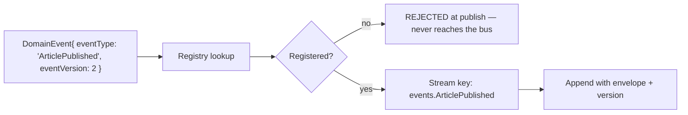
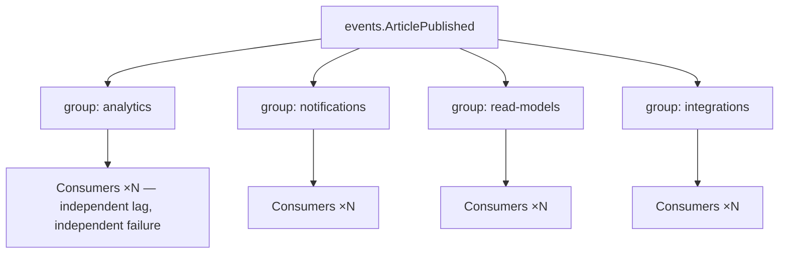
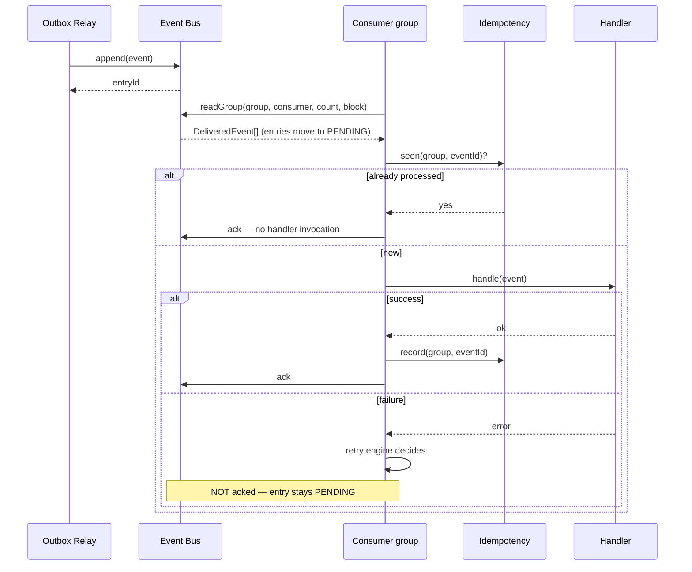
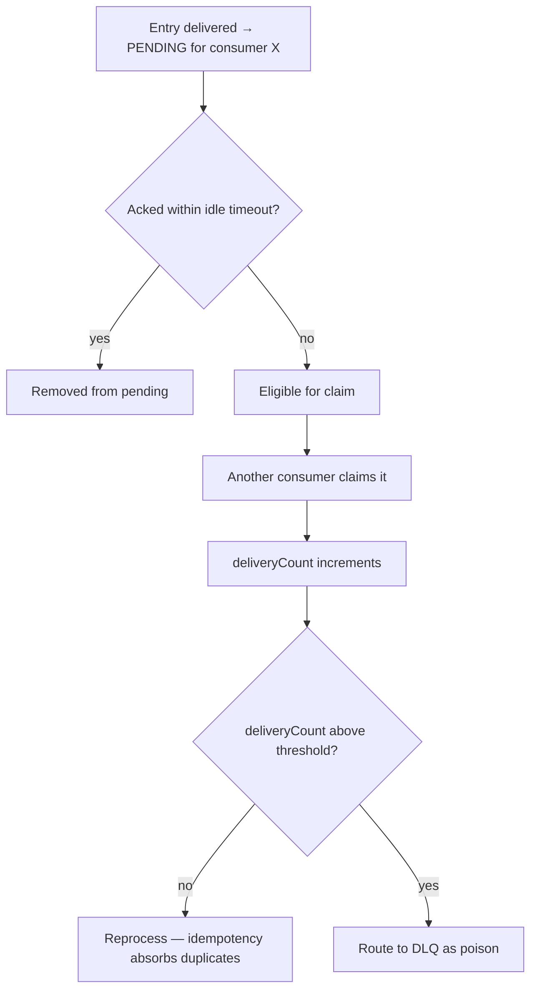

# Event Bus

> **Status:** v1.0 — complete. New in Phase 8. Implements the transport half of ADR-020.
> **The abstraction rule:** domain services see `EventBus`. They never see Redis, a stream key, a consumer-group name, or an entry identifier.

## Overview

**Business purpose.** The bus is what allows a capability to be added without touching the capability that triggers it. Analytics began tracking published content without the Publishing Engine knowing it exists; notifications, read models, and webhooks each subscribed the same way. That decoupling is why the platform can grow features without growing coordination cost.

**Technical purpose.** Provide a durable, replayable, fan-out transport with per-type streams and independent consumer groups — behind an interface narrow enough that the underlying technology can change without a single producer or consumer changing.

**Design posture — transport, not truth.** The bus carries events that already exist durably in the outbox. It may lose entries, be restarted, or be replaced wholesale; none of that risks an event, because the outbox can republish. Designing the bus as expendable is what makes the whole platform's durability claim credible.

## Responsibilities

- Publish: appending an event to its stream.
- Subscribe: consumer-group registration and reading.
- Delivery: at-least-once handoff with acknowledgement.
- Fan-out: independent delivery to every consumer group.
- Routing and topic resolution: mapping an event type to a stream.
- Acknowledgement, pending-entry tracking, and claim of stalled entries.
- The abstraction that makes the transport swappable.

## Non-responsibilities

| Not owned | Owner |
|---|---|
| Durability of the event's existence | `transactional-outbox.md` — the bus is transport |
| Deciding what to publish | The producing domain component |
| Retry scheduling and backoff | `retry-engine.md` |
| Duplicate suppression | `idempotency.md` |
| Consumer scaling, leases, rebalancing | `consumer-groups.md` |
| Poison-event quarantine | `dead-letter-queue.md` |
| Payload schema validation | `event-registry.md` |
| Any business meaning | The domain |

**The bus does not validate payloads.** Validation happens at publish time against the registry, before the outbox row is written — so an invalid event never reaches the bus at all. Validating again at transport would be redundant and would put schema knowledge in a component that must remain content-agnostic.

## The interface

```ts
interface EventBus {
  append(event: DomainEvent<unknown>): Promise<BusEntryId>;
  readGroup(options: ReadGroupOptions): AsyncIterable<DeliveredEvent>;
  ack(group: string, entryId: BusEntryId): Promise<void>;
  claimStalled(group: string, options: ClaimOptions): Promise<DeliveredEvent[]>;
  pendingCount(group: string, eventType?: string): Promise<number>;
  trim(eventType: string, olderThan: Date): Promise<number>;
}

interface DeliveredEvent {
  entryId: BusEntryId;          // OPAQUE — transport-specific, never persisted by consumers
  event: DomainEvent<unknown>;
  deliveryCount: number;        // how many times this entry has been delivered
  firstDeliveredAt: string;
}
```

**Six methods.** The interface is deliberately narrow — every capability the platform needs, and nothing that would couple a consumer to Redis Streams semantics.

**`entryId` is opaque and must never be persisted by a consumer.** It is transport-specific: a Redis stream id today, a Kafka offset later. A consumer that stored one would break at cutover. Consumers persist `eventId`, which is ours and stable.

**`deliveryCount` is the redelivery signal**, and it is what lets the retry engine distinguish a first attempt from a redelivery after a crash without the consumer tracking state.

## Topic resolution

**One stream per event type**, resolved deterministically from the registry.



| Decision | Choice | Reasoning |
|---|---|---|
| Granularity | **One stream per event type** | A slow consumer group backs up only its own event type; a single shared stream would couple every consumer's throughput |
| Version handling | **Same stream across versions** | Consumers filter by `eventVersion`; separate streams per version would fragment ordering and multiply topics |
| Tenant handling | **Shared stream, tenant in the envelope** | Per-tenant streams would produce tens of thousands of streams and destroy fan-out efficiency |
| Naming | `events.<EventType>` | Deterministic; derivable from the registry, never hand-configured |

**Per-tenant streams were considered and rejected.** They would give perfect tenant isolation at the transport layer, but at the cost of an unbounded stream count, per-tenant consumer coordination, and a fan-out cost proportional to tenant count. Isolation is instead enforced where it belongs — the envelope carries `tenantId`, and every consumer re-establishes tenant context from it before touching data (`consumer-groups.md`).

**Enterprise per-tenant streams remain a documented future option** for a customer requiring transport-level separation; the interface supports it without change because topic resolution is a registry function.

## Fan-out



**Every consumer group receives every event on its stream, independently.** A group's failure, backlog, or restart affects nothing else — which is the property that lets a slow read-model projector fall behind without delaying notifications.

**Groups are registered from the registry**, not created ad hoc. A consumer declaring a group that the registry does not know is a startup failure, so an accidental typo produces a boot error rather than a silently unconsumed subscription.

**Adding a consumer group is safe and requires no producer change.** The new group begins at the current stream head by default, or at a chosen position for backfill (`replay.md`).

## Delivery



**An unacknowledged entry stays pending and is redelivered.** That is the at-least-once mechanism, and it is why consumers must be idempotent — a crash between handler success and acknowledgement produces exactly one redelivery, which the idempotency check absorbs.

**Acknowledgement follows the idempotency record, never precedes it.** Acknowledging first would create a window where a crash loses the event permanently; recording first means the worst case is a redelivery that no-ops.

## Stalled entries

A consumer that dies mid-processing leaves entries pending forever unless reclaimed.



**`deliveryCount` above a threshold routes to the DLQ.** An entry repeatedly claimed and never acknowledged is usually poison — a payload that crashes the handler before it can fail gracefully. Without this, it would circulate forever, consuming a claim slot on every cycle.

The idle timeout before an entry becomes claimable is longer than the slowest expected handler, so a legitimately slow consumer is not raced by a peer.

## Retention and trimming

| Property | Value | Reasoning |
|---|---|---|
| Stream retention | **7 days** | Long enough for a consumer group to be down over a weekend and catch up |
| Trim strategy | By age, executed by a scheduled sweep | Length-capped trimming would drop entries a lagging group has not read |
| Beyond retention | **Replay from the outbox** | The bus is not the archive |
| Outbox retention | 30 days | The actual replay window |

**Trimming checks consumer-group lag first.** An entry is only trimmed when every registered group has acknowledged past it, or when it exceeds the maximum retention regardless — in which case the affected group is alerted, because it has fallen further behind than the platform tolerates.

## Business rules

1. **Publishing to the bus happens only from the Outbox Relay.** No domain service calls `append` (`transactional-outbox.md`).
2. **Every event type must be registered** before it can be published or subscribed to.
3. **`entryId` is opaque** and must never be persisted by a consumer.
4. **Acknowledgement follows the idempotency record.**
5. **One stream per event type**; versions share a stream and are filtered by consumers.
6. **The envelope carries `tenantId`**; consumers re-establish tenant context from it.
7. **Consumer groups are registry-declared**; an unknown group is a startup failure.
8. **Trimming respects consumer lag** and alerts when it cannot.
9. **The bus is expendable.** Entry loss is recoverable by outbox republication.
10. **No payload inspection.** Routing uses `eventType` only.

**Idempotency:** `append` is not idempotent at the bus level — the outbox's `event_id` uniqueness and the consumer-side check together provide the guarantee. **Concurrency:** many relay instances may append concurrently; ordering within a stream follows append order.

## The swappable transport

```ts
// One interface, multiple implementations
class RedisStreamsBus implements EventBus { /* v1 */ }
class KafkaBus implements EventBus { /* S3 scale */ }
class InMemoryBus implements EventBus { /* tests */ }
```

| Concern | Redis Streams (v1) | Kafka / NATS (S3) |
|---|---|---|
| Durability | Configurable persistence; **not relied upon** | Log-structured, replicated |
| Consumer groups | Native, with pending-entry lists | Native |
| Ordering | Per stream | Per partition |
| Operational cost | **Zero new infrastructure** — Redis is already required | A significant new system to operate |
| Trigger to migrate | — | Throughput or retention beyond what Redis serves comfortably (`14-operations/scaling-strategy.md`) |

**Redis Streams was chosen because the outbox already provides durability.** The bus needs fan-out, consumer groups, and acknowledgement — all of which Redis Streams has — and it does not need to be the source of truth. That reframing is what makes a zero-new-infrastructure choice defensible at v1.

**Migration is straightforward precisely because the bus is expendable:** stand up the new transport, run both, cut the relay over, let the old streams drain, decommission. No backfill of historical entries is required, because history lives in the outbox.

**`InMemoryBus` exists for tests** and is what makes consumer behaviour testable without containers at the unit level (`10-testing/unit-testing.md`).

## Interfaces

```ts
interface ReadGroupOptions {
  group: string;
  consumer: string;              // instance identity, for pending-entry attribution
  streams: string[];             // resolved from the registry, never hand-written
  count: number;                 // batch size
  blockMs: number;               // long-poll duration
  startFrom?: 'new' | 'pending' | BusPosition;
}

interface ClaimOptions {
  minIdleMs: number;
  count: number;
  consumer: string;
}
```

**`startFrom: 'pending'` is the crash-recovery path** — a restarting consumer first drains entries it had claimed but not acknowledged, then reads new ones. Skipping that step would leave its own pending entries for a peer to claim later, delaying them unnecessarily.

## Events

The bus produces **operational** events about itself, never domain events:

| Event | Consumers | Payload |
|---|---|---|
| `BusStreamLagExceeded` | Observability, Notifications | `{ eventType, group, lag, thresholdSeconds }` |
| `BusEntryStalled` | Observability, DLQ | `{ eventType, group, entryId, deliveryCount }` |
| `BusTrimBlocked` | **Observability — alert** | `{ eventType, blockingGroup, oldestUnacked }` |
| `BusUnavailable` | **Observability — page**, Relay | `{ reason, since }` |

These are emitted through the outbox like any other event, which is deliberate: the bus's own health signals must survive the bus being down.

## Database impact

**The bus owns no PostgreSQL tables.** Stream data, consumer-group state, and pending-entry lists live in Redis (`12-storage-platform/redis.md`).

One reference table:

| Table | Purpose |
|---|---|
| `bus_topics` | Event type → stream key mapping, retention override, partition hint | Reference data, derived from the registry (ADR-025 exception class) |

**No schema redesign.** The outbox tables belong to `transactional-outbox.md`.

**Redis structures:** one stream per event type; consumer groups per stream; pending-entry lists managed by Redis. Memory is the binding constraint, which is why retention is time-based and monitored.

## Security

- **The envelope carries `tenantId` and `organizationId`**, and every consumer re-establishes tenant context from the event rather than from ambient state. A consumer processing under the wrong tenant is a cross-tenant write — the platform's worst failure class (`consumer-groups.md`).
- **Payloads carry identifiers, counts, and classifications** — never content, credentials, or PII. That rule is enforced at publish by registry schema validation, not at transport.
- The bus is on the private network; there is no public ingress.
- Redis holding event payloads means Redis holds tenant-identifying data; access controls and encryption in transit apply (`16-security/`).
- **A shared stream across tenants is safe only because payloads carry no content.** If payload policy ever loosened, per-tenant streams would become necessary — which is why the payload rule is enforced at the registry rather than left to producer discipline.
- Reference `16-security/`; this component defines no controls of its own.

## Performance

| Concern | Approach |
|---|---|
| Append latency | **p95 < 5 ms** — a single Redis command |
| Read | Long-poll with `blockMs`, so idle consumers do not spin |
| Batch size | Tuned per group; larger batches raise throughput and coarsen failure granularity |
| Fan-out cost | O(groups) per event, not O(consumers) — Redis Streams delivers to groups, which distribute internally |
| Memory | The binding constraint; time-based retention with monitored depth |
| Trimming | Scheduled sweep, lag-aware |

**Fan-out cost scaling with groups rather than consumers** is the property that makes adding consumer instances cheap and adding consumer groups a deliberate decision.

## Observability

- **Metrics:** `bus_appends_total{event_type}`, `bus_append_duration_seconds`, `bus_deliveries_total{event_type,group}`, `bus_acks_total{group}`, `bus_pending_entries{group}` (gauge), `bus_stream_length{event_type}` (gauge), `bus_consumer_lag_seconds{group,event_type}`, `bus_claims_total{group}`, `bus_trim_blocked_total`.
- **Tracing:** `append` is a span within the relay's span; delivery starts a new trace **linked** to the producing trace by `correlationId` — a consumer's work is causally related to the producer's but is not part of the same synchronous operation, and modelling it as a child span would produce traces that never close.
- **Logging:** event type, group, entry id, delivery count, correlation id — never payloads.
- **Alerts:** `bus_consumer_lag_seconds` above threshold per group; `bus_trim_blocked_total` non-zero (a group has fallen behind retention); `BusUnavailable` (**page**); stream length growing without bound.

## Cross references

- `transactional-outbox.md` — the durability half; the only component that calls `append`
- `event-registry.md` — topic and consumer-group resolution
- `consumer-groups.md` — scaling, leases, and tenant-context re-establishment
- `idempotency.md` — why acknowledgement follows the idempotency record
- `dead-letter-queue.md` — where stalled and poison entries go
- `replay.md` — republication from the outbox when the bus cannot serve
- `ordering.md` — what per-stream ordering does and does not guarantee
- `01-system-architecture/10-event-flow.md` — ADR-020, which this implements
- `12-storage-platform/redis.md` — stream configuration and memory policy
- `14-operations/scaling-strategy.md` — the Kafka migration trigger
