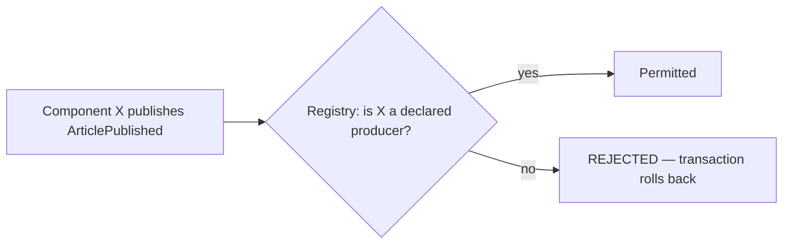

# Event Registry

> **Status:** v1.0 — complete. New in Phase 8.
> **Every event must be registered.** An unregistered event type cannot be published, cannot be subscribed to, and cannot be routed.

## Overview

**Business purpose.** By Phase 7 the platform had accumulated roughly 180 event types across seven folders, produced by dozens of components and consumed by dozens more. Without a registry that set is undiscoverable: nobody can answer *who consumes this?* before changing a payload, *what breaks if this event stops?* during an incident, or *is anything still listening?* before deleting a producer. Those questions get answered by grep, badly, and the answers rot.

**Technical purpose.** Be the single authority for event names, versions, producers, consumers, payload schemas, and deprecation state — enforced at publish, at subscribe, and at startup, so drift between the registry and reality is impossible rather than merely discouraged.

**Design posture — the registry is enforcement, not documentation.** A registry that describes the system is a wiki page that goes stale. A registry that *gates* publication and subscription cannot go stale, because the system stops working when it does.

## Responsibilities

- Event type identity and the naming contract.
- Version registration and lifecycle.
- Producer declaration — which component may emit which type.
- Consumer declaration — which consumer groups subscribe to which types.
- Payload schema registration and validation.
- Deprecation lifecycle and enforcement.
- Topic and consumer-group resolution for the bus.
- Compatibility checking in CI.

## Non-responsibilities

| Not owned | Owner |
|---|---|
| The **content** of any payload | The producing domain component |
| Transport, streams, delivery | `event-bus.md` |
| Version **evolution rules** | `versioning.md` — this registry stores and enforces them |
| Retry, ordering, idempotency | Their own components |
| Business meaning | The domain |

**The registry stores schemas; it does not author them.** A domain component defines what `ArticlePublished` contains. The registry records that definition, versions it, validates against it, and refuses anything that does not conform.

## The registry entry

```ts
interface EventTypeRegistration {
  eventType: string;                  // PascalCase, past tense — see naming
  category: 'domain' | 'application' | 'integration';
  owner: string;                      // the owning component document path
  description: string;

  versions: EventVersionRegistration[];
  producers: ProducerDeclaration[];
  consumers: ConsumerDeclaration[];

  ordering: {
    aggregateType: string;            // the ordering key's type
    orderingRequired: boolean;        // does per-aggregate order matter for this type?
  };
  retention: { streamDays: number; outboxDays: number };
  criticality: 'standard' | 'critical';   // does a DLQ entry page?
}

interface EventVersionRegistration {
  version: number;
  status: 'draft' | 'active' | 'deprecated' | 'retired';
  schema: JsonSchema;
  introducedAt: string;
  deprecatedAt?: string;
  retireAfter?: string;
  migrationNote?: string;
}

interface ProducerDeclaration { component: string; versions: number[] }
interface ConsumerDeclaration {
  consumerGroup: string;
  component: string;
  versions: number[];
  criticality: 'standard' | 'critical';
  handlerIdempotencyKey: string;      // how this consumer derives its dedupe key
}
```

**`criticality` is on both the type and each consumer**, and they are different facts. `ArticlePublished` is critical platform-wide; but the read-model consumer failing is an inconvenience while the analytics consumer failing means measurement never starts. Per-consumer criticality is what makes DLQ alerting precise instead of noisy.

**`handlerIdempotencyKey` is declared, not inferred.** Most consumers dedupe by `eventId`, but some legitimately need a different key — a projector that is idempotent per `(aggregateId, version)` can safely collapse redeliveries of superseded events. Declaring it makes the choice reviewable (`idempotency.md`).

## Naming contract

Enforced at registration; a violation fails CI.

| Rule | Example |
|---|---|
| **PascalCase, past tense** | `ArticlePublished`, not `PublishArticle` or `article_published` |
| **`<Aggregate><PastTenseVerb>`** | `EvidenceRetracted`, `MembershipRevoked` |
| **States a fact, not an intent** | `OutlineApproved` — something happened, not something should happen |
| **No command shapes** | `SendNotification` is rejected; a command is not an event |
| **Globally unique** | Across all categories and all folders |
| **Stable forever** | Renaming breaks every consumer and every historical row |

**Past tense is not stylistic.** An event is a statement about the past that has already happened and cannot be refused. A present-tense or imperative name invites a consumer to treat it as a request it may decline — which is a command, belongs on a queue, and has entirely different delivery semantics.

The rule matches `01-system-architecture/05-glossary.md` §Interfaces, and the registry is where it is enforced rather than merely stated.

## Validation points

```mermaid
flowchart TB
    A["CI: registry consistency check"] --> A1["Every produced type registered?"]
    A --> A2["Every consumed type registered?"]
    A --> A3["Every consumer group declared?"]
    A --> A4["Schema changes backward-compatible?"]
    A --> A5["No orphan types — registered but unproduced?"]
    B["Startup: component registration"] --> B1["Declared producers match registry"]
    B --> B2["Declared consumer groups exist"]
    B --> B3["Subscribed versions are not retired"]
    C["Publish: inside the transaction"] --> C1["Type registered and active?"]
    C --> C2["Version active or deprecated, not retired?"]
    C --> C3["Payload validates against schema?"]
    C --> C4["Producer authorized for this type?"]
    D["Subscribe: consumer start"] --> D1["Group registered for this type?"]
    D --> D2["Version supported by this consumer?"]
```



**Four enforcement points, each catching a different class of error:**

| Point | Catches | Failure mode |
|---|---|---|
| **CI** | Drift between code and registry; incompatible schema changes | Build fails |
| **Startup** | A component declaring something the registry does not know | Boot fails |
| **Publish** | An invalid payload, a retired version, an unauthorized producer | Transaction rolls back |
| **Subscribe** | A consumer group reading a type it never declared | Consumer refuses to start |

**Publish validation is inside the producer's transaction**, so an invalid event rolls back its state change (`transactional-outbox.md`). That is stricter than validating after commit, and deliberately so: a producer that successfully changes state but fails to notify has created exactly the inconsistency the outbox exists to prevent.

**Startup failure over runtime failure.** A component whose declarations do not match the registry refuses to boot. Discovering the mismatch when the first event is published — possibly days later, possibly in production — is strictly worse.

## Producer authorization

**Each event type declares which components may emit it**, and publish validation enforces it.



This prevents a real and subtle failure: a component emitting an event that another component owns. Two producers for one event type means two payload shapes, two sets of assumptions, and consumers that break unpredictably depending on which producer emitted the instance they received.

**Most types have exactly one producer.** Where several are legitimate — `ScoreCalculated` is emitted by both the Review and SEO engines (ADR-021) — all are declared, and the shared schema is the contract binding them.

## Consumer declaration

Declaring consumers turns unanswerable questions into registry lookups:

| Question | Answered by |
|---|---|
| *Who consumes this? Can I change the payload?* | `consumers[]` |
| *What breaks if this event stops flowing?* | Reverse lookup by type |
| *Is anything still listening?* | Empty `consumers[]` — an orphan |
| *Which consumer groups must exist?* | The set of declared groups |
| *Does a DLQ entry here page?* | Per-consumer `criticality` |

**Orphan detection runs in CI.** A registered type with no consumers is reported — sometimes correct (an event kept for audit or future use), sometimes a deleted consumer nobody noticed. Either way it is surfaced rather than silently accumulating publish cost for nobody.

**Consumers declare which versions they support.** That is what makes version retirement safe: a version cannot be retired while any consumer still declares it (`versioning.md`).

## Payload schemas

```ts
// Registered schema for ArticlePublished v2
{
  type: 'object',
  required: ['articleId', 'articleVersion', 'targetId', 'liveUrl', 'publishedAt'],
  additionalProperties: false,
  properties: {
    articleId: { type: 'string', format: 'uuid' },
    articleVersion: { type: 'integer', minimum: 1 },
    targetId: { type: 'string', format: 'uuid' },
    liveUrl: { type: 'string', format: 'uri' },
    externalRef: { type: 'string' },
    publishedAt: { type: 'string', format: 'date-time' },
  },
}
```

**`additionalProperties: false` is mandatory.** Without it, a producer can add an undeclared field, consumers begin depending on it, and the field is now a contract nobody registered. Rejecting unknown fields at publish forces every addition through the registry.

### The payload content rule — enforced, not advised

Every document in Phases 2 through 7 states that payloads carry identifiers and scalars, never content. The registry is where that becomes enforceable:

| Rejected at registration | Reason |
|---|---|
| A `string` field with no `maxLength` and a content-shaped name (`text`, `body`, `excerpt`, `content`, `prompt`) | Likely content |
| Any field matching credential patterns (`token`, `secret`, `password`, `apiKey`, `credential`) | Never permitted |
| Any field with `format: 'email'` | PII; identifiers or hashes instead |
| Unbounded arrays of objects | A collection is usually a payload smuggling a projection |

**A schema violating these fails registration in CI**, with the offending field named. It is a heuristic and it will occasionally flag a legitimate field — which is why it names the field and permits an explicit, reviewed exemption rather than blocking silently.

The rule exists because **events fan out much more widely than the tables they describe**: a payload reaches notification channels, webhook subscribers, read models, and analytics, several of which have weaker access controls than the source table.

## Deprecation lifecycle

```mermaid
stateDiagram-v2
    [*] --> Draft: version registered
    Draft --> Active: promoted; producers may emit
    Active --> Deprecated: superseded by a newer version
    Deprecated --> Active: deprecation reversed
    Deprecated --> Retired: no consumer declares it
    Retired --> [*]
    Active --> Active: consumers migrate to a newer version
```



| Status | Producers may emit | Consumers may subscribe | Publish validation |
|---|---|---|---|
| `draft` | No | No | Rejected |
| `active` | Yes | Yes | Accepted |
| `deprecated` | Yes, with a warning metric | Yes | Accepted |
| `retired` | **No** | **No** | **Rejected** |

**A version cannot be retired while any consumer declares it.** The registry refuses the transition and names the blocking consumers. That single rule is what makes "never break existing consumers" enforceable rather than aspirational (`versioning.md`).

**Deprecated versions still publish**, and emit a warning metric. Deprecation is a signal to migrate, not a break — the break comes at retirement, and only after the registry proves nobody is listening.

## Business rules

1. **Every event type must be registered** before publication or subscription.
2. **Names are PascalCase, past tense, globally unique, and stable forever.**
3. **Producers are declared and authorized**; an undeclared producer is rejected at publish.
4. **Consumers are declared**, including supported versions and idempotency key derivation.
5. **Schemas require `additionalProperties: false`.**
6. **Payload content rules are enforced at registration**, with named exemptions where justified.
7. **Publish validation happens inside the producer's transaction.**
8. **A version cannot be retired while a consumer declares it.**
9. **Component declarations are verified at startup**; a mismatch fails boot.
10. **Schema changes are checked for compatibility in CI** (`versioning.md`).
11. **Orphan types are reported**, not auto-deleted.
12. **The registry never inspects payload values** — only shape.

**Idempotency:** registration is idempotent by `(eventType, version)`. **Concurrency:** registry writes are deploy-time; reads are cache-resident.

## Registry as code

The registry is **source-controlled, reviewed, and deployed with the code that uses it** — not a runtime-editable table.

```
packages/contracts/events/
├── registry.ts              # the type catalogue
├── schemas/
│   ├── ArticlePublished.v1.json
│   ├── ArticlePublished.v2.json
│   └── ...
└── consumers.ts             # consumer group declarations
```

**Why not a runtime table:** an event contract is a code dependency. Consumers compile against payload types; changing a schema at runtime without a deploy would break running consumers with no review, no CI compatibility check, and no rollback path. The registry is deployed to the database as reference data, but its **source of truth is the repository**.

That makes registry changes reviewable in a pull request, which is where a payload change belongs — the reviewer can see the schema diff alongside the consumers that must handle it.

## Interfaces

```ts
interface EventRegistry {
  resolve(eventType: string, version: number): Promise<EventVersionRegistration>;
  validate(event: DomainEvent<unknown>): ValidationResult;
  topicFor(eventType: string): string;
  consumerGroupsFor(eventType: string): ConsumerDeclaration[];
  producersOf(eventType: string): ProducerDeclaration[];
  consumersOf(eventType: string): ConsumerDeclaration[];
  isRetired(eventType: string, version: number): boolean;
  catalogue(filter?: CatalogueFilter): Promise<EventTypeRegistration[]>;
}
```

**Admin REST:** `GET /internal/v1/events/registry` · `GET /internal/v1/events/registry/{type}` · `GET /internal/v1/events/registry/{type}/consumers` · `GET /internal/v1/events/orphans`.

**No mutation API.** Registration happens through deployment, so there is deliberately no endpoint that adds or changes an event type at runtime.

## Database impact

| Table | Purpose | Notes |
|---|---|---|
| `event_registry` | Deployed projection of the source registry: type, category, owner, criticality, ordering, retention | **Reference data** (ADR-025 exception class); replaced on deploy |
| `event_schemas` | Per-version JSON schemas | Reference data; immutable per version |
| `event_consumer_declarations` | Group, component, supported versions, criticality, idempotency key | Reference data |

**No schema redesign.** All three are new reference tables, seeded by migration from the repository source.

**Caching:** the registry is loaded process-wide at startup and refreshed on `EventRegistryChanged`. Resolution and validation perform **no database read on the publish path** — publish already sits inside a transaction holding locks, and adding a read there would be a serialization point on the platform's hottest write path.

## Security

- **The payload content rule is a security control.** Events reach broader consumers than their source tables, and enforcing the restriction at registration is what prevents content, credentials, or PII from being distributed by a well-meaning payload addition.
- **Producer authorization prevents event spoofing** — a compromised or buggy component cannot emit events attributed to another component's contract.
- The registry itself is reference data deployed through the normal release path, so a registry change requires code review and passes CI compatibility checks.
- Catalogue endpoints are platform-admin only: the full event catalogue is a map of the system's internal structure.
- Reference `16-security/`; this component defines no controls of its own.

## Performance

| Concern | Approach |
|---|---|
| Publish validation | **p95 < 2 ms** — in-memory schema validation against a compiled validator |
| Schema compilation | Compiled once at startup, cached by `(type, version)` |
| Resolution | Process-wide cache; **no I/O on the publish path** |
| Catalogue queries | Admin-only, uncached, infrequent |
| Startup verification | One pass over declarations at boot |

**Validation must be fast because it runs inside a transaction.** A slow validator would hold locks and reduce write throughput platform-wide, which is why schemas are compiled at startup rather than interpreted per publish.

## Observability

- **Metrics:** `event_registry_validations_total{event_type,outcome}`, `event_registry_rejections_total{reason}`, `event_types_total{category,status}`, `deprecated_version_publishes_total{event_type,version}`, `event_orphan_types` (gauge), `registry_validation_duration_seconds`.
- **Tracing:** validation is a span within the producer's transaction span.
- **Logging:** event type, version, validation outcome, rejection reason — never payloads.
- **Business KPIs:** deprecated-version publish rate per type, which measures migration progress and is what tells you whether a retirement date is realistic.
- **Alerts:** validation rejection rate above baseline (a producer drifting from its schema); `deprecated_version_publishes_total` still non-zero as a retirement date approaches; orphan count rising, which usually means a consumer was deleted without its producer.

## Cross references

- `versioning.md` — the evolution rules this registry stores and enforces
- `transactional-outbox.md` — validation inside the publishing transaction
- `event-bus.md` — topic and consumer-group resolution
- `consumer-groups.md` — group declarations enforced at startup
- `idempotency.md` — `handlerIdempotencyKey` declaration
- `dead-letter-queue.md` — per-consumer criticality drives DLQ alerting
- `01-system-architecture/05-glossary.md` — the naming contract
- `01-system-architecture/10-event-flow.md` — the event taxonomy and envelope
- `10-testing/testing-strategy.md` — the CI consistency and compatibility checks
