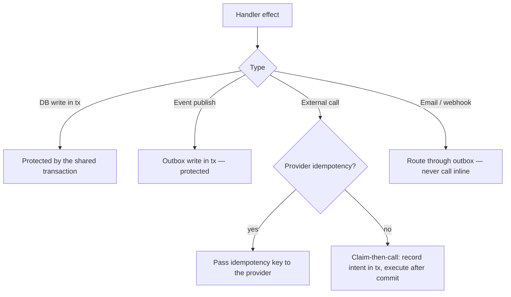

# Idempotency

> **Status:** v1.0 — complete. New in Phase 8. **Canonical.**
> **Exactly-once delivery is not required. Exactly-once *effects* are.** This document is the single authority on duplicate suppression for the whole platform; no component defines its own scheme.

## Overview

**Business purpose.** A customer must never be charged twice for one run, receive two copies of one notification, or see a metric counted twice because a worker restarted mid-handler. Every retry, every redelivery, every replay is a duplicate waiting to become a customer-visible error, and idempotency is what turns those duplicates into no-ops.

**Technical purpose.** Define the key derivation, detection mechanism, transactional discipline, retention window, and storage policy that make at-least-once delivery safe.

**This document is canonical because a second scheme is a bug.** If a consumer invents its own duplicate check with a different key or a different window, its guarantee holds only under conditions its author imagined. One mechanism, one table, one window, applied identically everywhere (`README.md`).

## Exactly-once delivery versus exactly-once effects

This distinction is the platform's central correctness idea and is stated here in full.

| | Exactly-once **delivery** | Exactly-once **effects** |
|---|---|---|
| Claim | Each event is delivered to each consumer exactly one time | Each event's *observable consequences* occur exactly one time |
| Achievable? | **No** — not across a process boundary | **Yes** |
| Cost | Would require distributed consensus on every delivery | One indexed insert per delivery |
| Platform position | **Explicitly not attempted** | **Required of every consumer** |

**Why exactly-once delivery is impossible.** A worker handles an event, commits, and dies before acknowledging. The bus cannot distinguish this from a worker that died *before* handling. It has exactly two options: redeliver (risking a duplicate) or not (risking loss). There is no third option, and no amount of engineering produces one — the acknowledgement and the work are on opposite sides of a boundary that can fail between them.

Every system claiming exactly-once delivery is doing one of two things: at-least-once delivery plus deduplication — which is exactly-once *effects*, described honestly — or losing messages in a failure mode not covered by its marketing.

**The platform chooses at-least-once and makes duplicates harmless.** Delivery may repeat freely; effects may not. This is why retry is safe (`retry-engine.md`), why cancellation need not acknowledge (`workers.md`), and why replay is a routine operation rather than a dangerous one (`replay.md`).

**A consequence worth stating plainly:** every handler in the platform is required to be idempotent. This is not advice. A non-idempotent handler is a defect regardless of whether a duplicate has occurred yet, and it is caught at registration (`event-registry.md`).

## Idempotency keys

```ts
type IdempotencyKey = string;   // ≤ 255 chars, stable, deterministic

interface IdempotencyKeyDerivation {
  strategy: 'event-id' | 'aggregate-version' | 'business-key';
  derive(event: DomainEvent<unknown>): IdempotencyKey;
}
```

| Strategy | Key | When to use |
|---|---|---|
| **`event-id`** (default) | `event.eventId` | Almost always. Suppresses redelivery of the same event. |
| **`aggregate-version`** | `${aggregateId}:${version}` | When several distinct events represent the same state transition and only one should take effect. |
| **`business-key`** | Declared fields from the payload | When duplicate suppression must span events that are genuinely different but must not both take effect. |

**`event-id` is the default and covers the overwhelming majority of handlers.** `eventId` is assigned once at publication, is carried immutably through the outbox, the bus, the DLQ, and every replay, and is unique by database constraint (`transactional-outbox.md`). Two deliveries of one event always share it; two genuinely different events never do.

**The other strategies exist for a narrower problem.** Suppose a retried API call produces two `SubscriptionRenewed` events for the same billing period — different `eventId`s, same real-world transition. `event-id` treats them as distinct and the customer is charged twice. A `business-key` of `${subscriptionId}:${periodStart}` collapses them correctly.

**Keys are derived, never supplied by producers.** A producer-supplied key is a producer-controlled correctness property, and the first producer to generate a random one per publish silently disables suppression for that entire event type. Derivation is declared in the registry, source-controlled, and reviewed.

**Keys are scoped per consumer group.** Two groups handling the same event both act on it — that is the point of fan-out. Suppression is on `(consumerGroup, idempotencyKey)`; a global key would let the first consumer's success suppress the second's work.

## Duplicate detection

```mermaid
sequenceDiagram
    participant CG as Consumer group
    participant TX as Transaction
    participant PE as processed_events
    participant H as Handler

    CG->>TX: BEGIN
    TX->>PE: INSERT (group, event_id, key) ON CONFLICT DO NOTHING
    alt zero rows returned
        Note over TX: duplicate — suppress
        TX->>TX: COMMIT (no work performed)
        CG->>CG: ack; count as suppressed
    else one row returned
        TX->>H: handle(event, ctx, tx)
        H->>TX: writes within the SAME transaction
        TX->>TX: COMMIT — marker and effects atomic
        CG->>CG: ack
    end
```

```ts
async function handleIdempotently(
  event: DomainEvent<unknown>,
  ctx: TenantContext,
  handler: RegisteredHandler,
): Promise<'handled' | 'suppressed'> {
  const key = deriveIdempotencyKey(event, handler.keyStrategy);

  return db.transaction(async (tx) => {
    const claimed = await tx.insert(processedEvents)
      .values({
        consumerGroup: handler.group,
        eventId: event.eventId,
        idempotencyKey: key,
        tenantId: event.tenantId,
        processedAt: new Date(),
      })
      .onConflictDoNothing()
      .returning({ eventId: processedEvents.eventId });

    if (claimed.length === 0) return 'suppressed';

    await handler.handle(event, ctx, tx);
    return 'handled';
  });
}
```

**The marker and the effects share one transaction.** This is the single most important property in this document. Splitting them reintroduces exactly the dual-write problem ADR-020 exists to eliminate (`transactional-outbox.md`):

| Ordering | Failure between the two | Result |
|---|---|---|
| Marker first, separate commit | Handler never runs | **Event lost** — marker says handled, nothing happened |
| Handler first, separate commit | Marker never written | **Duplicate on redelivery** |
| **Same transaction** | Both roll back | **Correct** — redelivery re-attempts cleanly |

**`ON CONFLICT DO NOTHING` makes the check atomic under concurrency.** A `SELECT` followed by an `INSERT` has a race window in which two workers both see no marker and both proceed; the unique constraint on `(consumer_group, event_id)` closes it in the database, where concurrent transactions are actually resolved.

**The handler receives the transaction handle.** It must write inside `tx`, not open its own connection — otherwise the atomicity above is lost. Passing `tx` as a required parameter makes the correct usage the only convenient one, matching the transaction-bound publisher's approach (`transactional-outbox.md`).

## Side-effect suppression

Not all effects are database writes, and the transaction only protects the ones that are.



| Effect | Discipline |
|---|---|
| Database write | Inside `tx`. Nothing further required. |
| Publishing an event | `publish(tx, event)` — the outbox row commits with the marker. |
| **External API call** | Pass an idempotency key when the provider supports one (Stripe does). |
| **External call without provider support** | Claim-then-call: commit the intent, execute after commit, record the outcome. |
| **Notification, email, webhook** | Never inline. Emit an event; a dedicated consumer delivers it. |

**External calls are the genuine hard case and the honest answer is a narrowed window, not elimination.** A provider call cannot join a PostgreSQL transaction. Claim-then-call reduces the exposure to the interval between commit and the call's completion; a crash inside that interval leaves a claimed-but-unconfirmed record, which is reconciled by a sweep rather than silently forgotten.

**Stripe operations always pass an idempotency key** derived from the event, so a repeated charge attempt is collapsed by Stripe itself (`04-platform/billing.md`).

**Notifications never happen inline in a handler.** An email sent from inside a transaction that then rolls back has already left the building. Emitting an event and letting a delivery consumer handle it moves the side effect behind the same suppression mechanism as everything else.

## Processing windows

```ts
interface IdempotencyWindow {
  retentionDays: 30;
  rationale: 'must exceed the longest possible redelivery interval';
}
```

| Bound | Duration | Relationship |
|---|---|---|
| Bus retention | 7 days | Redelivery cannot exceed this |
| Retry window | 1 hour | Well inside the bus window |
| Outbox retention | 30 days | Bounds range replay |
| **Idempotency window** | **30 days** | **Must be ≥ outbox retention** |

**The window must cover replay, not just retry.** Retry finishes within an hour and bus redelivery within seven days, but range replay can reach back thirty days — and a marker expiring before its event can be replayed means the replay re-executes the effect. Setting the window equal to outbox retention makes the guarantee hold across every path that can deliver an event.

**Deleting markers older than the outbox window is safe** because no mechanism can deliver an event older than that: the bus has trimmed it and replay cannot select it.

## Storage policy

**Idempotency uses the existing `processed_events` table** (`03-database/tables.md` §8). No new table, no change to the existing one.

| Aspect | Definition |
|---|---|
| Primary key | `(consumer_group, event_id)` — the atomic conflict target |
| Additional unique | `(consumer_group, idempotency_key)` — required for non-`event-id` strategies |
| Tenancy | `tenant_id` present; **RLS enabled** under the standard workspace policy |
| Retention | 30 days, deleted by a partitioned drop |
| Partitioning | Monthly by `processed_at` (`03-database/indexes.md` §9) |
| Vacuum | Aggressive autovacuum — high-churn insert/drop table (`03-database/indexes.md` §12) |

**Both unique constraints are needed.** The primary key handles the default `event-id` strategy; the second handles `business-key` and `aggregate-version`, where two different `eventId`s must collapse to one effect. Without it, those strategies would derive a key nothing enforces.

**Retention is by partition drop, never `DELETE`.** Deleting tens of millions of rows generates enormous WAL and leaves bloat that autovacuum struggles to reclaim on a table under constant insert load. Dropping a monthly partition is instant and produces no bloat.

**The table is high-churn and small-rowed**, which is why its vacuum settings are tuned separately in Phase 3. It receives one insert per successful delivery across the entire platform, making it one of the busiest tables in the system.

## Business rules

1. **Exactly-once delivery is not attempted.** Exactly-once effects are required.
2. **Every handler is idempotent.** Non-idempotent handlers are defects and are rejected at registration.
3. **The marker and the effects commit in one transaction.** Never split.
4. **Detection uses `ON CONFLICT DO NOTHING`**, never read-then-write.
5. **Keys are derived from the event**, never supplied by producers.
6. **The derivation strategy is declared in the registry** and source-controlled.
7. **Suppression is scoped per consumer group.**
8. **`event-id` is the default strategy.**
9. **External calls use provider idempotency keys** where available, and claim-then-call where not.
10. **Notifications are never sent inline** — always emitted as events.
11. **The window is 30 days**, at least equal to outbox retention.
12. **Retention is a partition drop.**
13. **Suppressed duplicates are acknowledged and counted**, never treated as errors.
14. **Replay relies on this mechanism alone**; no replay-specific bypass exists.

**Rule 13 matters operationally.** A suppressed duplicate is the system working correctly; logging it as an error trains operators to ignore the log. It is counted as a metric, at debug level, and a *spike* is what warrants attention — that indicates redelivery pressure, not an idempotency failure.

**Concurrency:** the unique constraint resolves concurrent deliveries of the same event; exactly one transaction claims the marker and the other suppresses.

## Interfaces

```ts
interface IdempotencyGuard {
  execute<T>(
    event: DomainEvent<unknown>,
    group: string,
    strategy: IdempotencyKeyDerivation['strategy'],
    work: (tx: Transaction) => Promise<T>,
  ): Promise<IdempotentResult<T>>;

  wasProcessed(group: string, key: IdempotencyKey): Promise<boolean>;
}

type IdempotentResult<T> =
  | { outcome: 'handled'; value: T }
  | { outcome: 'suppressed' };

interface ClaimThenCall {
  claim(tx: Transaction, claim: ExternalEffectClaim): Promise<string>;
  confirm(claimId: string, result: unknown): Promise<void>;
  fail(claimId: string, error: string): Promise<void>;
}

interface ExternalEffectClaim {
  eventId: string;
  group: string;
  provider: string;
  operation: string;
  providerIdempotencyKey: string;
}
```

**`execute` owns the transaction rather than accepting one.** The guard must control the boundary to keep the marker and the work atomic; a version accepting a caller's transaction would allow the caller to commit them separately, which is the failure this document exists to prevent.

**`wasProcessed` is for diagnostics only.** Using it as a pre-check reintroduces the read-then-write race that `ON CONFLICT` eliminates. It answers operator questions during incidents; it is not part of the handling path.

## Database impact

**No new tables. No schema change.** Idempotency uses `processed_events` exactly as Phase 3 defines it (`03-database/tables.md` §8), with the partitioning from `03-database/indexes.md` §9 and the vacuum tuning from §12.

The only Phase 8 change to an existing table remains `outbox_events.publish_attempts` (`transactional-outbox.md`).

**Write amplification is real and accounted for.** Every successful delivery adds one row. At 10M events/day across an average of three consumer groups, that is 30M rows/day — which is why monthly partitioning and partition-drop retention are mandatory rather than optional tuning.

## Security

- `processed_events` is **RLS-enabled**; `tenant_id` is recorded and enforced by the standard workspace policy.
- The table stores identifiers only — group, event id, key, tenant, timestamp. **Never payloads.** Business keys derived from payload fields must use identifier fields, never content, which the registry's payload content rule already guarantees (`event-registry.md`).
- Consumers write markers using the **RLS-enforced application role**, not an elevated one.
- Provider idempotency keys are derived deterministically and are not secrets, but are treated as tenant-scoped data.
- `ExternalEffectClaim` records the provider and operation, never credentials or request bodies.
- Reference `16-security/`; this component defines no controls of its own.

## Performance

| Concern | Approach |
|---|---|
| Duplicate check | Single indexed insert on the primary key; **p95 < 3 ms** |
| Added latency | One statement, inside a transaction the handler already needs |
| Table growth | Monthly partitions, 30-day retention |
| Retention cost | Partition drop — O(1), no WAL churn |
| Index size | Composite PK only; no additional index beyond the two constraints |
| Hot-path cost | No extra round trip — the insert is part of the existing transaction |

**The mechanism is cheap because it reuses a transaction that already exists.** A handler writing to the database opens a transaction regardless; the marker is one more statement inside it. That is why the platform can require idempotency universally rather than reserving it for expensive operations.

## Observability

- **Metrics:** `idempotency_suppressed_total{group,event_type}`, `idempotency_handled_total{group,event_type}`, `idempotency_suppression_ratio{group}` (gauge), `idempotency_check_duration_seconds`, `processed_events_rows` (gauge, by partition), `external_claims_unconfirmed` (gauge).
- **Tracing:** the check is an attribute on the delivery span (`idempotency.outcome`), not a separate span — a span per check would double trace volume for a 3 ms operation.
- **Logging:** suppressions at debug with group, event id, and key; a suppression *spike* is what escalates.
- **Business KPIs:** suppression ratio per group (redelivery pressure and handler health) and unconfirmed external claims (the reconciliation backlog).
- **Alerts:** `external_claims_unconfirmed` above threshold or ageing beyond one hour (**page** — external effects in an unknown state); suppression ratio above 0.05 sustained (excessive redelivery, usually a handler timing out after committing); `processed_events` partition growth deviating sharply from delivery volume; **zero suppressions across the platform for 24 hours** (the mechanism may not be wired in — duplicates should occasionally occur in a healthy at-least-once system).

**The last alert is deliberately counter-intuitive.** Zero suppressions looks like health and is actually the signature of a suppression path that was never exercised — the guarantee is untested precisely when it is most needed. Occasional suppressions are proof the mechanism is live.

## Cross references

- `transactional-outbox.md` — the dual-write problem this discipline mirrors; `UNIQUE(idempotency_key)` on publication
- `consumer-groups.md` — where the guard is invoked in the delivery path
- `retry-engine.md` — why redelivery after failure is safe
- `replay.md` — depends entirely on this mechanism
- `workers.md` — why cancellation need not acknowledge
- `event-registry.md` — declared key strategies and the payload content rule
- `dead-letter-queue.md` — byte-identical payloads preserving key derivation
- `03-database/tables.md` §8 — the `processed_events` schema
- `03-database/indexes.md` §9, §12 — partitioning and vacuum tuning
- `04-platform/billing.md` — Stripe idempotency keys
