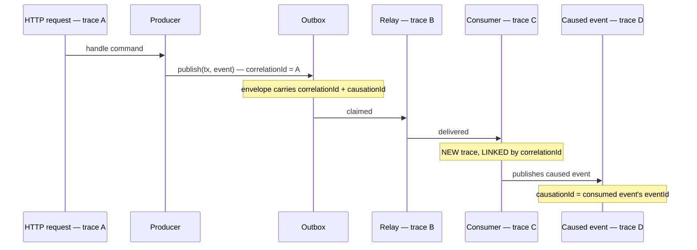

# Observability

> **Status:** v1.0 — complete. New in Phase 8.
> **Two failure classes, two responses.** Degradation — lag, latency, depth — is an SLO problem. An invariant breach — ordering violation, idempotency failure, silent loss — is a broken guarantee and pages immediately regardless of magnitude.

## Overview

**Business purpose.** Asynchronous failure is quiet. A synchronous API failure returns a 500 that someone sees; a consumer group that stops consuming produces no error anywhere — requests still succeed, events still publish, and a capability simply stops working until a customer notices days later. Observability is the only mechanism that makes asynchronous failure visible.

**Technical purpose.** Define the canonical metric catalogue, trace propagation model, structured log schema, SLOs, and alert routing for the Event Platform as a whole.

**This document consolidates; it does not duplicate.** Each Phase 8 document specifies the signals its own component emits. This one freezes the metric names, defines what they mean together, and specifies which combinations constitute an incident.

## Responsibilities

- Canonical metric catalogue with frozen names.
- Trace propagation across the asynchronous boundary.
- Structured log schema.
- Platform SLOs.
- Alert classification and routing.
- Diagnostic ordering for incidents.

## Non-responsibilities

| Not owned | Owner |
|---|---|
| Metrics infrastructure, dashboards, retention | `14-operations/monitoring.md` |
| Incident process and escalation | `14-operations/incident-response.md` |
| Audit record content and retention | `04-platform/audit-logs.md` |
| Business metrics derived from events | The consuming component |
| Per-component signal specifics | The respective Phase 8 document |

## The two failure classes

| | Degradation | **Invariant breach** |
|---|---|---|
| Examples | Consumer lag, publish latency, queue depth, DLQ growth | Ordering violation, idempotency failure, registry bypass, event loss |
| Meaning | The platform is slow | The platform is **wrong** |
| Threshold | Magnitude and duration | **Any occurrence** |
| Response | SLO burn-rate alerting | **Page immediately, count of one** |
| Resolution | Capacity, tuning, backpressure | Code fix; assume data is affected |

**An invariant breach at count one is a page.** Ordering, idempotency, and durability are guarantees other components are *built against* — a consumer that assumes per-aggregate ordering has no defence when ordering stops holding, and the damage compounds silently. Treating a single violation as noise to be aggregated into a daily digest is how a correctness bug becomes a month of corrupted projections.

This mirrors the treatment of provenance integrity and cross-tenant isolation in `11-knowledge-platform/observability.md`: those are not SLO degradations either.

## Metric catalogue

Names are **frozen**. A component may not emit a differently-named metric for the same concept.

### Publication

| Metric | Type | Labels | Meaning |
|---|---|---|---|
| `outbox_publish_duration_seconds` | histogram | `event_type`, `producer` | Publish-into-transaction latency |
| `outbox_events_published_total` | counter | `event_type`, `producer` | Events written to the outbox |
| `outbox_pending_depth` | gauge | — | Unpublished outbox rows |
| `outbox_relay_lag_seconds` | histogram | — | Commit → appended to bus |
| `outbox_relay_batch_size` | histogram | — | Rows per relay claim |
| `outbox_publish_attempts_total` | counter | `outcome` | Relay append attempts |
| `outbox_quarantined_total` | counter | `event_type` | Poison rows quarantined |

**`outbox_relay_lag_seconds` is the platform's single most important latency metric.** It measures the gap between a state change being durable and its notification being deliverable — the entire window in which the system is internally inconsistent. The p95 < 2 s guarantee (`README.md`) is measured here.

**`outbox_pending_depth` rising with `outbox_relay_lag_seconds` flat means throughput saturation.** Depth rising with lag *also* rising means the relay has stalled — a different problem with a different fix.

### Delivery

| Metric | Type | Labels | Meaning |
|---|---|---|---|
| `event_throughput_total` | counter | `event_type`, `group`, `outcome` | Events delivered |
| `consumer_lag_seconds` | gauge | `group`, `event_type` | Age of the oldest unprocessed event |
| `consumer_pending_depth` | gauge | `group` | Claimed but unacknowledged entries |
| `queue_depth` | gauge | `event_type` | Undelivered stream entries |
| `handler_duration_seconds` | histogram | `group`, `event_type` | Handler execution |
| `duplicate_delivery_total` | counter | `group`, `event_type` | Deliveries with `deliveryCount > 1` |
| `stalled_entries_claimed_total` | counter | `group` | Recovered from dead workers |

**`consumer_lag_seconds` is measured in time, not in entry count.** A backlog of 50,000 entries means nothing without knowing the drain rate; "the oldest unprocessed event is 40 minutes old" is directly actionable and is what the SLO is written against.

**`duplicate_delivery_total` is expected to be non-zero.** At-least-once delivery produces duplicates by design (`idempotency.md`); this metric quantifies redelivery pressure, and its ratio against `idempotency_suppressed_total` is what confirms suppression is keeping up.

### Retry and DLQ

| Metric | Type | Labels | Meaning |
|---|---|---|---|
| `retry_attempts_total` | counter | `group`, `event_type`, `classification` | Retry attempts |
| `retry_ratio` | gauge | `group` | Retries ÷ deliveries |
| `retry_budget_exhausted_total` | counter | `scope`, `key` | Budget exhaustion |
| `terminal_failures_total` | counter | `group`, `code` | Never-retried failures |
| `dlq_entries_total` | counter | `event_type`, `group`, `failure_code`, `source` | Dead-lettered |
| `dlq_depth` | gauge | `status` | Current DLQ size |
| `dlq_oldest_quarantined_age_seconds` | gauge | — | Triage backlog age |

**`dlq_depth` growth rate matters more than its absolute value.** A stable depth of 40 is a known backlog; a depth of 12 climbing by 5 per minute is an active incident, and rate-based alerting catches it far earlier than any threshold.

### Idempotency and ordering

| Metric | Type | Labels | Meaning |
|---|---|---|---|
| `idempotency_suppressed_total` | counter | `group`, `event_type` | Duplicates suppressed |
| `idempotency_handled_total` | counter | `group`, `event_type` | Events actually handled |
| `idempotency_suppression_ratio` | gauge | `group` | Suppressed ÷ delivered |
| `external_claims_unconfirmed` | gauge | `provider` | Claim-then-call reconciliation backlog |
| **`ordering_violations_total`** | counter | `group`, `event_type` | **Invariant breach** |
| `ordering_gaps_total` | counter | `group`, `event_type` | Ordered events dead-lettered |
| `aggregate_barrier_held` | gauge | `group` | Aggregates currently blocked |

### Replay, workers, registry

| Metric | Type | Labels | Meaning |
|---|---|---|---|
| `replay_runs_total` | counter | `mode`, `outcome` | Replay executions |
| `replay_events_delivered_total` | counter | `run_id`, `group` | Replay delivery rate |
| `replay_events_skipped_total` | counter | `reason` | Registry-rejected on replay |
| `replay_duplicates_suppressed_total` | counter | `group` | Replay safety proof |
| `worker_instances` | gauge | `group` | **Zero is an alert** |
| `worker_in_flight` | gauge | `group` | Concurrency utilization |
| `worker_shutdown_abandoned_total` | counter | — | Deploy hygiene |
| `registry_validation_failures_total` | counter | `event_type`, `reason` | Pre-commit rejections |
| `unknown_version_dead_letters_total` | counter | `group`, `event_type` | Version negotiation failures |

**Worker utilization is `worker_in_flight ÷ configured maximum`.** Sustained saturation with rising `consumer_lag_seconds` means genuine under-capacity; saturation with *flat* lag means the concurrency ceiling is correctly absorbing a burst.

## Tracing across the asynchronous boundary



**Consumers start a new trace and link, rather than extending the producer's.** A single request can cause hundreds of downstream events across hours; one continuous trace would become unreadable and would keep the originating span open far past the request. The link preserves navigability without the cost.

**Four envelope fields carry the connection**, and all four are mandatory on every event (`event-apis.md`):

| Field | Purpose in diagnosis |
|---|---|
| `eventId` | Identifies one event across outbox, bus, DLQ, replay, and idempotency markers |
| `correlationId` | Groups everything caused by one originating request — the primary incident query |
| `causationId` | The direct parent, enabling the causal chain to be walked one hop at a time |
| `aggregateId` | Groups everything about one entity, across event types |

**`correlationId` is the field that turns an incident into a query.** From a customer complaint to the request, to every event it caused, to every consumer that failed, in one search — as specified in `01-system-architecture/10-event-flow.md`.

**Span attributes, never separate spans, for sub-millisecond checks.** Idempotency (`idempotency.outcome`), version transformation (`version.from`, `version.to`), and barrier holds (`ordering.held_ms`) are attributes on the delivery span. A span per 3 ms check would multiply trace volume several-fold for no diagnostic gain.

## Structured logging

**Structured only.** No string interpolation, no free-text messages carrying data.

```ts
interface EventPlatformLogRecord {
  timestamp: string;
  level: 'debug' | 'info' | 'warn' | 'error';
  component: string;              // 'relay' | 'consumer' | 'retry' | ...
  event: 'delivered' | 'suppressed' | 'retried' | 'dead-lettered' | ...;
  eventId: string;
  eventType: string;
  eventVersion: number;
  correlationId: string;
  causationId: string | null;
  aggregateId: string;
  tenantId: string;
  group: string | null;
  outcome: string;
  durationMs: number | null;
  errorCode: string | null;       // classification, never a raw message
  traceId: string;
  spanId: string;
}
```

**Payloads are never logged.** Not at debug, not on error, not in the DLQ. Payloads carry identifiers rather than content by registry rule (`event-registry.md`), but logs reach a broader audience than the database and outlive it in aggregation systems.

**`errorCode` is a classification, never a raw message.** Raw messages routinely embed connection strings and bearer tokens from dependency errors; the classification is what the operator needs, and the sanitised message is retained on the DLQ entry instead (`dead-letter-queue.md`).

**Audit records are immutable and are not logs.** Every DLQ intervention and every replay run writes to `audit_log` synchronously, in the same transaction, append-only (`04-platform/audit-logs.md`). Logs are diagnostic and expire; audit records are evidence and do not.

## Service level objectives

| SLO | Target | Measured by |
|---|---|---|
| Publish latency | p95 < 10 ms added to the producer's transaction | `outbox_publish_duration_seconds` |
| **Relay lag** | **p95 < 2 s, p99 < 10 s** | `outbox_relay_lag_seconds` |
| Consumer lag | p95 < 30 s per group | `consumer_lag_seconds` |
| Delivery success | > 99.9% without dead-lettering | `dlq_entries_total ÷ event_throughput_total` |
| **Event durability** | **100% — no loss, ever** | Invariant, not an SLO |
| Ordering correctness | **100%** | Invariant, not an SLO |

**Durability and ordering are listed as invariants deliberately.** A 99.99% durability target would concede that roughly one event in ten thousand may vanish, which is not the guarantee ADR-020 makes. They appear in this table so that their *absence* from the SLO regime is explicit rather than an oversight.

## Alerts

### Invariant breaches — page immediately, count of one

| Alert | Condition | Meaning |
|---|---|---|
| **Ordering violation** | `ordering_violations_total` > 0 | Per-aggregate ordering has stopped holding |
| **Idempotency failure** | `external_claims_unconfirmed` ageing > 1 h | External effects in unknown state |
| **Registry bypass** | `terminal_failures_total{code="SchemaViolation"}` > 0 | An invalid payload reached a consumer despite pre-commit validation |
| **Publish-side DLQ** | `dlq_entries_total{source="publish"}` > 0 | Events are not reaching consumers at all |
| **Replay conflict** | `replay_runs_total{outcome="failed"}` > 0 | A projection is in an unknown state |
| **Critical-event DLQ** | Any DLQ entry for a `critical` event type | Depth 1, by registry criticality |
| **Unsafe retirement** | Retirement attempted within retention | Would render stored history unreplayable |

### Degradation — threshold and duration

| Alert | Condition |
|---|---|
| **Relay stalled** | `outbox_pending_depth` > 10,000 **or** no successful claim in 60 s |
| DLQ growth | `dlq_depth{status="quarantined"}` rate > 5/min, or absolute > 100 |
| Consumer lag | `consumer_lag_seconds` > 300 for 5 min |
| Zero consumers | `worker_instances{group}` == 0 for a registered group |
| Retry budget exhausted | `retry_budget_exhausted_total` > 0 |
| Suppression ratio | `idempotency_suppression_ratio` > 0.05 sustained |
| Deploy hygiene | `worker_shutdown_abandoned_total` > 0 per deploy |
| Backpressure | `replay_backpressure_pauses_total` sustained > 10 min |

**"Relay stalled" has two conditions because it has two failure modes.** Depth without progress is saturation; *no successful claim* with depth present is a stall — a stuck advisory lock, a connection leak, or a crash loop. The second is more urgent and is invisible to a depth threshold alone.

### Silence alerts

Three conditions look like health and are not:

| Alert | Condition | Why it matters |
|---|---|---|
| **Zero consumers** | `worker_instances{group}` == 0 | Events accumulate with no error anywhere; a failed deploy is otherwise invisible |
| **No suppressions** | `idempotency_suppressed_total` flat for 24 h | The suppression path may never have been wired in; the guarantee is untested |
| **No replay duplicates** | A replay reporting zero suppressions where overlap was expected | Idempotency may not be holding during replay |

**These exist because the dangerous failures in asynchronous systems are the quiet ones.** Every other alert fires on something happening; these fire on something *not* happening, which is the only way a silently-stopped consumer becomes visible before a customer reports it.

## Diagnostic ordering

When the platform is suspected, check in this order — each step distinguishes a different failure class:

1. **`outbox_relay_lag_seconds`** — if high, nothing downstream is meaningful yet.
2. **`outbox_pending_depth` and last successful claim** — saturation versus stall.
3. **`worker_instances` per group** — is anything consuming at all?
4. **`consumer_lag_seconds` per group** — one group or all of them?
5. **`retry_ratio` and `terminal_failures_total`** — handler health versus contract health.
6. **`dlq_depth` by `failure_code`** — grouped, not row by row.
7. **`ordering_violations_total`** — if non-zero, stop and treat as a correctness incident.

**One group lagging is a handler problem; every group lagging is a platform problem.** Step 4 is where that fork is decided, and taking the steps out of order routinely sends people to debug a handler when the relay had stalled ten minutes earlier.

## Business rules

1. **Metric names are frozen**; no component emits an alternate name for a catalogued concept.
2. **Invariant breaches page at count one**, without aggregation.
3. **Consumer lag is measured in time**, not entry count.
4. **Consumers start new traces linked by `correlationId`**, never extending the producer's.
5. **All four correlation fields are mandatory** on every event.
6. **Logs are structured**; payloads are never logged at any level.
7. **`errorCode` is a classification**, never a raw message.
8. **Audit records are immutable, synchronous, and separate from logs.**
9. **Durability and ordering are invariants**, not SLO targets.
10. **Silence alerts are mandatory** for every registered consumer group.
11. **Sub-millisecond checks are span attributes**, not spans.
12. **Every metric carries `event_type` and `group` where applicable** — platform-wide aggregates alone cannot locate a fault.

## Interfaces

```ts
interface EventPlatformMetrics {
  recordPublish(eventType: string, producer: string, durationMs: number): void;
  recordRelayLag(committedAt: Date, appendedAt: Date): void;
  recordDelivery(group: string, event: DomainEvent<unknown>, outcome: DeliveryOutcome): void;
  recordLag(group: string, eventType: string, oldestUnprocessedAt: Date): void;
  recordInvariantBreach(breach: InvariantBreach): void;
}

type DeliveryOutcome = 'handled' | 'suppressed' | 'retried' | 'dead-lettered';

interface InvariantBreach {
  kind: 'ordering-violation' | 'idempotency-failure' | 'registry-bypass'
      | 'publish-side-dlq' | 'replay-conflict';
  group: string | null;
  eventId: string;
  eventType: string;
  tenantId: string;
  detail: string;
}
```

**`recordInvariantBreach` is a separate method from the ordinary counters**, so that reporting a breach cannot be mistaken for reporting a metric. It always pages, always logs at `error`, and never samples — routing that would be easy to get wrong if breaches shared the generic counter path.

## Database impact

**No new tables. No schema change.** Metrics and traces are exported through OpenTelemetry (`14-operations/monitoring.md`); audit records use the existing `audit_log` (`03-database/tables.md`).

The only Phase 8 change to an existing Phase 3 table remains `outbox_events.publish_attempts`; the additive tables are declared in `dead-letter-queue.md` and `replay.md` under ADR-027 and ADR-028.

**Gauges are computed by query, not maintained as counters.** `outbox_pending_depth` reads the partial index `ixp_outbox_events__pending` (`03-database/indexes.md` §8) and `dlq_depth` reads the DLQ's partial index. A maintained counter would drift from reality after every crash — and would drift silently, which is the worst property a health metric can have.

## Security

- **Payloads never appear** in metrics, logs, traces, or alerts.
- **`tenantId` is a log field but never a metric label.** High-cardinality tenant labels would multiply every time series by the tenant count, and per-tenant metrics are derived from logs on demand instead.
- Metric labels are bounded, registry-derived values — event type, group, classification code — never user-supplied strings.
- Error messages are sanitised before storage or emission; credentials embedded in dependency errors are redacted (`dead-letter-queue.md`).
- Trace attributes carry identifiers only; `aggregateId` and `correlationId` are UUIDs and disclose nothing about content.
- Audit records are append-only and separately retained (`04-platform/audit-logs.md`).
- Reference `16-security/`; this component defines no controls of its own.

## Performance

| Concern | Approach |
|---|---|
| Metric recording | In-process counters; **< 0.1 ms**, no I/O on the hot path |
| Cardinality | Bounded labels; no `tenant_id`, no `event_id`, no `aggregate_id` |
| Trace sampling | Head-based, with **invariant breaches always sampled** |
| Gauge computation | Index-only scans on a schedule, never per event |
| Log volume | Debug-level suppressions sampled; errors never sampled |

**Cardinality discipline is the difference between observability and an outage.** `event_id` as a label would create one time series per event; the metrics backend would fall over long before the platform did.

**Invariant breaches bypass sampling entirely.** A breach dropped by a 1% sampler is a correctness incident with no trace attached — the single case where the trace matters most.

## Cross references

- `README.md` — delivery guarantees these signals verify; p95 < 2 s
- `transactional-outbox.md` — relay lag, pending depth, quarantine
- `consumer-groups.md` — lag, pending depth, stalled entries
- `retry-engine.md` — retry ratio, budgets, terminal failures
- `dead-letter-queue.md` — depth, growth rate, criticality routing
- `replay.md` — replay progress and duplicate-suppression proof
- `idempotency.md` — suppression ratio and unconfirmed external claims
- `ordering.md` — violation detection and its best-effort caveat
- `versioning.md` — version negotiation failures
- `workers.md` — instance counts, utilization, deploy hygiene
- `14-operations/monitoring.md` — metrics infrastructure and dashboards
- `14-operations/incident-response.md` — escalation and runbooks
- `04-platform/audit-logs.md` — immutable audit records
- `11-knowledge-platform/observability.md` — invariant-breach precedent
