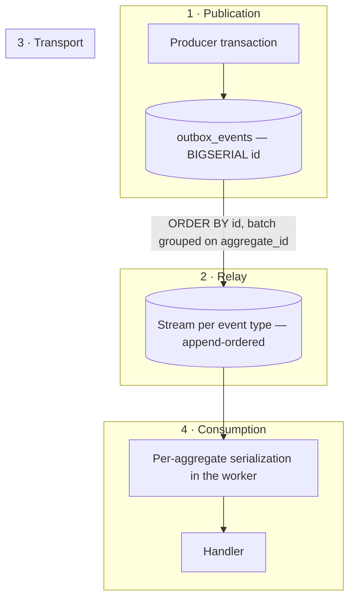
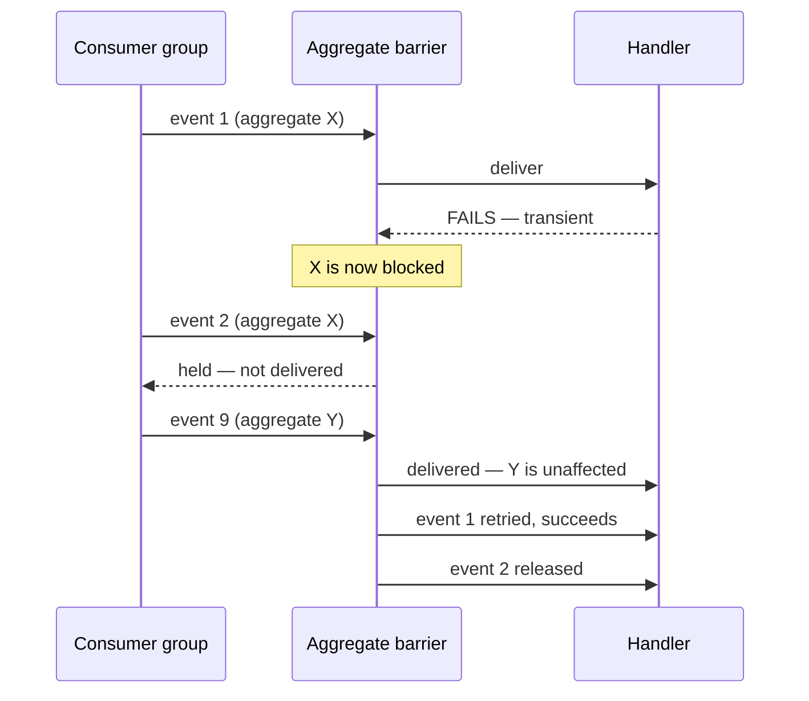
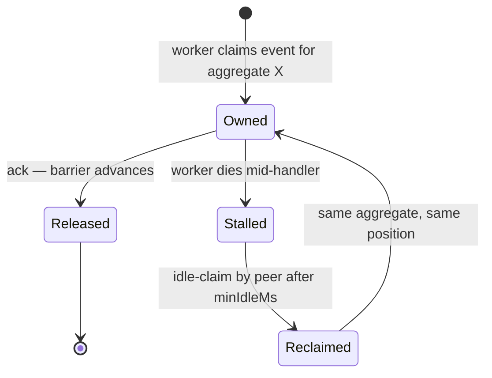

# Ordering

> **Status:** v1.0 — complete. New in Phase 8.
> **Per-aggregate ordering is guaranteed. Global ordering is refused.** The guarantee is produced by construction — sequence, transport, and serialization — not by a sequence number consumers compare.

## Overview

**Business purpose.** Two events about one article must take effect in the order they happened. If `ArticlePublished` is processed before the `ArticleContentUpdated` that preceded it, the published version is stale and the customer sees the wrong content. Ordering across *different* articles has no such requirement — nothing about article A depends on article B.

**Technical purpose.** Define exactly which ordering guarantees the platform makes, the mechanism that produces each one, and — equally important — the ones it does not make, so that consumers are built against reality rather than assumption.

**Global ordering is deliberately refused** (`README.md`). Totally ordering every event in a multi-tenant platform requires funnelling all publication through a single sequencer, which caps throughput at one core's serialization rate and makes every tenant's latency a function of every other tenant's volume. The guarantee costs enormously and is needed by nothing in the system.

## Responsibilities

- Per-aggregate ordering guarantee and its mechanism.
- Partition ordering within a stream.
- Causal ordering across event types.
- Documented ordering limits.
- Batch claiming preserving aggregate order.
- Aggregate ownership during concurrent processing.
- Ordering violation detection.

## Non-responsibilities

| Not owned | Owner |
|---|---|
| Duplicate suppression | `idempotency.md` |
| Whether a handler tolerates a gap | The handler's owning component |
| Delivery distribution | `consumer-groups.md` |
| Concurrency limits | `workers.md` |
| Stream topology | `event-bus.md` |

## The guarantee, stated precisely

| Scope | Guarantee | Mechanism |
|---|---|---|
| **Same aggregate, same event type, same group** | **Strict order** | Outbox sequence → single stream → per-aggregate serialization |
| **Same aggregate, different event types, same group** | **Not ordered.** Causal ordering available via `causationId` | Separate streams |
| **Different aggregates** | **Not ordered**, deliberately | Parallel by design |
| **Same event, different groups** | Independent; groups never coordinate | Fan-out |
| **Globally** | **Never ordered** | Refused |

**The second row is the one that surprises people and it is stated plainly rather than buried.** One stream per event type (`event-bus.md`) means `ArticleCreated` and `ArticlePublished` for the same article live on different streams and can be processed in either relative order. This is a real limit, and consumers that need cross-type ordering must handle it explicitly — the patterns are below.

## Mechanism: how per-aggregate order survives



Order is preserved at four points, and it survives only because **every one** of them holds:

**1 · The outbox assigns order at commit.** `outbox_events.id` is a `BIGSERIAL` assigned inside the producer's transaction. Two events published in one transaction receive increasing ids; two transactions touching one aggregate are serialized by the row locks they already hold on that aggregate. Ordering is therefore established by the database that already orders the state changes — not by a clock, which would be subject to skew.

**2 · The relay claims in `id` order and batches by aggregate.** `ORDER BY id ... FOR UPDATE SKIP LOCKED` reads in sequence, and the batch is grouped on `aggregate_id` so that two relay instances never split one aggregate's events across concurrent appends (`transactional-outbox.md`). Without the grouping, instance A could append event 2 before instance B appends event 1 — inverting order before it ever reaches a consumer.

**3 · Redis Streams preserve append order** within a stream, and one event type maps to exactly one stream. There is no partitioning within a stream, so there is no partition-assignment step that could reorder.

**4 · The worker serializes per aggregate.** A group whose event type declares `orderingRequired` processes at most one event per `aggregateId` at a time; different aggregates remain fully parallel (`workers.md`). Without this, two consumers in the same group could pull events 1 and 2 for one aggregate simultaneously and finish in either order.

**`aggregateId` is the partition key throughout.** It is the sole ordering dimension in the platform, which is why it is a required, non-nullable envelope field (`event-apis.md`).

## Surviving retries

This is where naive ordering implementations break.



**A failed event blocks its own aggregate and nothing else.** If event 1 fails and retries with backoff while event 2 proceeds, ordering is inverted precisely when the system is already degraded. The aggregate barrier holds subsequent events for that `aggregateId` until the blocking event resolves.

| Outcome for the blocking event | Barrier behaviour |
|---|---|
| Retry succeeds | Barrier releases; held events proceed in order |
| Dead-lettered | Barrier releases with a **recorded ordering gap** |
| Still retrying | Held events remain held, up to the retry window |

**Dead-lettering an ordered event is an ordering gap, and it is recorded rather than hidden.** Releasing the barrier means event 2 is processed while event 1 never was. The alternative — blocking the aggregate permanently — converts one failed event into an indefinitely stuck aggregate. The platform chooses to proceed and to make the gap explicit: the DLQ entry is flagged `orderingGap: true`, and replaying it later delivers out of order by definition, which the operator is told (`dead-letter-queue.md`, `replay.md`).

**Head-of-line blocking is scoped to one aggregate**, which is what makes it acceptable. A single stuck article does not stall the other 40,000.

## Surviving worker failover



**Ownership is per `(group, aggregateId)` and is a lease, not an assignment.** A worker holding aggregate X processes its events serially; if it dies, the lease expires and a peer reclaims from the same position.

**The reclaim window is a genuine ordering exposure and is bounded, not eliminated.** Between a worker dying and `minIdleMs` elapsing, no event for that aggregate is processed — correct, but delayed. The exposure is that the dead worker may have committed event 1 without acknowledging it; the peer redelivers event 1, idempotency suppresses it, and event 2 follows in order. **Ordering survives failover because idempotency makes the redelivery a no-op rather than a reordering** (`idempotency.md`).

**This is why cancellation never acknowledges** (`workers.md`). An acknowledged-but-unprocessed event would advance the barrier past work that never happened, and the gap would be silent.

## Surviving replay

| Replay mode | Ordering |
|---|---|
| **Range** | Delivered in `outbox_events.id` order — the original sequence |
| **Consumer** | Same; the group's aggregates are serialized as in live delivery |
| **Targeted (DLQ)** | **Out of order by definition** — an isolated event re-delivered after later ones |

**Range and consumer replay preserve order because they read from the sequence that defined it.** Replay selects from `outbox_events` ordered by `id`, which is the same order the relay used originally (`replay.md`).

**Targeted replay cannot preserve order and says so.** Replaying one dead-lettered event delivers it after events that followed it. Where the entry carries `orderingGap: true`, the operator is warned explicitly, because the correct remedy is often a range replay of that aggregate rather than a single-event replay.

**Live delivery continues during replay**, so a replayed historical event and a live event for the same aggregate can interleave. Both pass through the same aggregate barrier in the target group, so they are serialized — but their *relative* order is replay-arrival order, not original order. Rebuilds that must be strictly ordered use the shadow-then-swap path, where the shadow processes history before catching up to live (`replay.md`).

## Cross-stream and causal ordering

Since one event type is one stream, cross-type ordering for an aggregate is not guaranteed. Three patterns handle it, in order of preference:

**1 · Design handlers to be order-tolerant.** The best answer is usually to remove the dependency. A handler that checks aggregate state rather than assuming an event sequence works under any arrival order and needs no coordination.

**2 · Use `causationId` for causal ordering.** When event B is caused by the handling of event A, B carries `causationId = A.eventId`. A consumer receiving B can determine whether A was processed by checking `processed_events` for A's id in its own group — a causal check, not a global ordering guarantee. This is the mechanism behind causal ordering in the platform and it uses only frozen envelope fields.

**3 · Use aggregate version checks in the handler.** Where a domain component maintains a version on its aggregate, the handler compares and defers events arriving ahead of their predecessor. This is domain logic and lives in the domain component, never in the Event Platform.

**Combining event types into one stream to force ordering is not permitted.** It would couple unrelated consumers, force every subscriber of one type to read all others, and make a high-volume type's backlog block a low-volume one (`event-bus.md`).

## Ordering violation detection

Detection is separate from the guarantee. The guarantee is structural; detection exists to prove it is holding.

```ts
interface AggregateOrderMarker {
  group: string;
  aggregateId: string;
  lastEventId: string;      // UUIDv7 — lexicographically time-ordered
  lastProcessedAt: Date;
}
```

**`eventId` is UUIDv7, so it sorts lexicographically by generation time.** A delivered event whose `eventId` sorts *before* the last processed one for that `(group, aggregateId)` indicates a possible ordering violation, using only frozen envelope fields and no new sequence number.

**Detection is best-effort and deliberately labelled as such.** UUIDv7 embeds a wall-clock timestamp assigned in the producer's process, so events published by different hosts within the same millisecond may sort inconsistently with their true commit order. The mechanism is therefore a monitoring signal, not an enforcement gate — it never rejects an event.

**A sustained non-zero violation rate is a structural bug**, not noise: it means one of the four mechanisms above has stopped holding, most commonly because per-aggregate serialization was disabled by a concurrency misconfiguration.

Markers live in Redis with a TTL matching the retry window. **No schema change.**

## Business rules

1. **Per-aggregate ordering is mandatory** for event types declaring `orderingRequired`.
2. **Global ordering is never required and never provided.**
3. **`aggregateId` is the sole partition key.**
4. **The relay claims in `id` order** and groups batches by `aggregate_id`.
5. **One event type maps to one stream**; streams are never merged to force ordering.
6. **Ordered groups serialize per aggregate**; different aggregates run in parallel.
7. **A failed ordered event blocks its own aggregate only.**
8. **Dead-lettering an ordered event records an ordering gap** and releases the barrier.
9. **Ordering survives failover through idempotency**, not through coordination.
10. **Range and consumer replay preserve original order.**
11. **Targeted replay is out of order by definition** and is labelled so.
12. **Cross-type ordering is not guaranteed**; use tolerance, `causationId`, or domain version checks.
13. **Violation detection is best-effort observability** and never blocks an event.
14. **The Event Platform never inspects payloads to determine order** — `aggregateId` and sequence only.

**Concurrency:** the aggregate barrier is a Redis lease on `(group, aggregateId)`; concurrent claims for one aggregate cannot both succeed.

## Interfaces

```ts
interface AggregateBarrier {
  acquire(group: string, aggregateId: string, eventId: string): Promise<BarrierToken | 'held'>;
  release(token: BarrierToken): Promise<void>;
  releaseWithGap(token: BarrierToken, deadLetteredEventId: string): Promise<void>;
  heldCount(group: string): Promise<number>;
}

interface OrderingPolicy {
  eventType: string;
  orderingRequired: boolean;     // declared in the registry
  partitionKey: 'aggregateId';   // the only legal value
}

interface OrderingMonitor {
  record(group: string, event: DomainEvent<unknown>): Promise<OrderingObservation>;
}

type OrderingObservation =
  | { ordered: true }
  | { ordered: false; lastEventId: string; observedEventId: string };
```

**`partitionKey` has exactly one legal value.** Allowing an arbitrary key would let a component partition by `tenantId` — serializing an entire workspace's events — or by a payload field, which would require the platform to inspect business data. Constraining the type makes both unrepresentable.

**`acquire` returns `'held'` rather than blocking.** A blocking acquire would occupy a worker slot and a connection while waiting; returning `'held'` lets the runtime release the entry for later redelivery and move to another aggregate.

**`releaseWithGap` is a distinct method from `release`** so that recording the gap is not an optional flag someone forgets to pass.

## Database impact

**No new tables. No schema change.** Ordering uses `outbox_events.id` — the `BIGSERIAL` already defined in Phase 3 (`03-database/tables.md` §8) — as its sequence, and Redis for barriers and markers.

The only Phase 8 change to an existing Phase 3 table remains `outbox_events.publish_attempts` (`transactional-outbox.md`); the platform's additive tables are declared in `dead-letter-queue.md` and `replay.md` under ADR-027 and ADR-028.

**The relay must read the primary, and ordering is the sharpest reason why.** A replica lagging behind the primary can return rows whose ids are present but whose predecessors have not yet replicated, so a relay reading a replica could publish event 2 before event 1 exists to publish (`transactional-outbox.md`).

## Security

- Ordering decisions use `aggregateId` and sequence only; **payloads are never inspected**.
- Barriers are keyed by `(group, aggregateId)` and hold no tenant data beyond identifiers already in the envelope.
- Per-aggregate serialization is a correctness property, not an isolation boundary — **tenant isolation is enforced by RLS**, and no ordering mechanism substitutes for it (`consumer-groups.md`).
- `aggregateId` values are UUIDs and are not cross-tenant guessable, but the barrier is additionally scoped by group and never shared across tenants.
- Reference `16-security/`; this component defines no controls of its own.

## Performance

| Concern | Approach |
|---|---|
| Barrier acquire | Single Redis `SET NX`; **p95 < 2 ms** |
| Serialization cost | Per aggregate only; parallelism scales with distinct aggregates |
| Held events | Released for redelivery, never occupying a worker slot |
| Relay batching | Aggregate-grouped batches of 100 |
| Violation detection | One Redis read and one write per ordered delivery |
| Unordered types | **Zero ordering overhead** — no barrier, no marker |

**Ordering is opt-in per event type, and most types decline it.** A type without `orderingRequired` pays nothing: no barrier, no marker, no serialization. This matters because ordering caps a group's parallelism at the number of distinct aggregates in flight, and applying it universally would throttle high-volume types that never needed it.

**Throughput for an ordered type is bounded by aggregate diversity, not by worker count.** Ten thousand events across ten thousand articles parallelize fully; ten thousand events across one article are strictly serial. This is inherent to the guarantee, and a group whose traffic concentrates on few aggregates should not declare ordering unless it truly needs it.

## Observability

- **Metrics:** `ordering_violations_total{group,event_type}`, `aggregate_barrier_held{group}` (gauge), `aggregate_barrier_wait_seconds{group}` (histogram), `ordering_gaps_total{group,event_type}`, `ordered_aggregates_in_flight{group}` (gauge), `barrier_acquire_duration_seconds`.
- **Tracing:** barrier hold is a span attribute on the delivery span (`ordering.held_ms`, `ordering.aggregate_id`), not a separate span.
- **Logging:** group, aggregate id, event id, barrier outcome — never payloads.
- **Business KPIs:** ordering violation rate (structural correctness) and barrier wait p99 (whether ordering is throttling a group).
- **Alerts:** `ordering_violations_total` non-zero (**page — invariant breach**, per `README.md`: an ordering violation is a broken guarantee, not degraded performance); `ordering_gaps_total` non-zero (an ordered event was dead-lettered — the aggregate is now inconsistent and needs a range replay); `aggregate_barrier_held` sustained above threshold (an aggregate is stuck); barrier wait p99 exceeding delivery SLO (ordering is the bottleneck, and aggregate diversity is too low for the traffic).

**Ordering violations page immediately and are never rate-limited into a digest.** A violation means a guarantee other components were built against has stopped holding, which is a different class of problem from a slow queue — the same treatment given to provenance integrity and cross-tenant isolation breaches in `11-knowledge-platform/observability.md`.

## Cross references

- `event-bus.md` — one stream per event type; append-order preservation
- `transactional-outbox.md` — `BIGSERIAL` sequence, aggregate-grouped batch claiming, primary-only reads
- `consumer-groups.md` — delivery distribution and idle-claim recovery
- `workers.md` — per-aggregate serialization in the concurrency governor
- `idempotency.md` — why redelivery after failover does not reorder
- `retry-engine.md` — barrier interaction during backoff and exhaustion
- `dead-letter-queue.md` — `orderingGap` flag on quarantined ordered events
- `replay.md` — ordering across the three replay modes
- `event-registry.md` — `orderingRequired` declaration
- `03-database/tables.md` §8 — `outbox_events.id`
