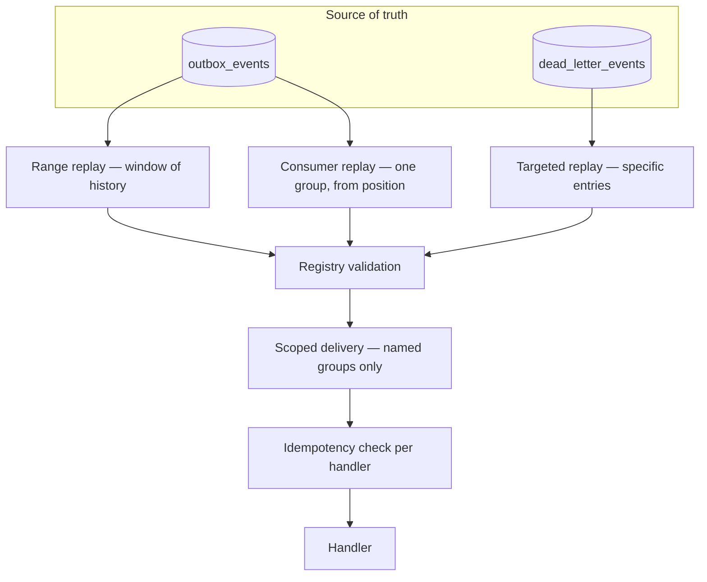
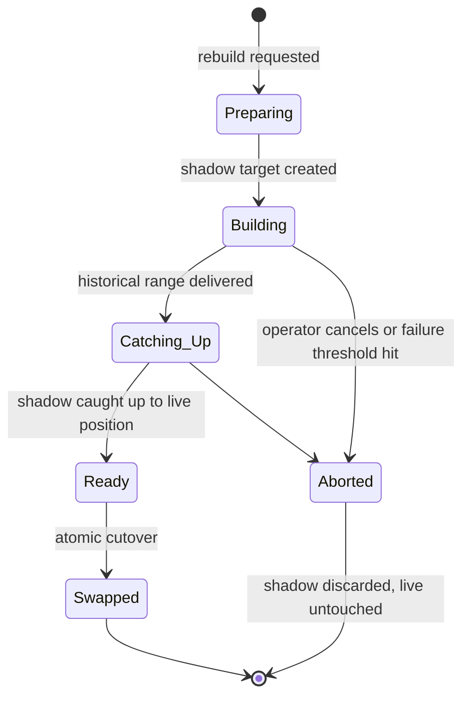

# Replay

> **Status:** v1.0 — complete. New in Phase 8.
> **Replay re-delivers events; it does not re-execute effects.** Every replayed event passes through the same registry validation, the same tenant context, and the same idempotency checks as its original delivery. A correctly built consumer cannot tell the difference — and that is the entire safety model.

## Overview

**Business purpose.** Read models drift, consumers ship with bugs, dependencies suffer outages, and new projections need history. Replay is how the platform recovers without asking customers to redo work: rebuild a stale analytics rollup, re-run a projection after a fix, deliver a week of events to a consumer that was silently down.

**Technical purpose.** Re-deliver events from the durable record in PostgreSQL under explicit operator control, with bounded scope, tracked progress, and guaranteed idempotency.

**Replay reads from PostgreSQL, never from Redis.** The bus holds seven days and trims under pressure; `outbox_events` is the durable record and is the only acceptable replay source. This is the sharpest practical consequence of **Redis is transport; PostgreSQL is truth** (`README.md`) — replaying from a stream that has been trimmed produces a *silently partial* rebuild, which is worse than no rebuild at all because it looks like it worked.

## Responsibilities

- Range replay — a time or id window.
- Consumer replay — re-deliver history to one group.
- Targeted replay — specific events, typically from the DLQ.
- Snapshot coordination for projection rebuilds.
- Replay safety: scoping, validation, rate limiting, progress tracking.

## Non-responsibilities

| Not owned | Owner |
|---|---|
| Duplicate suppression | `idempotency.md` |
| Quarantine and eligibility rules | `dead-letter-queue.md` |
| Schema and version validity | `event-registry.md` |
| Delivery mechanics | `consumer-groups.md` |
| What a handler does on redelivery | The handler |
| Deciding a rebuild is needed | The owning domain component |

**Replay never repairs data directly.** It re-delivers events and lets handlers rebuild their own state. A replay component that wrote to a projection table would be duplicating handler logic in the Event Platform — and would drift from it the moment the handler changed.

## Replay modes



| Mode | Selects | Delivers to | Typical use |
|---|---|---|---|
| **Range** | Time or id window, filtered by type and tenant | Named groups | Rebuild after a fix; backfill a new projection |
| **Consumer** | All history for the types a group subscribes to | That group only | New consumer needs history; group was down |
| **Targeted** | Explicit event ids or a DLQ filter | Original group (delivery-side) or all subscribers (publish-side) | Post-incident recovery |

**Every mode requires an explicit target group list.** There is no "replay to everyone" default. An operator rebuilding one analytics projection who accidentally re-delivers to the notification consumer sends real customers a week of duplicate emails — an effect no idempotency check can retract once the send has left the platform.

**Publish-side DLQ entries are the sole exception**, and only because those events *never reached any consumer*. Delivering to all subscribers is not a duplicate; it is the original delivery, late (`dead-letter-queue.md`).

## Replay safety

```mermaid
sequenceDiagram
    participant OP as Operator
    participant RP as Replay Coordinator
    participant REG as Event Registry
    participant CG as Consumer group
    participant IDEM as Idempotency store

    OP->>RP: request(scope, targets, mode)
    RP->>RP: estimate count; reject if unbounded
    RP->>OP: confirmation required — N events, M groups
    OP->>RP: confirm
    RP->>REG: validate each event (type, version, schema)
    REG-->>RP: invalid -> skipped and recorded, never delivered
    RP->>CG: deliver with replay marker
    CG->>IDEM: seen (group, idempotencyKey)?
    IDEM-->>CG: yes -> suppress, count as duplicate
    IDEM-->>CG: no -> handle, then record
    CG-->>RP: progress
    RP->>RP: persist checkpoint
```

### The five safety properties

| Property | Mechanism |
|---|---|
| **Bounded** | Count estimated first; unbounded scope rejected outright |
| **Validated** | Registry re-validates every event; invalid events are skipped and recorded |
| **Scoped** | Target groups named explicitly; never broadcast by default |
| **Idempotent** | Standard per-handler duplicate suppression; no replay-specific bypass |
| **Resumable** | Checkpointed, so an interrupted replay continues rather than restarting |

**Registry validation is never bypassed during replay.** A three-week-old event may reference a version since retired or a schema since narrowed. Validating on the way back in is what prevents replay from becoming a channel that injects payloads no current consumer accepts — and it is why the registry cannot be a runtime-editable store (`event-registry.md`).

**A skipped event is recorded, never dropped quietly.** The replay run records each skip with its reason, so an operator learns "8,412 delivered, 3 skipped: version retired" rather than believing a rebuild was complete.

### Why replay does not duplicate side effects

Replay adds no new mechanism. It relies entirely on the one that already makes at-least-once delivery safe:

```ts
async function handleWithIdempotency(event: DomainEvent<unknown>, ctx: TenantContext) {
  const key = deriveIdempotencyKey(event);
  await db.transaction(async (tx) => {
    const inserted = await tx.insert(processedEvents)
      .values({ consumerGroup: GROUP, eventId: event.eventId, idempotencyKey: key })
      .onConflictDoNothing()
      .returning();
    if (inserted.length === 0) return;   // already handled — suppress
    await handler.handle(event, ctx, tx);
  });
}
```

**The replayed event is byte-identical to the original**, so it derives the same idempotency key, so the conflict fires, so the handler does not run twice. This is the entire safety argument, and it holds only because events are immutable and payloads are stored exactly as published (`dead-letter-queue.md`, `idempotency.md`).

**Consumers are told a delivery is a replay, and almost none of them should care.** The marker exists for observability — distinguishing replay load from live load on dashboards — and for the narrow class of handlers that legitimately suppress outbound notifications during a rebuild. A handler that *branches its business logic* on the replay marker has made replay unsafe: it now behaves differently on redelivery, which is exactly what idempotency is supposed to rule out.

```ts
interface ReplayContext {
  isReplay: true;
  replayRunId: string;
  originalOccurredAt: Date;      // handlers must use this, never "now"
}
```

**`originalOccurredAt` is the field that prevents the most common replay bug.** A handler stamping `now()` while replaying three-week-old events writes an entire month of history at today's timestamp, silently corrupting every time-series projection it maintains. Handlers use the event's own occurrence time; the platform never rewrites it.

## Snapshot coordination

Rebuilding a projection is more than replaying events — the existing state must be dealt with.



| Phase | Behaviour |
|---|---|
| **Preparing** | A shadow projection is created; the live projection keeps serving |
| **Building** | The historical range is replayed into the shadow |
| **Catching up** | Live events are applied to the shadow until it reaches the current position |
| **Ready** | Shadow is consistent and verifiable against the live projection |
| **Swapped** | Atomic cutover; the old projection is retained briefly for rollback |
| **Aborted** | Shadow discarded; the live projection was never touched |

**Shadow-then-swap exists because the naive approach has a visible outage.** Truncating a projection and replaying into it leaves customers reading empty data for the duration of the rebuild — minutes to hours. The shadow approach keeps reads serving stale-but-correct data throughout, and the cutover is a single transaction.

**The catch-up phase is the part that is easy to get wrong.** Between the start of the historical replay and the cutover, live events continue to arrive. The shadow subscribes to live delivery *before* the historical replay begins, so nothing falls into the gap; overlapping events are suppressed by the same idempotency check that makes replay safe in the first place.

**Snapshot coordination is offered by the platform but owned by the domain.** The Event Platform provides the shadow lifecycle and the cutover primitive; deciding that a projection needs rebuilding, and verifying the shadow is correct before swapping, belongs to the component that owns the projection.

## Rate limiting

| Control | Default | Rationale |
|---|---|---|
| Delivery rate | 500 events/s per replay run | Keeps replay from starving live delivery |
| Concurrent runs | 2 platform-wide | Bounds total load |
| Backpressure | Pause when target group lag exceeds threshold | Replay yields to live traffic |
| Priority | Live delivery always wins | Replay is never urgent enough to degrade production |

**Replay yields; it never competes.** A rebuild pushing a consumer group's lag past its SLO has converted a maintenance task into a customer-visible incident. Backpressure on target-group lag is what keeps a large replay from becoming an outage, and it means a big rebuild simply takes longer under load — the correct trade.

## Business rules

1. **Replay reads from `outbox_events` or `dead_letter_events`, never from Redis.**
2. **Registry validation is always re-run**; there is no bypass path.
3. **Invalid events are skipped and recorded**, never delivered and never silently dropped.
4. **Target groups are always explicit.** No broadcast default.
5. **Publish-side DLQ entries may target all subscribers** — they reached no consumer originally.
6. **Replayed events are byte-identical** to the originals.
7. **Idempotency is the sole duplicate defence**; replay adds no special-case suppression.
8. **Handlers use `originalOccurredAt`**, never wall-clock time.
9. **Handlers must not branch business logic on the replay marker.**
10. **Scope is bounded and estimated before execution**; unbounded requests are rejected.
11. **Runs are checkpointed and resumable.**
12. **Replay is rate-limited and yields to live delivery.**
13. **Every run is attributed and audited** — actor, scope, targets, outcome.
14. **Tenant context comes from each event's envelope**, exactly as in live delivery.

**Idempotency:** guaranteed by handler-level suppression on `(consumerGroup, idempotencyKey)`. **Concurrency:** a replay run holds a lock on `(targetGroup, mode)`; overlapping runs against the same group are rejected rather than interleaved.

## Interfaces

```ts
interface ReplayCoordinator {
  estimate(request: ReplayRequest): Promise<ReplayEstimate>;
  start(request: ReplayRequest, actor: string): Promise<ReplayRun>;
  status(runId: string): Promise<ReplayRun>;
  pause(runId: string, actor: string): Promise<void>;
  resume(runId: string, actor: string): Promise<void>;
  abort(runId: string, actor: string, reason: string): Promise<void>;
}

type ReplayRequest =
  | { mode: 'range'; targetGroups: string[]; from: Date; to: Date;
      eventTypes?: string[]; tenantId?: string }
  | { mode: 'consumer'; targetGroup: string; fromPosition: 'earliest' | Date }
  | { mode: 'targeted'; deadLetterIds: string[] };

interface ReplayEstimate {
  eventCount: number;
  targetGroups: string[];
  estimatedDurationMs: number;
  withinBounds: boolean;
  rejectionReason?: string;
}

interface ReplayRun {
  id: string;
  request: ReplayRequest;
  status: 'pending' | 'running' | 'paused' | 'completed' | 'aborted' | 'failed';
  delivered: number;
  skipped: number;
  skipReasons: Record<string, number>;
  suppressedAsDuplicate: number;
  checkpoint: string | null;
  startedBy: string;
  startedAt: Date;
  completedAt: Date | null;
}
```

**`targetGroups` is required in every variant** — a request without targets does not typecheck, so accidental broadcast is a compile error rather than an operational one. The same structural technique as the transaction-bound publisher (`transactional-outbox.md`) and the two-variant `RetryDecision` (`retry-engine.md`).

**`estimate` is separate from `start`** so scope is known before anything is delivered. An operator seeing "2.4 million events across 6 groups" reconsiders; one who typed a date range a year too wide and pressed go does not get the chance.

**`suppressedAsDuplicate` is a success metric.** A rebuild reporting a high suppression count is proof idempotency is working; a rebuild reporting zero suppressions where overlap was expected means duplicate effects may have occurred and warrants investigation.

## Database impact

**One new table: `replay_runs`.** Additive, Event Platform-owned, changing nothing in Phase 3's schema (`03-database/tables.md`).

| Aspect | Definition |
|---|---|
| Primary key | `id` (UUIDv7) |
| Tenancy | Platform-operational; **operator-scoped**, not workspace-owned. Tenant-filtered replays record `tenant_id` for audit |
| Columns | `mode`, `request JSONB`, `status`, `delivered`, `skipped`, `skip_reasons JSONB`, `suppressed_as_duplicate`, `checkpoint`, `started_by`, timestamps |
| CHECK | `status IN ('pending','running','paused','completed','aborted','failed')` |
| Partial unique | One active run per target group: unique on `(target_group)` where `status IN ('pending','running','paused')` |
| Indexes | `(status, started_at DESC)` |

**The partial unique index is what makes "no overlapping runs" unbypassable.** Two concurrent rebuilds of the same projection interleave writes into one shadow and produce a corrupt result that passes every superficial check. Enforced in the database, the second run fails to start rather than quietly corrupting the first — the same push-invariants-into-constraints discipline used throughout (`03-database/tables.md`).

**Replay reads `outbox_events` on the primary or a replica.** Unlike the relay, which must read the primary to avoid publishing stale claims (`transactional-outbox.md`), replay operates on committed history and may read a replica — which is preferable, since a large range scan should not compete with live writes.

**Retention interaction:** `outbox_events` retains 30 days (`03-database/tables.md` §8). Range replay beyond that window is impossible and the estimator rejects it explicitly rather than silently returning a partial set.

## Security

- Replay is a **privileged platform operation** requiring an explicit capability, distinct from workspace administration.
- Every run — start, pause, resume, abort — is written to `audit_log` with actor, scope, and target groups (`04-platform/audit-logs.md`).
- **Tenant context is taken from each event's envelope**, so a replayed delivery runs under exactly the isolation of its original.
- Replay workers use the **RLS-enforced application role**; a replay cannot reach data its live equivalent could not.
- Cross-tenant range replay is available only to platform operators and is audited as a cross-tenant operation.
- Replay never modifies events. `outbox_events` and `dead_letter_events` payloads are read-only to this component.
- Reference `16-security/`; this component defines no controls of its own.

## Performance

| Concern | Approach |
|---|---|
| Estimation | Index-only count on `(occurred_at)`; **p95 < 2 s** for a 30-day window |
| Range scan | Keyset pagination on `id`; never `OFFSET` |
| Delivery rate | 500 events/s per run, backpressured on target lag |
| Checkpointing | Every 1,000 events; bounds re-delivery after interruption |
| Replica reads | Range scans served from a replica |
| Live impact | Replay pauses when target-group lag exceeds threshold |

**Keyset pagination matters at replay scale.** `OFFSET` on a multi-million-row scan degrades quadratically, so a large replay would start fast and finish never — the failure mode looks like a hang rather than an error.

## Observability

- **Metrics:** `replay_runs_total{mode,outcome}`, `replay_events_delivered_total{run_id,group}`, `replay_events_skipped_total{reason}`, `replay_duplicates_suppressed_total{group}`, `replay_run_duration_seconds`, `replay_active_runs` (gauge), `replay_backpressure_pauses_total`.
- **Tracing:** each run is a trace; each delivery is a span linked to the original event's `correlationId`, so a replayed delivery navigates back to the operation that first produced the event.
- **Logging:** run id, mode, actor, scope, target groups, progress counters, skip reasons — never payloads.
- **Business KPIs:** replay duplicate-suppression rate (idempotency correctness) and skipped-event count (contract drift between stored history and the current registry).
- **Alerts:** replay run failed (**page** — a rebuild left a projection in an unknown state); skipped events above 1% of a run (registry drift); backpressure pauses sustained beyond 10 minutes (replay cannot make progress against live load); active run exceeding its estimate by 3×; **zero duplicates suppressed on a run where overlap was expected** (**page** — the idempotency guarantee may not be holding).

## Cross references

- `idempotency.md` — the canonical duplicate-suppression mechanism replay depends on entirely
- `dead-letter-queue.md` — eligibility, targeted replay, publish-side versus delivery-side
- `event-registry.md` — validation re-run on every replayed event
- `transactional-outbox.md` — the durable source and its 30-day retention
- `consumer-groups.md` — delivery mechanics shared with live traffic
- `workers.md` — hosts replay execution
- `ordering.md` — per-aggregate ordering during replay
- `04-platform/audit-logs.md` — attribution of every run
- `14-operations/incident-response.md` — replay as a recovery procedure
