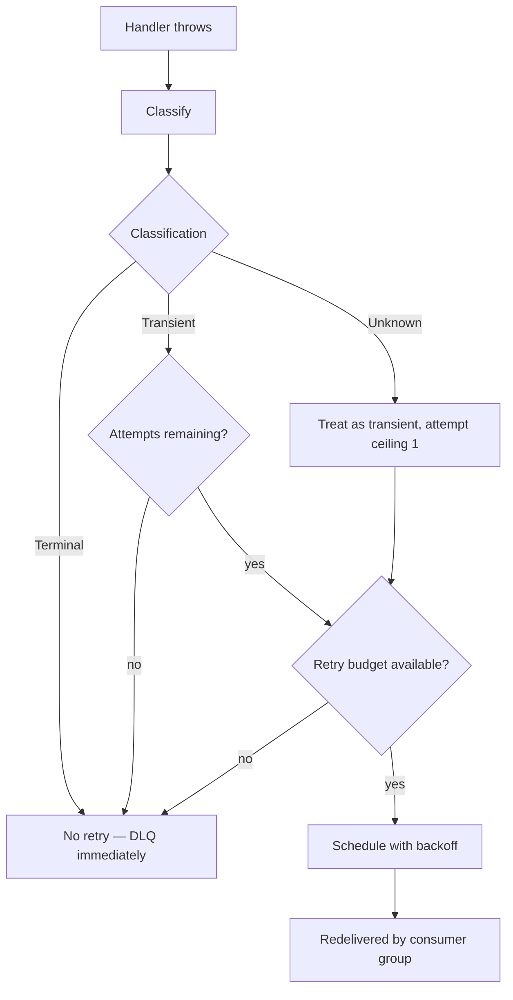
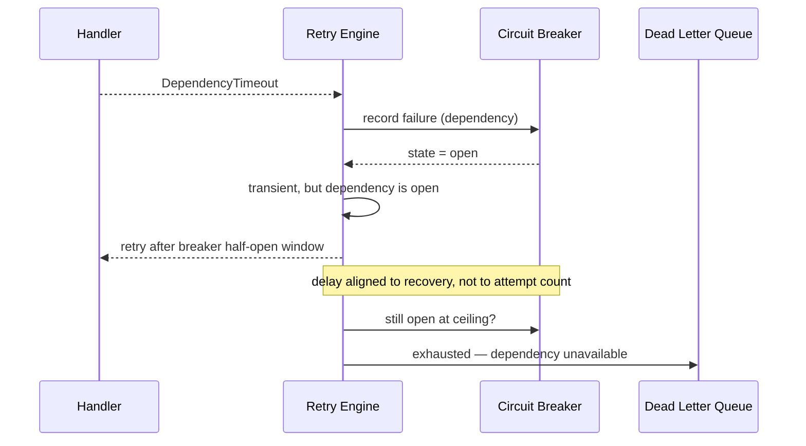
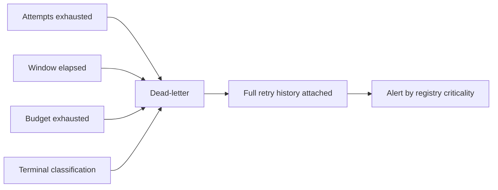

# Retry Engine

> **Status:** v1.0 — complete. New in Phase 8.
> **Retry is a decision, not a reflex.** The Retry Engine classifies a failure and decides whether repeating the work could plausibly succeed. When it could not, the event goes to the dead-letter queue immediately.

## Overview

**Business purpose.** Transient failures are the normal condition of a distributed system: a database failover, a provider timeout, a Redis reconnect, a deploy restarting a dependency. Retrying absorbs them invisibly. Retrying the *wrong* failure is actively harmful — it multiplies load on a struggling dependency, delays the operator signal that something is permanently broken, and in the case of guardrail decisions, repeatedly re-attempts something the platform has already refused.

**Technical purpose.** Provide a single classification function and a single backoff policy for all event delivery, so that "should this be retried?" is answered in one place rather than reinvented inside every handler.

**The engine decides; consumer groups execute.** Delivery distribution never retries (`consumer-groups.md`). A handler that fails hands its error to the Retry Engine, which returns a decision. Splitting the two keeps retry policy uniform across every consumer in the platform.

## Responsibilities

- Failure classification: transient versus terminal.
- Exponential backoff with jitter.
- Retry windows and attempt ceilings.
- Retry budgets — per group, per event type, and platform-wide.
- Circuit breaker coordination.
- Retry exhaustion and hand-off to the DLQ.

## Non-responsibilities

| Not owned | Owner |
|---|---|
| Deciding *what* the handler does | The handler's owning domain component |
| Whether a business operation should be re-attempted | The domain component |
| Delivery distribution and acknowledgement | `consumer-groups.md` |
| Quarantine storage, inspection, manual replay | `dead-letter-queue.md` |
| Suppressing duplicate effects across retries | `idempotency.md` |
| AI provider retry and fallback | `08-ai-platform/retry-strategy.md` |
| Circuit breaker implementation | `04-platform/resilience.md` |
| Relay publish retry (pre-bus) | `transactional-outbox.md` |

**Two retry engines exist and they are deliberately separate.** This one governs *event delivery* — a handler failed, should the event be redelivered? The AI Platform's governs *model invocation* — a provider call failed, should it be re-issued or routed elsewhere (`08-ai-platform/retry-strategy.md`). They share a discipline but not a code path, because their failure taxonomies are different: one classifies infrastructure faults, the other classifies model and provider behaviour.

## Failure classification



### Terminal failures — never retried

| Failure | Why repeating cannot help |
|---|---|
| **`GuardrailBlocked`** | A deliberate refusal by policy. The same input yields the same refusal, and retrying re-attempts something the platform has decided must not happen. |
| **`ValidationRejected`** | The input violates a documented rule. Rules are deterministic; the input is immutable. |
| **`SchemaViolation`** | The payload does not match the registered schema. Events are immutable, so the payload will never match. |
| **`UnknownEventType`** | The type is absent from the registry. Absence is a deployment or contract fact, not a fault that clears on its own. |
| **`AuthorizationFailure`** | Permission is denied. Retrying is an authorization retry loop against a system that has already said no. |

**`GuardrailBlocked` is never retried, in any component, under any circumstance.** This is the platform's most-repeated rule and it is stated identically here and in `08-ai-platform/retry-strategy.md` (Rule 1). A guardrail block is the safety system working; retrying it is an attempt to obtain a different answer to a question that has been settled.

**`UnknownEventType` deserves a note.** It looks transient — a consumer deployed before the producer might genuinely resolve once the deploy completes. It is classified terminal anyway, because the alternative is silent: an event retrying for hours against a consumer that never learns the type produces no clear signal, while a DLQ entry names the missing registration immediately and replays cleanly once the deploy lands (`replay.md`). The registry's rules make this rare — a type cannot be retired while a consumer declares it (`event-registry.md`).

### Transient failures — retried

| Failure | Typical cause |
|---|---|
| `TransportFailure` | Redis or network interruption |
| `DatabaseUnavailable` | Failover, connection exhaustion, restart |
| `DependencyTimeout` | A downstream service exceeded its deadline |
| `LockContention` | Concurrent access resolved by re-attempt |
| `RateLimited` | Quota exceeded; honours `retryAfter` when supplied |
| `SerializationFailure` | PostgreSQL 40001 under concurrent transactions |
| `TemporaryResourceExhaustion` | Memory or pool pressure |

### Unknown failures

An error matching no classifier is treated as **transient with an attempt ceiling of one**: it gets exactly one retry, then dead-letters.

**This is the deliberately conservative choice.** Classifying unknowns as fully transient would let a novel permanent bug retry to the ceiling on every event, burning budget and hiding the signal. Classifying them as terminal would dead-letter genuine blips. One retry absorbs the blip; a second failure produces a DLQ entry naming an unclassified error — which is itself the alert that the taxonomy needs an entry.

```ts
type FailureClass = 'transient' | 'terminal' | 'unknown';

interface Classification {
  class: FailureClass;
  code: string;
  retryAfterMs?: number;      // honoured when the failure supplies it
  reason: string;             // recorded on the DLQ entry
}

interface FailureClassifier {
  classify(error: unknown): Classification;
}
```

**Classification is by error type, never by message string.** Message matching breaks silently when a dependency rewords an error, and it breaks in the dangerous direction — a `GuardrailBlocked` that stops matching becomes retryable. Domain errors carry an explicit class; only third-party errors are mapped, and that mapping is a source-controlled table.

## Backoff

```ts
interface BackoffPolicy {
  initialDelayMs: number;     // 1_000
  multiplier: number;         // 2
  maxDelayMs: number;         // 300_000  (5 min)
  maxAttempts: number;        // 5, per group
  jitter: 'full';
}
```

| Attempt | Base delay | Actual delay (full jitter) |
|---|---|---|
| 1 | 1 s | 0–1 s |
| 2 | 2 s | 0–2 s |
| 3 | 4 s | 0–4 s |
| 4 | 8 s | 0–8 s |
| 5 | 16 s | 0–16 s |

**Full jitter is mandatory, not optional tuning.** A database failover fails every in-flight handler simultaneously; with fixed backoff every one of them retries at the same instant, producing a synchronised thundering herd against a dependency that has just come back. Full jitter — a uniform random draw from `[0, base]` — spreads the recovery load and is the difference between a failover that self-heals and one that oscillates.

**`retryAfter` overrides the computed delay** when a failure supplies one, so a rate-limited dependency is respected rather than second-guessed.

**Retry delay is implemented as delayed redelivery, not as sleeping in the handler.** A worker sleeping for 16 s holds a slot, a connection, and a bus entry. The entry is instead released with a scheduled visibility time, so the slot is free and the retry is delivered when it becomes due. This is why cancelled and failed entries are never acknowledged (`consumer-groups.md`).

## Retry windows

| Bound | Value | Behaviour on breach |
|---|---|---|
| Max attempts | 5 (group-configurable) | Exhausted → DLQ |
| Max retry window | 1 hour from first attempt | Exhausted → DLQ, even with attempts remaining |
| Bus retention | 7 days | Retention is longer than any window by design |

**The window bounds wall-clock time, not just attempt count.** A handler failing after a four-minute timeout would consume five attempts across more than twenty minutes; without a window, a slower handler could stretch retries beyond the point where the event is still meaningful to act on. The window makes retry duration predictable regardless of handler latency.

## Retry budgets

```ts
interface RetryBudget {
  scope: 'group' | 'eventType' | 'platform';
  maxRetryRatio: number;      // retries ÷ deliveries over the window
  windowMs: number;           // 60_000
  onExhausted: 'dead-letter'; // never 'drop'
}
```

| Scope | Default ratio | Protects against |
|---|---|---|
| Consumer group | 0.20 | One broken handler amplifying its own load |
| Event type | 0.20 | A bad producer deployment flooding all consumers |
| Platform | 0.10 | Correlated failure turning into a retry storm |

**A budget is a circuit breaker for retries.** When a handler is failing on 90% of events, retrying each five times triples the load on whatever is already broken. Once the ratio is exceeded, further failures dead-letter immediately instead of retrying — the platform stops amplifying and starts reporting.

**Budget exhaustion is a page, not a warning.** It means retries have stopped absorbing failures, so every subsequent failure lands in the DLQ. That is the correct behaviour and it is also a live incident.

**`onExhausted` has exactly one legal value.** Budget exhaustion changes *where* an event goes, never *whether* it survives. No event is discarded — the platform's hardest rule (`README.md`).

## Circuit breaker coordination



| Breaker state | Retry behaviour |
|---|---|
| Closed | Normal exponential backoff |
| Open | Delay extended to the breaker's half-open window — retrying sooner is guaranteed to fail |
| Half-open | Single probe permitted; success closes the breaker |

**The breaker is owned by `04-platform/resilience.md`; the Retry Engine only reads its state.** Two components independently deciding a dependency is unhealthy would produce contradictory behaviour, so there is one breaker and one authority on it.

**Coordination prevents pointless attempts.** With an open breaker, every retry fails instantly, burning attempts and budget without ever reaching the dependency. Aligning the retry delay to the recovery window means the attempts are spent when they have a chance of succeeding.

## Retry exhaustion



Exhaustion hands the DLQ a complete record: every attempt, its classification, its error, and its timestamp (`dead-letter-queue.md`). **The retry history is written by this engine** — reconstructing it later from logs is not possible once retention rolls.

## Business rules

1. **Terminal failures are never retried.** `GuardrailBlocked`, `ValidationRejected`, `SchemaViolation`, `UnknownEventType`, `AuthorizationFailure`.
2. **`GuardrailBlocked` is never retried in any component**, matching `08-ai-platform/retry-strategy.md` Rule 1.
3. **Only transient failures are retried.**
4. **Unknown failures get exactly one retry**, then dead-letter.
5. **Classification is by error type, never message matching.**
6. **Full jitter is mandatory.**
7. **Retry is delayed redelivery**, never in-handler sleeping.
8. **Both an attempt ceiling and a wall-clock window apply**; whichever binds first exhausts.
9. **Exhaustion always routes to the DLQ**; `onExhausted: 'drop'` does not exist.
10. **Retry budgets bound amplification** at group, type, and platform scope.
11. **Breaker state extends retry delay**, and the breaker is owned elsewhere.
12. **Retry history is recorded** at every attempt and handed to the DLQ intact.
13. **The engine never inspects payloads** — classification uses the error, never the event's business meaning.

**Idempotency:** every retry is a redelivery of an immutable event and is safe only because handlers are idempotent (`idempotency.md`). **Concurrency:** budget counters are Redis-atomic; concurrent failures cannot over-spend a budget.

## Interfaces

```ts
interface RetryEngine {
  decide(context: RetryContext): Promise<RetryDecision>;
  recordAttempt(context: RetryContext, classification: Classification): Promise<void>;
  budgetState(scope: RetryBudget['scope'], key: string): Promise<BudgetState>;
}

interface RetryContext {
  group: string;
  eventType: string;
  eventId: string;
  tenantId: string;
  attempt: number;              // 1-based
  firstAttemptAt: Date;
  error: unknown;
}

type RetryDecision =
  | { action: 'retry'; delayMs: number; attempt: number }
  | { action: 'dead-letter'; reason: ExhaustionReason; classification: Classification };

type ExhaustionReason =
  | 'terminal-classification'
  | 'attempts-exhausted'
  | 'window-elapsed'
  | 'budget-exhausted';

interface BudgetState {
  ratio: number;
  exhausted: boolean;
  windowResetsAt: Date;
}
```

**`RetryDecision` has exactly two branches and neither is "drop".** The type makes silent discard unrepresentable — a `default` case that swallowed an event cannot be written, because there is no third variant to fall through to. This is the same technique as the transaction-bound publisher (`transactional-outbox.md`): push the invariant into the signature so violating it is a compile error rather than a code review miss.

**`ExhaustionReason` is carried to the DLQ** because the four reasons demand different operator responses: a terminal classification is a contract bug, attempts exhausted is a flaky dependency, budget exhausted is a live incident, and window elapsed is a slow handler.

## Database impact

**The Retry Engine owns no tables.** Attempt counters and budget windows live in Redis, keyed by `(group, eventId)` and `(scope, key)` with TTLs matching the retry window. Retry state is intentionally ephemeral: it is meaningful only while a retry is in flight, and the durable record is the DLQ entry.

**No schema change.** The only Phase 8 schema change to an existing table remains `outbox_events.publish_attempts` (`transactional-outbox.md`), which is the relay's *publish* attempt counter and is unrelated to handler retry — the relay retries appending to the bus; this engine retries handler execution.

## Security

- Retry decisions are made from error type and counters only; **payloads are never inspected**.
- Retry history recorded for the DLQ contains error classifications and messages, never payload content (`dead-letter-queue.md`).
- `AuthorizationFailure` being terminal is a security property: it prevents the platform from generating authorization retry loops against its own policy layer.
- Redis retry state is keyed by `(group, eventId)`; `tenantId` is carried for observability labelling but never used to vary policy — retry behaviour is uniform across tenants.
- Reference `16-security/`; this component defines no controls of its own.

## Performance

| Concern | Approach |
|---|---|
| Classification | Pure function over the error; **< 1 ms**, no I/O |
| Decision | One Redis read for attempt count, one for budget; **p95 < 5 ms** |
| Attempt recording | Single atomic Redis increment |
| Delayed redelivery | No worker slot held during backoff |
| Budget counters | Sliding window in Redis; O(1) per delivery |

**Retry cost must stay below handler cost, or a failing handler becomes a load generator.** Keeping classification I/O-free and decisions to two Redis round-trips is what makes a 90%-failure handler expensive in DLQ entries rather than in platform capacity.

## Observability

- **Metrics:** `retry_attempts_total{group,event_type,classification}`, `retry_decisions_total{group,action,reason}`, `retry_ratio{group}` (gauge), `retry_budget_exhausted_total{scope,key}`, `retry_delay_seconds{group}` (histogram), `terminal_failures_total{group,code}`, `retry_exhausted_total{group,reason}`.
- **Tracing:** each attempt is a span linked to the original delivery span by `correlationId`, with attempt number and classification as attributes.
- **Logging:** group, event type, event id, tenant id, attempt, classification code, exhaustion reason — never payloads.
- **Business KPIs:** retry ratio per group (handler health) and terminal-failure rate per event type (contract health — a rising rate means producers and consumers are diverging).
- **Alerts:** any retry budget exhausted (**page** — retries have stopped absorbing failures); `terminal_failures_total{code="SchemaViolation"}` non-zero (**page** — a contract violation reached production despite pre-commit validation); `GuardrailBlocked` terminal rate rising (a producer is generating work the platform refuses); retry ratio above 0.10 sustained for 15 minutes.

**A non-zero `SchemaViolation` at delivery time is a genuine paradox and must page.** The registry validates inside the producer's transaction, so an invalid payload cannot reach the outbox (`event-registry.md`). Seeing one at a consumer means either the registry was bypassed or a schema changed incompatibly in place — both are contract breaches, not delivery failures.

## Cross references

- `consumer-groups.md` — executes the decision; never decides retry itself
- `dead-letter-queue.md` — receives exhausted and terminal failures with full history
- `idempotency.md` — why redelivery is safe
- `event-registry.md` — criticality driving alert routing; pre-commit validation
- `transactional-outbox.md` — relay publish retry and `publish_attempts`, distinct from handler retry
- `08-ai-platform/retry-strategy.md` — model-invocation retry; identical guardrail rule, separate taxonomy
- `04-platform/resilience.md` — circuit breaker ownership and state
- `01-system-architecture/13-adr-log.md` — ADR-020
