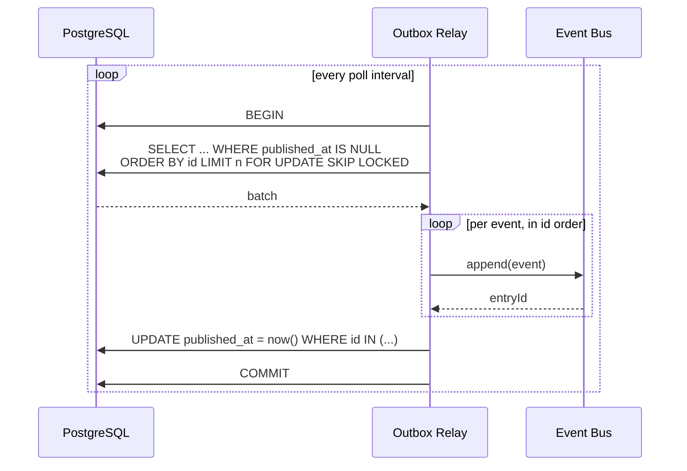
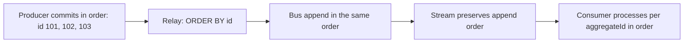
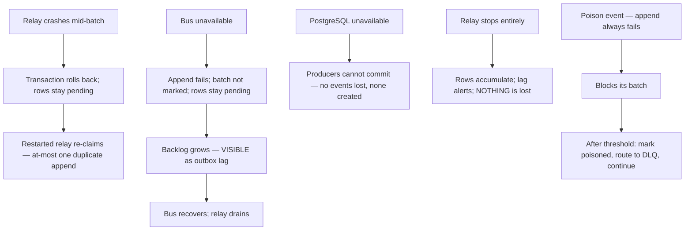

# Transactional Outbox

> **Status:** v1.0 — complete. New in Phase 8. **The implementation of ADR-020's durability guarantee.**
> This document implements the decision; it does not redesign it.

## Overview

**The problem it solves.** A service that writes state to PostgreSQL and then publishes to a bus performs a **dual write**. A crash between the two produces one of two corruptions: a committed state change nobody hears about, or an event describing a transaction that rolled back. Both are silent, both corrupt downstream state, and neither is detectable at the time.

The failure is not rare. It happens on every deploy that lands mid-request, every OOM kill, every network partition between the application and the bus — which for a platform where the lifecycle loop *is* the product means a customer's content quietly stops being measured, optimized, or refreshed with nothing in any log to explain it.

**The solution.** Write the event to a table **inside the same transaction** as the state change. Both commit or neither does. A separate relay publishes committed rows. The only variable is latency.

**Technical purpose.** Own the outbox table, the publisher API that makes correct use structurally mandatory, the relay that dispatches, the delivery guarantees, and recovery from every failure mode.

## Responsibilities

- The outbox table and its access discipline.
- The publisher API — signature-enforced transactional writes.
- The Outbox Relay: polling, dispatch, marking published.
- Ordering preservation from insertion to bus append.
- Multi-instance relay coordination.
- Failure recovery and lag management.
- Outbox retention and pruning.

## Non-responsibilities

| Not owned | Owner |
|---|---|
| Transport, fan-out, consumer groups | `event-bus.md` |
| Schema validation of payloads | `event-registry.md` — validated at publish, before the row is written |
| Consumer-side deduplication | `idempotency.md` |
| Retry of handler failures | `retry-engine.md` |
| Deciding what to publish | The producing domain component |
| Business meaning of anything | The domain |

## The publisher — correctness by signature

```ts
interface EventPublisher {
  publish<T>(tx: Transaction, event: DomainEvent<T>): Promise<void>;
}
```

**There is exactly one method, and it requires a transaction handle.** There is no overload without one, no ambient-transaction variant, and no fire-and-forget path. Publishing outside a transaction is not discouraged — it is **unrepresentable**.

That single design decision is what makes the guarantee hold in a codebase written substantially by AI agents. A convention ("always publish inside the transaction") decays; a signature does not.

```ts
// The only correct shape, and the only shape that compiles
await db.transaction(async (tx) => {
  const article = await articleRepo.updateStatus(tx, articleId, 'published');
  await publisher.publish(tx, {
    eventId: uuidv7(),
    eventType: 'ArticlePublished',
    eventVersion: 2,
    tenantId: ctx.tenantId,
    organizationId: ctx.organizationId,
    aggregateType: 'Article',
    aggregateId: articleId,
    correlationId: ctx.correlationId,
    causationId: ctx.causationId,
    occurredAt: clock.now(),
    payload: { articleId, liveUrl, publishedAt },
  });
});
```

**Validation happens at publish, before the row is written.** The registry is consulted for the event type, version, and payload schema (`event-registry.md`). An unregistered type or a schema violation throws inside the transaction, which **rolls back the state change too** — a producer emitting an invalid event does not silently succeed at the state change and fail at the notification.

## The table

`outbox_events`, specified in `03-database/tables.md` §8 and **not redesigned here**.

| Column | Purpose |
|---|---|
| `id BIGSERIAL PK` | **Publication order** — monotonic, gap-tolerant |
| `event_id UUID UNIQUE` | The consumer dedupe key; application-generated UUID v7 |
| `tenant_id`, `organization_id` | Tenant context, carried to every consumer |
| `event_type`, `event_version` | Routing and schema resolution |
| `aggregate_type`, `aggregate_id` | The ordering key |
| `correlation_id`, `causation_id` | Chain reconstruction |
| `payload JSONB` | Identifiers and scalars — **never content, credentials, or PII** |
| `occurred_at` | Domain time, from the injected clock |
| `published_at TIMESTAMPTZ NULL` | **The one mutable column.** `NULL` means pending |

**No foreign keys, by design.** The outbox must be writable alongside any table without creating a dependency cycle, and it must survive deletion of the aggregate it describes — an `ArticlePurged` event referencing a deleted article is precisely the case that matters.

**`id` is `BIGSERIAL`, not a UUID.** Publication order must be a total order the relay can scan cheaply; UUID v7 is time-ordered but its ordering is not dense, and gap-tolerant scanning over a sequence is materially simpler.

## The relay



```sql
SELECT id, event_id, tenant_id, organization_id, event_type, event_version,
       aggregate_type, aggregate_id, correlation_id, causation_id, payload, occurred_at
FROM outbox_events
WHERE published_at IS NULL
ORDER BY id
LIMIT 100
FOR UPDATE SKIP LOCKED;
```

| Parameter | Default | Reasoning |
|---|---|---|
| Poll interval | 200 ms | Keeps p95 commit-to-consumer under the 2 s target with headroom |
| Batch size | 100 | Large enough to amortize the round-trip; small enough that a failed batch is cheap to retry |
| Lock strategy | **`FOR UPDATE SKIP LOCKED`** | Multiple relay instances run without duplicating work or blocking each other |
| Index | `ixp_outbox_events__pending` — partial on `WHERE published_at IS NULL` | Stays tiny regardless of table size, because published rows leave the index |

**`FOR UPDATE SKIP LOCKED` is what makes the relay horizontally scalable.** Each instance claims a disjoint batch; none waits on another. Without it, instances would serialize on the same rows and adding a second relay would slow the system down.

**The partial index is the most important index in this platform.** `outbox_events` reaches 10⁹ rows; the pending set is typically hundreds. A full index on `published_at` would grow with the table and the poll would slow with it. The partial index contains only pending rows, so poll cost is constant as the table grows.

**`published_at` is deliberately not indexed on its own**, which preserves HOT updates on the platform's highest-write table — an update that touches no indexed column avoids index maintenance entirely (`03-database/indexes.md` §12.3).

## Delivery guarantees and how each is achieved

| Guarantee | Mechanism | Failure it prevents |
|---|---|---|
| **Event exists iff transaction committed** | Same-transaction insert | Dual-write corruption |
| **No loss** | Rows persist until `published_at` is set | Bus outage losing events |
| **At-least-once delivery** | Relay retries unpublished rows; bus redelivers unacked entries | Crash between append and mark |
| **Per-aggregate ordering** | `ORDER BY id`; single stream per type; consumer keys on `aggregateId` | Out-of-order state transitions |
| **Bounded latency** | Poll interval and batch size | Unbounded staleness |

**The relay may publish an event twice.** If it appends to the bus and crashes before marking `published_at`, the next poll re-appends the same event. That is correct and expected — the consumer-side dedupe by `event_id` absorbs it (`idempotency.md`). Attempting to make the relay exactly-once would require a distributed transaction across PostgreSQL and Redis, which is precisely the complexity the outbox pattern exists to avoid.

**Duplicate publication is cheap; lost publication is not.** The design accepts the former to eliminate the latter.

## Ordering



**Ordering is preserved from insertion through to the bus.** Within a batch the relay appends in `id` order; across batches, `id` ordering is maintained because batches are claimed in `id` order.

**Two relay instances can interleave across aggregates**, and that is acceptable — the guarantee is per-aggregate, not global. Events for one aggregate are typically produced by one transaction sequence and land in `id` order; if two instances split a batch containing two events for the same aggregate, the second may be appended first.

**That is a real gap, and it is closed by claim-by-aggregate**: the relay's batch claim groups by `aggregate_id`, so all pending events for one aggregate are claimed by one instance in one batch. Details and the guarantee's exact scope are in `ordering.md`.

## Failure recovery



**Every failure mode degrades to lag, never to loss.** That is the property that matters, and it is what makes the outbox worth its cost.

**The poison-event case needs explicit handling.** An event whose append always fails — an oversized payload, an unresolvable topic — would block its batch forever, and because the relay claims in `id` order, it would block everything behind it. After a threshold of failed append attempts, the row is marked `poisoned`, routed to the DLQ, and the relay proceeds. Head-of-line blocking on the outbox would be a platform-wide outage.

## Retention and pruning

| Property | Value | Reasoning |
|---|---|---|
| Published-row retention | **30 days** | The replay window (`replay.md`) |
| Pending-row retention | Indefinite | A pending row is undelivered work; it is never pruned |
| Pruning method | **Partition drop** at S2+, batched delete before that | Mass deletes on a 10⁹-row table are expensive and produce bloat |
| Partitioning | RANGE on `occurred_at`, weekly, from S2 | `03-database/indexes.md` §9 |

**A pending row is never pruned, regardless of age.** An event pending for a week means the relay has been failing for a week — deleting it would convert a visible operational failure into silent data loss.

**Vacuum matters here more than anywhere.** `published_at` is the one column that updates, and it churns constantly across the platform's highest-write table. Without aggressive autovacuum the pending partial index bloats and event latency rises. `autovacuum_vacuum_scale_factor = 0.02` on this table is deliberate (`03-database/indexes.md` §12.2).

## Business rules

1. **Publishing requires a transaction handle.** No overload exists without one.
2. **Validation happens inside the transaction**, so an invalid event rolls back its state change.
3. **The outbox has no foreign keys** and must survive deletion of what it describes.
4. **`published_at` is the only mutable column.** Everything else is immutable after insert.
5. **Only the relay appends to the bus.** No domain service calls `EventBus.append`.
6. **Rows are claimed with `FOR UPDATE SKIP LOCKED`**, in `id` order, grouped by aggregate.
7. **Duplicate publication is acceptable**; loss is not.
8. **Pending rows are never pruned.**
9. **Poison rows are quarantined after a threshold**, never left to block the queue.
10. **Payloads carry identifiers and scalars only** — never content, credentials, or PII.
11. **`occurred_at` comes from an injected clock**, so behaviour is testable and deterministic.
12. **Relay instances are stateless**; all coordination is through row locks.

**Idempotency:** the relay is idempotent by `event_id` at the consumer. **Concurrency:** multiple instances are safe by construction through `SKIP LOCKED`.

## The relay as a container

The Outbox Relay is a separate process (`01-system-architecture/07-c4-container.md`):

| Property | Value |
|---|---|
| Instances | 1 at S1; multi-instance safe by design |
| State | A cursor only — it holds nothing that cannot be recomputed |
| Restart safety | Anytime; resumes from `published_at IS NULL` |
| Database access | **Primary only** — never a replica |
| Failure impact | Lag, never loss |

**The relay must read the primary, never a replica.** Reading pending rows from a lagging replica would publish events late and non-deterministically, and could re-publish rows already marked published on the primary. This is stated in the deployment topology and repeated here because it is the single most damaging misconfiguration available.

**One instance suffices at S1** because the relay's work is trivial — a poll, an append, an update. Multi-instance is supported for availability rather than throughput, and adding a second requires no coordination change.

## Interfaces

```ts
interface OutboxPublisher {
  publish<T>(tx: Transaction, event: DomainEvent<T>): Promise<void>;
  publishBatch<T>(tx: Transaction, events: DomainEvent<T>[]): Promise<void>;
}

interface OutboxRelay {
  start(): Promise<void>;
  stop(graceful: boolean): Promise<void>;
  status(): Promise<{ pendingCount: number; oldestPendingAge: number; lastPublishedId: bigint }>;
}

interface OutboxAdmin {
  pending(filter: PendingFilter): Promise<OutboxRow[]>;
  poisoned(): Promise<OutboxRow[]>;
  requeue(ids: bigint[], actor: ActorRef): Promise<number>;
  prune(olderThan: Date): Promise<number>;
}
```

**`publishBatch` exists because a single transaction frequently emits several events** — a workspace suspension cascading, a research run committing evidence and completion together. Batching them into one insert avoids N round-trips inside a transaction that is holding locks.

**`requeue` is an operator action** for poisoned rows whose cause has been fixed; it is audited.

## Database impact

Owns `outbox_events` (`03-database/tables.md` §8). **No schema redesign.**

| Index | Purpose |
|---|---|
| `ixp_outbox_events__pending` — partial `(id) WHERE published_at IS NULL` | **The relay poll.** The most important index in this platform |
| `ux_outbox_events__event_id` | Dedupe and replay by id |
| `ix_outbox_events__aggregate` — `(aggregate_type, aggregate_id, id)` | Aggregate replay and ordering verification |
| `ix_outbox_events__correlation` | Incident reconstruction |

One additive column is required by the poison handling in this document:

| Change | Type |
|---|---|
| `outbox_events.publish_attempts INTEGER NOT NULL DEFAULT 0` | **Expand migration** — additive, nullable-safe default, no rewrite (`03-database/migrations.md`) |

That is the only schema change Phase 8 introduces to an existing table, and it follows the expand/contract discipline: added with a default, backfilled trivially, never breaking the prior application version.

## Security

- **Payload restriction is enforced at the registry**, not by producer discipline — schema validation rejects a payload containing content-shaped fields (`event-registry.md`).
- The outbox carries `tenant_id` with RLS for application roles; **the relay role holds a documented cross-tenant read policy**, since it must publish every tenant's events. That exception is registered and audited (`16-security/rbac.md`).
- The relay's cross-tenant read is the platform's broadest data access outside break-glass, which is why the relay does nothing but move rows — it never inspects, transforms, or branches on a payload.
- Poisoned rows may contain the payload that caused a failure; DLQ access controls apply.
- Reference `16-security/`; this component defines no controls of its own.

## Performance

| Concern | Approach |
|---|---|
| Publish overhead | One insert inside an existing transaction — **under 1 ms** |
| Relay throughput | Batch × poll rate; 100 × 5/s = 500 events/s per instance, well beyond current need |
| Poll cost | Constant, via the partial index |
| HOT updates | `published_at` unindexed alone; `fillfactor = 85` |
| Vacuum | Aggressive on this table specifically |
| Lag | **p95 < 2 s** commit to consumer |

**Publish cost is negligible and that matters.** The outbox pattern is only viable if producers pay almost nothing — a design where publishing added meaningful latency to every state change would push teams toward bypassing it.

## Observability

- **Metrics:** `outbox_pending_rows` (gauge), **`outbox_lag_seconds`** (commit to publish, the headline signal), `outbox_published_total{event_type}`, `outbox_publish_attempts` (histogram), `outbox_poisoned_total`, `relay_poll_duration_seconds`, `relay_batch_size` (histogram), `outbox_rows_pruned_total`.
- **Tracing:** the producer's transaction span records the outbox insert; the relay's dispatch span is **linked by `correlationId`**, not nested — the producer's span closes at commit, long before the relay runs.
- **Logging:** event id, type, aggregate, attempt count, correlation id — never payloads.
- **Alerts:** `outbox_lag_seconds` above 30 s (**page** — the loop is stalling); `outbox_pending_rows` growing monotonically for 10 minutes; any `outbox_poisoned_total` increase; relay not polling (dead-man's-switch — a silent relay is indistinguishable from a healthy idle one without it).

**The dead-man's-switch matters most.** A relay that stops polling produces no errors, and pending rows accumulate silently until someone notices the lifecycle loop stopped. A heartbeat that must arrive every interval turns that into an immediate page.

## Cross references

- `01-system-architecture/10-event-flow.md` — **ADR-020**, the decision this implements
- `event-bus.md` — the transport the relay appends to
- `event-registry.md` — validation at publish, inside the transaction
- `idempotency.md` — why duplicate publication is safe
- `ordering.md` — the exact scope of the ordering guarantee
- `replay.md` — republication from these rows
- `dead-letter-queue.md` — where poisoned rows go
- `03-database/tables.md` §8 · `indexes.md` §8, §9, §12 — schema, partial index, partitioning, vacuum
- `01-system-architecture/07-c4-container.md` — the relay as a container; primary-only access
- `16-security/rbac.md` — the relay's documented cross-tenant read policy
