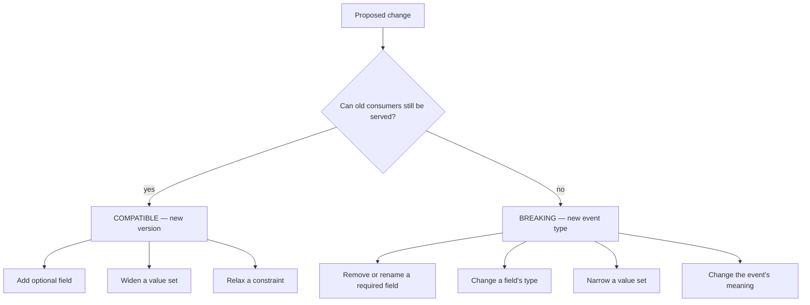
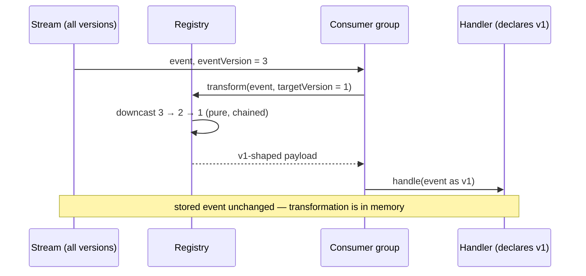
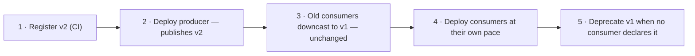
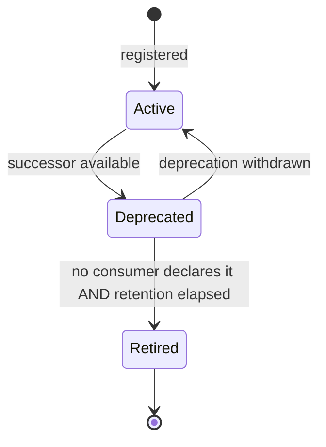

# Versioning

> **Status:** v1.0 — complete. New in Phase 8.
> **Every version is immutable and every historical event stays exactly as published.** Evolution happens by adding versions and transforming on read — never by editing what was written.

## Overview

**Business purpose.** Event contracts outlive the code that wrote them. An event published today may be replayed in three weeks by a consumer deployed next month (`replay.md`). Versioning is what lets producers and consumers evolve independently without a coordinated deploy, and without a schema change silently invalidating a month of stored history.

**Technical purpose.** Define what constitutes a compatible change, how versions are transformed on read, the deploy ordering for producer and consumer upgrades, and the deprecation lifecycle that eventually removes a version safely.

**The registry owns declaration; this document owns evolution.** Registration mechanics, naming, and the payload content rule are specified in `event-registry.md` and are not repeated here.

## Responsibilities

- Compatible versus breaking change classification.
- Upcast and downcast transformation on read.
- Producer and consumer upgrade ordering.
- Version negotiation at delivery.
- Deprecation lifecycle.
- Migration strategy for breaking changes.

## Non-responsibilities

| Not owned | Owner |
|---|---|
| Registration and validation mechanics | `event-registry.md` |
| Stream topology across versions | `event-bus.md` |
| Payload content rules | `event-registry.md` |
| Database schema migration | `03-database/migrations.md` |
| API versioning | `06-api/` |

## The three immutability rules

**1 · Historical events are never mutated.** Rows in `outbox_events` and `dead_letter_events` are written once and never updated. There is no migration that rewrites stored payloads, and no version transformation writes back.

A "quick backfill" that rewrites old payloads to the new shape breaks the platform in three places simultaneously: idempotency keys derived from content no longer match (`idempotency.md`), the DLQ's byte-identical payload guarantee fails, and audit reconstruction returns something that was never actually published. Transformation happens **in memory, on read, every time**.

**2 · A published version is immutable.** Once `ArticlePublished` v2 exists in the registry, its schema never changes. A field cannot be added to v2 — that is v3. The registry rejects a modified schema for an existing version at CI.

Editing a version in place is the most damaging change available, because it invalidates history *retroactively*: a month of stored v2 events suddenly fails validation against "v2", and replay of those events becomes impossible (`replay.md`).

**3 · Event types are never reused.** A retired type's name is permanently retired. Reusing `ArticleIndexed` for a different meaning makes stored history ambiguous — the same type name in `outbox_events` would mean two different things depending on when it was written, and nothing in the row distinguishes them.

## Compatible versus breaking



| Change | Class | Result |
|---|---|---|
| Add an optional field | Compatible | New version; downcast drops it |
| Add a required field with a defined default | Compatible | New version; downcast drops it, upcast supplies the default |
| Widen an enum | Compatible | New version — but see the caveat below |
| Remove a required field | **Breaking** | New event type |
| Rename a field | **Breaking** | New event type |
| Change a field's type | **Breaking** | New event type |
| Narrow an enum | **Breaking** | New event type |
| Change what the event *means* | **Breaking** | New event type |

**Breaking changes produce a new event type, not a new version.** This is the rule that makes the whole scheme tractable. If a breaking change could be a version, then old consumers reading the shared stream would receive events they cannot process, and the only outcomes are silent skipping (event loss) or mass dead-lettering. A new type means old consumers keep receiving the old type until they migrate — a contract change becomes a deliberate migration rather than an outage.

**Enum widening carries a real caveat.** The *payload* remains readable by old consumers, so it is structurally compatible, but a v1 consumer receiving a value it has never seen may branch incorrectly. Widening is permitted only where consumers are documented to handle unknown values by ignoring or deferring, and the registry requires that acknowledgement at registration.

**Changing an event's meaning while keeping its shape is the most dangerous change in this document**, because every automated check passes. `ArticlePublished` shifting from "published to CMS" to "queued for publication" breaks every consumer with no schema violation anywhere. It is classified breaking and requires a new type; enforcement is human review, which is why the registry is source-controlled (`event-registry.md`).

## Version transformation



**All versions of a type share one stream** (`event-bus.md`), so a v1 consumer *will* receive v3 events. Transformation on read is what makes that safe.

```ts
interface VersionTransform {
  eventType: string;
  from: number;
  to: number;                       // always from ± 1 — chained, never skipping
  transform(payload: unknown): unknown;   // PURE
}
```

| Direction | Name | Purpose |
|---|---|---|
| Older → newer | **Upcast** | A consumer on v3 reads a stored v1 event during replay |
| Newer → older | **Downcast** | A consumer still on v1 reads a live v3 event |

**Transforms are adjacent-version only and chain.** Registering `v1→v3` directly means adding v4 requires touching every prior transform; adjacent steps mean one new pair per version. The chain is computed at registration and cached.

**Transforms are pure functions.** No I/O, no clock, no database lookup. A transform that enriched a payload by querying the database would produce a different result on replay than on live delivery — the same event yielding two different handler inputs, which defeats idempotency. Purity is enforced at CI by prohibiting imports in transform modules.

**Downcasting may lose information, and that is exactly why the change was classified compatible.** A v1 consumer never knew about the field v3 added; dropping it returns it to the contract it was built against.

**Upcasting must supply defaults that are honest.** Adding `wordCount` in v2 means a replayed v1 event has no word count, and the upcast must supply a documented sentinel rather than a plausible-looking fabricated number. Registration requires each upcast default to be declared and reviewed — an invented value silently corrupts any consumer that aggregates the field.

## Version negotiation

```ts
interface ConsumerVersionDeclaration {
  eventType: string;
  handlesVersion: number;           // exactly one — the version the handler is written against
  onUnknownVersion: 'transform' | 'dead-letter';
}
```

**A consumer declares exactly one version.** Handlers that branch internally on `eventVersion` accumulate a decision tree that no one can safely delete from, and every branch is a version that can never be retired. One declared version, transformation at the boundary, and the handler contains no version logic at all.

**`onUnknownVersion` defaults to `transform` and is the only sane default.** `dead-letter` exists for handlers where a downcast would be genuinely misleading — a consumer that must not act on partial information — and it converts an unhandleable version into a visible DLQ entry rather than a silent skip.

**No version is ever skipped silently.** A consumer that cannot handle a version either transforms it or dead-letters it; there is no third path (`README.md`).

## Upgrade ordering

### Compatible change — producer first



**Producers upgrade first and consumers follow at their own pace.** Downcast transforms mean an un-upgraded consumer keeps working, so there is no coordinated deploy and no window in which a consumer receives a shape it cannot handle.

**The registration step precedes both deploys.** A producer publishing v2 before v2 is registered fails validation inside its own transaction and rolls back the state change — the pre-commit gate doing exactly its job (`event-registry.md`).

### Breaking change — consumer first


**Dual publication is the transition mechanism and it is bounded.** During step 3 the producer emits both the old and new type in the *same transaction*, so they are atomic with each other and with the state change (`transactional-outbox.md`).

**No consumer group may subscribe to both a type and its successor.** This is the rule that prevents dual publication from doubling effects: if one group handled both, every state change would take effect twice, and idempotency would not help because the two events are genuinely different with different ids. The registry rejects a group declaring both, so the constraint is enforced rather than remembered.

**Dual publication has a declared end date.** An unbounded transition means the old type never dies and the registry accumulates permanent dead weight; the successor declaration records the intended retirement date and the registry reports overdue transitions.

## Deprecation lifecycle



| State | Producers | Consumers | Registry |
|---|---|---|---|
| **Active** | May publish | May declare | Fully valid |
| **Deprecated** | Publishing warns at CI | Existing declarations valid; new ones rejected | Valid; reported |
| **Retired** | Publishing fails | Declaration fails | Rejected everywhere |

**Two conditions must both hold before retirement.** No consumer may declare the version — already enforced by the registry (`event-registry.md`) — **and** the outbox retention window must have elapsed since the last event of that version was published. The second condition is the one that is easy to miss: retiring a version while 30-day-old events of it still sit in `outbox_events` makes those events permanently unreplayable, because replay re-validates against the registry and the version no longer exists (`replay.md`).

**Retirement removes the version from validation but never from history.** Stored events keep their original `eventVersion`. A retired version's events are unreplayable by design — that is the accepted cost of retirement, and the retention condition is what ensures nothing recent is affected.

## Business rules

1. **Historical events are never mutated.** Transformation is in memory, on read.
2. **A published version is immutable.** Any change is a new version.
3. **Event type names are never reused**, including after retirement.
4. **Compatible changes become new versions; breaking changes become new event types.**
5. **Changing an event's meaning is breaking**, regardless of shape.
6. **Transforms are pure and adjacent-version only.**
7. **Upcast defaults are declared and reviewed**, never invented at runtime.
8. **A consumer declares exactly one version**; handlers contain no version branching.
9. **No version is silently skipped** — transform or dead-letter.
10. **Compatible changes deploy producer-first; breaking changes deploy consumer-first.**
11. **No group may subscribe to both a type and its successor.**
12. **Dual publication is atomic** — both types in one transaction — and time-bounded.
13. **Retirement requires no declaring consumers and elapsed outbox retention.**
14. **All versions of a type share one stream.**

**Idempotency:** version transformation never changes `eventId`, so keys are unaffected by upcast or downcast (`idempotency.md`). **Concurrency:** the registry is source-controlled and loaded at startup; no runtime version mutation is possible.

## Interfaces

```ts
interface VersionRegistry {
  transform(event: DomainEvent<unknown>, targetVersion: number): DomainEvent<unknown>;
  supportedVersions(eventType: string): VersionState[];
  canTransform(eventType: string, from: number, to: number): boolean;
  deprecate(eventType: string, version: number, successor: SuccessorRef): void;
  retirementEligibility(eventType: string, version: number): RetirementCheck;
}

interface VersionState {
  version: number;
  status: 'active' | 'deprecated' | 'retired';
  declaringConsumers: string[];
  lastPublishedAt: Date | null;
}

type SuccessorRef =
  | { kind: 'version'; version: number }
  | { kind: 'event-type'; eventType: string; transitionEndsAt: Date };

type RetirementCheck =
  | { eligible: true }
  | { eligible: false; reasons: RetirementBlocker[] };

type RetirementBlocker =
  | { kind: 'consumers-declare'; groups: string[] }
  | { kind: 'retention-not-elapsed'; earliestEligibleAt: Date };
```

**`SuccessorRef` encodes the compatible/breaking distinction in the type system.** A successor is either a version or a different event type; there is no variant that lets a breaking change masquerade as a version bump. The same structural-correctness technique used for the transaction-bound publisher (`transactional-outbox.md`) and the two-variant `RetryDecision` (`retry-engine.md`).

**`RetirementCheck` returns *all* blockers, not the first.** An operator who fixes the consumer declaration only to discover the retention condition also blocks has been made to do two rounds of work for one answer.

## Database impact

**No new tables. No schema change.** Version state lives in the source-controlled registry (`packages/contracts/events/`), and `eventVersion` is already a column on `outbox_events` and a field on the envelope (`03-database/tables.md` §8).

The only Phase 8 change to an existing Phase 3 table remains `outbox_events.publish_attempts` (`transactional-outbox.md`); the additive tables are declared in `dead-letter-queue.md` and `replay.md` under ADR-027 and ADR-028.

**Versioning explicitly does not migrate data.** No migration rewrites `outbox_events.payload`. Database migrations follow expand/contract independently (`03-database/migrations.md`) and are not coupled to event version changes — a producer's table gaining a column does not oblige its events to gain a field.

## Security

- Version transforms are **pure and I/O-free**, so a transform cannot exfiltrate data or reach a credential store.
- Downcasting **removes** fields and never adds them, so an old consumer can never receive data beyond its declared contract — a version boundary that is also a small disclosure boundary.
- The payload content rule applies identically to every version; a new version cannot introduce content-shaped or credential-shaped fields, because registration re-applies the rule (`event-registry.md`).
- Versions and transforms are source-controlled and code-reviewed; **no runtime version mutation exists**, so a compromised process cannot alter a contract.
- Reference `16-security/`; this component defines no controls of its own.

## Performance

| Concern | Approach |
|---|---|
| Transform cost | Pure in-memory function; **p95 < 1 ms** per step |
| Chain length | Adjacent steps; bounded by the number of live versions (typically ≤ 3) |
| No-op path | A consumer on the current version performs **zero** transformation |
| Registry lookup | Chains resolved at startup and cached |
| Storage | Versioning adds no storage — one payload, one version, stored once |

**The common path is free.** A consumer declaring the version an event was published at receives it untouched; transformation cost is paid only by consumers that are behind or by replay of older events, which is the correct place for it to land.

## Observability

- **Metrics:** `event_versions_published_total{event_type,version}`, `version_transforms_total{event_type,from,to,direction}`, `unknown_version_dead_letters_total{group,event_type}`, `deprecated_version_publishes_total{event_type,version}`, `transition_overdue{event_type}` (gauge), `retirement_blocked_total{reason}`.
- **Tracing:** transformation is a delivery-span attribute (`version.from`, `version.to`), not a separate span.
- **Logging:** event type, stored version, target version, group — never payloads.
- **Business KPIs:** consumers still on deprecated versions (migration progress) and overdue dual-publication transitions (contract debt).
- **Alerts:** `unknown_version_dead_letters_total` non-zero (**page** — a consumer is receiving versions it cannot handle); `deprecated_version_publishes_total` rising after the transition end date (a producer has not migrated); `transition_overdue` non-zero for 7 days (dual publication has become permanent); a retirement attempted while events remain within retention (**page** — would render stored history unreplayable).

**The last alert protects a guarantee that fails silently.** Retiring a version whose events still sit in the outbox does not break anything today; it breaks a replay attempted weeks later during an incident, which is the worst possible moment to discover it.

## Cross references

- `event-registry.md` — registration, naming, payload content rule, consumer declarations
- `event-bus.md` — all versions of a type share one stream
- `transactional-outbox.md` — atomic dual publication; pre-commit validation
- `replay.md` — why retirement must wait for retention to elapse
- `idempotency.md` — `eventId` unaffected by transformation
- `consumer-groups.md` — where transformation happens in the delivery path
- `dead-letter-queue.md` — destination for unhandleable versions
- `event-apis.md` — the frozen envelope carrying `eventVersion`
- `03-database/migrations.md` — expand/contract, independent of event versioning
