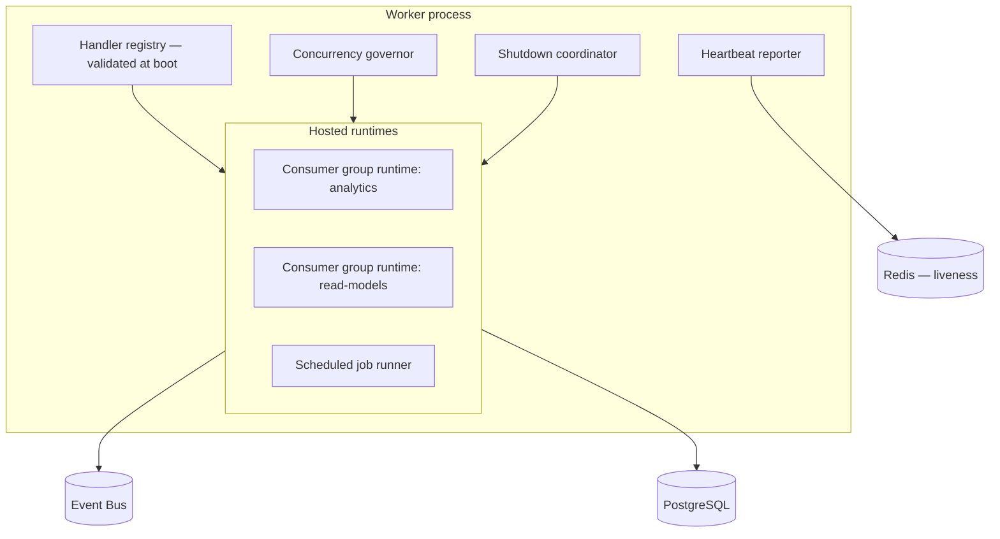
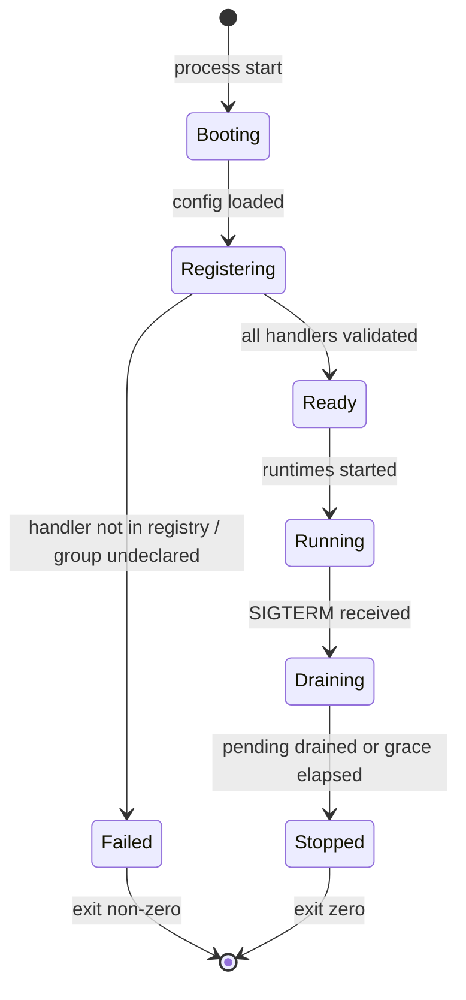
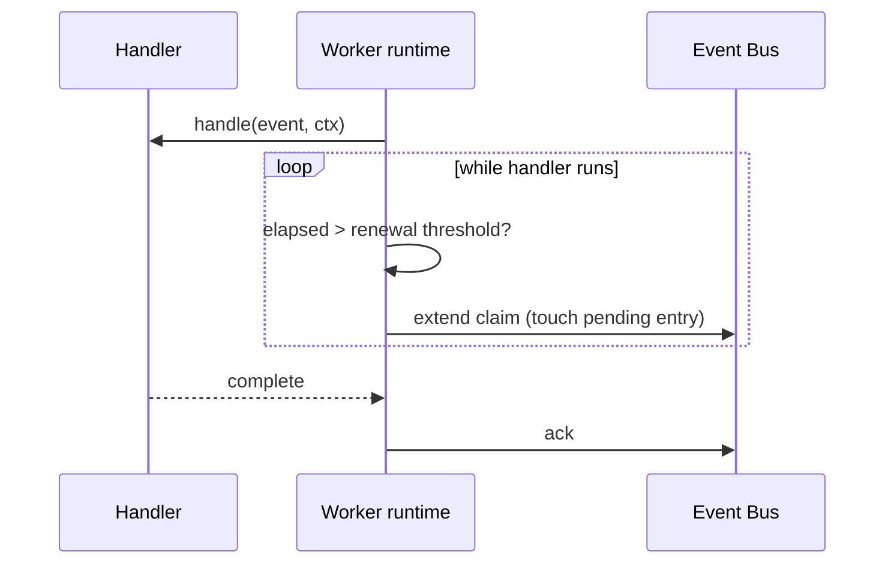
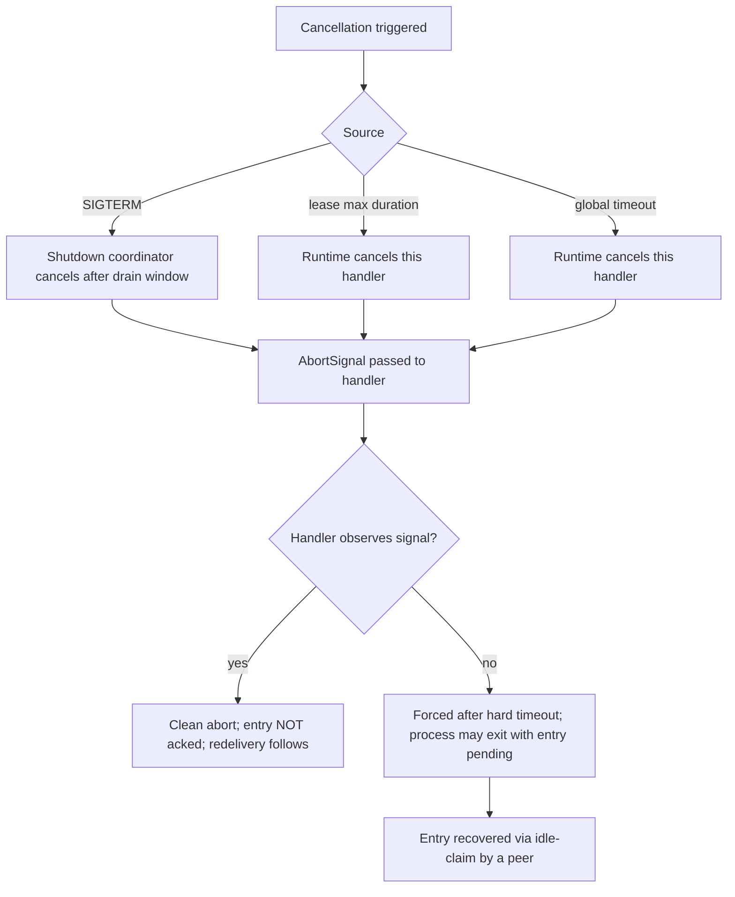
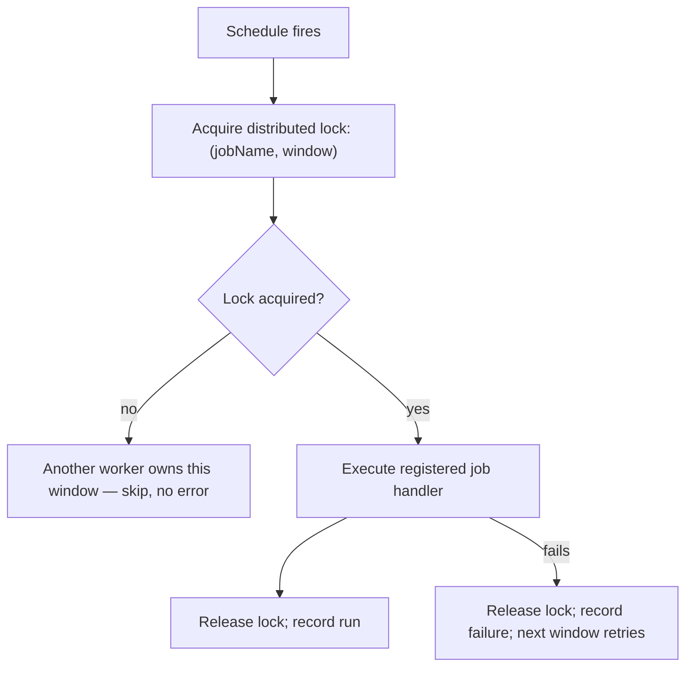

# Workers

> **Status:** v1.0 — complete. New in Phase 8.
> **A worker is a host, not a participant.** It executes registered handlers; it contains no business rules and knows nothing about what any handler does.

## Overview

**Business purpose.** Everything asynchronous in the platform runs in a worker: event consumers projecting read models, scheduled sweeps detecting stale evidence, the outbox relay moving events, embedding jobs, notification delivery. When workers stop cleanly, deploys are invisible to customers; when they stop badly, in-flight work is lost, leases expire slowly, and a deploy becomes a latency spike.

**Technical purpose.** Provide the process lifecycle that hosts consumer-group runtimes and scheduled jobs: registration, heartbeats, lease renewal, concurrency management, cancellation propagation, and graceful drain on shutdown.

**Design posture — the worker is generic.** A single worker binary hosts any set of registered handlers, selected by configuration. There is no "analytics worker" or "embedding worker" as a distinct program; there are worker instances configured with different handler sets. That keeps deployment uniform and makes rebalancing a configuration change rather than a build.

## Responsibilities

- Worker lifecycle: boot, registration, run, drain, exit.
- Handler registration and validation against the registry.
- Heartbeats and liveness reporting.
- Lease renewal for long-running handlers.
- Concurrency management across hosted handlers.
- Cancellation propagation.
- Graceful shutdown with pending-entry drain.
- Scheduled job execution with distributed coordination.

## Non-responsibilities

| Not owned | Owner |
|---|---|
| **Any business rule** | The handler's owning domain component |
| Retry policy and classification | `retry-engine.md` |
| Delivery distribution, group membership | `consumer-groups.md` |
| Duplicate suppression | `idempotency.md` |
| Durable workflow execution, human waits | Temporal (`05-content-platform/orchestration.md`) |
| Container orchestration, autoscaling | `14-operations/` |
| What a handler does | The handler |

**Workers versus Temporal, restated.** A worker executes short, stateless handler invocations driven by events or a schedule. Temporal executes long, stateful, resumable workflows with human waits. A worker that needed to remember where it was between invocations is modelling a workflow and belongs in the orchestrator (`01-system-architecture/13-adr-log.md`, ADR-004).

## Worker composition



**A worker hosts one or more runtimes.** A small deployment runs every consumer group in one worker; at scale, groups are split across worker sets so a heavy projector does not compete for CPU with latency-sensitive notification delivery.

## Lifecycle



### Boot-time validation

Every handler is checked against the registry **before any runtime starts**:

| Check | Failure |
|---|---|
| Event type registered and not retired | Boot fails |
| Consumer group declared for that type | Boot fails |
| Handler's declared version supported by the registry | Boot fails |
| Handler's idempotency key derivation declared | Boot fails |
| Ordering mode matches the registry's requirement | Boot fails |

**A misconfigured worker refuses to start.** Discovering that a handler subscribes to an event type nobody registered — days later, when the first event arrives and is silently unconsumed — is strictly worse than a boot failure that surfaces in the deploy (`event-registry.md`).

## Heartbeats

```ts
interface WorkerHeartbeat {
  workerId: string;              // stable across restarts
  hostedGroups: string[];
  hostedSchedules: string[];
  inFlightCount: number;
  lastBeatAt: string;
  version: string;               // build identity
}
```

| Property | Value |
|---|---|
| Interval | 5 s |
| Storage | Redis, with TTL of 3× interval |
| Missing heartbeat | Worker presumed dead; its leases become claimable |
| Reporting | Fed to `14-operations/monitoring.md` as worker liveness |

**Heartbeats answer "is anything consuming this group?"** A registered consumer group with zero heartbeating workers is the alert that catches a deployment failure — events accumulate unconsumed, producing no errors anywhere, and the capability that group powers silently stops working (`consumer-groups.md` §Observability).

## Lease renewal

A handler that runs longer than its group's lease duration will have its entry claimed by a peer mid-flight — safe because of idempotency, but wasteful.



**Renewal is automatic and bounded.** The runtime extends the claim while a handler is genuinely progressing, up to a **maximum total duration** per group. Beyond that the handler is cancelled and the entry released — an unbounded renewal would let a hung handler hold an entry forever, which is indistinguishable from a lost event.

**Renewal requires the handler to be alive, not to be making progress.** Distinguishing the two would require handler cooperation the platform does not mandate; the maximum-duration cap is the safeguard instead.

## Concurrency management

```ts
interface ConcurrencyConfig {
  globalMaxInFlight: number;          // across all runtimes in this worker
  perGroupMaxInFlight: Record<string, number>;
  perAggregateSerialization: boolean; // from the registry's ordering mode
}
```

| Level | Purpose |
|---|---|
| **Global** | Bounds total resource use — connections, memory, CPU |
| **Per group** | Prevents one group starving others hosted in the same worker |
| **Per aggregate** | Enforces ordering where the registry requires it (`ordering.md`) |

**The global bound exists because database connections are the real constraint.** A worker with 200 in-flight handlers holds up to 200 connections, and worker fleets exhaust connection pools long before they exhaust CPU (`14-operations/scaling-strategy.md` §8). The global bound is derived from the pool size, not chosen freely.

**Per-aggregate serialization is enforced here** because it is a concurrency property, though the *requirement* comes from the registry. A group whose event type declares `orderingRequired` processes at most one event per `aggregateId` at a time; events for different aggregates remain fully parallel.

## Cancellation



**Every handler receives an `AbortSignal`.** Handlers performing I/O are expected to honour it; those that do not are forcibly abandoned after a hard timeout, and their entry recovers through the normal idle-claim path.

**Cancellation never acknowledges.** A cancelled handler's entry stays pending and is redelivered — which is correct, because a cancelled handler may have completed part of its work, and idempotency is what makes the redelivery safe.

## Graceful shutdown

```mermaid
sequenceDiagram
    participant K as Orchestrator
    participant W as Worker
    participant BUS as Event Bus

    K->>W: SIGTERM
    W->>W: stop reading NEW entries immediately
    W->>W: mark unhealthy — removed from any routing
    loop until drained or grace elapsed
        W->>W: await in-flight handlers
        W->>BUS: ack each completion
    end
    alt drained within grace
        W->>W: exit 0 with ZERO pending
    else grace elapsed
        W->>W: cancel remaining; exit
        Note over W,BUS: remaining entries recovered by idle-claim
    end
```

| Phase | Behaviour |
|---|---|
| 1 · Stop reading | No new entries claimed — the backlog stops growing for this instance |
| 2 · Mark unhealthy | Readiness fails; orchestrator stops routing anything to it |
| 3 · Drain | In-flight handlers complete and acknowledge |
| 4 · Exit | Clean if drained; forced if the grace window elapses |

**Draining to zero pending is the goal, and it matters operationally.** An instance that exits with pending entries forces the cluster to wait out the idle-claim timeout before recovering them — turning a routine deploy into a visible latency spike on that group (`consumer-groups.md`).

**The grace window must exceed the p99 handler duration** for every group the worker hosts. A group with a four-minute handler needs a grace window longer than four minutes, or every deploy abandons work.

## Scheduled jobs

Workers also host scheduled execution — freshness sweeps, retention runs, rollup builders, reconciliation.



**Distributed locking prevents duplicate execution.** Every worker hosting a schedule fires at the same moment; without a lock keyed on `(jobName, window)`, a retention sweep would run once per worker instance.

**A skipped window is not an error.** Losing the lock means a peer is running the job, which is the intended outcome.

**Scheduled jobs are idempotent per window.** A job that ran partially and failed will re-run at the next window, so partial completion must be safe — the same discipline event handlers follow, applied to time-triggered work.

## Business rules

1. **Workers contain no business rules.** They host handlers and know nothing of their semantics.
2. **Only registered handlers execute.** Boot validates every handler against the registry and fails if any is unknown.
3. **`workerId` is stable across restarts**, so an instance reclaims its own pending entries (`consumer-groups.md`).
4. **Heartbeats are mandatory**; a missing heartbeat releases leases.
5. **Lease renewal is bounded** by a per-group maximum handler duration.
6. **Cancellation never acknowledges** an entry.
7. **Shutdown drains before exiting**, within a grace window exceeding p99 handler duration.
8. **Global concurrency is derived from the connection-pool size**, not chosen arbitrarily.
9. **Per-aggregate serialization is enforced** where the registry requires ordering.
10. **Scheduled jobs use a distributed lock** keyed on job and window; a skipped window is not an error.
11. **Workers use the RLS-enforced application role** — background work never bypasses tenant isolation.
12. **Handlers receive `TenantContext` from the event**, never ambiently.

**Idempotency:** worker restarts are safe by construction; all in-flight work is either acknowledged or redelivered. **Concurrency:** bounded at three levels as above.

## Interfaces

```ts
interface Worker {
  register(handlers: RegisteredHandler[], schedules: RegisteredSchedule[]): void;
  start(): Promise<void>;
  shutdown(graceMs: number): Promise<ShutdownReport>;
  health(): WorkerHealth;
}

interface RegisteredHandler {
  eventType: string;
  version: number;
  group: string;
  handle(event: DomainEvent<unknown>, ctx: TenantContext, signal: AbortSignal): Promise<void>;
}

interface RegisteredSchedule {
  jobName: string;
  cron: string;
  maxDurationMs: number;
  run(ctx: JobContext, signal: AbortSignal): Promise<void>;
}

interface ShutdownReport {
  drained: number;
  abandoned: number;               // must be zero on a clean deploy
  durationMs: number;
}
```

**`ShutdownReport.abandoned` is the deploy-health signal.** A non-zero value means the grace window is too short for the hosted handlers, and it is reported per deploy rather than left to be inferred from a latency graph.

## Database impact

**Workers own no tables.** Heartbeats, scheduled-job locks, and lease state live in Redis (`12-storage-platform/redis.md`).

Workers connect to PostgreSQL using the **RLS-enforced application role**, identical to the request path. A background process granted broader access "because it processes all tenants" is how cross-tenant leaks occur in systems that otherwise enforce isolation correctly (`01-system-architecture/07-c4-container.md`).

**No schema change.** The only Phase 8 change to an existing Phase 3 table remains `outbox_events.publish_attempts` (`transactional-outbox.md`); the platform's own additive tables are declared in `dead-letter-queue.md` and `replay.md`.

## Security

- **Workers use the restricted application role**; RLS applies identically to background work.
- **Tenant context comes from the event envelope** and is set per delivery, so a handler cannot operate without it.
- Workers hold no credentials beyond their database and Redis connections; provider credentials are reached through the Provider Layer only.
- Scheduled jobs that operate across tenants — retention sweeps, reconciliation — iterate **tenant by tenant with context set per iteration**, never with a single cross-tenant query.
- Worker identity and hosted-group configuration are deployment configuration, not runtime-editable.
- Reference `16-security/`; this component defines no controls of its own.

## Performance

| Concern | Approach |
|---|---|
| Handler dispatch overhead | **p95 < 2 ms** above handler duration |
| Concurrency | Bounded globally by connection pool, per group for fairness |
| Heartbeat cost | One Redis `SETEX` per 5 s per worker |
| Lease renewal | Only for handlers exceeding the renewal threshold |
| Shutdown | Bounded by the grace window |
| Scheduling | One lock attempt per window per worker |

**Long-poll reads mean idle workers cost almost nothing.** A worker hosting five groups with no traffic blocks on reads rather than spinning, which is what makes it affordable to host many groups per worker at low volume.

## Observability

- **Metrics:** `worker_instances{group}` (gauge — zero is an alert), `worker_heartbeats_total`, `worker_in_flight{group}` (gauge), `handler_duration_seconds{group,event_type}`, `handler_invocations_total{group,outcome}`, `worker_shutdown_abandoned_total`, `worker_shutdown_duration_seconds`, `lease_renewals_total{group}`, `scheduled_job_runs_total{job,outcome}`, `scheduled_job_lock_skips_total{job}`.
- **Tracing:** each handler invocation is a span, starting a **new trace linked by `correlationId`** to the producing trace (`consumer-groups.md`).
- **Logging:** worker id, group, event type, event id, tenant id, duration, outcome — never payloads.
- **Business KPIs:** `worker_shutdown_abandoned_total` per deploy (deploy hygiene) and handler duration p99 per group, which is what sets the grace window.
- **Alerts:** zero heartbeating workers for a registered group (**page** — a subscription silently stopped); `worker_shutdown_abandoned_total` non-zero (grace window too short); handler duration p99 approaching the lease maximum; scheduled job missing consecutive windows.

## Cross references

- `consumer-groups.md` — the runtimes workers host; delivery distribution
- `retry-engine.md` — decides retry; workers only observe handler outcome
- `event-registry.md` — boot-time handler validation
- `idempotency.md` — why redelivery after cancellation is safe
- `ordering.md` — the per-aggregate serialization workers enforce
- `05-content-platform/orchestration.md` — Temporal, for stateful long-running work
- `01-system-architecture/07-c4-container.md` — the Job Workers container and its database role
- `14-operations/scaling-strategy.md` — queue-depth scaling and slow scale-in
- `12-storage-platform/redis.md` — heartbeat, lock, and lease state
