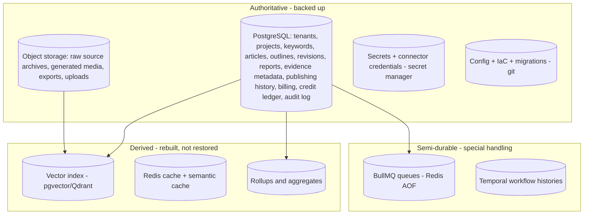
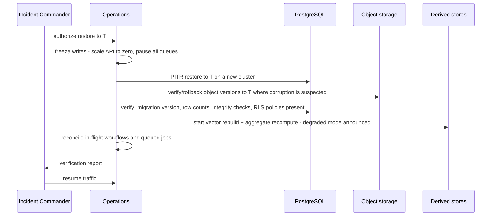

# Backup & Recovery

> **Status:** v1.0 — complete. Realizes the durability and recoverability NFRs in `01-system-architecture/` §6 ("no data loss on single-node failure; PITR enabled"; "pipeline resumes from the last durable step").
> **Scope:** what is backed up and what is deliberately not, RPO/RTO per store, backup mechanics, restore procedures at platform and tenant level, verification drills, and the interaction between backups and GDPR deletion.

## 1. Overview

**Why this exists.** ContentOS holds data a customer cannot recreate: months of research evidence with provenance, approved outlines, article revision history, publishing records, and an immutable credit ledger that is a financial record. Losing it is not a degraded experience — it is the end of the customer relationship. At the same time, most of the platform's *volume* is derived data that is cheaper to rebuild than to restore, and treating everything as equally precious wastes money and slows recovery.

**Business purpose.** Make the durability claim contractually defensible. Enterprise procurement asks for RPO, RTO, backup encryption, and restore-test evidence; this document is the answer, and the drill log is the proof.

**Technical purpose.** Classify every dataset as *authoritative* (must be backed up) or *derived* (must be rebuildable), define the recovery objective for each, and specify the procedures that meet them.

**Design philosophy.**
1. **Back up sources of truth; rebuild derivatives.** PostgreSQL and object storage are backed up. Vector indexes, caches, and search indexes are rebuilt from them.
2. **A backup that has not been restored is a hypothesis.** Restores are drilled on a schedule and the results recorded.
3. **Recovery granularity matters more than backup frequency.** Most real incidents need one tenant's articles back, not the whole platform; the procedures optimize for that case.
4. **Immutability where it counts.** Backups are write-once with a retention lock, so ransomware or a compromised operator cannot delete the recovery path.
5. **Deletion obligations are explicit.** GDPR erasure and backup retention conflict by nature; the conflict is resolved in writing (§11), not discovered during an audit.

## 2. Responsibilities

**MUST:** classify every dataset; define RPO/RTO per store; define backup mechanics, encryption, and retention; define full, partial, and tenant-level restore procedures; define verification drills; define the deletion/backup reconciliation policy.

**MUST NOT:** define incident command (`incident-response.md`), which invokes these procedures; define deployment rollback (`deployment.md`) — restoring from backup is the last resort, not the rollback path; define retention *product policy* per plan tier (OQ-9), which is a commercial decision this document consumes.

**Boundary:** this document covers loss and corruption recovery. Availability failover (replicas, multi-AZ) is `scaling-strategy.md` and the managed platform's concern; the two meet when a failover fails and a restore becomes necessary.

## 3. Architecture

### 3.1 Data classification



**Why vectors are derived.** Every embedding traces to an Evidence Bank row in PostgreSQL and its raw document in object storage. Re-embedding is a bounded, parallelizable batch job with a known cost, whereas backing up and restoring a large vector index adds a second recovery path that must itself be tested. Rebuild is simpler and always consistent with the source of truth — the accepted trade-off is a degraded-retrieval window during rebuild, which is stated explicitly in the RTO below.

**Why queues and workflow histories are special.** Losing Redis loses queued jobs; losing Temporal history loses in-flight pipeline state — including runs a customer has already paid credits for. Neither is a classic "backup" target, so both are handled by durability configuration plus a reconciliation job (§6).

### 3.2 Objectives

| Store | Class | RPO | RTO | Mechanism |
|---|---|---|---|---|
| PostgreSQL | Authoritative | **≤ 5 min** | **≤ 1 h** (full), ≤ 15 min (single-tenant logical) | Managed daily full + continuous WAL archiving (PITR) |
| Object storage (R2) | Authoritative | **0** (versioned) | ≤ 1 h for a bucket-level rollback | Object versioning + lifecycle + cross-account replication |
| Secrets | Authoritative | 0 | ≤ 15 min | Secret manager's own versioning + an encrypted offline escrow copy |
| Config / IaC / migrations | Authoritative | 0 | ≤ 15 min | Git, mirrored |
| Temporal histories | Semi-durable | ≤ 5 min | ≤ 1 h | Persistence store backed up with the same PITR policy |
| Redis (queues, AOF) | Semi-durable | ≤ 1 min | ≤ 15 min | AOF `everysec`; queue reconciliation on restart |
| Redis (cache) | Derived | n/a | Immediate | Cold start, no restore |
| Vector index | Derived | n/a | ≤ 4 h to full recall | Rebuild job from PostgreSQL + object storage |
| Aggregates/rollups | Derived | n/a | ≤ 2 h | Recompute job |

The platform-wide statement that follows from this table: **RPO 5 minutes, RTO 1 hour for authoritative data**, with degraded semantic retrieval for up to 4 hours after a catastrophic restore.

## 4. Inputs

| Input | Source | Validation |
|---|---|---|
| Backup schedule and retention config | IaC | Reviewed as code; a change to retention requires the same approval as a schema change |
| Encryption keys | KMS / secret manager | Key rotation must not orphan older backups — the drill explicitly verifies restore from a pre-rotation backup |
| Restore request | Incident commander (platform) or an authenticated tenant admin (tenant-level) | Platform restore requires two-person approval |
| Target point in time | PITR window | Must fall inside the retention window; requests outside it are rejected with the earliest available time |
| Drill schedule | Ops calendar | Monthly logical restore, quarterly full-cluster restore |

**Authorization:** platform-level restores require break-glass elevation and IC approval (`incident-response.md` §11). Tenant-level restores are limited to that tenant's data and are audit-logged with actor, scope, and target time.

**Error cases:** requested time outside PITR window → rejected with the boundary stated; encryption key unavailable → hard failure (a backup that cannot be decrypted is not a backup, which is precisely what drills exist to detect); insufficient disk on the restore target → abort before starting rather than fail halfway.

## 5. Outputs

| Output | Consumer |
|---|---|
| Backup inventory: store, timestamp, size, checksum, encryption key id | Compliance evidence, restore selection |
| Restore report: scope, target time, duration, verification results | Incident record, audit |
| Drill report: RPO/RTO achieved vs target, deviations, remediation | Quarterly reliability review, enterprise due diligence |
| `BackupCompleted` / `BackupFailed` / `RestoreCompleted` events | Monitoring, alerting |
| Rebuild job status for derived stores | Operations dashboard |

## 6. Internal Workflow

### 6.1 Backup

```
Managed PostgreSQL: continuous WAL archiving + nightly full base backup
  ↓
Checksums recorded; encryption verified; inventory row written
  ↓
Object storage: versioning always on; nightly replication to a second account/region
  ↓
Secrets: versioned in the manager; weekly encrypted escrow export
  ↓
Nightly verification job: restore the most recent logical dump into a scratch database,
run schema + row-count + referential integrity checks, then destroy
  ↓
Emit BackupCompleted with verification result; failure pages per monitoring.md
```

The nightly automated verification is what separates this from a checkbox: an unverified backup chain can silently break for weeks — most often through an encryption or permission change — and be discovered only when it is needed.

### 6.2 Full platform restore (SEV1)



**Write freeze first.** Restoring while writes continue produces a split-brain: rows created after the restore point exist in the old cluster and vanish in the new one. Scaling the API to zero and pausing queues is unavailable-but-consistent, which is the correct trade for this system (§4 philosophy: data integrity outranks availability).

### 6.3 Reconciliation after restore

Restoring to a point in time leaves three classes of inconsistency that must be actively resolved, not assumed away:

| Inconsistency | Resolution |
|---|---|
| Workflows in Temporal referencing rows that no longer exist | Reconciliation job terminates orphaned workflows with a typed reason; affected tenants notified; credits restored |
| Credit holds without a corresponding run | Holds older than the restore point are released via compensating ledger entries |
| Published articles whose publish record was rolled back | Detected by comparing publish history against the CMS via the connector; the platform reports the divergence rather than republishing or deleting on the customer's site |
| Object storage objects newer than the database restore point | Orphaned objects are quarantined, not deleted, pending review |

### 6.4 Tenant-level restore

The common case. A tenant deletes a project or an article revision and asks for it back:

1. Identify scope: `tenant_id` plus the affected aggregates and time range.
2. Restore a logical dump into an isolated scratch database (never into production).
3. Extract only that tenant's rows — the extraction script is tenant-predicated and reviewed, matching the repair rule in `incident-response.md` §8.
4. Re-import through the application's own repository layer where possible, so invariants and RLS apply, rather than by raw SQL insert.
5. Re-index affected vectors; verify with the tenant.

**Target RTO: 15 minutes** for a single article or project; hours for a large workspace. Soft-delete makes most of these requests unnecessary in the first place — deletion is a status change with a 30-day window before hard deletion, and only requests outside that window reach this procedure.

## 7. Dependencies

Managed PostgreSQL with PITR (WAL archiving and base backups); Cloudflare R2 with object versioning and cross-account replication; KMS/secret manager for backup encryption keys and escrow; Redis with AOF persistence for queue durability; the Temporal cluster's persistence store; IaC for reproducible infrastructure — restoring data into an environment that must be hand-built doubles RTO, so infrastructure reproducibility is part of the recovery path; and monitoring for backup success/failure alerting.

## 8. Database Impact

| Aspect | Detail |
|---|---|
| Backup source | Read replica where the provider supports it, so base backups never add load to the primary |
| PITR window | **14 days** for production; 3 days for staging |
| Retention | Nightly fulls 30 days; weekly fulls 90 days; monthly 13 months (aligned with the billing dispute window and the credit-ledger audit requirement) |
| Encryption | At rest with a KMS-managed key; keys rotated annually; older backups remain decryptable via retained key versions, and this is drill-verified |
| Immutability | Retention lock on backup storage; deletion requires two-person approval |
| Integrity checks post-restore | Migration version matches; referential integrity; row counts per major table within expected bounds; **RLS policies present on every table** (a restore that loses policies would silently disable tenant isolation — this check is mandatory, not optional); credit ledger sum reconciles |
| Append-only tables | Credit ledger and audit log are restored as-is; corrections after a restore are compensating entries, never edits |

## 9. API Contracts

| Interface | Purpose | Access |
|---|---|---|
| `POST /internal/v1/restore/tenant` | Request a tenant-scoped restore: `{ tenantId, scope, targetTime, reason }` | Platform admin, two-person approval, audit-logged |
| `GET /internal/v1/backups/inventory` | Backup inventory with verification status | Platform admin |
| `GET /internal/v1/restore/{id}` | Restore job status and verification report | Platform admin |
| Tenant-facing export | `06-api/` account endpoints: full workspace export (GDPR portability, also a self-service safety net) | Tenant owner/admin |

Self-service export deserves emphasis as a design decision: giving customers a complete, machine-readable export of their own data reduces the frequency of restore requests, satisfies GDPR portability, and is far cheaper to operate than a restore pipeline invoked for every accidental deletion.

## 10. Error Handling

| Failure | Behavior |
|---|---|
| Backup job fails | Alert on the first failure (not the third); two consecutive failures is SEV2 — a broken backup chain is a latent SEV1 |
| Verification restore fails | SEV2 immediately; the backup chain is presumed broken until proven otherwise |
| Restore exceeds RTO | IC informed at 50% of the RTO budget; communication updated with a revised estimate rather than silence |
| Corruption discovered inside the PITR window | Restore to the last known-good point; the reconciliation job (§6.3) handles the delta |
| Corruption discovered outside the PITR window | Escalate: partial reconstruction from object storage archives and audit logs; explicit customer communication about what is unrecoverable |
| Vector rebuild fails or lags | Platform serves in degraded retrieval mode with a visible indicator; grounding checks continue to run, so quality gates remain enforced — degraded retrieval must never become degraded grounding |
| Redis AOF loss | Queued jobs are reconstructed from durable state: pipelines are Temporal-driven and resume; fire-and-forget jobs are re-enqueued by a reconciliation scan |

## 11. Security

- **Encryption:** all backups encrypted at rest; transfers over TLS; keys in KMS with rotation, and restore-from-pre-rotation-backup verified in drills.
- **Access:** backup storage is write-once with retention lock; restore requires break-glass elevation and two-person approval; every restore is audit-logged with scope and justification.
- **Isolation during restore:** scratch restore databases are network-isolated and destroyed after extraction. A scratch database containing all tenants' data is a high-value target and must not outlive its use.
- **GDPR erasure vs backups — the explicit position:** erasure requests are executed against production immediately (soft-delete then hard-delete within the documented window) and recorded in an **erasure log**. Backups are *not* rewritten — rewriting immutable backups is neither technically sound nor generally required. Instead, backups age out within the retention window (maximum 13 months), and **any restore replays the erasure log** so erased subjects are re-erased as part of the restore procedure. This is a documented step in §6.2, not an assumption.
- **Cross-border:** backup replication targets must respect tenant data residency once residency is offered (OQ-7); until then, all backups remain in the primary region and this is stated to customers rather than left implied.

## 12. Performance

Base backups run off-peak against a replica; WAL archiving is continuous and adds negligible primary load. Restore duration is dominated by database size — the quarterly drill records actual restore time as the database grows, and the moment measured RTO approaches the 1-hour target, the mitigation is documented in advance: partition by time and restore the hot partitions first, serving recent data while older partitions stream in. Vector rebuild is parallelized across workers with a bounded embedding-cost budget, since a full rebuild is also a significant AI spend event and must not silently blow the monthly cost budget during an incident.

## 13. Observability

Monitored: backup success/failure per store, backup age (a gauge that must never exceed the schedule interval), verification-restore result, PITR window coverage, backup size trend (a sudden drop suggests a partial backup), restore drill results versus RPO/RTO targets, and rebuild job progress. Alerts: any backup failure; backup age exceeding schedule; verification failure; PITR window shorter than policy; drill RTO exceeding target by more than 25%. The drill log — dates, scope, measured RPO/RTO, deviations — is retained permanently as compliance evidence for SOC 2 readiness and enterprise due diligence.

## 14. Future Expansion

- **Cross-region warm standby** with continuous replication, cutting RTO from ~1 hour to minutes (decision pending — OQ-20, cost versus benefit at current scale).
- **Per-tenant continuous export** to a customer-owned bucket as an enterprise feature — the strongest possible answer to "what if you go away?"
- **Automated restore drills in CI**, restoring the previous night's backup into an ephemeral environment and running the integration integrity suite against it.
- **Point-in-time tenant restore UI** for self-service recovery within the soft-delete window.
- **Backup residency controls** per tenant once multi-region ships (OQ-7).

## 15. Open Questions

- Disaster-recovery tier: single-region PITR (current) versus cross-region warm standby, and the committed regional-outage RTO — **OQ-20**.
- Retention per plan tier for evidence and generated media — **OQ-9**.
- Whether tenant-level restore is offered as a paid service tier or included.

Tracked in `99-open-questions.md`.

## Cross References

- `01-system-architecture/11-deployment-topology.md` — storage topology and managed services
- `03-database/migrations.md` — schema version verification after restore
- `incident-response.md` — restore as the last-resort mitigation; evidence preservation rules
- `deployment.md` — why rollback, not restore, is the normal recovery path
- `scaling-strategy.md` — replicas, partitioning, and their effect on restore time
- `monitoring.md` — backup and drill alerting
- `02-domain-design/workspace.md` — tenant boundary that scopes every tenant-level restore
