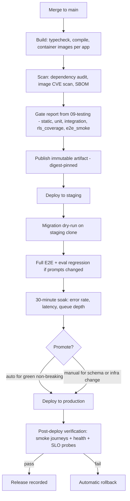
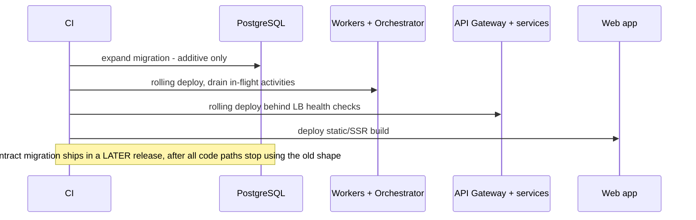
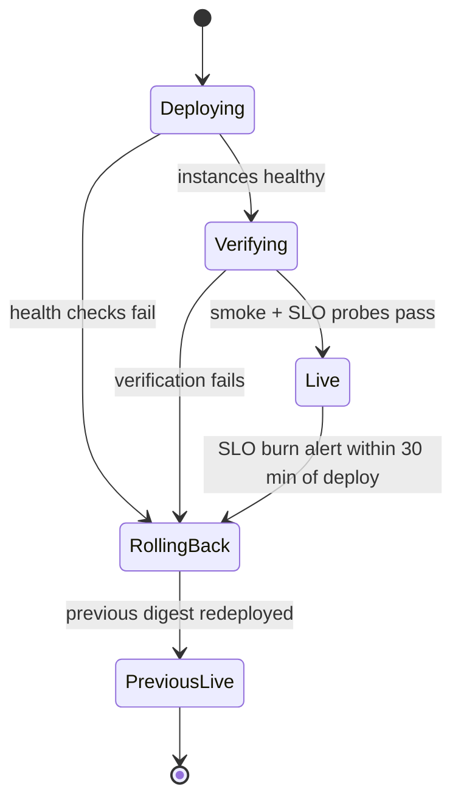

# Deployment

> **Status:** v1.0 — complete. Release process for the topology defined in `01-system-architecture/11-deployment-topology.md`. Process decisions here are recorded as **ADR-015 (Release Process: environments, expand/contract migrations, rollback)** and must be transcribed into `01-system-architecture/13-adr-log.md` when that file is written.
> **Scope:** environments, the CI/CD pipeline, artifact and configuration management, database migration strategy, feature flags, deploy order, release verification, and rollback.

## 1. Overview

**Why this exists.** ContentOS deploys a system with in-flight state: Temporal workflows that may be days into a run, BullMQ jobs mid-retry, SSE connections streaming to open browsers, and a schema shared by the version being replaced and the version replacing it. A naive "stop, migrate, start" release breaks all four. The release process is therefore an architectural concern, not a script.

**Business purpose.** Ship continuously without customer-visible interruption. A workspace whose 18-minute pipeline dies because of a mid-run deploy has lost work it paid credits for — a refundable, trust-damaging event that the release design must make structurally impossible.

**Technical purpose.** Define one repeatable path from a merged commit to running production code, with deterministic artifacts, forward-compatible schema changes, verifiable release health, and a bounded, rehearsed rollback.

**Design philosophy.**
1. **Build once, promote the same artifact.** The image deployed to production is byte-identical to the one tested in staging; only configuration differs.
2. **Schema changes are always backward compatible.** Expand/contract, never in-place breaking changes. This is what makes rollback possible at all.
3. **Deploys are decoupled from releases.** Code ships dark behind flags; enabling a feature is a configuration change with its own, faster rollback.
4. **Workers drain, never die.** Every worker and workflow process handles shutdown by finishing or checkpointing in-flight work.
5. **Verification is automated and its failure is automated too** — a failed post-deploy verification rolls back without waiting for a human decision.

## 2. Responsibilities

**MUST:** define environments and their differences; define the pipeline stages and promotion rules; own migration strategy and ordering relative to code; own feature-flag lifecycle; define release verification and automatic rollback; define secret and configuration delivery; define the deploy freeze and out-of-hours policy.

**MUST NOT:** define the runtime topology (folder 01); define what tests exist (`10-testing/testing-strategy.md`) — it consumes their gate report; define alerting (`monitoring.md`); define capacity or autoscaling thresholds (`scaling-strategy.md`).

**Boundary:** this document ends when the new version is serving traffic and verification has passed. From that moment, `monitoring.md` and `incident-response.md` own the system.

## 3. Architecture

### 3.1 Environments

| Environment | Purpose | Data | Providers | Scale |
|---|---|---|---|---|
| `local` | Development | Synthetic factories | Stubs + cassettes | Docker Compose |
| `e2e` (ephemeral) | Automated journeys | Synthetic, per-run tenants | Vendor stub gateway | Minimal |
| `staging` | Release candidate soak, load tests, migration dry-runs | Synthetic at production-like volume | Provider sandbox accounts | ~25% of production |
| `production` | Customers | Real | Live providers | Full |

Staging deliberately holds no production data (`10-testing/testing-strategy.md` §11); realistic *volume* is achieved by generating synthetic data at production-like scale, which is what load testing actually requires.

### 3.2 Pipeline

### 3.3 Deploy order

Order matters because the components share a schema and a queue:

Workers deploy before the API because they must be able to handle any job the new API can enqueue. The web app deploys last so no user sees a UI referencing an endpoint that is not yet live.

## 4. Inputs

| Input | Source | Validation |
|---|---|---|
| Commit SHA | `main` | Must be a fast-forward merge with a green gate report |
| Gate report | `10-testing/testing-strategy.md` §5 | `verdict: releasable`; a missing or stale report blocks promotion |
| Artifact digest | Container registry | Immutable; promotion references the digest, never a tag like `latest` |
| Configuration | `packages/config` schema + environment values | Validated against a schema at container start; an unknown or missing required key fails startup rather than defaulting |
| Secrets | Secret manager, injected at runtime | Never baked into images; rotation does not require a rebuild |
| Migration set | `03-database/migrations.md` | Lint: no destructive statement in an expand-phase migration; every migration reversible or explicitly marked forward-only with justification |

**Authorization:** production deploys require an authenticated pipeline identity; manual promotion requires a human with the deploy role; both are audit-logged with commit, artifact digest, and actor.

**Error cases:** missing config key → startup failure (fail fast, never boot half-configured); migration lint failure → pipeline stops before staging; expired secret → health check fails before the instance receives traffic.

## 5. Outputs

| Output | Consumer |
|---|---|
| Immutable artifact per app, digest-pinned, with SBOM | Registry, promotion |
| Release record `{ sha, digest, migrations[], flags_changed[], actor, timestamp }` | Audit, incident timeline correlation |
| Deploy marker event | Grafana annotations — every dashboard shows deploy lines, which is the single highest-value correlation signal during an incident |
| Verification report | Rollback decision |
| `ReleaseDeployed` / `ReleaseRolledBack` events | Notifications, status page automation |

## 6. Internal Workflow — migrations

The expand/contract sequence, spanning three releases, is the core mechanic that makes rollback safe:

| Release | Migration phase | Application behavior |
|---|---|---|
| N | **Expand** — add nullable column / new table / new index `CONCURRENTLY` | Writes both old and new shape; reads old |
| N+1 | Backfill — batched, resumable, throttled | Reads new shape with fallback to old |
| N+2 | **Contract** — drop old column/constraint | Reads and writes new shape only |

Rules: no `ALTER TABLE ... SET NOT NULL` on a large table without a validated `CHECK` first; indexes are always built `CONCURRENTLY`; backfills run as BullMQ jobs with a batch size tuned to keep replication lag under one second, and are resumable because a deploy may interrupt them; a migration that would lock a hot table for more than one second is rejected at review.

**Rollback of data.** Rolling back code is trivial; rolling back a *contract* migration is not. That asymmetry is why the contract phase ships alone, in its own release, after the expanded shape has been running in production for at least one full release cycle.

## 7. Dependencies

| Dependency | Role |
|---|---|
| Coolify (v1) / Kubernetes (at scale) | Container orchestration and rolling updates (`01-system-architecture/11-deployment-topology.md`) |
| Container registry | Immutable artifacts, digest promotion |
| Secret manager | Runtime secret injection and rotation |
| Managed PostgreSQL / Redis | Migration target; PITR (`backup-recovery.md`) |
| Temporal cluster | Worker versioning; must be upgraded independently of application deploys |
| Feature-flag service | Config-backed flags with per-tenant targeting |
| CI (gate report producer) | `10-testing/` |

**Temporal worker versioning** deserves explicit attention: changing workflow code in a way that alters its execution path breaks determinism for in-flight workflows. The rule is that workflow definitions are versioned and old paths are retained until no workflow older than the retention window remains; replay tests (`10-testing/integration-testing.md`) enforce this at build time.

## 8. Database Impact

Deployment is one of the few processes that changes the schema, so its database obligations are strict:

| Aspect | Policy |
|---|---|
| Execution | Migrations run as a dedicated pipeline step with a migration role, not by application containers at boot (concurrent boots would race) |
| Locking | Statement timeout and lock timeout are set for every migration session; a blocked migration fails fast rather than queueing behind and blocking application queries |
| Ordering | Expand before code; contract at least one release after |
| RLS | New tables ship with `tenant_id` and a policy in the same migration; the `rls_coverage` gate has already proven the isolation test exists |
| Verification | Post-migration checks assert row counts and constraint validity before the deploy proceeds |
| Read replicas | Replication lag is monitored during and after migration; a backfill that pushes lag over threshold throttles itself |

## 9. API Contracts — release surface

| Contract | Rule |
|---|---|
| API versioning | Path-versioned (`/v1/`); a breaking change ships as `/v2/` with both live during a documented deprecation window |
| Event schemas | Additive only within a major version; consumers ignore unknown fields (`10-testing/unit-testing.md` §9) |
| Health endpoints | `/health/live` (process up) and `/health/ready` (dependencies reachable, migrations at expected version). The load balancer routes on readiness only |
| Deprecation | Announced via `Deprecation` and `Sunset` headers plus changelog before removal |
| Client compatibility | The deployed web app and API may be one release apart in either direction — asserted by running the previous web build against the new API in staging |

## 10. Error Handling — rollback

| Failure | Response |
|---|---|
| Instance fails readiness | Orchestrator halts the rolling update; no traffic shifted; alert raised |
| Post-deploy verification fails | Automatic rollback to the previous digest; no human decision required |
| Fast SLO burn within 30 minutes of a deploy | Automatic rollback candidate; on-call is paged with the deploy marker attached |
| Migration fails mid-run | Transactional migrations roll back; non-transactional ones (concurrent index) are resumable and idempotent by design |
| A bad feature, not a bad build | Disable the flag first — seconds, no redeploy — before considering a rollback |
| Rollback impossible (contract migration already applied) | Escalate to `incident-response.md`; recover forward with a hotfix, restoring from PITR only as a last resort |

**Target:** rollback complete within **10 minutes** of the decision, rehearsed quarterly alongside the restore drill.

## 11. Security

- **Supply chain:** dependencies pinned by lockfile; images built from pinned base digests; SBOM generated per artifact; image and dependency CVE scans block on critical findings; images signed and verified at deploy.
- **Least privilege:** the deploy identity may pull artifacts and update workloads; it holds no database superuser rights. The migration role can alter schema but cannot read tenant content — separating the two limits what a compromised pipeline can exfiltrate.
- **Secrets** are runtime-injected, never in images, environment dumps, or logs; rotation is a config change with no rebuild.
- **Audit:** every deploy, rollback, flag change, and manual migration is append-only audit-logged with actor and artifact digest.
- **Environment separation:** production credentials are unreachable from `staging`/`e2e`; the test-provisioning API refuses to start outside those environments (`10-testing/e2e-testing.md` §8).
- **Freeze policy:** no non-critical production deploys during an active SEV1/SEV2 incident.

## 12. Performance

Deploys must not degrade live traffic. Mechanisms: rolling updates with surge capacity (never fewer healthy instances than baseline); connection draining with a grace period longer than the p99 request; SSE connections closed with a retry hint so browsers reconnect to the new instance rather than hanging; workers drain by refusing new jobs while completing current ones; Temporal activity heartbeats let the server reassign work from a terminating worker immediately rather than after a timeout.

Pipeline duration target: merge to production in **under 45 minutes**, of which the 30-minute staging soak is the dominant term — deliberately, since it is the cheapest place to catch a regression that tests missed.

## 13. Observability

Every deploy emits an annotation onto all dashboards, so the first question in any incident — "did we just ship something?" — is answered visually. Release-specific signals: deploy frequency, lead time from merge to production, change failure rate (deploys followed by rollback or SEV within 24 hours), and mean time to restore. These four are tracked as the platform's delivery health metrics. Post-deploy, the verification suite's results and the first 30 minutes of SLO burn are attached to the release record, giving every release a permanent health verdict.

## 14. Future Expansion

- **Progressive delivery:** canary at 5% → 25% → 100% with automatic promotion on SLO health, replacing today's all-at-once rolling deploy. This is the natural upgrade once Kubernetes replaces Coolify.
- **Per-PR preview environments**, unblocking fully isolated E2E (`10-testing/e2e-testing.md` §14).
- **Automated database change review** — a bot that annotates migration PRs with estimated lock duration and affected row counts.
- **Multi-region deploy orchestration** with region-by-region promotion (`scaling-strategy.md` §14).
- **Blue/green for the Temporal worker fleet**, so workflow-code changes can be validated on a fraction of task-queue traffic.

## 15. Open Questions

- Whether production deploys are fully automatic on green (current position: automatic for non-schema changes, manual approval for schema or infrastructure changes).
- Deprecation window length for a `/v2/` API cutover.
- Whether staging should hold anonymized production data for realistic scale testing — **OQ-18**.

Tracked in `99-open-questions.md`.

## Cross References

- `01-system-architecture/11-deployment-topology.md` — topology this process acts on
- `03-database/migrations.md` — migration tooling and zero-downtime patterns
- `10-testing/testing-strategy.md` — the gate report consumed here
- `10-testing/e2e-testing.md` — post-deploy verification suite
- `monitoring.md` — SLO burn alerts that trigger automatic rollback
- `incident-response.md` — escalation when rollback is not possible
- `backup-recovery.md` — PITR as the last-resort recovery path
