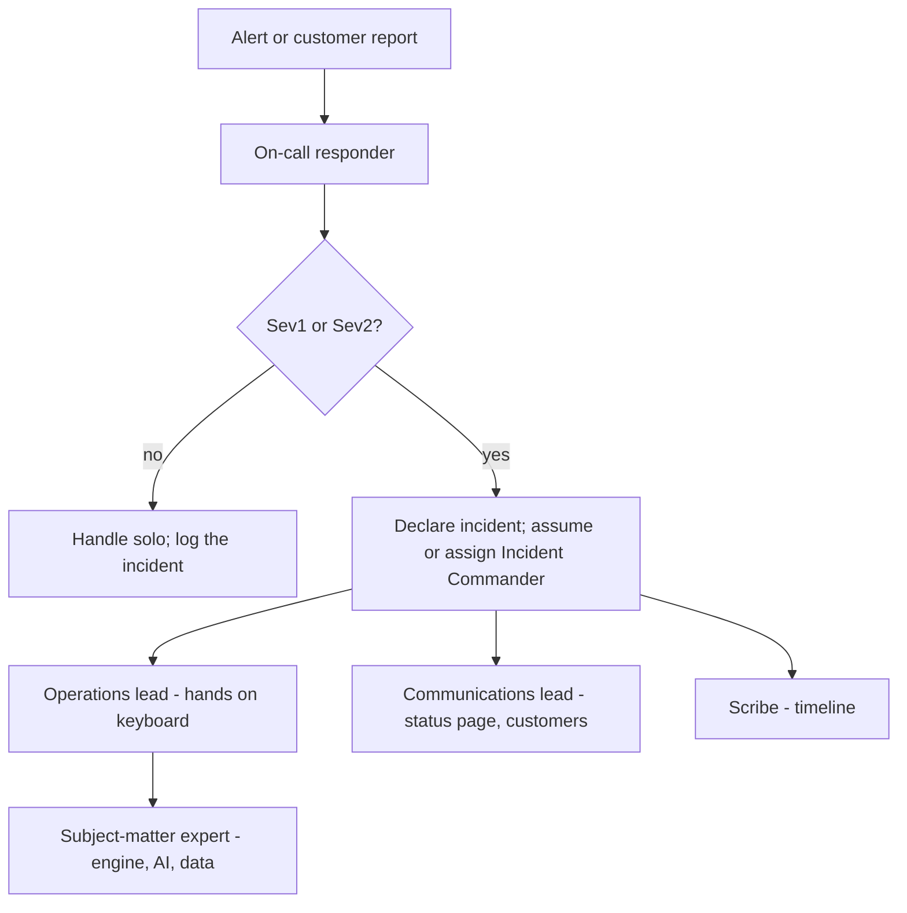
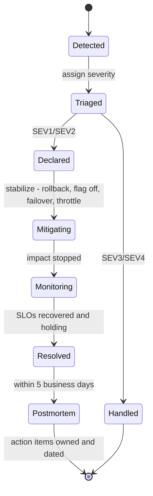

# Incident Response

> **Status:** v1.0 — complete. Consumes the alerts defined in `monitoring.md` and the rollback mechanics in `deployment.md`.
> **Scope:** severity model, roles, the response lifecycle, communication, ContentOS-specific playbooks, postmortems, and the feedback loop back into tests and architecture.

## 1. Overview

**Why this exists.** At 03:00, judgment is unreliable and improvisation is expensive. The purpose of this document is to make the first fifteen minutes of an incident mechanical: what severity is this, who is in charge, what do I check first, what do I tell customers. Everything creative can wait until the structure is in place.

**Business purpose.** For a platform that publishes to a customer's own domain and charges credits per run, incidents have direct financial and reputational consequences: a stuck pipeline holds paid work hostage, a publish bug puts wrong content on a live site, and a cross-tenant leak is a contractual and regulatory event. Response quality is part of the product.

**Technical purpose.** Define detection-to-resolution mechanics for a distributed system with durable state, so responders can reason about in-flight workflows, queued jobs, third-party dependencies, and money — all of which behave differently from stateless request/response failures.

**Design philosophy.**
1. **Stabilize before diagnosing.** Restore service first; root cause is a postmortem activity.
2. **One incident commander, always.** Ambiguous ownership is the most common cause of slow response.
3. **Blameless, but not consequence-free.** Postmortems produce owned, dated action items that are tracked to completion.
4. **Data integrity outranks availability.** When they conflict — a bug charging credits twice, a publish loop posting duplicates — stop the affected path rather than keep serving.
5. **Every incident ends in a test.** A regression that can recur without a test is an unfinished incident (`10-testing/`).

## 2. Responsibilities

**MUST:** define severities with unambiguous examples; define roles and activation; define the response lifecycle and communication cadence; provide playbooks for this platform's realistic failure modes; define the postmortem process and action-item tracking.

**MUST NOT:** define alert thresholds (`monitoring.md`); define rollback mechanics (`deployment.md`) — it invokes them; define restore procedures (`backup-recovery.md`) — it invokes them; substitute for a legal/regulatory breach-notification process, which it triggers but does not define.

**Boundary:** begins at alert or report, ends when the postmortem's action items are closed.

## 3. Architecture — severity and roles

### 3.1 Severity model

| Sev | Definition | Examples | Response | Comms |
|---|---|---|---|---|
| **SEV1** | Data integrity breach, security breach, or total outage | Cross-tenant data exposure; credentials leaked; platform down; published content corrupted at scale; credit ledger diverging | Page immediately, 24×7; all-hands allowed | Status page within 30 min; customer comms within 2 h; legal engaged for any data exposure |
| **SEV2** | Major degradation of a core flow | Pipelines failing > 10%; publishing broken for a target; AI Gateway failing over continuously; auth degraded | Page, 24×7 | Status page within 1 h; affected tenants notified |
| **SEV3** | Partial or single-tenant degradation with a workaround | One provider degraded with fallback holding; elevated latency within budget; one tenant's connector broken | Business hours, next working day at the latest | Direct to affected tenants |
| **SEV4** | Minor, no customer impact | Cosmetic defects, non-customer-facing job failures, DLQ entries with a clear cause | Ticket queue | None |

**Automatic SEV1, no triage discussion:** any confirmed cross-tenant data access; any credential or secret exposure; any evidence that published content was materially altered by a defect; any credit ledger inconsistency that a customer could observe. These are pre-classified precisely so that no one has to negotiate severity while the clock runs.

### 3.2 Roles

At current team size one person may hold several roles, but **the Incident Commander never also has hands on the keyboard** during SEV1/SEV2. The IC's job is decisions, delegation, and the timeline; a commander who is debugging stops commanding.

## 4. Inputs

| Trigger | Source | Notes |
|---|---|---|
| Page-worthy alert | `monitoring.md` alert catalogue | Payload includes runbook link, deploy markers, affected SLO |
| Customer report | Support | Support may declare SEV3; escalation to SEV2+ is the on-call's call |
| Automated invariant breach | Grounding integrity, cross-tenant denial spike, credit reconciliation mismatch | Auto-declares SEV1 and pages |
| Provider status | Provider status pages and circuit-breaker state | Often the first signal for SEV2/SEV3 |
| Failed post-deploy verification | `deployment.md` | Rollback is automatic; an incident is declared only if rollback fails or impact was customer-visible |

**Preconditions for effective response:** on-call schedule published; runbooks linked from every alert; responders hold break-glass access (audited, time-boxed elevation — standing production superuser access is not granted).

## 5. Outputs

| Output | Consumer |
|---|---|
| Incident record: severity, timeline, impact, actions, resolution | Postmortem, audit, compliance evidence |
| Status page updates | Customers |
| Customer notifications, including per-tenant impact detail | Affected tenants |
| Credit remediation instructions | Billing — failed runs are credited back |
| Postmortem with owned, dated action items | Engineering backlog |
| New regression tests / eval cases | `10-testing/` |
| ADR proposals where the fix is architectural | `01-system-architecture/13-adr-log.md` |

## 6. Internal Workflow

**The first ten minutes, in order:** (1) acknowledge the page; (2) check the deploy markers — a recent deploy is the most likely cause and the fastest fix; (3) check provider health and circuit states; (4) assign severity; (5) if SEV1/SEV2, declare and open the incident channel; (6) post the first status update even if the message is only "investigating."

**Mitigation preference order:** disable the feature flag → roll back the release → fail over the provider or force the fallback chain → throttle or pause the affected queue → degrade the feature deliberately → restore from backup (last resort, `backup-recovery.md`).

## 7. Dependencies

Paging provider and on-call schedule (OQ-19); Grafana dashboards and alerts; Sentry for exception detail; the status page; the incident channel and document template; break-glass credentials via the secret manager with audited elevation; provider status feeds; Temporal and BullMQ administrative tooling (workflow query/terminate/reset, queue pause/drain/replay), which are the primary levers for this system's most common incidents.

## 8. Database Impact

Incidents frequently require database action, which is itself risky and therefore constrained:

| Action | Rule |
|---|---|
| Read access to tenant data | Requires break-glass elevation, a stated reason, and audit logging; least data possible |
| Data repair | Written as a reviewed, reversible migration or script with a dry-run — never ad-hoc `UPDATE` in a production console |
| Tenant-scoped repair | Every repair statement carries an explicit `tenant_id` predicate; a repair without one is rejected in review, no exceptions |
| Ledger corrections | Never mutate the append-only credit ledger; corrections are compensating entries with an incident reference |
| Restore | Only via `backup-recovery.md` procedures; a full restore is a SEV1 decision made by the IC |
| Verification | Post-repair, run the affected isolation and integrity checks from `10-testing/integration-testing.md` against production-shaped data before declaring resolution |

## 9. API Contracts — communication

| Channel | Trigger | Cadence | Content |
|---|---|---|---|
| Status page | SEV1 within 30 min; SEV2 within 1 h | Every 30 min (SEV1), 60 min (SEV2) until resolved | Impact in customer terms, workaround, next update time — never internal cause speculation |
| In-app banner | SEV1/SEV2 affecting a specific flow | On declaration and resolution | Scoped to affected capability |
| Direct email | Tenant-specific impact, any data exposure | On confirmation | Specific impact for that tenant, actions taken, actions required from them |
| Internal channel | All SEV1/SEV2 | Continuous | Timeline, decisions, owner per workstream |
| Regulatory | Confirmed personal-data breach | Per applicable deadline (GDPR: 72 h) | Legal-owned; this document only guarantees the trigger and the evidence trail |

Customer communication rule: state impact and action, not internal architecture. "Article generation was delayed for some workspaces between 09:10 and 09:48; affected runs were retried and credits restored" — not "our Temporal task queue backlogged behind a provider circuit breaker."

## 10. Error Handling — playbooks

Each playbook lists the symptom, the immediate action, and the recovery. These cover the failure modes this architecture actually produces.

### P1 — Model provider (OpenRouter) degraded or down
**Symptoms:** `ai_fallback_total` spikes; `provider_circuit_state{openrouter}` open; pipelines stall at AI stages.
**Immediate:** confirm provider status; verify the Router's fallback chain engaged; if the whole provider is down, pause new pipeline starts (queue pause) so runs do not consume credits to fail, while letting in-flight runs wait on Temporal timers at zero cost.
**Recovery:** resume queues; in-flight workflows continue from their last durable step. **Credits:** nothing to refund for stages that never dispatched. **Follow-up:** this is the concrete case for the direct-provider fallback path in OQ-11.

### P2 — Data provider (DataForSEO / Firecrawl / Exa) degraded
**Symptoms:** provider error rate, circuit open, research stages returning thin evidence.
**Immediate:** confirm the engine's documented degraded behavior is engaged (cached data, reduced source count) and that outputs record the gap rather than silently proceeding; if evidence coverage drops below the Planning Engine's threshold, pipelines correctly request more research instead of writing unsupported sections — verify this rather than assuming it.
**Recovery:** resume; re-run affected runs at no credit cost.

### P3 — Pipelines stalled
**Symptoms:** `pipeline_active` flat, stage duration heatmap frozen, Temporal task-queue backlog rising.
**Immediate:** distinguish the three causes — no workers (deploy or crash loop), a poisoned workflow (non-deterministic code after a deploy), or a downstream provider block. Check worker count and Temporal worker heartbeats first, then recent workflow-code changes.
**Recovery:** scale workers; for a determinism break, roll back the worker deploy — replay errors are a build-time failure that escaped, so add the recorded history to the replay corpus.

### P4 — Queue backlog / DLQ growth
**Symptoms:** `queue_job_age_seconds` and `queue_dlq_total` rising.
**Immediate:** identify the failing job type; if poisoned, pause that queue only — never all queues; inspect a DLQ payload for the failure class.
**Recovery:** fix and replay from DLQ with idempotency verified before bulk replay (replaying non-idempotent jobs turns one incident into two).

### P5 — Suspected cross-tenant exposure (automatic SEV1)
**Symptoms:** `cross_tenant_denied_total` anomaly, a customer reporting unfamiliar data, or a review finding a query without tenant scope.
**Immediate:** declare SEV1; engage legal; **preserve evidence before repairing** (snapshot logs, traces, and affected rows); disable the implicated endpoint or feature by flag; identify the blast radius by correlation id and tenant.
**Recovery:** patch, then run the full isolation suite against the fixed code; confirm the RLS policy exists and the missing test is added; notify affected tenants; follow breach obligations.
**Never:** repair by widening a policy, and never conclude "no evidence of access" without querying the audit trail to establish it.

### P6 — Credit/billing inconsistency (automatic SEV1)
**Symptoms:** daily reconciliation mismatch; customer reports a double charge.
**Immediate:** stop the affected charge path (flag); quantify by comparing metered AI cost events against ledger entries.
**Recovery:** compensating ledger entries with incident references; customer notification; add the interleaving that caused it to the idempotency suite.

### P7 — Publishing incident
**Symptoms:** publish failures, or worse, duplicate publishes to a customer's live site.
**Immediate:** duplicates are treated as data integrity — pause the publishing queue immediately; enumerate affected tenants and URLs.
**Recovery:** coordinate cleanup with tenants (the platform must not silently delete content on a customer's site); verify the publish idempotency key path before resuming.

### P8 — Database primary failure / high replication lag
**Symptoms:** connection errors, `db_replication_lag_seconds` climbing, write latency spikes.
**Immediate:** confirm managed failover status; shed load by pausing non-critical queues (analytics pulls, cache warming, backfills — in that order).
**Recovery:** after failover, verify migration version and replica health; check for orphaned workflows and stuck holds.

### P9 — Prompt or model quality regression
**Symptoms:** online eval score drop, gate block rate spike, customer complaints about quality.
**Immediate:** identify the recently promoted `prompt_version` or routing change from telemetry; roll back the prompt version (`08-ai-platform/prompt-engine.md`) — this is a registry operation, not a deploy, and takes seconds.
**Recovery:** add the failing cases to the eval set so the same regression cannot pass the gate again.

### P10 — Secret or credential exposure (automatic SEV1)
**Immediate:** rotate the exposed credential first, before analysis; revoke provider keys; invalidate sessions if user credentials are implicated.
**Recovery:** audit usage during the exposure window; determine whether tenant data was reachable; follow breach obligations.

## 11. Security

Security incidents follow the same lifecycle with three additions: **evidence preservation precedes remediation** (snapshot logs, traces, and database state before changing anything — repairing first destroys the forensic trail); **legal and compliance are engaged at declaration**, not at resolution; and **communication is legal-approved** before any external statement about a data exposure. Break-glass access is time-boxed, requires a stated reason, and every elevated session is audit-logged and reviewed after the incident. Access to another tenant's data during an investigation is itself recorded as a privileged access event.

## 12. Performance — response targets

| Metric | SEV1 | SEV2 | SEV3 |
|---|---|---|---|
| Acknowledge | 5 min | 15 min | Next business day |
| First status update | 30 min | 60 min | Direct to tenant |
| Mitigation target | 60 min | 4 h | 3 business days |
| Postmortem published | 5 business days | 5 business days | Optional |

These targets assume the paging and on-call model resolved in OQ-19; until that decision lands, 24×7 SEV1 coverage is best-effort and should be stated as such to enterprise prospects rather than implied.

## 13. Observability

Incident timelines are reconstructed from correlated telemetry: deploy markers, SLO burn, traces filtered by `correlation_id` and `tenant_id`, provider circuit states, and cost events. The scribe records decisions with timestamps; the automated timeline (alerts, deploys, flag changes, scaling events) is merged into the incident record so the postmortem starts from facts rather than recollection. Tracked incident metrics: MTTA, MTTD, MTTR by severity, incident count by category, repeat-cause rate, and action-item closure rate — a rising repeat-cause rate is the signal that postmortems are producing paperwork instead of fixes.

## 14. Future Expansion

- **Formal on-call rotation** with follow-the-sun coverage as the team grows (OQ-19).
- **Game days:** scheduled failure injection — kill a worker fleet, open a provider circuit, force a database failover — validating these playbooks against reality rather than intention.
- **Automated remediation** for the highest-confidence patterns (auto-pause a queue on DLQ growth beyond threshold, auto-rollback on fast SLO burn — the latter already exists in `deployment.md`).
- **Customer-facing incident history** and per-tenant impact reporting as an enterprise feature.
- **Error-budget-driven planning** formally linking budget consumption to roadmap allocation.

## 15. Open Questions

- Paging vendor, rotation model, and whether 24×7 SEV1 coverage is committed at launch — **OQ-19**.
- Credit remediation policy: automatic refund thresholds versus case-by-case (interacts with **OQ-10**).
- Whether the status page is public or customer-authenticated at launch.

Tracked in `99-open-questions.md`.

## Cross References

- `monitoring.md` — alerts, dashboards, and the signals every playbook reads
- `deployment.md` — rollback and feature-flag mitigation, deploy markers
- `backup-recovery.md` — restore procedures invoked as a last resort
- `scaling-strategy.md` — capacity incidents and their scaling responses
- `10-testing/integration-testing.md` — the failure modes simulated in tests, and where post-incident regressions land
- `08-ai-platform/prompt-engine.md` — prompt-version rollback used in P9
- `01-system-architecture/13-adr-log.md` — where architectural fixes are recorded
