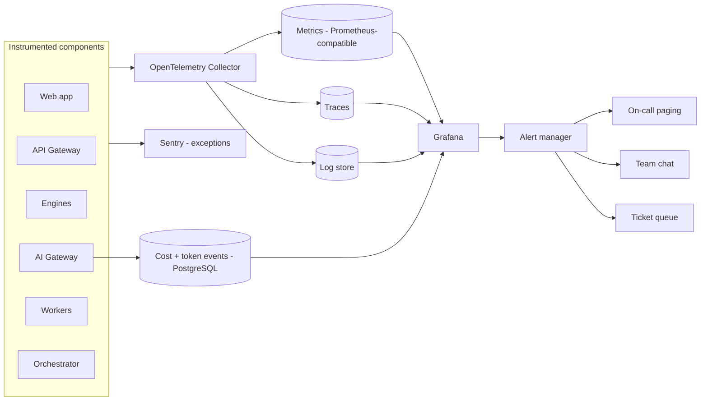
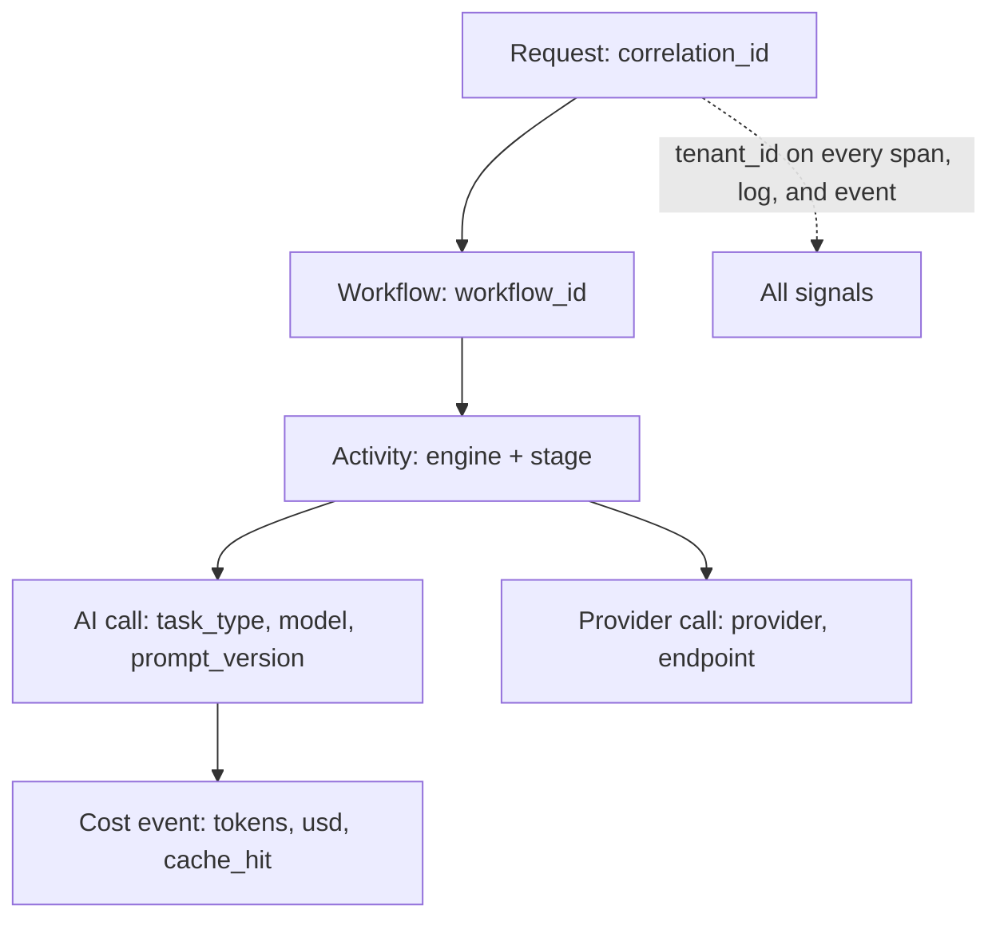

# Monitoring

> **Status:** v1.0 — complete. Operationalizes the observability NFRs in `01-system-architecture/` §4.11 and §6 into concrete SLOs, signals, dashboards, and alert routing.
> **Scope:** the SLO catalogue and error budgets, the telemetry pipeline, the metric/log/trace catalogue including AI-specific and cost signals, dashboards, alert rules and routing, and health checks.

## 1. Overview

**Why this exists.** ContentOS fails in ways a generic APM setup will not surface. HTTP 200s can hide a pipeline that has been stalled for an hour waiting on a provider; error rates can look perfect while AI spend per article silently triples after a routing change; a semantic-cache regression produces no errors at all, only a bill. The signals that matter here are pipeline progress, evidence grounding, credit consumption, and cost per article — none of which appear in a default dashboard.

**Business purpose.** Two things are being protected: the customer's experience of a long-running product (they cannot see the pipeline, so the platform must know before they ask), and gross margin (AI cost per article is the dominant variable cost and moves with every prompt and routing change).

**Technical purpose.** Provide a single, correlated telemetry pipeline — traces, metrics, logs, and cost events sharing `tenant_id`, `correlation_id`, and `workflow_id` — so an investigation moves from a customer complaint to a specific model call without a context switch.

**Design philosophy.**
1. **Alert on symptoms, diagnose with causes.** Pages map to SLOs or data-integrity invariants; everything else is a dashboard or a ticket.
2. **Every alert has a runbook.** An alert without a documented action is deleted (`incident-response.md`).
3. **Tenant dimension everywhere, cardinality controlled.** Traces and logs carry `tenant_id`; metrics do not, except for a curated set of top-N tenant metrics — unbounded tenant labels on every metric would make the metrics store cost more than the platform.
4. **Cost is a first-class signal**, monitored and alerted like latency.
5. **Instrument at boundaries.** Engine entry/exit, AI Gateway calls, provider calls, database transactions, queue operations — 100% span coverage of engine and AI boundaries is an NFR, and it is asserted at build time (`10-testing/integration-testing.md` §13).

## 2. Responsibilities

**MUST:** define SLOs and error budgets; define the metric, log, and trace catalogue; define dashboards and their audiences; define alert rules, severities, and routing; define health-check semantics; define AI cost and quality monitoring.

**MUST NOT:** define incident handling (`incident-response.md`); define scaling thresholds (`scaling-strategy.md`) — it supplies the metrics those thresholds read; define release verification (`deployment.md`) — it supplies the SLO probes that verification uses.

**Boundary:** monitoring detects and describes. Response is `incident-response.md`; capacity action is `scaling-strategy.md`.

## 3. Architecture

### 3.1 Telemetry pipeline



Cost events are written to PostgreSQL rather than only to the metrics store because they are financial records reconciled against provider invoices and against the tenant credit ledger — they must be exact and queryable per article, not sampled aggregates.

### 3.2 Correlation model



Mandatory span attributes: `tenant_id`, `correlation_id`, `workflow_id` (where applicable), `article_id`, `engine`, `stage`, and for AI spans `task_type`, `model`, `prompt_version`, `cache_hit`, `prompt_tokens`, `completion_tokens`, `cost_usd`. `prompt_version` on the span is what makes "did quality drop after prompt 7?" answerable from telemetry rather than from guesswork.

## 4. Inputs — the SLO catalogue

SLOs derive directly from the NFR table in `01-system-architecture/` §6; this document turns them into measured indicators with windows and budgets.

| SLO | Indicator | Target | Window | Error budget |
|---|---|---|---|---|
| API availability | Non-5xx / total on read paths | 99.9% | 30 d rolling | 43 min/month |
| Dashboard read latency | p95 of authenticated GETs | < 300 ms | 30 d | 1% of requests may exceed |
| Keyword lookup latency | p95, cached path | < 800 ms | 30 d | 1% |
| Pipeline success rate | Runs reaching a terminal success or an actionable, credited failure / total | ≥ 99% | 7 d | 1% |
| Pipeline duration | p50 / p95, excluding human wait | < 8 min / < 20 min | 7 d | 5% |
| Publish success | Successful publishes / attempts, excluding user-side conflicts | ≥ 99% | 30 d | 1% |
| Streaming continuity | SSE sessions delivering a terminal event | ≥ 99.5% | 7 d | 0.5% |
| Grounding integrity | Published articles with unresolvable citations | **0** | Always | None — any occurrence is an incident |
| Tenant isolation | Cross-tenant access events | **0** | Always | None — SEV1 |
| Credit accuracy | Ledger entries reconciling to metered AI cost | 100% | Daily | None |

The last three are **invariants, not SLOs** — they have no error budget. Listing them here is deliberate: they are monitored continuously and page immediately, because a "0.1% acceptable rate" of cross-tenant reads or fabricated citations is not a coherent position for this product.

**Error-budget policy:** when a 30-day budget is more than 50% consumed, non-critical deploys continue but reliability work is prioritized; when exhausted, only reliability fixes and security patches ship until the budget recovers.

## 5. Outputs — signal catalogue

### 5.1 Metrics

| Domain | Metric | Type | Notes |
|---|---|---|---|
| HTTP | `http_request_duration_seconds` | histogram | by route, method, status |
| HTTP | `http_requests_total` | counter | SLO numerator/denominator |
| Pipeline | `pipeline_runs_total{outcome}` | counter | outcome: success, failed, cancelled, blocked |
| Pipeline | `pipeline_stage_duration_seconds{stage}` | histogram | per engine stage |
| Pipeline | `pipeline_active` | gauge | concurrent runs; capacity signal |
| Pipeline | `pipeline_awaiting_human_seconds` | histogram | excluded from duration SLO, tracked separately |
| Queue | `queue_depth{queue}` / `queue_job_age_seconds{queue}` | gauge | autoscaling input (`scaling-strategy.md`) |
| Queue | `queue_dlq_total{queue}` | counter | any increase is investigated |
| Workflow | `temporal_task_queue_backlog` / `workflow_terminated_total` | gauge/counter | orchestrator health |
| AI | `ai_calls_total{task_type,model,outcome}` | counter | includes `outcome=cache_hit` |
| AI | `ai_tokens_total{direction,model}` | counter | prompt vs completion |
| AI | `ai_cost_usd_total{task_type,model}` | counter | cost dashboards |
| AI | `ai_cache_hit_ratio{task_type}` | gauge | primary cost lever (§23) |
| AI | `ai_fallback_total{from_model,to_model,reason}` | counter | provider health signal |
| Provider | `provider_request_duration_seconds{provider}` / `provider_errors_total{provider,code}` | histogram/counter | per adapter |
| Provider | `provider_circuit_state{provider}` | gauge | 0 closed, 1 half-open, 2 open |
| Quality | `gate_verdicts_total{verdict}` | counter | pass / soft-warn / block mix |
| Quality | `citation_coverage_ratio` | histogram | grounding health |
| Quality | `online_eval_score{template_family}` | gauge | from `10-testing/ai-evaluation.md` |
| Business | `credits_consumed_total` / `credit_balance_low_total` | counter | billing health |
| Data | `db_replication_lag_seconds`, `db_connection_saturation` | gauge | database health |
| Security | `cross_tenant_denied_total` | counter | RLS denials — a rising rate means a bug or a probe |

### 5.2 Logs

Structured JSON only. Mandatory fields: `timestamp`, `level`, `service`, `env`, `correlation_id`, `tenant_id`, `message`, plus domain fields. Prohibited: request/response bodies containing customer content, prompt text, credentials, tokens, or PII — an engine that needs prompt text for debugging references the `prompt_version` and the AI call id instead of inlining the prompt. Levels: `error` (actionable failure), `warn` (degraded but handled — fallback engaged, cache miss storm), `info` (state transitions), `debug` (off in production, enabled per-tenant for a bounded window).

### 5.3 Traces and sampling

Head-based sampling at 10% for routine requests, **100% for pipeline workflows, AI calls, publishes, and any request that errors** — the expensive, rare, and diagnostically valuable paths are always fully traced, while high-volume dashboard reads are sampled.

## 6. Internal Workflow — from signal to action

```
Instrumentation emits span/metric/log/cost event
  ↓
Collector enriches (env, version, region) and routes
  ↓
Recording rules compute SLIs and burn rates
  ↓
Alert rules evaluate: multi-window burn (fast + slow) or invariant breach
  ↓
Routing: page (SEV1/SEV2) | chat (SEV3) | ticket (SEV4)
  ↓
Runbook link attached to the alert payload
  ↓
Incident lifecycle -> incident-response.md
```

**Multi-window burn alerting** is used rather than static thresholds: a fast window (1 h at 14.4× burn) catches acute outages, and a slow window (6 h at 6× burn) catches slow bleeds. Static error-rate thresholds either page constantly at low traffic or miss real degradation at high traffic.

## 7. Dependencies

OpenTelemetry SDKs across all services and an OTel Collector (`01-system-architecture/11-deployment-topology.md`); a Prometheus-compatible metrics store; a trace backend (Grafana Tempo or equivalent); a log store (Grafana Loki or equivalent); Grafana for dashboards and alert rules; Sentry for exception aggregation and release-tagged regressions; PostgreSQL for cost events and eval history; the paging provider (OQ-19).

**Internal:** `packages/observability` is the only place instrumentation is configured — services import it rather than wiring OTel individually, which is what makes mandatory span attributes actually mandatory.

## 8. Database Impact

| Aspect | Detail |
|---|---|
| Cost events | `ai_call_costs` table: tenant, article, task_type, model, prompt_version, tokens, usd, cache_hit, correlation_id. Tenant-scoped with RLS; append-only |
| Reconciliation | A daily job reconciles metered cost against the credit ledger and against provider invoices; a mismatch beyond tolerance raises an alert |
| Aggregates | Hourly rollups per tenant/project feed dashboards without scanning raw events |
| Retention | Raw cost events 13 months (billing dispute window); rollups indefinitely |
| Indexes | `(tenant_id, created_at)`, `(article_id)`, `(model, created_at)` |
| Monitoring queries | Run against a read replica, never the primary — a dashboard must never be able to degrade the write path |

## 9. API Contracts — health checks

| Endpoint | Semantics | Consumer |
|---|---|---|
| `/health/live` | Process is running; no dependency checks | Container restart policy |
| `/health/ready` | Dependencies reachable and migration version as expected | Load balancer, deploy gate |
| `/health/deep` (internal, authenticated) | Per-dependency status with latency, provider circuit states, queue depths | On-call triage |

`/health/ready` must be cheap and must not cascade: a readiness check that calls a provider turns a provider outage into a full platform outage as every instance is marked unready. It checks only local dependencies (database, Redis) with short timeouts.

## 10. Error Handling

| Failure | Behavior |
|---|---|
| Collector unavailable | SDK buffers with bounded memory then drops telemetry; the application never blocks on telemetry |
| Metrics store outage | Alerting degrades; a dead-man's-switch alert (expects a heartbeat every minute) fires when signals stop — an outage that silences monitoring must itself page |
| Cardinality explosion | Label allowlist in the collector drops unapproved high-cardinality labels rather than letting the store fall over |
| Alert storm | Grouping and inhibition rules: a platform-wide SLO alert suppresses dependent component alerts |
| Missing spans on a boundary | Detected by the integration test asserting trace shape; failing the build rather than discovering the gap during an incident |

## 11. Security

- **No customer content in telemetry.** Prompts, drafts, evidence text, and connector credentials never enter logs or spans; a serializer redacts by key at any depth and is unit-tested (`10-testing/unit-testing.md` §11).
- **`tenant_id` in telemetry is an identifier, not content** — safe to log, essential for isolation forensics.
- **Access control:** dashboards with per-tenant data require operator roles; access is audit-logged. Grafana is behind SSO.
- **Security signals monitored here:** `cross_tenant_denied_total`, failed-auth rate per IP and per tenant, role escalation events, connector credential changes, and unusual export volume — all routed to the security alert channel.
- **Retention:** logs 30 days, traces 14 days, audit logs per the compliance retention policy (longer, and stored separately from operational logs so an operational retention change cannot shorten an audit trail).

## 12. Performance

Instrumentation overhead is budgeted at **under 3%** of request latency, achieved through sampling, batched export, and avoiding synchronous telemetry I/O on the request path. Metrics cardinality is capped by an allowlist; the tenant dimension is carried on traces and logs but only on a curated top-N metric set. Dashboards query pre-aggregated recording rules rather than raw series, so an incident-time dashboard load does not itself become a load problem.

## 13. Observability — dashboards

| Dashboard | Audience | Contents |
|---|---|---|
| **Platform health** | On-call | SLO burn, error rate, latency, queue depth, deploy markers |
| **Pipeline** | On-call, product | Runs by stage, stage duration heatmap, stalls, gate verdict mix, human wait times |
| **AI cost & quality** | Founder, AI engineer | Cost per article, cost by task type and model, cache hit ratio, fallback rate, online eval scores |
| **Provider health** | On-call | Per-provider latency, error rate, circuit state, quota consumption |
| **Tenant view** | Support | Per-tenant runs, failures, credit consumption, recent errors — the "what happened to this customer" screen |
| **Data & storage** | DevOps | Replication lag, connection saturation, table growth, vector index size, object storage growth |
| **Delivery** | Team | Deploy frequency, lead time, change failure rate, MTTR (`deployment.md` §13) |

**Alert catalogue (page-worthy):** availability or latency fast-burn; pipeline success rate below target; queue age above threshold; DLQ growth; provider circuit open for a critical provider; replication lag above threshold; AI cost per article above 2× the 7-day baseline; grounding-integrity breach; cross-tenant access detected; credit reconciliation mismatch; dead-man's-switch silence. Everything else notifies or files a ticket.

## 14. Future Expansion

- **Synthetic monitoring** from multiple regions running the read-only E2E subset every 15 minutes (`10-testing/e2e-testing.md` §14).
- **Real user monitoring** for frontend Core Web Vitals per route.
- **Per-tenant SLO reporting** as an enterprise contractual feature, reusing the tenant dashboard.
- **Anomaly detection on cost** per task type, replacing static multiplier thresholds.
- **Continuous profiling** for the hottest services (AI Gateway, Research Engine).
- **Trace-linked eval:** jump from a low online eval score directly to the trace of the run that produced it.

## 15. Open Questions

- Paging vendor and on-call coverage model (24×7 vs business hours at launch) — **OQ-19**.
- Whether per-tenant metric cardinality is affordable beyond the curated top-N set.
- Log/trace retention windows versus enterprise contractual expectations (interacts with **OQ-9**).

Tracked in `99-open-questions.md`.

## Cross References

- `01-system-architecture/11-deployment-topology.md` — where the observability stack runs
- `deployment.md` — deploy markers, SLO-burn-triggered rollback, release health
- `incident-response.md` — what happens after an alert fires
- `scaling-strategy.md` — consumes queue depth, saturation, and latency signals as scaling triggers
- `10-testing/ai-evaluation.md` — online eval scores and drift alerts
- `08-ai-platform/ai-gateway.md` — emitter of AI cost and token signals
