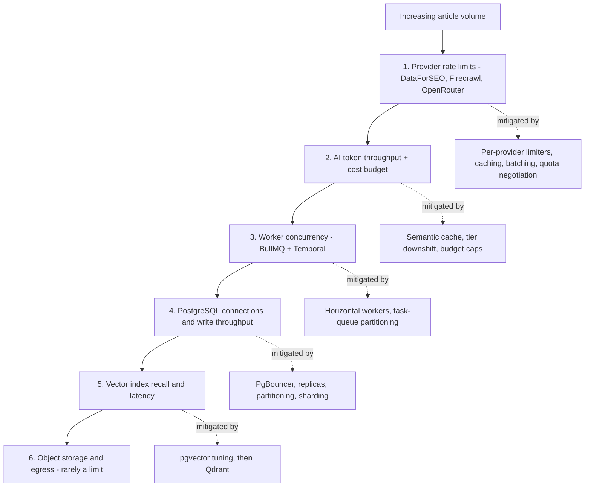

# Scaling Strategy

> **Status:** v1.0 — complete. Operationalizes `01-system-architecture/` §29 (Future Scalability) into a capacity model, concrete scaling triggers, and staged architectural thresholds.
> **Scope:** the capacity model and unit economics, per-component scaling triggers, the database scaling ladder, the pgvector → Qdrant cutover criteria, AI-tier and provider-quota scaling, fairness under multi-tenancy, cost control, and the multi-region path.

## 1. Overview

**Why this exists.** The architecture claims it scales from 10 users to 1,000,000+ without redesign. That claim is only credible if the *sequence* of scaling steps is written down: which component saturates first, what metric reveals it, what the response is, and at what point scaling out stops working and an architectural change is required. Without that sequence, "scale horizontally" is aspiration.

**Business purpose.** Capacity is money. Each article consumes provider quota, AI tokens, worker CPU, and storage; growth must translate to predictable unit cost, and the pricing model (OQ-10) depends on knowing the cost floor per article. Equally, one agency's 500-article batch must not degrade every other tenant — fairness is a retention issue, not just an engineering one.

**Technical purpose.** Define the observable trigger and the bounded response for every scalable component, plus the thresholds at which the platform advances to its next architectural stage.

**Design philosophy.**
1. **Scale the queue, not the request.** Nearly all heavy work is asynchronous; the correct response to load is deeper queues and more workers, not bigger synchronous instances.
2. **The bottleneck is rarely CPU.** It is provider rate limits, database connections, and AI token throughput — so scaling triggers read those, not CPU alone.
3. **Fairness is engineered.** Per-tenant limits and fair scheduling are default behavior, not an enterprise feature.
4. **Cost per article is a monitored SLI.** A change that doubles throughput and triples cost is a regression.
5. **Stage transitions are pre-decided.** Each has a trigger metric and a threshold, so the team upgrades on data rather than on anxiety.

## 2. Responsibilities

**MUST:** define the capacity model and the cost-per-article baseline; define scaling triggers and bounds per component; define the database scaling ladder and its thresholds; define vector-store cutover criteria; define provider-quota and AI-throughput scaling; define fairness controls; define the multi-region path.

**MUST NOT:** define the topology (`01-system-architecture/11-deployment-topology.md`); define alert rules (`monitoring.md`) — it consumes those metrics; define release mechanics (`deployment.md`); set commercial pricing (OQ-10), though it supplies the cost inputs.

**Boundary:** ends where an architectural change is required; at that point the next step becomes an ADR (`01-system-architecture/13-adr-log.md`).

## 3. Architecture

### 3.1 Load model

One article pipeline is the unit of load. A standard 2,000-word run consumes roughly:

| Resource | Per article (standard run) | Notes |
|---|---|---|
| Temporal activities | 40–70 | One per engine step plus fan-out |
| BullMQ jobs | 25–60 | SERP fan-out, fetch/parse, embeddings, media |
| AI calls | 30–60 | Tiered; heavily cache-influenced |
| AI tokens | 300k–800k | Dominated by Writing and Review |
| Provider calls | 20–60 | DataForSEO, Firecrawl, Exa |
| DB writes | 150–400 rows | Evidence, sections, reports, events |
| Object storage | 2–20 MB | Raw archives + media |
| Wall clock | 8–20 min | Excluding human waits (§6 NFR) |

**Derived planning numbers:** 500 concurrent pipelines (the v1 NFR) implies roughly 300–600 concurrently active AI calls at peak, which makes the AI Gateway and provider quota — not application CPU — the binding constraint. This single observation drives most of the scaling design below.

### 3.2 Saturation order



### 3.3 Scaling stages

| Stage | Scale | Shape | Trigger to advance |
|---|---|---|---|
| **S1** | < 1k articles/day | Coolify; modular monolith; single PostgreSQL; pgvector; single Redis | Sustained worker saturation or > 60% DB connection use |
| **S2** | 1k–10k/day | Kubernetes; HPA on queue depth; read replicas; PgBouncer; separate Redis for cache vs queues; Temporal task-queue partitioning | p95 pipeline duration breaching SLO at steady state, or replica lag > 2 s |
| **S3** | 10k–100k/day | Hot engines extracted as services (AI Gateway, Research, Review); table partitioning by time and `tenant_id`; Qdrant; dedicated embedding pipeline | Largest tenants dominating a shared table; cross-region demand |
| **S4** | 100k+/day | Selective sharding for the largest tenants; regional deployments with a global control plane | — |

Extraction at S3 is a deployment change rather than a redesign because engines already communicate only through `contracts` (§29.2) — that is the concrete payoff of the boundary discipline enforced in `10-testing/testing-strategy.md`.

## 4. Inputs — scaling triggers

Every trigger reads a metric defined in `monitoring.md` §5.

| Component | Trigger metric | Scale-out threshold | Scale-in | Bound |
|---|---|---|---|---|
| Web / API Gateway | CPU + p95 latency | CPU > 65% for 5 min, or p95 > 250 ms | < 35% for 15 min | Min 2 instances for availability |
| BullMQ workers | `queue_job_age_seconds` p95 | > 60 s for 3 min | < 10 s for 15 min | Capped by provider limiters, not by CPU |
| Temporal workers | Task-queue backlog | > 100 tasks for 3 min | Backlog 0 for 15 min | Per task queue |
| Embedding workers | Embedding queue depth | > 5,000 pending | Depth < 500 | Cost-capped |
| PostgreSQL | Connection saturation, replica lag | > 70% connections → PgBouncer/replica; lag > 2 s → offload reads | — | Vertical first, then the ladder in §8 |
| Redis | Memory, evictions, latency | Evictions > 0 sustained, or memory > 70% | — | Split cache/queue instances before scaling either |
| Vector | Query p95, recall drift, index size | p95 > 200 ms or index > 50 GB | — | Cutover criteria in §12 |
| AI Gateway | In-flight calls, provider 429 rate | 429 rate > 1% → raise quota or throttle | — | Stateless; scales freely, but providers do not |

**Scale-in is deliberately slower than scale-out** (longer windows, lower thresholds): a worker terminated mid-activity costs a retry and, worse, risks the double-effect interleavings that the idempotency suite exists to catch. Aggressive scale-in trades a small infrastructure saving for a correctness risk.

## 5. Outputs

| Output | Consumer |
|---|---|
| Autoscaling events with trigger metric and resulting replica count | Operations dashboard, incident timelines |
| Capacity report: peak concurrency, headroom per component, projected exhaustion date | Quarterly planning |
| Cost per article: total and by component (AI, providers, infrastructure) | Pricing (OQ-10), margin monitoring |
| Provider quota utilization per provider | Contract renegotiation timing |
| Stage-transition recommendation with the trigger that fired | ADR proposal |

## 6. Internal Workflow — responding to load

```
Monitoring detects trigger threshold breach
  ↓
Autoscaler adjusts replicas within configured bounds (workers, API)
  ↓
If bound reached: throttle at the edge (per-tenant rate limits) rather than accept unbounded queue growth
  ↓
If provider-limited: requests queue behind the limiter; pipelines slow but never fail spuriously
  ↓
If sustained beyond the stage envelope: capacity report flags the stage transition
  ↓
Stage transition planned as an ADR + a migration plan (deployment.md)
```

**Degradation preference under overload**, in order: (1) slow non-interactive work — analytics pulls, refresh scans, cache warming; (2) shed batch pipeline starts while protecting in-flight runs, because a half-finished article is worse than a delayed one; (3) reduce optional enrichment (fewer competitors analyzed, smaller evidence set) with the reduction recorded in the output's explainability so quality changes are never invisible; (4) queue new interactive requests with a communicated wait; (5) reject with a typed, retryable error. Interactive reads are protected longest.

## 7. Dependencies

Container platform autoscaling (Coolify manual/scripted at S1, Kubernetes HPA/KEDA from S2 — KEDA specifically because queue depth, not CPU, is the correct scaling signal); managed PostgreSQL with replicas and PgBouncer; Redis cluster; Temporal with partitioned task queues; provider quotas and contracts (DataForSEO, Firecrawl, Exa, OpenRouter); the metrics pipeline in `monitoring.md`; and cost telemetry from the AI Gateway.

## 8. Database Impact — the scaling ladder

PostgreSQL is the component whose scaling is most consequential and least reversible, so its steps are pre-decided:

| Step | Action | Trigger | Notes |
|---|---|---|---|
| 1 | Vertical scale + index tuning | Connection saturation < 70%, CPU-bound queries | Cheapest, always first |
| 2 | **PgBouncer** transaction pooling | Connection count approaching the instance limit | Worker fleets exhaust connections long before CPU; this is the most common early wall |
| 3 | **Read replicas** for analytics, dashboards, exports, backups | Read load > 50% of primary capacity | Application must route reads explicitly; replica lag is surfaced so stale reads are a known condition, not a mystery bug |
| 4 | **Partition high-volume tables** by time and/or `tenant_id` | Table > 100 GB or > 500M rows; index maintenance windows growing | Candidates: `evidence`, `ai_call_costs`, `analytics_snapshots`, `events`, `audit_log` |
| 5 | **Archive cold data** to object storage | Evidence/media older than the retention policy | Per plan tier (OQ-9) |
| 6 | **Selective sharding** for the largest tenants | A single tenant exceeding ~10% of total volume | Tenant-per-shard routing at the data-access layer; RLS remains inside each shard |

**RLS at scale.** RLS adds a predicate to every query; at S3 volumes, policy predicates must be index-supported — every hot query's index must lead with `tenant_id`. This is asserted by the `EXPLAIN` checks in `10-testing/integration-testing.md` §8, which is precisely why those assertions exist at build time rather than being discovered as a production regression.

**Vectors.** pgvector with HNSW serves S1–S2. The **cutover criteria to Qdrant (OQ-6 recommendation)**: any two of — index size > 50 GB, query p95 > 200 ms at target recall, embedding count > 50M, or vector workload contending measurably with transactional load on the primary. The migration path is dual-write, backfill, shadow-read comparison, then cutover; the parity suite in `10-testing/integration-testing.md` §14 is what makes shadow comparison meaningful.

## 9. API Contracts — limits and fairness

| Control | Rule |
|---|---|
| Per-tenant API rate limits | By plan tier; `429` with `Retry-After`; buckets are per-tenant so one tenant cannot exhaust another's allowance |
| Per-tenant concurrent pipelines | Plan-tier cap; excess runs queue with a visible position rather than failing |
| Per-tenant AI spend caps | Enforced by the AI Gateway per request and per period; `BudgetExceeded` is a typed, actionable error |
| Fair scheduling | Worker pull uses round-robin across tenants rather than strict FIFO, so a 500-article batch interleaves with a single-article tenant instead of starving it |
| Batch endpoints | Bulk operations are explicitly asynchronous and rate-shaped; there is no synchronous bulk path to abuse |
| Provider quota fairness | The per-provider limiter is global; per-tenant shares prevent one tenant consuming the platform's entire external quota |

Fair scheduling is the single most important multi-tenant scaling control: FIFO queues make the platform's responsiveness a function of the largest customer's batch size, which is exactly backwards from what smaller customers experience as reliability.

## 10. Error Handling — capacity failures

| Failure | Behavior |
|---|---|
| Queue growth beyond drain capacity | Edge throttling engages; new pipeline starts shed before in-flight runs are harmed; SEV3 unless customer-visible SLO breach |
| Provider quota exhausted | Limiter queues rather than errors; if the wait exceeds the stage's threshold, pipelines pause with a typed, resumable state — never a failed run that consumed credits |
| Autoscale ceiling reached | Alert with the binding metric; degradation order in §6 applies |
| Thundering herd after an outage | Jittered retry and a ramped queue resume, so recovery does not immediately re-saturate what just recovered |
| Hot tenant saturating a shard | Rate-limit that tenant to its contracted share; plan a shard move |
| Cost budget exhaustion | AI Gateway refuses further spend for the affected tenant with an actionable error; platform-level budget breach pages immediately |

## 11. Security

Scaling interacts with security in three specific ways, each with a control:

- **Fairness is a denial-of-service defense.** Per-tenant limits mean a compromised or abusive tenant degrades only itself.
- **Isolation must survive every scaling step.** Replicas, partitions, shards, and a new vector store each inherit tenant scoping; the RLS-coverage gate and the cross-tenant vector assertion run against every configuration, and a shard added without policies is a build failure, not a review finding.
- **Autoscaling is an attack surface.** Scaling triggers driven by unauthenticated traffic allow cost-amplification attacks; edge rate limiting and bot filtering sit in front of the autoscaled tier, and cost alerts (`monitoring.md`) act as the backstop that catches amplification the limiter missed.

## 12. Performance — cost per article

Cost per article is tracked as a first-class metric with three components: **AI** (dominant; steerable by routing, semantic cache hit ratio, and context size), **providers** (SERP, crawl, semantic search calls; steerable by the external-data cache TTL), and **infrastructure** (compute, storage, egress; the smallest term at any realistic scale).

The three most effective levers, in order: (1) **semantic cache hit ratio** — the single largest lever, which is why it has a dedicated gauge and dashboard; (2) **tier downshift validated by evaluation** — moving a task to a cheaper model only when `10-testing/ai-evaluation.md` shows the quality delta within tolerance; (3) **context size discipline** in the Context Builder, since token cost scales with retrieved evidence volume and, past a point, additional context measurably degrades output rather than improving it.

Alert: cost per article above 2× the 7-day baseline. This catches the realistic regressions — a cache key change that silently disabled caching, a prompt that ballooned context, a fallback chain routing everything to the premium tier during a provider degradation.

## 13. Observability

Capacity signals watched continuously: queue depth and job age per queue, Temporal backlog per task queue, worker utilization, DB connection saturation and replica lag, Redis memory and evictions, vector query latency and index size, provider quota consumption as a percentage of contracted limits, concurrent pipelines versus the 500 target, and cost per article. The **capacity review** is quarterly: each component's headroom, growth rate, and projected exhaustion date, producing either a scaling action or a stage-transition ADR. Projected exhaustion dates are what convert scaling from reactive firefighting into planned work.

## 14. Future Expansion

- **Multi-region** (§29.4): region-pinned tenants with region-local compute and data, a global control plane for identity and billing, and region-aware routing at the edge — gated on residency demand (OQ-7) and DR strategy (OQ-20).
- **Predictive autoscaling** from historical patterns, pre-warming workers ahead of known batch windows.
- **Tenant tiering** onto dedicated worker pools and connection pools for enterprise contracts.
- **Spot/preemptible capacity** for embedding and media generation, which are interruptible by nature.
- **Cross-tenant semantic cache for public evidence** — a large potential cost saving with a genuine isolation risk, which is why it is listed as future work requiring an ADR and not a v1 optimization.
- **Read-your-writes routing** so replica adoption never surfaces stale reads to the writer.

## 15. Open Questions

- pgvector → Qdrant cutover thresholds: §8 states a concrete recommendation, but the decision remains **OQ-6** until accepted as an ADR.
- Multi-region timing and residency scope — **OQ-7**.
- Per-plan concurrency and spend caps, which depend on the credit pricing model — **OQ-10**.
- Whether a cross-tenant cache for public evidence is ever acceptable, and under what proof of isolation.

Tracked in `99-open-questions.md`.

## Cross References

- `01-system-architecture/11-deployment-topology.md` — topology at each stage
- `03-database/indexes.md` — indexing and partitioning strategy referenced by the ladder
- `monitoring.md` — every trigger metric defined here
- `deployment.md` — how stage transitions are rolled out safely
- `incident-response.md` — capacity incidents and degradation playbooks
- `backup-recovery.md` — how partitioning and size affect restore time
- `08-ai-platform/model-router.md`, `08-ai-platform/ai-gateway.md` — AI throughput, tiering, and budget enforcement
- `10-testing/ai-evaluation.md` — validating cost-driven routing changes
