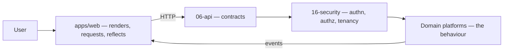
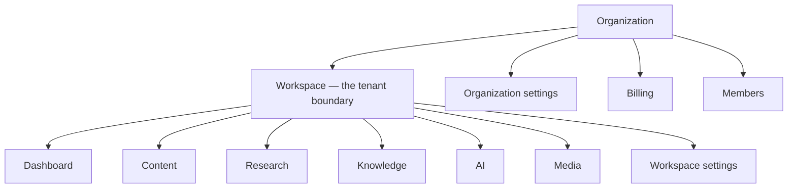

# Application UI

> **Status:** v1.0 — complete. New in Phase 15.
> **The UI is informative, never authoritative.** It renders what the server says, requests what the user asks, and reflects what comes back. Every rule it appears to enforce is enforced again on the server, and the server's answer wins.

## Overview

**Purpose.** Define the application's screen hierarchy, navigation, page responsibilities, component boundaries, permission-driven visibility, and the UX contracts that make asynchronous work legible.

**What this folder is not.** It contains no business rule, no validation logic that isn't duplicated server-side, no permission decision, and no API behaviour. Twelve phases specified what the platform does; this folder specifies how a person sees and drives it.

**The stack is already decided.** Next.js App Router (ADR-016), in `apps/web` (`07-development-guide/project-structure.md`). This folder does not re-decide it.

## UI philosophy

**Three commitments shape every screen.**

**The server owns truth.** A client-side check is a courtesy that saves a round trip and improves a message. It is never the reason something is safe. Disabling a button prevents a mistake; it does not prevent an attack, and the API refuses the call regardless (`16-security/api-security.md`).

**Asynchronous work is visible work.** The platform's central operation — the content pipeline — takes minutes and returns `202` with a handle. A UI that hid that behind a spinner would misrepresent a system whose defining characteristic is durable, resumable, long-running work. Progress is a first-class surface, not a loading state.

**Explanations travel with recommendations.** Every recommendation the platform surfaces carries an Explainability Envelope — `{ recommendation, reason, evidence[], expected_impact, confidence }` (ADR-009). A screen that displayed a score without its explanation would strip the property that makes the product trustworthy. The envelope is a rendering requirement, not an optional detail view.

## Separation of UI and business logic

| The UI does | The UI never does |
|---|---|
| Render server state | Compute a score, verdict, or recommendation |
| Request an action | Decide whether an action is permitted |
| Show why something is disabled | Rely on disabling for enforcement |
| Display validation errors | Be the only place a rule is checked |
| Reflect a status | Set a status |

**The clearest case is article status.** Fourteen values exist and the UI renders all of them; **none is settable** (`06-api/content-api.md`). Sending `status` in a `PATCH` is a `400`, not a silent no-op — so a UI built on the assumption that it drives state transitions fails loudly rather than diverging.

**Permission-driven visibility is rendering, not enforcement.** `GET /v1/workspaces/{workspaceId}/permissions` exists to hide affordances the user cannot use. `16-security/authorization.md` states explicitly that this is never an enforcement path, and this folder repeats it because the UI is where the temptation to trust it lives.

## Relationship to previous phases

| Phase | What the UI takes from it | What the UI must never do |
|---|---|---|
| **`06-api/`** | Every contract: endpoints, schemas, status codes, pagination, idempotency | Call an endpoint not in `api-reference.md` |
| **`16-security/`** | Session handling, permission visibility, 404-versus-403 semantics | Enforce a permission; reveal cross-tenant existence |
| **`04-platform/`** | Notifications inbox, workflow boards, credits, billing surfaces | Compute credit cost or entitlement |
| **`05-content-platform/`** | The pipeline's shape, gate verdicts, revisions, citations | Decide a gate verdict or bypass one |
| **`08-ai-platform/`** | Cost and usage display, Council disclosure | Name a model or provider |
| **`11-knowledge-platform/`** | Evidence, provenance, freshness presentation | Expose vectors or raw distances |
| **`12-storage-platform/`** | Upload flow, media states, signed URLs | Construct a storage key |
| **`13-event-platform/`** | Progress semantics, at-least-once expectations | Assume ordered or exactly-once delivery |
| **`07-development-guide/`** | Coding standards, project structure, testing | Introduce a package or boundary |

**Four inherited constraints govern more UI decisions than any others:**

**Cross-tenant denial is `404`, in-tenant is `403`.** The UI must render these differently: a `404` shows "not found," never "you lack permission," because a permission message would confirm the resource exists in another tenant (`16-security/authorization.md`).

**Long-running operations return `202` with a run handle and stream progress over SSE.** The run resource is the source of truth; the stream is a convenience, and a client that misses events reconstructs state from `GET /v1/runs/{runId}` (`01-system-architecture/09-request-flow.md`, `06-api/research-api.md`).

**Event delivery is at-least-once with no ordering guarantee across HTTP.** A UI driven by webhooks or notifications treats them as signals to refetch, never as deltas to apply (`06-api/webhooks.md`).

**No model, provider, or routing decision is ever exposed.** The AI surfaces show cost in credits, Council participant counts, and consensus — never which model produced what (`06-api/ai-api.md`).

## Folder overview

| Document | Owns |
|---|---|
| `README.md` | Philosophy, phase relationships, navigation map |
| `design-principles.md` | Consistency, disclosure, accessibility, loading, errors, empty states, confirmation, undo, optimistic updates |
| `information-architecture.md` | The screen hierarchy, journeys, context switching, deep links |
| `navigation.md` | Global and workspace navigation, breadcrumbs, search, shortcuts, permission-driven visibility |
| `dashboard.md` | Overview aggregation, widgets, and their authoritative destinations |

**Later batches** extend this set to the remaining surfaces — content, research, knowledge, AI, media, settings, and administration — following the same ownership discipline.

## Navigation map

**The hierarchy mirrors ADR-017 exactly.** Organization is the commercial boundary; workspace is the tenant and the isolation boundary; everything below it is scoped to one tenant.

**Organization-level screens and workspace-level screens are separated deliberately**, because organization roles grant no content access. An organization Owner sees members, billing, and the workspace list — and cannot open a workspace's content without a workspace role (`16-security/rbac.md`). The navigation makes that boundary visible rather than surprising.

## Document ownership

**This folder owns presentation. It owns no rule that exists elsewhere.**

| Owned here | Not owned here |
|---|---|
| Screen hierarchy and routes | Endpoint paths (`06-api/api-reference.md`) |
| What a widget shows and where it links | What the data means |
| When a confirmation is required | Whether an operation is permitted |
| How progress is rendered | Run semantics (`06-api/research-api.md`) |
| Which affordances are hidden | Permission evaluation (`16-security/authorization.md`) |
| Empty, loading, and error presentation | Error codes (`07-development-guide/error-handling.md`) |
| Keyboard shortcuts and focus order | Any business rule |

**Where a UI document appears to state a rule, it is restating one and names its owner.** A screen that says "publishing requires a `pass` or `soft-warn` verdict" is quoting `05-content-platform/publishing-engine.md`, not deciding it.

## Testing posture

**`apps/web` carries no coverage threshold** (`10-testing/testing-strategy.md` §9). That is deliberate and is not an invitation to skip testing — it reflects that UI correctness is better asserted by end-to-end journeys than by line coverage of render functions.

**The E2E suite covers journeys, not features** (`07-development-guide/testing-guide.md`): sign up → create workspace → run a pipeline → publish. A feature-per-test suite becomes the slowest and flakiest part of CI.

**Accessibility is asserted, not reviewed.** Automated checks run in CI; the specifics are in `design-principles.md`.

## Cross references

- `06-api/api-reference.md` — **every endpoint the UI may call**
- `06-api/api-principles.md` — pagination, idempotency, errors, rate-limit headers
- `16-security/authorization.md` — permission visibility; 404-versus-403
- `16-security/authentication.md` — session, MFA, step-up flows
- `16-security/rbac.md` — the roles that drive visibility
- `01-system-architecture/09-request-flow.md` — `202`, handle, SSE progress
- `01-system-architecture/13-adr-log.md` — ADR-009 Explainability Envelope, ADR-016 stack, ADR-017 hierarchy
- `04-platform/notifications.md` — the in-app inbox surface
- `04-platform/workflow.md` — board and queue surfaces
- `05-content-platform/` — pipeline stages, gates, revisions
- `07-development-guide/project-structure.md` — `apps/web` placement and import boundaries
- `10-testing/testing-strategy.md` — no coverage threshold on `apps/web`
