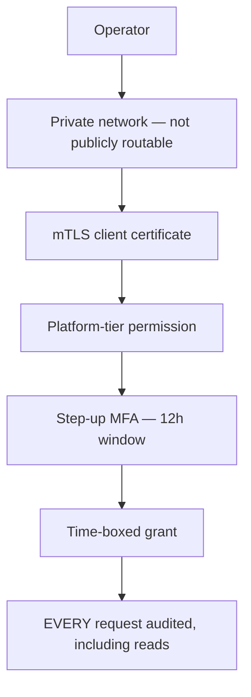
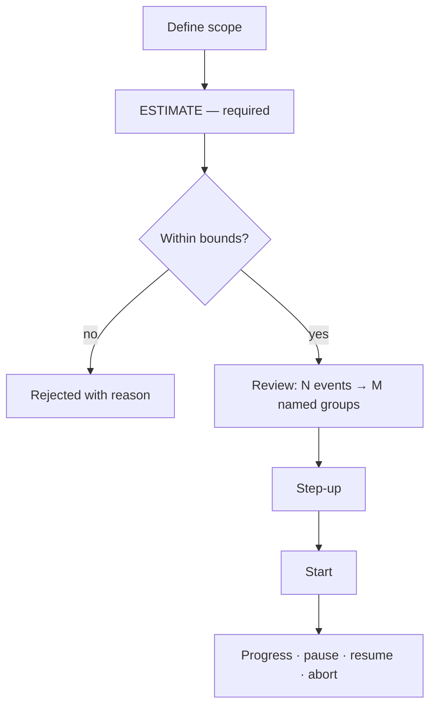

# Administration

> **Status:** v1.0 — complete. Phase 15 batch 3.
> **This is a separate application.** `apps/admin`, not `apps/web`. It is network-isolated, requires platform-tier permissions no customer role holds, demands step-up, and **audits every request including reads**.

## Overview

**Purpose.** Define the operator console: health, system status, configuration inspection, feature flags, jobs and workers, dead-letter inspection, replay administration, audit lookup, and tenant lookup.

**Scope.** Screen composition and states. Every control it surfaces is specified in `06-api/admin-api.md`, and no behaviour is redefined.

**Boundary with the customer application.** `information-architecture.md` and `navigation.md` state that the operator surface has **no screen in `apps/web`**, and that remains true. This document covers the distinct operator console in `apps/admin` (`07-development-guide/project-structure.md`).

## Access model

| Control | Rendering |
|---|---|
| Network isolation | Not reachable from the customer app; no link exists between them |
| mTLS | A certificate failure renders a connection error, never a login form |
| Permission | Platform-tier only — `dlq:read`, `dlq:manage`, `replay:execute`, `platform:audit`, `platform:support` |
| Step-up | Required on every mutating action; remaining window shown |
| **Grant expiry** | **Time remaining is displayed persistently** |
| **Audit** | **A persistent banner states that all activity is recorded** |

**The audit banner is permanent and not dismissible.** An operator working across tenant boundaries should never be uncertain whether their actions are recorded — and reads are audited here, inverting the customer application's rule (`16-security/audit.md`).

**Grant expiry is displayed as a countdown**, because a time-boxed grant that expires mid-investigation without warning produces a confusing failure.

**No customer user reaches this application.** Platform-tier permissions are granted individually to operator identities and are never held by a customer role (`16-security/rbac.md`).

## Health and readiness

| Property | Value |
|---|---|
| **API** | `GET /healthz` · `/readyz` · `/startupz` |
| **Permission** | **None** — orchestrator probes |
| **Rendering** | A simple status board |

**Neither probe names a dependency**, and the console renders exactly what they return. Detailed component health requires authentication and lives on System Status.

**Liveness never checks dependencies**, and the console does not present it as if it did. Showing "liveness: database unreachable" would misrepresent a probe designed to avoid exactly that (`07-development-guide/deployment-guide.md`).

## System status

| Property | Value |
|---|---|
| **API** | `GET /admin/v1/status` |
| **Permission** | `platform:support` |
| **Shows** | Build identity, component health, **invariant breaches (24 h)** |

**The invariant panel is the console's primary artifact and is designed to be boring.**

| Invariant | Target |
|---|---|
| Cross-tenant events | **0** |
| Audit write failures | **0** |
| Ordering violations | **0** |
| RLS policy violations | **0** |
| Checksum mismatches | **0** |

**Every panel reads zero, and a non-zero value is an incident rather than a metric to interpret.** There are no thresholds to tune and no judgement required, which is what makes it usable at 03:00 by someone who did not build it (`16-security/security-observability.md`).

**`commitSha` and `deployedAt` are shown prominently**, because "what is actually running here" is the first question in most incidents.

**Component health renders `healthy` / `degraded` / `unhealthy` with detail**, and links to the owning platform's runbook.

## Configuration inspection

| Property | Value |
|---|---|
| **API** | `GET /admin/v1/config` |
| **Permission** | `platform:support` |
| **Read-only** | **Yes — there is no edit affordance** |

**Secret names and versions are shown; values never are.** The UI renders `database.passwordSecret → db-app-password (v4, resolved 09:12)` and nothing more (`16-security/secrets-management.md`).

**Configuration is read-only through this console.** Changes go through deployment, and a mutable configuration screen would let an operator alter production behaviour outside the pipeline with no artifact and no rollback target (`07-development-guide/configuration.md`).

**The absence of an edit affordance is stated**, so an operator does not hunt for it during an incident.

## Feature flags

| Property | Value |
|---|---|
| **API** | `GET /admin/v1/flags` · `PATCH /admin/v1/flags/{flagName}` |
| **Permission** | `platform:support` + **step-up** |
| **Concurrency** | `If-Match` |

**Flags are the fastest rollback available** — seconds, no deploy — which is why they are on this surface at all (`07-development-guide/deployment-guide.md`).

**A flag gating a security control cannot exist**, and an attempt returns `403 FLAG_IMMUTABLE`. The console states the rule rather than presenting a control that will refuse.

**Stale flags — past their removal date — are marked and remain changeable.** Blocking a change to an overdue flag would remove a rollback lever during an incident.

**Percentage and per-tenant overrides are shown together**, because a flag enabled at 5% with three tenant overrides behaves differently from either alone.

**Every change is audited with before and after.**

## Jobs and workers

| Property | Value |
|---|---|
| **API** | `GET /admin/v1/jobs` · `GET /admin/v1/workers` |
| **Permission** | `platform:support` |

| Signal | Rendering |
|---|---|
| **`instanceCount: 0` for a registered group** | **Alert state — the loudest thing on the screen** |
| `lagSeconds` | **Time, not entry count** |
| `pendingCount` | Claimed but unacknowledged |
| Worker heartbeat age | Stale workers marked |

**Zero instances for a registered consumer group is the alert that catches a failed deploy.** Events accumulate with no error anywhere, and the capability that group powers silently stops working — so it renders as an alert, not as a zero in a table (`13-event-platform/workers.md`).

**Lag is displayed in seconds.** A backlog of 50,000 means nothing without a drain rate; "the oldest unprocessed event is 40 minutes old" is directly actionable.

**Scheduled jobs show their last run, next window, and lock-skip count.** A skipped window is not an error — it means a peer held the lock.

## Dead-letter inspection

| Property | Value |
|---|---|
| **API** | `GET /admin/v1/dlq[/{entryId}]`; resolve · discard · replay |
| **Permission** | `dlq:read`; actions require `dlq:manage` + **step-up** |
| **Default view** | **Grouped by `failure_code`** |

**Grouped is the default, not a toggle.** It turns a 4,000-entry queue into three distinct incidents, which is the difference between triage and archaeology (ADR-027).

**Publish-side and delivery-side entries are visually distinct**, because they demand different responses: publish-side means no consumer saw the event at all.

**`correlationId` is a first-class filter**, since one failing operation typically dead-letters several events across groups.

**Every entry shows its full retry history** — attempt, classification, error, timestamp — captured at each attempt rather than reconstructed.

**Resolve and discard require a note, and the field cannot be skipped.** The API enforces it with a CHECK constraint; the console enforces it in the form.

**There is no delete affordance.** Removal happens only through retention of already-terminal entries — an API that could remove a quarantined entry would be an API that could lose an event.

**Payloads are shown.** They carry identifiers, not content, which is what makes operator inspection across a tenant boundary acceptable at all (`13-event-platform/event-registry.md`).

**Alerting is by registry criticality, not depth.** One dead-lettered critical event outranks five hundred low-criticality ones, and the console orders accordingly.

## Replay administration

| Property | Value |
|---|---|
| **API** | `POST /admin/v1/replays/estimate` · `POST /admin/v1/replays` · pause · resume · abort |
| **Permission** | `replay:execute` + **step-up** |

**Estimation is required before start and the console enforces the order.** An operator seeing "2.4 million events across 6 groups" reconsiders; one who typed a date range a year too wide and pressed go does not get the chance (ADR-028).

**`targetGroups` is a required multi-select with no "all" option.** There is no broadcast, and the UI cannot express one — an operator rebuilding one projection who also re-delivered to notifications would send a week of duplicate emails.

**The confirmation restates the target groups by name**, not by count.

**An overlapping run is refused** — `409 REPLAY_RUN_ACTIVE` — and the console links to the active run rather than reporting a generic conflict.

**Progress shows delivered, skipped with reasons, and `suppressedAsDuplicate`.** A high suppression count is proof idempotency is working; **zero suppressions where overlap was expected is flagged**, because duplicate effects may have occurred.

**Abort states that delivered events are not rolled back.**

## Audit lookup

| Property | Value |
|---|---|
| **API** | `GET /admin/v1/audit` · `.../timeline/{correlationId}` · `POST .../audit/verify` |
| **Permission** | **`platform:audit`** + step-up |
| **Audited** | **Yes — reading the audit log is itself audited** |

**The timeline view is the investigation primitive.** From one `correlationId` it returns every audited action caused by a single request, across services, tenants, and asynchronous work — reconstructing an incident in one query.

**Chain verification renders as valid or broken with the break point.** A failure is presented as a **suspected compromise**, not a data-quality finding: the chain breaks for exactly two reasons, and treating the benign one as likely is how the other goes unnoticed (`16-security/audit.md`).

**There is no write, edit, or delete affordance.** The interface offers no path to mutation because the API offers none.

**A cross-tenant audit read pages every time**, and the console states that before the query runs.

## Tenant lookup

| Property | Value |
|---|---|
| **Purpose** | Support investigation across a tenant boundary |
| **Permission** | **`platform:support`** — time-boxed, individually approved |
| **Audited** | Every lookup, as a **cross-tenant operation** |
| **Alerted** | **Yes — every time** |

**This is break-glass and the console presents it as such.** Before the first query it requires a stated reason, which is recorded in the audit entry alongside the actor and the tenant.

**It surfaces operational state, not content.** Workspace status, run history, quota, storage totals, and integration health — never article bodies, evidence text, or media.

**A `contentos_operator` database session pages unconditionally**, and the console states this. Break-glass access is legitimate and rare; the page is not an accusation but a guarantee that no privileged session happens unobserved (`16-security/row-level-security.md`).

**The grant is time-boxed and the remaining window is displayed.**

## Common UI states

| State | Rendering |
|---|---|
| **Loading** | Table skeletons; the invariant panel never renders optimistically |
| **Empty** | "No dead letters" · "No active replays" · filtered to nothing |
| **Success** | Action result inline; audit confirmation shown |
| **Failure** | Full error with `requestId`; **operator errors are not sanitised the way customer errors are** |
| **Retry** | `5xx`, `503`, network — never `4xx` |
| **Offline** | **Fully read-only; every mutating control disabled** |
| **Conflict** | `409` on replay start or DLQ resolve — links to the conflicting entity |
| **Permission denied** | `403`: names the required platform-tier permission |
| **Not found** | `404` on an entry or run, with retention stated |
| **Maintenance** | Health and status remain; mutations disabled |

**Operator errors carry more detail than customer errors.** The audience is inside the trust boundary, and withholding a failure reason from the person diagnosing it serves nobody — but secrets, payloads, and credentials are still never rendered.

**Offline is fully read-only.** A queued replay or DLQ discard applied later against changed state is exactly the class of mistake this console exists to prevent.

## Business rules

1. **This is `apps/admin`, a separate application** from the customer app.
2. **No customer user reaches it**; platform-tier permissions are never in a customer role.
3. **Every request is audited, including reads.**
4. **The audit banner is permanent and not dismissible.**
5. **Grant expiry is displayed as a countdown.**
6. **Probes name no dependency; liveness is not presented as dependency-aware.**
7. **The invariant panel reads zero**, with no thresholds to interpret.
8. **Configuration is read-only**; secret values are never shown.
9. **No flag can gate a security control**; stale flags remain changeable.
10. **Zero instances for a registered group renders as an alert.**
11. **Lag is displayed in seconds, never entry count.**
12. **DLQ defaults to grouped by failure code**; notes are mandatory; there is no delete.
13. **Replay estimation precedes start**, and `targetGroups` has no "all" option.
14. **Zero replay suppressions where overlap was expected is flagged.**
15. **Audit reads are audited; there is no mutation affordance.**
16. **Chain verification failure is presented as a suspected compromise.**
17. **Tenant lookup requires a stated reason and surfaces operational state, not content.**
18. **Offline is fully read-only.**

## Cross references

- `06-api/admin-api.md` — **every endpoint, permission, and constraint this console surfaces**
- `16-security/rbac.md` — platform-tier permissions, never in a customer role
- `16-security/audit.md` — audited reads, chain verification, the timeline primitive
- `16-security/row-level-security.md` — `contentos_operator` sessions page unconditionally
- `16-security/security-observability.md` — the invariant board
- `16-security/incident-response.md` — the procedures this console supports
- `13-event-platform/dead-letter-queue.md` — ADR-027, entry shape, mandatory notes
- `13-event-platform/replay.md` — ADR-028, estimation, target groups
- `13-event-platform/workers.md` — worker and consumer group health
- `07-development-guide/configuration.md` — flags and configuration immutability
- `07-development-guide/deployment-guide.md` — liveness versus readiness
- `07-development-guide/project-structure.md` — `apps/admin`
- `navigation.md` · `information-architecture.md` — why this has no screen in `apps/web`
