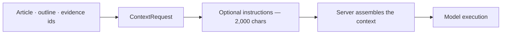
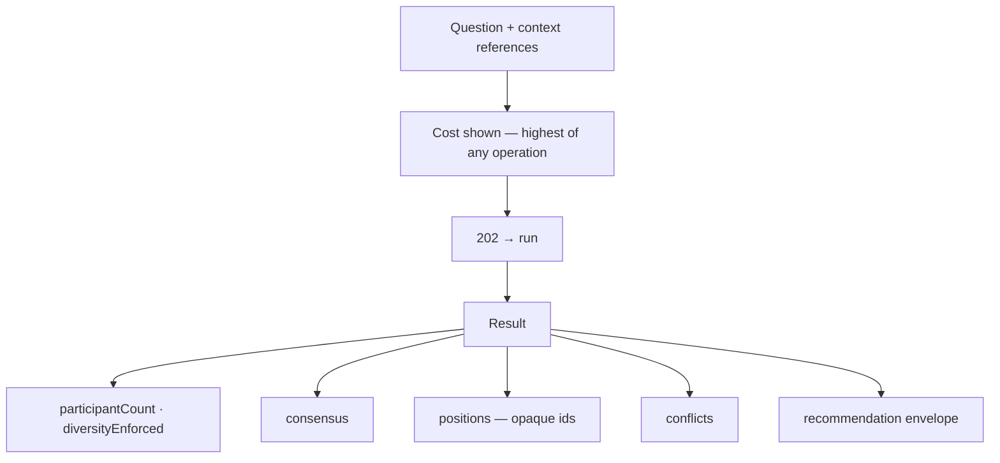

# AI

> **Status:** v1.0 — complete. Phase 15 batch 2.
> **No model name, no provider, no routing decision, no prompt.** The UI submits references and renders outcomes. Council results disclose how many independent evaluations ran and whether they agreed — never which models produced them.

## Overview

**Purpose.** Define the AI-facing screens: generation, review, Council, suggestions, context preview, credit usage and cost, run history, failures, cancellation, and re-running.

**Scope.** Screen composition and states. Model behaviour, routing, guardrails, and cost accounting are owned by `08-ai-platform/` and `06-api/ai-api.md`.

## What is never rendered

| Never shown | Why |
|---|---|
| Model name, family, or version | Substitution would become a breaking change |
| Provider identity | Same, plus it leaks commercial arrangements |
| **Routing decisions** | Which model handled what is an optimization detail |
| Fallback occurrence | Implies provider structure |
| **Raw prompts or system instructions** | Prompt engineering is not a customer contract |
| **Per-model token counts** | Tokenizers fingerprint model families |
| Provider currency cost | Reveals commercial terms |
| `algorithmVersion` on any score | Opaque; changes must not look like contract changes |

**Cost is rendered in credits and nothing else** (`06-api/ai-api.md`).

## Context submission

**The UI submits references. It never submits prompt text.**

| Field | Rendered as |
|---|---|
| `articleId`, `outlineVersionId`, `revisionNumber` | Selected from the current article |
| `evidenceIds` | Multi-select from the workspace's evidence |
| **`instructions`** | **A bounded free-text field, 2,000 characters, with a live counter** |

**`instructions` is the only free-text field and its limit is visible.** Customers legitimately need to say "keep the tone formal"; that is not the same as submitting a system prompt, and the bound is what keeps the distinction (`08-ai-platform/context-builder.md`).

**There is no raw-prompt affordance anywhere in this application**, and there will not be one. It would bypass the Context Builder and defeat the structural exclusion that keeps secrets out of prompts entirely.

**Evidence references are authorized individually.** A caller referencing evidence they cannot read receives `403` for that reference — rendered inline at the reference, not as a whole-form failure, because a silently dropped reference would produce content grounded differently than the user believes.

## Context preview

| Property | Value |
|---|---|
| **Shows** | Which **sources** will be used: article, outline version, N evidence items, instructions |
| **Never shows** | The assembled prompt, system instructions, token budget internals, segment framing |
| **Permission** | Per referenced resource |

**The preview lists inputs, not the prompt.** A user confirming "this will use your outline, 14 evidence items, and your instructions" gets what they need — confidence about grounding — without exposing prompt engineering.

**Each listed evidence item links to its detail**, so a user can verify what will ground the output before spending credits.

**Unresolvable references are shown before submission**, not after the charge.

## Generation

| Property | Value |
|---|---|
| **API** | `POST /v1/workspaces/{workspaceId}/ai/generate` |
| **Permission** | `article:execute` |
| **Idempotency** | `Idempotency-Key` required |
| **Response** | `202` with a run handle |

**Targets are `section`, `article`, `summary`, or `meta`**, selected explicitly.

**Cost is shown before starting.** Generation charges credits, and a user who did not see the cost cannot consent to it (`design-principles.md`).

**The run surface is shared** — five coarse phases, six statuses, SSE progress, `GET /v1/runs/{runId}` as source of truth (`research.md`).

**Output appears as a new revision**, not as an in-place edit. Revisions are append-only, and generation produces one (`content.md`).

## Review

| Property | Value |
|---|---|
| **API** | `POST /v1/workspaces/{workspaceId}/ai/review` |
| **Permission** | `article:execute` |
| **Result** | Scores plus a verdict |

**Scores render per ADR-021**: integer 0–100, higher always better, confidence shown separately and never blended into the value. One component renders all twelve categories (`content.md`).

**Every score carries its explanation**, which is a rendering requirement rather than an optional detail view (ADR-009).

**Three verdicts, each with icon and word** — `pass`, `soft-warn`, `block`. Colour is never the sole carrier (`design-principles.md`).

**`algorithmVersion` is never displayed; `contractVersion` may be.** The first is opaque and changes when scoring improves; the second is contract.

**Dimensions may be requested explicitly**, and unrequested categories are absent rather than shown as zero — a zero would read as "measured and bad."

## Council

| Property | Value |
|---|---|
| **API** | `POST /v1/workspaces/{workspaceId}/ai/council` |
| **Permission** | `article:execute` |
| **Cost** | **Highest per call** — shown prominently before starting |

**The disclosure is rendered in full, because it is the honesty requirement (ADR-019):**

| Field | Rendered as |
|---|---|
| `participantCount` | "3 independent evaluations" |
| `diversityEnforced` | "Model diversity enforced" |
| `consensus` | Unanimous · Majority · **Split** · **No consensus** |
| `positions[]` | Labelled **Position 1, 2, 3** — opaque, no attribution |
| `conflicts[]` | The topics they disagreed on |
| `recommendation` | The Explainability Envelope |
| `costCredits` | Shown inline |

**Position labels carry no model attribution.** `positionId` is opaque by contract, and the UI renders `position-1` as "Position 1" — numbering is stable within a result and meaningless across results.

**`no-consensus` is rendered as a legitimate outcome, not a failure.** Forcing a recommendation from genuine disagreement would misrepresent the platform's confidence, and the UI presents the positions and conflicts without a synthesized verdict (`06-api/ai-api.md`).

**An empty `conflicts` array means the participants actually agreed** and is rendered as such — not omitted, because "they agreed" is information.

**`costCredits` is shown inline on the result**, so a user deciding whether to run Council again has the number without a second lookup.

## Suggestions

| Property | Value |
|---|---|
| **Shows** | Platform recommendations with their Explainability Envelope |
| **Permission** | `article:read` |
| **Never** | A recommendation without `reason`, `evidence[]`, and `confidence` |

**Progressive disclosure applies**: recommendation → reason → evidence → detail. Level 2 is never optional, and every evidence reference resolves (`design-principles.md`).

**`expected_impact` renders as `low` / `medium` / `high`**, as the envelope defines it — never as a computed percentage.

**A suggestion is never auto-applied.** Applying one is an explicit action that creates a revision, and the user sees what changed.

## Credit usage and cost

| Property | Value |
|---|---|
| **API** | `GET /v1/workspaces/{workspaceId}/ai/usage` |
| **Permission** | `analytics:read` |
| **Shows** | Balance, credits by operation, series over the period, aggregate `tokensProcessed` |

**Credits are informational only, and the UI states the consequence.** A displayed balance is a snapshot; the server charges authoritatively and may return `402` even when the balance looked sufficient — because another run in the same workspace consumed it first. The UI surfaces `402` as a real outcome rather than treating a pre-check as a guarantee.

**Cost is never shown in provider currency**, and `tokensProcessed` appears as a single aggregate where shown at all. Per-operation token counts fingerprint model families.

**Breakdown is by operation** — generate, review, council, embed — which is the finest granularity available.

**Usage links to organization billing** rather than reimplementing balance management (`organizations.md`).

## Run history

**AI runs share the run surface** — same list, same filters, same detail, `kind: 'ai'` (`research.md`, `workspaces.md`).

**Cost per run is shown in the list**, because AI runs are the ones whose cost varies most.

## Failures

**Five failure classes render distinctly, because they demand different responses.**

| Code | Rendered | Retryable |
|---|---|---|
| **`SECURITY_GUARDRAIL_BLOCKED`** | "Blocked by content safety" with the **category**, not the content | **No — no retry affordance** |
| **`PROVIDER_SAFETY_REFUSAL`** | "The request was refused on safety grounds" | **No** |
| **`AI_GROUNDING_FAILED`** | "Not enough evidence to support this" → **Run more research** | **No** |
| `DOMAIN_QUOTA_EXCEEDED` (`402`) | Insufficient credits, or plan limit — distinguished | No — top up or upgrade |
| `PROVIDER_UNAVAILABLE` (`503`) | "Temporarily unavailable" | **Yes**, with `Retry-After` |

**Guardrail blocks show no retry affordance at all.** A guardrail decision is deterministic and the input is unchanged; offering retry would invite a user to hammer a settled refusal (`08-ai-platform/retry-strategy.md`).

**Block reasons are rendered as categories, never as model output.** A verbatim refusal message could contain injected content from a fetched page (`16-security/threat-model.md`, T-14).

**`AI_GROUNDING_FAILED` points at research, not at retry.** The claim could not be supported by available evidence, so the resolving action is more research — retrying generation would fail identically.

**Safety refusal never suggests trying a different model**, because no fallback occurs and none is offered. The concept of "a different model" does not exist in this UI.

**`AI_VALIDATION_FAILED` is never rendered.** It is retried internally and invisibly; the user sees a result or a terminal failure, never a retry they must manage.

## Cancellation and re-running

| Action | Behaviour |
|---|---|
| **Cancel** | Cooperative; `POST /v1/runs/{runId}/actions/cancel` |
| **Run again** | A **new** run, new charge, new id — never a resume |

**Cancellation states the credit outcome**: an in-flight provider call cannot be recalled, so credits for calls already issued are retained (`research.md`).

**"Run again" is labelled honestly.** There is no retry endpoint; re-running creates a new run and charges again, and the cost is shown again.

## Common UI states

| State | Rendering on these screens |
|---|---|
| **Loading** | Skeleton for usage charts; run progress for executions |
| **Empty** | No usage this period · no runs · filtered to nothing · no permission |
| **Success** | Result rendered; output linked to the revision it created |
| **Failure** | Class-specific, per the table above; `requestId` on `5xx` |
| **Retry** | Only for `503` and network — **never for guardrail, refusal, or grounding failures** |
| **Offline** | Progress freezes with a reconnecting indicator; **the run continues server-side** |
| **Conflict** | `409` — a run is already active for this article; links to it |
| **Permission denied** | `403`: names the missing permission; per-reference for evidence |
| **Not found** | `404`: "Run not found" — never a permission message |
| **Maintenance** | Usage remains readable; new executions disabled with expected return |

**Retry is offered only where retrying could plausibly succeed.** That single rule removes the retry affordance from three of five failure classes, and it is the clearest expression of the platform's retry discipline reaching the UI (`13-event-platform/retry-engine.md`).

**Offline never renders a run as failed.** A dropped SSE connection does not stop server-side work.

## API interactions

| Screen | Endpoints |
|---|---|
| Generation | `POST /v1/workspaces/{workspaceId}/ai/generate` |
| Review | `POST /v1/workspaces/{workspaceId}/ai/review` |
| Council | `POST /v1/workspaces/{workspaceId}/ai/council` |
| Usage | `GET /v1/workspaces/{workspaceId}/ai/usage` |
| Progress | `GET /v1/runs/{runId}`; `GET /v1/runs/{runId}/events` |
| Results | `GET /v1/runs/{runId}/results` |
| Cancel | `POST /v1/runs/{runId}/actions/cancel` |

**Every execution sends `Idempotency-Key`**, because a retried submission would otherwise charge twice.

## Business rules

1. **No model, provider, routing decision, or fallback is ever rendered.**
2. **No raw-prompt affordance exists.**
3. **Clients submit references**; `instructions` is bounded at 2,000 characters with a visible counter.
4. **Context preview lists sources, never the assembled prompt.**
5. **Evidence references are authorized individually**, with `403` inline at the reference.
6. **Cost is shown before every charging action** and again before running again.
7. **Council discloses participant count, diversity, and consensus** — never identity.
8. **Position labels are opaque**; `no-consensus` is a legitimate outcome.
9. **Every score carries its explanation**; `algorithmVersion` is never shown.
10. **Unrequested score categories are absent**, never zero.
11. **Credits are informational**; `402` is a real outcome despite a sufficient-looking balance.
12. **Cost is in credits only**; `tokensProcessed` is an aggregate.
13. **Guardrail blocks and safety refusals show no retry affordance.**
14. **`AI_GROUNDING_FAILED` points at research**, not retry.
15. **`AI_VALIDATION_FAILED` is never rendered** — retried internally.
16. **"Run again" creates a new run and says so.**
17. **Offline never renders a run as failed.**

## Cross references

- `06-api/ai-api.md` — **every contract, disclosure rule, and failure class these screens surface**
- `08-ai-platform/context-builder.md` — why clients submit references, not prompts
- `08-ai-platform/guardrails.md` — block semantics
- `08-ai-platform/retry-strategy.md` — guardrail and safety-refusal rules
- `01-system-architecture/13-adr-log.md` — **ADR-019 Council disclosure**, ADR-009 envelope, ADR-021 scoring
- `01-system-architecture/14-scoring-contract.md` — score rendering
- `16-security/threat-model.md` — T-14 prompt injection; why block reasons are categories
- `research.md` — the shared run surface, phases, cancellation
- `content.md` — revisions generation produces; gate verdicts review feeds
- `workspaces.md` — credits detail screen
- `organizations.md` — billing and balance
- `design-principles.md` — cost before action, progressive disclosure, offline
- `13-event-platform/retry-engine.md` — the retry discipline this UI reflects
