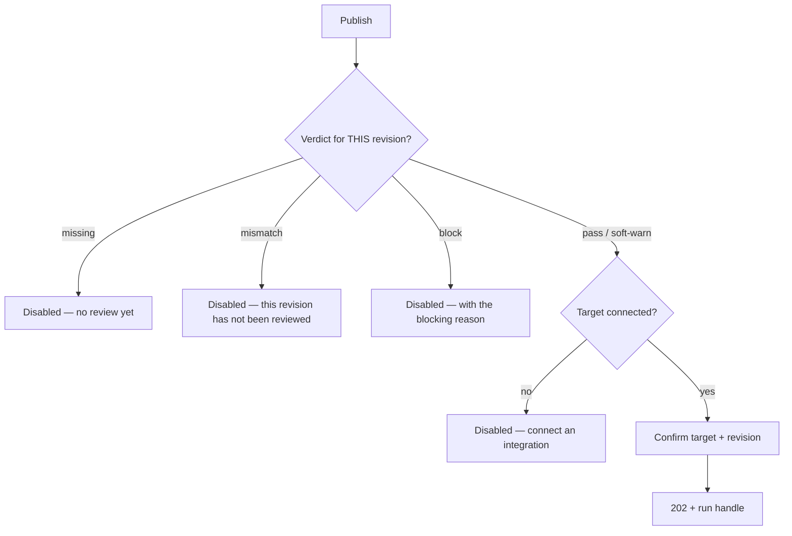

# Content

> **Status:** v1.0 — complete. Phase 15 batch 2.
> **Status is read-only and the editor does not mutate.** Fourteen statuses are rendered and none is settable; a human edit creates a new revision rather than changing an existing one. Every transition comes from an API.

## Overview

**Purpose.** Define the content screens: article list, draft editor, metadata, revision history, review status, publishing, optimization, refresh, archive, and restore.

**Scope.** Screen composition, flows, and states. The pipeline, gate rules, and approval requirements are owned by `05-content-platform/` and `06-api/content-api.md`.

## Page hierarchy

```
/w/{slug}/content                                  → Article list
/w/{slug}/content/{articleId}                      → Overview
/w/{slug}/content/{articleId}/outline              → Outline + approval
/w/{slug}/content/{articleId}/draft                → Draft editor
/w/{slug}/content/{articleId}/review               → Gate results
/w/{slug}/content/{articleId}/citations            → Grounding chain
/w/{slug}/content/{articleId}/history              → Revisions + compare
/w/{slug}/content/{articleId}/media                → Attached media
/w/{slug}/projects/{projectId}                     → Project view
```

**Each tab is a route**, deep-linkable and permission-filtered (`navigation.md`).

## Status is read-only

**Fourteen statuses are rendered; none is settable.** Sending `status` in a `PATCH` returns `400`, not a silent no-op — a UI built on the assumption that it drives transitions fails loudly rather than diverging (`06-api/content-api.md`).

**Five display buckets group the fourteen for scanning**, and every bucket links to a list filtered on the real values:

| Bucket | Statuses |
|---|---|
| Drafting | `idea` · `researching` · `planning` · `outline_ready` · `outline_approved` · `drafting` |
| In review | `in_review` · `revalidating` |
| **Blocked** | `gate_blocked` |
| Ready | `optimizing` · `ready_to_publish` |
| Published | `published` · `refreshing` |
| Archived | `archived` |

**Grouping is presentation only.** The underlying status is shown on the article itself, and filters operate on real values.

**There is no client-side workflow logic.** The UI never computes what state should come next, never enables an action based on a state machine it holds, and never predicts a transition. It renders the status it received and offers the actions the server says are available.

## Article list

| Property | Value |
|---|---|
| **API** | `GET /v1/workspaces/{workspaceId}/articles` |
| **Permission** | `article:read` |
| **Filters** | `status` · `type` · `projectId` · `createdAfter` · `createdBefore` · `q` |
| **Sort** | `updatedAt` (default, descending) · `createdAt` · `publishedAt` · `title` |
| **Pagination** | **Cursor** — no page numbers, no total |

**Filters are query parameters** and survive reload and sharing. An unknown filter value returns `400` rather than silently returning everything (`06-api/api-principles.md`).

**Each row shows status, type, project, last updated, and — where present — its gate verdict.** A blocked article is visually distinct because it is the one requiring action.

**Rows link to Overview**, not to the editor. The editor is one tab of an article, and landing directly there hides the outline, review, and citation context.

### Bulk actions

| Action | Bulk-safe | Reason |
|---|---|---|
| Archive | **Yes** | Reversible; no per-item precondition |
| Move to project | **Yes** | Metadata only |
| Delete | **Yes, with per-item results** | May be refused per item |
| **Publish** | **No** | Gate verdict is verified **per revision** |
| **Refresh / optimize** | **No** | Each charges credits and starts a run |

**Publish is never a bulk action.** Publishing verifies the gate verdict for the specific revision being published, and `CONTENT_GATE_MISMATCH` is a distinct outcome from `CONTENT_GATE_MISSING`. Presenting publish as a checkbox operation implies a uniformity that does not exist (`06-api/content-api.md`).

**Credit-charging actions are never bulk**, because cost must be shown and consented to per action (`design-principles.md`).

**Bulk delete reports per-item results**, since deletion is refused while live published content exists. A partial outcome is rendered as a list, not a single success or failure.

## Article overview

| Property | Value |
|---|---|
| **Shows** | Title, type, status, project, brief, current revision, run state |
| **API** | `GET /v1/articles/{articleId}` |
| **Concurrency** | **`If-Match` on `PATCH`** |

**`brief` is displayed as it was snapshotted at creation.** Changing a project default does not retroactively alter an in-flight article, and the UI states that the brief belongs to the article (`06-api/content-api.md`).

**Editing the brief is blocked while a run is active** — `409 DOMAIN_STATE_INVALID` — and the UI disables it with the reason rather than letting the user discover it on submit.

**The active run is surfaced here with its coarse phase and a link to the run** (`research.md`).

## Outline and approval

| Property | Value |
|---|---|
| **API** | `GET .../outlines`; `POST .../actions/approve-outline` |
| **Permission** | `article:read`; approval requires `article:update` |

**Approval is a required human decision and is rendered as an action, not as progress.** The database refuses to move an article to `drafting` without an approved outline, so a client cannot skip it by calling a later action (`03-database/tables.md`).

**Five outline statuses render distinctly:**

| Status | Rendered |
|---|---|
| `draft` | In progress |
| **`coverage_thin`** | **Warning with the coverage report — approvable with acknowledgement** |
| `awaiting_approval` | **Action required** |
| `approved` | Approved, with approver and time |
| `superseded` | Historical; read-only |

**`coverage_thin` is approvable.** The platform advises; the customer decides. The UI requires an explicit acknowledgement rather than refusing, because refusing outright would substitute the platform's judgement for the editor's (`06-api/content-api.md`).

**`rationale` renders as the Explainability Envelope** — recommendation, reason, evidence, expected impact, confidence. Every evidence reference links to the evidence item (`design-principles.md`).

## Draft editor

| Property | Value |
|---|---|
| **API** | `GET .../revisions/{revisionNumber}`; edits create a new revision |
| **Permission** | `article:update` |
| **Save strategy** | **Pessimistic** |

**The editor does not mutate a revision.** Revisions are append-only and immutable; a human edit produces a **new revision with `origin: 'human_edit'`**, which preserves the record of what the platform generated versus what a person changed (`06-api/content-api.md`).

**Five revision origins render distinctly** — `initial_draft`, `revision_requested`, `seo_optimization`, `human_edit`, `refresh` — because "who wrote this" is the question the history answers.

**Saving is pessimistic.** A save that appeared to succeed and did not would lose work, and creating a revision requires the server's id.

**Concurrent editing surfaces as a conflict, never an auto-merge.** A `412` renders as "someone else saved a revision," offering reload — silently overwriting is the lost-update bug `If-Match` exists to prevent (`design-principles.md`).

**Citations are visible inline while editing.** A claim with `supported: false` is marked in place, because an unsupported claim is the thing an editor most needs to see before publishing.

**Preview renders the current revision as it would publish**, without publishing. It is read-only and does not create a revision.

## Revision history and compare

| Property | Value |
|---|---|
| **API** | `GET .../revisions` |
| **Permission** | `article:read` |
| **Shows** | Revision number, origin, created, content hash |

**Compare is section-level and origin-aware.** Selecting two revisions shows added, removed, and changed sections, with each revision's origin labelled — so a reviewer sees that an SEO optimization changed three sections and a human edit changed one.

**`contentHash` lets the UI detect whether content actually changed** without diffing full section bodies (`06-api/content-api.md`).

**Revisions are never editable or deletable from this screen.** They are an append-only record.

## Review status

| Property | Value |
|---|---|
| **API** | `GET .../revisions/{revisionNumber}/gates` |
| **Permission** | `article:read` |

**Exactly three verdicts render, each with an icon and a word** — colour is never the sole carrier (`design-principles.md`):

| Verdict | Rendering | Publish |
|---|---|---|
| `pass` | Passed | Enabled |
| `soft-warn` | Passed with warnings | **Enabled** |
| **`block`** | **Blocked** | **Disabled with the reason** |

**`soft-warn` does not prevent publication**, and the UI must not imply it does — a warning that behaves like a block trains users to ignore both.

**Scores render per ADR-021**: integer 0–100, higher always better, with confidence shown separately. One component renders all twelve categories.

**`algorithmVersion` is never displayed.** It is opaque and changes when scoring improves, which must not look like a contract change (`01-system-architecture/14-scoring-contract.md`).

**Every score carries its explanation.** A score without one would be an incomplete object (ADR-009).

**A `block` cannot be overridden from the UI.** There is no force affordance, because there is no force parameter — the path forward is revision or a human review decision recorded in the pipeline (`06-api/content-api.md`).

## Publishing



| Property | Value |
|---|---|
| **API** | `POST .../actions/publish` |
| **Permission** | **`publish:execute`** |
| **Idempotency** | `Idempotency-Key` required |
| **Response** | `202` with a run handle |

**Three distinct blocked reasons are rendered distinctly**, because they are three different mistakes: no verdict exists, the verdict belongs to a **different revision**, or the verdict is `block`. `CONTENT_GATE_MISMATCH` deserves its own message — a revision that passed, then was edited, does not inherit its verdict.

**Contributors see no publish affordance.** `publish:execute` is held by Editor and Workspace Admin only, and the action is absent rather than disabled (`16-security/rbac.md`).

**Publishing is not undoable and the confirmation says so.** Content leaves for an external CMS; unpublishing is a separate operation against the target (`design-principles.md`).

**The revision being published is named in the confirmation**, not implied.

## Optimization, refresh, archive, restore

| Action | Applies to | Charges | Permission |
|---|---|---|---|
| **Optimize** | Drafts | **Yes** | `article:execute` |
| **Refresh** | **Published only** | **Yes** | `article:execute` |
| Archive | Any | No | `article:update` |
| Restore | Archived | No | `article:update` |

**Refresh applies to published articles; optimize applies to drafts.** Refreshing an unpublished article is just writing it; optimizing a published one would change live content without a publish step (`06-api/content-api.md`).

**Both show cost before starting** and both return `202` with a run handle.

**One active run per article.** A second attempt returns `409 CONTENT_RUN_IN_PROGRESS`, and the UI disables the action with a link to the running run rather than letting the user discover the conflict.

**Deletion is refused while live published content exists** — `409 CONTENT_PUBLISHED_EXISTS` — rendered as "unpublish first," naming the targets.

**Soft delete has a 30-day grace period**, so a deleted article shows as deleted with a restore action rather than vanishing (`12-storage-platform/retention.md`).

## Search and filtering

**Workspace-scoped, filtered server-side, never cross-tenant** (`navigation.md`).

**Content search covers titles and article text**; evidence search is a separate mode on the knowledge screens.

**Filter combinations produce a shareable URL**, and an empty result set renders "filtered to nothing" with a clear-filters action — never the create-first-article state (`design-principles.md`).

## Common UI states

| State | Rendering on these screens |
|---|---|
| **Loading** | Skeleton matching the list or editor layout; nothing under 300 ms |
| **Empty** | Four distinct: no articles · filtered to nothing · no permission · load failed |
| **Success** | Inline; the list or editor updates in place |
| **Failure** | Field-level for `400`; banner with `requestId` for `5xx` |
| **Retry** | `5xx`, `503`, network only — **never `4xx`** |
| **Offline** | **Editor becomes read-only; unsaved content is preserved locally and never auto-submitted on reconnect** |
| **Conflict** | `412` — "someone else saved a revision"; reload, never auto-merge |
| **Permission denied** | `403`: names the missing permission and who can grant it |
| **Not found** | `404`: "Article not found" — **never a permission message** |
| **Maintenance** | Read paths remain; editing disabled with expected return |

**Offline preserves but never auto-submits.** Reconnecting and silently saving a revision written against stale content is worse than requiring the user to review and save deliberately.

**`409` states are actionable, not errors.** Run in progress, published content exists, gate blocked — each names the resolving action.

## API interactions

| Screen | Endpoints |
|---|---|
| List | `GET /v1/workspaces/{workspaceId}/articles` |
| Overview | `GET`/`PATCH`/`DELETE /v1/articles/{articleId}` |
| Outline | `GET .../outlines[/{versionNumber}]`; `POST .../actions/approve-outline` |
| Draft | `GET .../revisions[/{revisionNumber}]` |
| Review | `GET .../revisions/{revisionNumber}/gates` |
| Citations | `GET .../revisions/{revisionNumber}/citations` |
| Publish | `POST .../actions/publish` |
| Refresh / optimize | `POST .../actions/refresh` · `.../actions/optimize` |
| Archive | `POST .../actions/archive` |

**Every action endpoint returning `202` hands off to the run surface** (`research.md`).

**`Idempotency-Key` accompanies create, publish, refresh, and optimize.** `If-Match` accompanies `PATCH`.

## Business rules

1. **Status is read-only**; sending it is `400`.
2. **No client-side workflow logic** — no predicted transitions, no held state machine.
3. **Five display buckets are presentation**; filters use real values.
4. **The editor creates revisions; it never mutates one.**
5. **Five revision origins render distinctly.**
6. **Saving is pessimistic**; `412` surfaces as a conflict, never an auto-merge.
7. **Outline approval is a required action**, and `coverage_thin` is approvable with acknowledgement.
8. **Three gate verdicts, each with icon and word**; `soft-warn` does not block publishing.
9. **`algorithmVersion` is never displayed; every score carries its explanation.**
10. **A `block` has no override affordance.**
11. **Three publish-blocked reasons render distinctly**, including gate mismatch.
12. **Publish is never a bulk action**; credit-charging actions never are.
13. **Publishing is not undoable and says so.**
14. **Refresh is published-only; optimize is draft-only.**
15. **One active run per article**, surfaced before the attempt.
16. **Deletion is refused while live published content exists**, naming the targets.
17. **Unsupported citations are visible inline**, never hidden.
18. **Offline preserves but never auto-submits.**

## Cross references

- `06-api/content-api.md` — **every endpoint, status, verdict, and error these screens surface**
- `05-content-platform/orchestration.md` — the pipeline these actions trigger
- `05-content-platform/publishing-engine.md` — gate verdict verification per revision
- `05-content-platform/review-engine.md` — gate evaluation
- `01-system-architecture/14-scoring-contract.md` — **ADR-021 score rendering**
- `01-system-architecture/13-adr-log.md` — ADR-009 Explainability Envelope
- `03-database/tables.md` — the constraint enforcing outline approval
- `16-security/rbac.md` — `publish:execute`, `article:export`, Contributor limits
- `research.md` — the run surface every `202` hands off to
- `ai.md` — generation, review, and Council behind these actions
- `navigation.md` · `design-principles.md` · `information-architecture.md`
- `12-storage-platform/retention.md` — the grace period behind restore
- `04-platform/credits.md` — cost shown before charging actions
