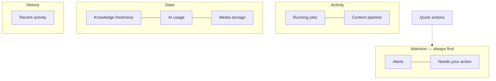

# Dashboard

> **Status:** v1.0 — complete. New in Phase 15.
> **The dashboard aggregates and links. It computes nothing.** Every number it shows is returned by an API that owns it, and every widget links to the screen that owns the detail.

## Overview

**Purpose.** Define the workspace root screen: its widgets, what each shows, where each links, and the rules that keep it an aggregation surface rather than a second implementation.

**Scope.** Widget composition and behaviour. Every underlying value is owned by an API document and is not recomputed here.

**The dashboard is the only screen with no resource of its own.** Everything on it belongs to another screen, which is why the linking rule is absolute.

## The three rules

**1 · The dashboard aggregates.** It fetches summaries from resources that already produce them. Where a summary endpoint exists — knowledge freshness, AI usage — it is used. Where one does not, the widget shows a bounded list, never a derived statistic.

**2 · The dashboard owns no business logic.** No score is computed, no verdict derived, no freshness assessed, no cost calculated. If a number is not returned by an API, it is not shown.

**3 · Every widget links to its authoritative screen.** A widget is an entry point. A number with no destination is a dead end that invites the user to look for detail that is elsewhere.

## Layout



**Attention comes first because the pipeline has human gates.** Outline approval and gate review block progress until a person acts, and a dashboard that buried them below activity charts would let work stall silently.

**Widget order is fixed, not personalized.** Predictability outranks customization on a screen people scan many times a day (`design-principles.md`).

**Widgets load independently.** One slow or failed widget does not blank the page; each renders its own loading, empty, or error state.

## Widgets

### Needs your action

| Property | Value |
|---|---|
| **Shows** | Runs in `awaiting_input`, gate-blocked articles, expiring role bindings |
| **Source** | `GET /v1/workspaces/{id}/runs?status=awaiting_input`, `GET .../articles?status=gate_blocked` |
| **Links to** | The article's outline, review, or the run |
| **Permission** | `run:read`, `article:read` |
| **Empty** | "Nothing needs your attention" |

**`awaiting_input` is rendered distinctly from `running`.** A pipeline waiting on approval is not progressing, and showing it as busy leaves a user waiting for something that requires them (`06-api/research-api.md`).

**Gate-blocked articles are actionable, not failures.** A `block` verdict is the quality system working; the widget links to the review screen where the reason and evidence are shown.

### Alerts

| Property | Value |
|---|---|
| **Shows** | Credits low, run failures, webhook endpoint disabled, integration disconnected, stale evidence on published content |
| **Source** | Billing, runs, `GET .../webhooks`, integrations, knowledge freshness |
| **Links to** | The screen that resolves each |
| **Empty** | Not rendered |

**These are customer alerts, not platform alerts.** Invariant breaches, DLQ depth, and consumer lag are operator concerns on a surface this application does not render (`06-api/admin-api.md`).

**A disabled webhook endpoint is the alert most likely to be missed otherwise.** After 100 consecutive delivery failures the platform disables an endpoint, and the customer's integration stops silently unless they are told (`06-api/webhooks.md`).

**Stale evidence supporting published content is an alert; stale evidence generally is not.** The freshness widget shows the general picture; the alert fires when something published depends on it.

### Running jobs

| Property | Value |
|---|---|
| **Shows** | Active runs with kind, coarse phase, and progress |
| **Source** | `GET /v1/workspaces/{id}/runs?status=running` + SSE per visible run |
| **Links to** | `/w/{slug}/runs/{runId}` |
| **Permission** | `run:read` |
| **Empty** | "No jobs running" |

**Five coarse phases are rendered** — `preparing`, `gathering`, `analyzing`, `synthesizing`, `finalizing`. The orchestrator's internal stages are deliberately not exposed and would break this widget on every pipeline improvement (`06-api/research-api.md`).

**The list is capped and links to the full runs screen** rather than growing unbounded.

**Progress streams over SSE while visible and stops when the widget is not.** A dashboard holding a stream per run indefinitely is a connection leak.

### Content pipeline

| Property | Value |
|---|---|
| **Shows** | Article counts by status |
| **Source** | `GET .../articles?status=…` per bucket |
| **Links to** | The content list, pre-filtered to that status |
| **Permission** | `article:read` |
| **Empty** | Create-first-article state |

**Fourteen statuses are grouped into five buckets for display** — Drafting, In review, Blocked, Ready, Published. The grouping is presentation; the underlying statuses are unchanged and the link filters on the real values (`06-api/content-api.md`).

**Every bucket links to a pre-filtered list.** A count with no destination forces the user to reconstruct the filter.

**Blocked is visually distinct** because it is the bucket requiring action.

### Research status

| Property | Value |
|---|---|
| **Shows** | Recent research runs, outcome, evidence produced |
| **Source** | `GET .../runs?kind=research` |
| **Links to** | The run and its results |
| **Permission** | `research:read` |
| **Empty** | Start-first-research state |

**Evidence counts link to evidence, not to a number.** Research results return evidence identifiers, and the value is in opening them (`06-api/research-api.md`).

### Knowledge freshness

| Property | Value |
|---|---|
| **Shows** | Counts by freshness — current, aging, stale, unknown |
| **Source** | **`GET .../knowledge/freshness`** — the summary is returned, not computed |
| **Links to** | Knowledge, filtered by freshness |
| **Permission** | `knowledge:read` |
| **Empty** | No evidence yet |

**`unknown` is displayed as its own category.** A source with no discoverable publication date is not stale, and collapsing the two would misrepresent an absence of information as a finding (`06-api/knowledge-api.md`).

**Stale evidence is ordered by citing-revision count** where the API provides it, because stale evidence cited by forty published articles matters more than stale evidence cited by none.

### AI usage

| Property | Value |
|---|---|
| **Shows** | Credits consumed this period, by operation; remaining balance |
| **Source** | **`GET .../ai/usage`** — returned, not computed |
| **Links to** | The usage screen and billing |
| **Permission** | `analytics:read` |
| **Empty** | No usage this period |

**Cost is shown in credits, never in provider currency.** Provider cost reveals commercial terms and changes independently of what the customer pays (`06-api/ai-api.md`).

**No model or provider appears anywhere in this widget.** Operation type — generate, review, council, embed — is the finest breakdown available.

**Remaining balance is shown alongside consumption**, because consumption without balance cannot be acted on.

### Media storage

| Property | Value |
|---|---|
| **Shows** | Bytes used, object count, quota where a plan sets one |
| **Source** | `GET .../media` aggregates |
| **Links to** | Media |
| **Permission** | `article:read` |
| **Empty** | No media yet |

**Objects in non-readable states are counted but distinguished.** Media in `scanning` or `processing` is stored and not yet usable; showing only `available` would understate storage and confuse a user who just uploaded (`12-storage-platform/blob-lifecycle.md`).

**Quarantined objects are shown to their owner with their status**, never hidden — but the threat signature is never disclosed.

### Recent activity

| Property | Value |
|---|---|
| **Shows** | Recent changes across content, research, knowledge, media |
| **Source** | Workspace activity feed |
| **Links to** | Each item's authoritative screen |
| **Permission** | Per item, revalidated on render |
| **Empty** | No recent activity |

**Every entry is permission-revalidated on render**, exactly as recents and favourites are. An entry the user can no longer access is removed silently, never rendered as inaccessible (`navigation.md`).

**Entries sort by occurrence, not arrival.** Event delivery is at-least-once with no ordering guarantee, so arrival order can invert (`06-api/webhooks.md`).

**Actor names appear only where the viewer may see membership.** A user without `member:read` sees the action without the actor.

## Quick actions

| Action | Permission | Destination |
|---|---|---|
| New article | `article:create` | Article creation |
| Start research | `research:execute` | Research start |
| Upload media | `article:create` | Upload |
| Invite member | `member:manage` | Members |

**Permission-gated actions are absent, not disabled** (`navigation.md`).

**Credit-charging actions show their cost before starting**, so a user consents to the spend (`design-principles.md`).

**Quick actions never bypass a required step.** "Start research" opens the same form as the research screen, including SSRF-validated competitor URLs — it is a shortcut to a screen, not a shortcut through validation.

## Widget contract

Every widget conforms to the same shape:

```ts
interface DashboardWidget {
  readonly id: string;
  readonly requiredPermissions: readonly string[];   // absent if unmet
  readonly source: string;                            // the owning API resource
  readonly destination: string;                       // REQUIRED — no dead ends
  readonly refreshStrategy: 'on-mount' | 'polled' | 'streamed';
}
```

**`destination` is non-optional.** A widget with no authoritative screen would be a number the user cannot investigate, and the type makes that unbuildable.

**`requiredPermissions` drives absence, not disabling.** A widget whose permissions are unmet does not render, and the layout closes around it.

**`refreshStrategy` is explicit per widget.** Running jobs stream; usage and freshness refresh on mount; nothing polls on a short interval, because a dashboard left open would generate continuous load for data that changes slowly.

## Business rules

1. **The dashboard aggregates; it computes nothing.**
2. **Every widget links to an authoritative screen** — `destination` is required.
3. **Summary endpoints are used where they exist**, never reimplemented client-side.
4. **Widgets load, fail, and empty independently.**
5. **Widget order is fixed; attention items come first.**
6. **Permission-gated widgets and actions are absent, not disabled.**
7. **`awaiting_input` renders distinctly from `running`.**
8. **Five coarse run phases only**; internal stages are never shown.
9. **Fourteen article statuses group into five display buckets**; links filter on real values.
10. **Alerts are customer-facing**; operator signals are not rendered here.
11. **Freshness `unknown` is its own category.**
12. **Cost is shown in credits**; no model or provider is named.
13. **Media in non-readable states is counted and distinguished.**
14. **Recent activity is permission-revalidated on render** and sorted by occurrence.
15. **Credit-charging quick actions show cost first.**
16. **Streams stop when a widget is not visible.**

## Cross references

- `information-architecture.md` — the workspace root and screen ownership
- `navigation.md` — permission-driven visibility, revalidation, quick-action placement
- `design-principles.md` — loading, empty, error states; cost before action
- `06-api/research-api.md` — the `Run` resource, coarse phases, `awaiting_input`
- `06-api/content-api.md` — article statuses and gate verdicts
- `06-api/knowledge-api.md` — the freshness summary endpoint
- `06-api/ai-api.md` — usage in credits; no provider exposure
- `06-api/media-api.md` — media states and storage
- `06-api/webhooks.md` — endpoint auto-disable; ordering by occurrence
- `06-api/admin-api.md` — the operator surface, deliberately unrendered
- `16-security/rbac.md` — the permissions gating every widget
- `04-platform/credits.md` — balance and cost
- `12-storage-platform/blob-lifecycle.md` — media states shown in storage
