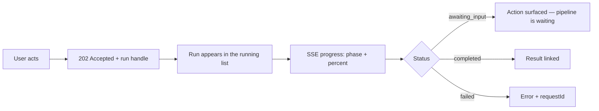

# Design Principles

> **Status:** v1.0 — complete. New in Phase 15.
> **The UI never bypasses server validation.** Client-side checks exist to save a round trip and improve a message. Every one of them is duplicated on the server, and where the two disagree the server wins.

## Overview

**Purpose.** Define the interaction principles every screen follows: consistency, disclosure, accessibility, loading, errors, empty states, confirmation, undo, long-running operations, and update strategy.

**Scope.** Presentation and interaction only. No business rule, no validation that is not also server-side, no permission decision.

## The three governing rules

**1 · The server owns truth.** A disabled button prevents a mistake, not an attack. Every action the UI offers is authorized again on arrival, and every action it hides is refused if called directly (`16-security/authorization.md`).

**2 · The UI is informative, not authoritative.** It renders state; it does not compute it. Scores, verdicts, costs, and permissions arrive from the server and are displayed as received.

**3 · Client validation is a courtesy.** Required fields, length limits, and format checks give immediate feedback. They mirror the server's schema and are never the only place a rule exists (`16-security/api-security.md`).

## Consistency

**One pattern per concept, everywhere.**

| Concept | Single pattern |
|---|---|
| Destructive action | Confirmation with typed match; never a bare dialog |
| Long-running operation | Accepted → progress → result; never a blocking spinner |
| Recommendation | Always with its Explainability Envelope |
| Score | Integer 0–100 with confidence; higher always better |
| Permission-gated affordance | Hidden, not disabled — with one exception, below |
| List | Cursor pagination; no page numbers |
| Timestamp | Absolute on hover, relative in place |

**Scores render identically everywhere because they are identical everywhere.** ADR-021 makes every score an integer 0–100 where higher is always better, with orthogonal confidence — so one component renders all twelve categories, and a reader never has to ask which direction is good.

**Hidden versus disabled has one rule and one exception.** An affordance the user can never have is **hidden**; showing it teaches them the product has a feature they cannot reach. An affordance blocked by *state* rather than permission is **disabled with a reason** — "Publish" on a `block` verdict is disabled and explains why, because the user can act to change it.

## Predictability

**The same action produces the same result in the same place.** Primary actions sit in the same position on every screen of a kind. Navigation does not reorder based on recency. Nothing moves under a cursor.

**Destructive and constructive actions are visually and spatially separated**, never adjacent.

**No action is hidden behind a hover-only affordance** without a keyboard-reachable equivalent.

## Progressive disclosure

**Show the decision, then the reasoning, then the data.**

| Level | Contains |
|---|---|
| 1 · Summary | The score, the verdict, the count |
| 2 · Reasoning | The Explainability Envelope's `recommendation` and `reason` |
| 3 · Evidence | The `evidence[]` array with links to sources |
| 4 · Detail | Raw records — revisions, provenance chains, attempt history |

**Level 2 is never optional.** ADR-009 makes an explanation mandatory on every recommendation, so a summary that could not be expanded to its reasoning would be rendering an incomplete object.

**Level 3 always resolves.** An evidence reference links to the evidence item; a citation resolves to its source. A recommendation whose evidence cannot be opened is indistinguishable from an unsupported claim.

**Depth is opt-in, but the indicator that depth exists is always visible.** A collapsed section shows its item count.

## Accessibility

**Target: WCAG 2.2 Level AA.** Asserted by automated checks in CI, not by review alone (`07-development-guide/ci-cd.md`).

| Requirement | Rule |
|---|---|
| Contrast | 4.5:1 body text, 3:1 large text and UI components |
| **Colour** | **Never the sole carrier of meaning** — verdicts, statuses, and scores carry text or shape too |
| Focus | Always visible; never removed |
| Targets | 24×24 CSS px minimum |
| Motion | Respects `prefers-reduced-motion` |
| Labels | Every control has an accessible name |
| Landmarks | One `main`; navigation, complementary, contentinfo present |
| Headings | One `h1` per page; no level skipped |

**The colour rule matters most for gate verdicts.** `pass`, `soft-warn`, and `block` are three states a colour-blind user must distinguish reliably, so each carries an icon and a word — never a coloured dot alone.

**Live regions announce asynchronous change.** Progress updates, run completion, and errors are announced politely; nothing steals focus mid-task.

**Dynamic content does not move focus.** A pipeline advancing while a user reads must not relocate their cursor.

## Responsive layout

| Breakpoint | Behaviour |
|---|---|
| Mobile | Single column; navigation collapses; primary actions reachable one-handed |
| Tablet | Two column; sidebar collapsible |
| Desktop | Full layout; persistent navigation |
| Wide | Content max-width capped — line length, not screen width, sets the measure |

**Nothing is desktop-only.** A user approving an outline from a phone is a real journey, and approval gates the entire pipeline (`06-api/content-api.md`).

**Tables become cards below the tablet breakpoint.** A horizontally-scrolling table on a phone is a table nobody reads.

**Wide content — diagrams, code, long tables — scrolls inside its own container.** The page body never scrolls horizontally.

## Keyboard navigation

| Requirement | Rule |
|---|---|
| Every interactive element is reachable by `Tab` | No keyboard traps |
| Focus order follows visual order | DOM order matches layout |
| `Escape` closes the topmost layer | Dialogs, menus, popovers |
| `Enter` activates; `Space` toggles | Standard semantics |
| Modals trap focus and restore it on close | Returns to the trigger |
| Shortcuts never override browser or assistive-technology bindings | — |

**Skip-to-content is the first focusable element on every page.**

**Shortcut specifics are owned by `navigation.md`.** This document establishes that they exist, are discoverable, and are overridable.

## Loading behaviour

**Four states, chosen by expected duration.**

| Duration | Pattern |
|---|---|
| < 300 ms | **Nothing** — a flash of loading is worse than a brief wait |
| 300 ms – 2 s | Inline spinner on the affected element only |
| 2 s – 10 s | Skeleton matching the eventual layout |
| **> 10 s** | **Not a loading state** — an accepted operation with progress |

**Skeletons match the real layout.** A skeleton whose shape differs from the loaded content causes a visible reflow, which reads as instability.

**Loading is scoped to what is loading.** A page does not blank because one widget is refetching. The dashboard renders each widget's state independently (`dashboard.md`).

**Cached data renders immediately and refreshes underneath**, with a subtle indicator. Blanking known-good content to show a spinner trades certainty for uncertainty.

## Error presentation

**The UI maps a stable code to a message. It never parses message text.**

```ts
// Codes are contract; messages are not (07-development-guide/error-handling.md)
const message = ERROR_MESSAGES[error.code] ?? GENERIC_MESSAGE;
```

| Error class | Presentation |
|---|---|
| Field validation (`400` with `details`) | Inline, at the field, using the returned path |
| Permission (`403`) | Explain what is missing and who can grant it |
| **Not found (`404`)** | **"Not found" — never "no permission"** |
| Conflict (`409`) | Explain the state and the action that resolves it |
| Rate limited (`429`) | Show when to retry, from `Retry-After` |
| Payment required (`402`) | Distinguish credits from plan entitlement |
| Server (`5xx`) | Generic message plus **`requestId`**, copyable |

**The `404` rule is a security requirement, not a UX preference.** A cross-tenant resource returns `404`, and rendering "you don't have permission" would confirm it exists in another tenant — undoing the control (`16-security/authorization.md`).

**`requestId` is always surfaced on a `5xx` and is copyable in one action.** It is how support recovers full detail without the platform disclosing any (`06-api/api-principles.md`).

**Errors appear where the action was taken.** A form error belongs at the field; a global toast for a field error makes the user hunt.

**`402` distinguishes two causes.** Insufficient credits and a plan that does not include the capability are different problems with different resolutions — top up, or upgrade.

## Empty states

**Four distinct empties, never conflated.**

| State | Message | Action |
|---|---|---|
| **Nothing created yet** | Explains the feature | Primary create action |
| **Filtered to nothing** | Names the active filters | Clear filters |
| **No permission to see** | Neutral; no count | Request access, where applicable |
| **Failed to load** | Error with `requestId` | Retry |

**Conflating "no results" with "no data" is the most common empty-state defect.** A user who filtered to nothing and sees "Create your first article" concludes their work is gone.

**"No permission" empties never leak a count.** "12 items hidden" tells the user something exists that they cannot see.

## Confirmation patterns

| Risk | Pattern |
|---|---|
| Reversible, low stakes | **No confirmation** — rely on undo |
| Irreversible, scoped | Dialog naming the specific object |
| **Irreversible, cascading** | **Typed confirmation** — the user types the slug |
| **Charges credits** | Cost shown before the action |
| Requires fresh identity | Step-up MFA challenge |

**Typed confirmation is required where the API requires it**, and for the same reason: deleting an organization or a workspace cascades to everything inside, and the API demands `confirmSlug` in the body (`06-api/organization-api.md`, `workspace-api.md`). The UI surfaces that requirement rather than inventing it.

**Cost is shown before any credit-charging action.** Pipeline runs, refreshes, optimizations, and Council calls all charge, and a user who did not see the cost cannot consent to it (`04-platform/credits.md`).

**Step-up is presented as a challenge, not an error.** A `401` with `SECURITY_STEP_UP_REQUIRED` means "prove it's you," not "you can't do this" (`16-security/authentication.md`).

## Undo philosophy

**Undo where the platform supports it. Confirmation where it does not. Never a fake undo.**

| Operation | Reversal |
|---|---|
| Delete article, media, workspace | **Real undo** — soft delete with a 30-day grace |
| Metadata edit | Real undo — a new revision or a `PATCH` back |
| Archive | Real undo — restore action exists |
| **Publish** | **No undo** — content left for an external CMS |
| **Credit-charging run** | **No undo** — provider capacity consumed |
| **Cryptographic erasure** | **No undo** — the key is destroyed |

**A toast offering "Undo" must map to a real restore endpoint.** Deferring the delete client-side and calling it undo means a user who closes the tab loses the guarantee they were shown.

**Where undo is impossible, confirmation carries the weight.** Publish and paid runs are confirmed with their consequence stated; they are not softened with a countdown that implies reversibility.

## Long-running operations



**The run is the source of truth; the stream is a convenience.** A client that loses its connection refetches `GET /v1/runs/{runId}` rather than assuming the last event it saw (`06-api/research-api.md`).

**Five coarse phases are rendered — `preparing`, `gathering`, `analyzing`, `synthesizing`, `finalizing`.** The orchestrator's internal stages are deliberately not exposed, and a UI that displayed them would break whenever the pipeline improved.

**`awaiting_input` is rendered differently from `running`.** A pipeline waiting on outline approval is not making progress, and showing it as busy leaves the user waiting for something that will never arrive without them.

**Leaving the page never cancels a run.** Work is durable and detached; the run continues and is picked up from the running list (ADR-004).

**Cancellation is cooperative and says so.** "Cancelling…" is an honest state; work already committed is not rolled back, and credits for work performed are retained.

## Optimistic versus pessimistic updates

**Optimistic only where reversal is free and the server cannot legitimately refuse.**

| Operation | Strategy | Reason |
|---|---|---|
| Toggle a filter, sort, expand | **Optimistic** | Pure client state |
| Rename, edit metadata | **Optimistic with rollback** | Reversible; `If-Match` may still conflict |
| Mark notification read | **Optimistic** | Trivial to reconcile |
| **Create anything** | **Pessimistic** | Needs the server's id |
| **Any credit-charging action** | **Pessimistic** | Optimistic success on a `402` is a lie about money |
| **Publish** | **Pessimistic** | Gate verdict is verified server-side |
| **Delete** | **Pessimistic** | May be refused — references, legal hold |
| **Anything with `If-Match`** | **Pessimistic** | `412` is a real outcome |

**Optimistic updates roll back visibly, never silently.** A rename that failed must show the old value and the reason, or the user believes a change persisted that did not.

**Anything requiring `Idempotency-Key` is pessimistic**, because the endpoints requiring one are exactly those that create, charge, or trigger irreversible work (`06-api/api-principles.md`).

**Concurrent-edit conflicts (`412`) are surfaced, never auto-merged.** The UI shows that someone else changed the resource and offers reload — silently overwriting is the lost-update bug `If-Match` exists to prevent.

## Business rules

1. **Client validation never replaces server validation.**
2. **The server's answer wins** where the two disagree.
3. **Hidden for permission; disabled with a reason for state.**
4. **Every recommendation renders its Explainability Envelope.**
5. **Colour is never the sole carrier of meaning.**
6. **WCAG 2.2 AA, asserted in CI.**
7. **Errors map from stable codes**, never parsed messages.
8. **`404` renders as "not found"**, never as a permission message.
9. **`requestId` is surfaced and copyable on every `5xx`.**
10. **Four empty states, never conflated**; no-permission empties leak no count.
11. **Typed confirmation where the API requires it.**
12. **Cost is shown before any credit-charging action.**
13. **Undo maps to a real restore endpoint, or is not offered.**
14. **Operations over 10 seconds are runs, not loading states.**
15. **Five coarse phases are rendered; internal stages are not.**
16. **Leaving the page never cancels a run.**
17. **Optimistic only where reversal is free**; anything charging, creating, publishing, deleting, or carrying `If-Match` is pessimistic.
18. **Rollbacks and `412` conflicts are visible, never silent.**

## Cross references

- `README.md` — philosophy and phase relationships
- `information-architecture.md` · `navigation.md` · `dashboard.md`
- `07-development-guide/error-handling.md` — stable codes; codes are contract, messages are not
- `06-api/api-principles.md` — status codes, `requestId`, rate-limit headers, idempotency
- `06-api/research-api.md` — the `Run` resource, phases, SSE
- `16-security/authorization.md` — 404-versus-403; permissions are not enforcement
- `16-security/authentication.md` — step-up as a challenge
- `01-system-architecture/13-adr-log.md` — ADR-009 Explainability Envelope, ADR-021 scoring
- `04-platform/credits.md` — cost before action
- `12-storage-platform/retention.md` — the grace period that makes undo real
- `07-development-guide/ci-cd.md` — accessibility assertions in the pipeline
