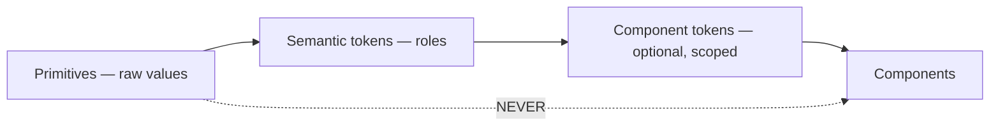

# Design System

> **Status:** v1.0 — complete. Phase 15 batch 3.
> **Tokens are authoritative. No screen defines its own styling.** A value that appears in a component and not in a token is a defect, because it cannot be changed centrally and will drift.

## Overview

**Purpose.** Define the token system, the component inventory, and the mapping from platform states to visual treatments.

**Scope.** Structure and semantics. This document defines token *names, roles, and scales*; the brand's primitive values — specific hues, the typeface — are a product decision, and the token layer is designed so they can be set without changing a component.

**The governing rule.** Components consume **semantic** tokens, never primitives. A button references `--color-action-primary`, never a hue value. That indirection is what makes a rebrand or a theme a token change rather than a codebase change.

## Token architecture

| Layer | Contains | Consumed by |
|---|---|---|
| **Primitive** | Raw scales: colour ramps, sizes, weights | **Semantic layer only** |
| **Semantic** | Roles: surface, content, border, action, status | Components |
| **Component** | Scoped overrides where a component genuinely differs | That component only |

**A component referencing a primitive fails review.** It is the single rule that keeps theming possible (`07-development-guide/code-review.md`).

**Semantic tokens resolve per theme.** The layer is theme-agnostic by construction, so adding a dark theme sets primitive values without touching a component. Whether a second theme ships in v1 is a product decision the token system does not constrain.

## Typography

| Token | Role |
|---|---|
| `--font-sans` | Interface and body |
| `--font-mono` | Identifiers, hashes, code, `requestId` |

**A monospace face is required, not optional.** The product surfaces UUIDs, content hashes, `requestId`, API key prefixes, and object ids constantly — proportional rendering of those is harder to read, harder to compare, and harder to transcribe into a support ticket.

### Scale

| Token | Use |
|---|---|
| `--text-xs` | Metadata, timestamps, captions |
| `--text-sm` | Secondary content, table cells |
| `--text-base` | Body — the default |
| `--text-lg` | Section headings |
| `--text-xl` · `--text-2xl` | Page and screen titles |

**One `h1` per page; no level skipped** (`accessibility.md`). Visual size is a token; heading level is semantics, and the two are set independently.

**Line length is capped for long-form content** — the draft editor and evidence excerpts — because a measure that spans a wide monitor is unreadable regardless of font size (`design-principles.md`).

**Numeric columns use tabular figures**, so scores, byte counts, and credit balances align.

## Colour

**Semantic roles, not names.**

| Token group | Roles |
|---|---|
| Surface | `--surface-base` · `--surface-raised` · `--surface-sunken` · `--surface-overlay` |
| Content | `--content-primary` · `--content-secondary` · `--content-tertiary` · `--content-inverse` |
| Border | `--border-subtle` · `--border-default` · `--border-strong` · `--border-focus` |
| Action | `--action-primary` · `--action-secondary` · `--action-destructive` |
| Status | `--status-success` · `--status-warning` · `--status-danger` · `--status-info` · `--status-neutral` |

**Every foreground/background pairing meets the contrast targets in `accessibility.md`** — 4.5:1 body, 3:1 large text and UI components — and pairings are validated in CI, not by eye.

**Colour is never the sole carrier of meaning.** Every status token has a paired icon token and a text label, because gate verdicts and run statuses must be distinguishable without colour perception (`design-principles.md`).

**`--border-focus` is a distinct token** and is never removed. Focus visibility is not a style choice.

## Spacing and grid

| Token | Value |
|---|---|
| `--space-0` … `--space-16` | A **4 px base scale**: 0, 4, 8, 12, 16, 24, 32, 48, 64 |

**Arbitrary spacing values are prohibited.** A `13px` margin cannot be reasoned about, cannot be adjusted systematically, and signals that a layout is being nudged rather than composed.

| Breakpoint | Layout |
|---|---|
| Mobile | Single column |
| Tablet | Two column; collapsible sidebar |
| Desktop | Full layout; persistent navigation |
| Wide | Content max-width capped |

**Layout is grid- and flex-based; absolute positioning is reserved for overlays.**

**Nothing is desktop-only** (`design-principles.md`).

## Icons

| Rule | Detail |
|---|---|
| One icon set | Consistent weight and grid across the product |
| Sizes | `--icon-sm` 16 px · `--icon-md` 20 px · `--icon-lg` 24 px |
| **Meaning** | **One icon per concept, product-wide** |
| Decorative | `aria-hidden`; never announced |
| Meaningful | Accompanied by text or an accessible label |

**An icon-only button always carries an accessible name.** An unlabelled icon is unusable to a screen reader and ambiguous to everyone else (`accessibility.md`).

**Status icons are fixed per state** and never reused across concepts — the icon for `block` is not the icon for `rejected`.

## Buttons

| Variant | Use |
|---|---|
| `primary` | The single main action on a screen |
| `secondary` | Supporting actions |
| `tertiary` / `ghost` | Low-emphasis, in-table actions |
| **`destructive`** | **Delete, discard, revoke** |

| State | Rendering |
|---|---|
| Default · hover · active | Standard |
| **Focus** | **Always visible** — never suppressed |
| **Disabled** | **Requires an accompanying reason** |
| Loading | Spinner replaces the label; width preserved to prevent reflow |

**One primary button per screen region.** Two primaries means neither is primary.

**Destructive variants are visually and spatially separated** from constructive actions, never adjacent (`design-principles.md`).

**A disabled button without a reason is a defect.** Disabled means blocked by *state*; permission-blocked affordances are absent, not disabled (`navigation.md`).

## Inputs

| Component | Notes |
|---|---|
| Text · textarea | Character counters where a limit exists |
| Select · combobox | Type-ahead above ~10 options |
| Checkbox · radio · switch | Switch implies immediate effect; checkbox implies save |
| Date · date range | Explicit timezone |
| File | Drag-and-drop plus a keyboard-reachable button |
| Multi-select | For evidence references and target groups |

**Every input has a persistent visible label.** Placeholder-as-label disappears on focus and fails every accessibility check.

**Validation renders inline at the field**, using the `details[].path` the API returned — never as a global toast (`error-and-loading-patterns.md`).

**Character counters are required where the API imposes a limit**, most visibly on the 2,000-character AI `instructions` field (`ai.md`).

**A switch implies the change takes effect immediately; a checkbox implies an explicit save.** Mixing them makes it unclear whether work was saved.

## Tables

| Requirement | Detail |
|---|---|
| Semantics | Real `<table>` with `<caption>`, `<th scope>` |
| Sort | Indicated in the header; state announced |
| Selection | Row checkboxes; count shown; bulk bar appears on selection |
| Density | Comfortable default; compact option |
| **Responsive** | **Becomes cards below tablet** |
| Empty | Renders the correct empty state, never a blank body |

**A horizontally-scrolling table on a phone is a table nobody reads**, which is why the card transformation is a requirement rather than an enhancement.

**Numeric columns right-align with tabular figures.**

**Bulk actions respect what is bulk-safe.** Publish and credit-charging actions are never offered in a bulk bar (`content.md`).

## Cards

| Use | Notes |
|---|---|
| Dashboard widgets | Each with its own loading, empty, and error state |
| Media grid items | Thumbnail, label, state badge |
| Entity and evidence summaries | Title, metadata, freshness |

**A card is clickable in its entirety only when it has one destination.** Cards with multiple actions expose them explicitly rather than relying on a hidden primary target.

**Every dashboard card has a destination** — a widget without one is a dead end (`dashboard.md`).

## Dialogs and drawers

| Component | Use |
|---|---|
| **Dialog** | Confirmation, short forms, blocking decisions |
| **Drawer** | Detail inspection alongside a list; non-blocking |
| Popover | Small contextual content |

| Requirement | Rule |
|---|---|
| Focus | Trapped inside; restored to the trigger on close |
| `Escape` | Closes the topmost layer |
| Backdrop click | Closes non-destructive dialogs only |
| **Destructive dialogs** | **Require an explicit action; no backdrop dismissal** |
| Typed confirmation | Where the API requires it — organization and workspace deletion |
| Nesting | **Maximum one level** |

**Destructive dialogs cannot be dismissed by clicking away.** An accidental backdrop click on a delete confirmation is the mistake the dialog exists to prevent.

**Drawers preserve list context**, which is why evidence and media detail open in a drawer from a list and as a page from a deep link.

## Toasts

| Rule | Detail |
|---|---|
| Use | Transient confirmation of a completed action |
| **Never for** | **Errors requiring action; field validation; long-running status** |
| Duration | 4–6 s; **persistent if it contains an action** |
| Position | Consistent; never over the primary action area |
| Stacking | Maximum three; older collapse |
| Announcement | Polite live region (`accessibility.md`) |

**Errors that require action are never toasts.** A toast disappears; a user who looked away has lost the message and the `requestId` with it (`error-and-loading-patterns.md`).

**An "Undo" toast maps to a real restore endpoint or is not offered** (`design-principles.md`).

## Status badges

**The most product-specific component. Every badge maps to a real platform state.**

### Gate verdicts

| Verdict | Token | Icon | Label |
|---|---|---|---|
| `pass` | `--status-success` | Check | Passed |
| `soft-warn` | `--status-warning` | Warning | Passed with warnings |
| **`block`** | `--status-danger` | Blocked | **Blocked** |

### Run statuses

| Status | Token |
|---|---|
| `queued` | `--status-neutral` |
| `running` | `--status-info` + indeterminate motion |
| **`awaiting_input`** | **`--status-warning` — needs a person** |
| `completed` | `--status-success` |
| `failed` | `--status-danger` |
| `cancelled` | `--status-neutral` |

### Article buckets

Drafting · In review · **Blocked** · Ready · Published · Archived — the five display buckets plus archived, grouping fourteen statuses (`content.md`).

### Media states

`available` and `degraded` are success-toned; `scanning` and `processing` are informational; **`quarantined` and `rejected` are danger-toned** (`media.md`).

### Freshness

`current` · `aging` · `stale` · **`unknown`** — four tokens, and `unknown` is neutral rather than warning, because it is an absence of information rather than a finding (`knowledge.md`).

**Every badge carries icon and text.** A coloured dot alone fails the colour rule.

## Progress indicators

| Type | Use |
|---|---|
| **Skeleton** | 2–10 s loads; matches the eventual layout |
| **Indeterminate spinner** | 300 ms – 2 s; scoped to the affected element |
| **Determinate bar** | Runs with a percentage; upload progress |
| **Phase indicator** | The five coarse run phases |
| Nothing | Under 300 ms |

**Thresholds are set in `design-principles.md` and are not redefined here.**

**The phase indicator renders exactly five phases** — `preparing`, `gathering`, `analyzing`, `synthesizing`, `finalizing` — and never a stage name (`research.md`).

**Skeletons match the real layout.** A skeleton whose shape differs from the loaded content causes a reflow that reads as instability.

## Motion

| Rule | Detail |
|---|---|
| Duration | 150–250 ms for UI transitions |
| Easing | One shared curve |
| **`prefers-reduced-motion`** | **Respected — animation reduced to opacity or removed** |
| Never | Motion that moves a target under a cursor or delays feedback |

## Business rules

1. **Components consume semantic tokens, never primitives.**
2. **Semantic tokens resolve per theme**; theming requires no component change.
3. **A monospace face is required** for identifiers and hashes.
4. **Spacing uses a 4 px scale**; arbitrary values are prohibited.
5. **Every pairing meets contrast targets**, validated in CI.
6. **Colour is never the sole carrier of meaning**; every status has icon and text.
7. **`--border-focus` exists and is never removed.**
8. **One icon per concept, product-wide.**
9. **One primary button per screen region.**
10. **A disabled button requires a reason**; permission-blocked affordances are absent.
11. **Every input has a persistent visible label.**
12. **Character counters appear where the API imposes a limit.**
13. **Tables use real table semantics and become cards below tablet.**
14. **Every dashboard card has a destination.**
15. **Destructive dialogs cannot be dismissed by backdrop click.**
16. **Dialog nesting is capped at one level.**
17. **Toasts are never used for errors requiring action.**
18. **Badges map to real platform states**, enumerated above.
19. **Motion respects `prefers-reduced-motion`.**

## Cross references

- `design-principles.md` — **loading thresholds, hidden-versus-disabled, confirmation, undo**
- `accessibility.md` — contrast targets, focus, labels, live regions
- `error-and-loading-patterns.md` — the shared state catalogue these components render
- `content.md` — gate verdicts and article buckets
- `research.md` — run statuses and the five phases
- `media.md` — media state badges
- `knowledge.md` — freshness tokens
- `dashboard.md` — card destinations
- `navigation.md` — permission-driven absence
- `07-development-guide/coding-standards.md` — Prettier owns formatting; tokens own styling
- `07-development-guide/code-review.md` — primitive-token usage fails review
