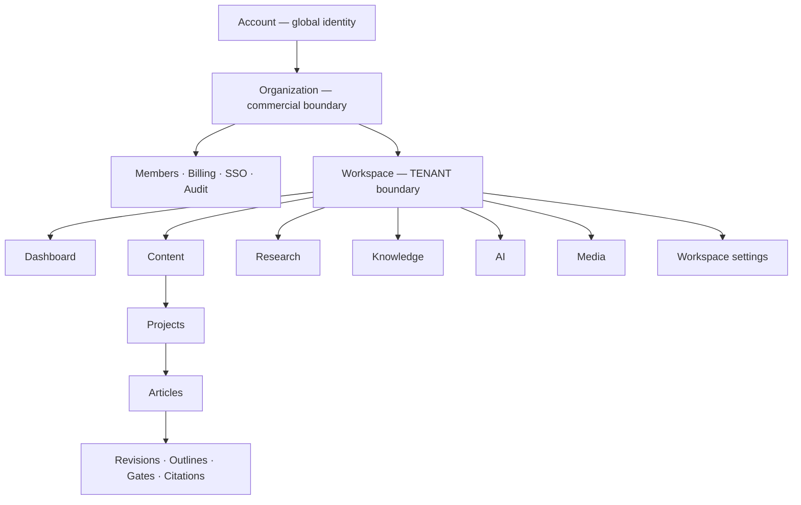
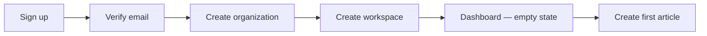
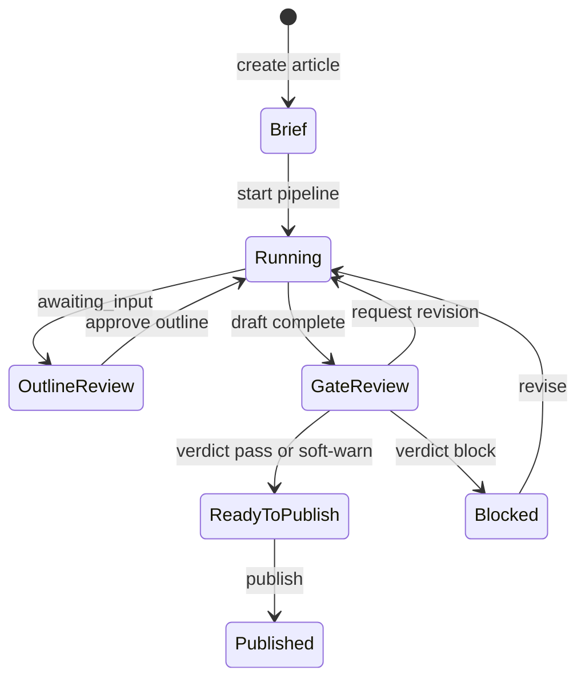
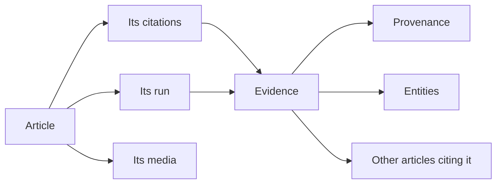

# Information Architecture

> **Status:** v1.0 — complete. New in Phase 15.
> **The hierarchy is ADR-017, rendered.** Organization is the commercial boundary; workspace is the tenant. Every screen below a workspace is scoped to one tenant, and the URL says so.

## Overview

**Purpose.** Define the screen hierarchy, route structure, user journeys, cross-feature navigation, context switching, breadcrumb behaviour, and deep-link resolution.

**Scope.** Structure and traversal. Chrome, menus, and shortcuts belong to `navigation.md`; aggregation belongs to `dashboard.md`.

## The hierarchy



**Three tiers, three access models.**

| Tier | Identity scope | Governed by |
|---|---|---|
| **Account** | Global — spans organizations | `16-security/authentication.md` |
| **Organization** | Commercial; administrative capability | Organization roles (`16-security/rbac.md`) |
| **Workspace** | **The tenant; all content** | Workspace roles + RLS |

**Organization screens and workspace screens are separated because organization roles grant no content access.** An Owner sees members, billing, and the workspace list; opening a workspace's content requires a workspace role. Presenting them as one continuous space would suggest an authority that does not exist — and the API returns `404` on the content the navigation implied (`16-security/rbac.md`).

**Project is a scope, not a tier.** It groups articles and can bound a role binding's `projectScope`, but it is not an isolation boundary. Two projects in one workspace share a tenant.

## Route structure

```
/                                          → workspace redirect or picker
/organizations/{orgSlug}                   → organization overview
/organizations/{orgSlug}/members
/organizations/{orgSlug}/billing
/organizations/{orgSlug}/settings
/organizations/{orgSlug}/audit

/w/{workspaceSlug}                         → dashboard
/w/{workspaceSlug}/content                 → article list
/w/{workspaceSlug}/content/{articleId}     → article detail
/w/{workspaceSlug}/content/{articleId}/outline
/w/{workspaceSlug}/content/{articleId}/draft
/w/{workspaceSlug}/content/{articleId}/review
/w/{workspaceSlug}/content/{articleId}/citations
/w/{workspaceSlug}/projects/{projectId}
/w/{workspaceSlug}/research
/w/{workspaceSlug}/research/{runId}
/w/{workspaceSlug}/knowledge
/w/{workspaceSlug}/knowledge/evidence/{evidenceId}
/w/{workspaceSlug}/knowledge/entities/{entityId}
/w/{workspaceSlug}/ai/usage
/w/{workspaceSlug}/media
/w/{workspaceSlug}/media/{mediaId}
/w/{workspaceSlug}/runs
/w/{workspaceSlug}/runs/{runId}
/w/{workspaceSlug}/settings
```

**`/w/` is short deliberately.** Workspace paths are the most-typed and most-shared URLs in the product; `/workspaces/` on every link adds length to no benefit.

**Slugs address organizations and workspaces; ids address everything else.** Slugs are human-meaningful and immutable after creation (`06-api/organization-api.md`), which makes them safe in bookmarked URLs. Article and evidence ids are UUIDs with no meaningful slug.

**Routes mirror API resource shape without mirroring API paths.** `/w/{slug}/content/{articleId}` maps to `GET /v1/articles/{articleId}` — the UI resolves the slug to a workspace, then addresses the article directly. Coupling UI routes to API paths would make an API version change a URL change.

**`/runs` is workspace-level, not nested under content**, because runs span content, research, and AI. A run started from an article is still a run.

## User journeys

### First run



**Organization creation makes the creator Owner in the same transaction** (`06-api/organization-api.md`). The UI never shows an organization without an owner.

**Workspace creation may return `membership: null`** — an organization Admin who created a workspace has no workspace role and cannot open its content. The UI surfaces this as a grant-yourself-access action rather than as an error, because self-grant is permitted, audited, and alerted (`16-security/rbac.md`).

### Content production — the central journey



**Two human decision points gate the pipeline**, and both are `awaiting_input` states rendered as required actions, not as passive progress: **outline approval** — mandatory, enforced by a database constraint, and writing cannot proceed without it — and **gate review**, where a `block` verdict must be resolved by revision.

**The journey is resumable at every point.** Runs are durable and detached; closing the browser mid-pipeline loses nothing (ADR-004).

### Research, knowledge, and media

| Journey | Entry | Terminal state |
|---|---|---|
| Standalone research | `/research` → new run | Evidence added to the workspace |
| Knowledge curation | `/knowledge` → entity → merge candidates | Human-approved merge with a note |
| Media upload | `/media` → upload | `available` after scan and derivation |

**Media has a visible asynchronous tail.** An upload completes and the object is not yet readable — scanning and derivation follow. The UI shows `scanning` and `processing` as real states rather than extending the upload spinner (`12-storage-platform/blob-lifecycle.md`).

## Cross-feature navigation

**The product's value is in the connections, so the graph is a first-class concern.**



| From | To | Why it matters |
|---|---|---|
| Article → run | Progress and history | The run explains what produced the draft |
| Citation → evidence | Verification | The grounding chain is the product's claim to trustworthiness |
| Evidence → citing articles | Impact | Answers "what breaks if this source is wrong" |
| Evidence → provenance | Origin | Where it came from and what merged into it |
| Run → evidence | Output | Research results are evidence identifiers |

**Evidence → citing articles is the highest-value cross-link and is easy to omit.** When a source is found unreliable or goes stale, the question is which published content depends on it — and the API supports it directly (`06-api/knowledge-api.md` `citingRevisions`).

**Every cross-link is permission-checked independently.** A user who may read an article but not knowledge sees the citation with no expansion — never a `403` for the whole page (`06-api/knowledge-api.md`).

## Context switching

**Two switchers, two meanings.**

| Switcher | Changes | Placement |
|---|---|---|
| **Organization** | Commercial context; billing and members | Account menu |
| **Workspace** | **The tenant** | Primary, always visible |

**The workspace switcher lists only workspaces the user has a role in.** An organization Owner with no workspace roles sees an empty switcher and a workspace list on the organization screen — which is accurate, not broken (`16-security/rbac.md`).

**Switching workspace resets to that workspace's dashboard**, never to the equivalent screen. Article ids are not portable across tenants, and attempting to preserve position would produce a `404` that looks like data loss.

**Switching never carries filters, selections, or drafts across.** State is per workspace.

**The current workspace is visible on every screen below `/w/`.** A user with several workspaces acting in the wrong one is the most consequential ordinary mistake available, and the tenant boundary is exactly where it happens.

## Breadcrumbs

```
Acme Corp  ›  Marketing  ›  Content  ›  Espresso Machine Guide
```

| Rule | Detail |
|---|---|
| Reflects the hierarchy | Not navigation history |
| Every segment navigable | Except the current page |
| **Permission-filtered** | A segment the user cannot open is rendered as text, not a link |
| Truncates from the middle | Ends are the most meaningful |
| Present on every screen below the workspace root | Dashboard is the root and shows none |

**Breadcrumbs are structural, not historical.** A user who reached an article from search sees the article's place in the hierarchy, not their path. A history-based trail tells them where they have been, which they already know.

**A permission-filtered segment renders as plain text with no explanation.** An organization Owner viewing a workspace's article — having self-granted access — sees the organization segment as a link and any segment they lack as text. Explaining the absence would disclose structure.

## Deep links

**Every screen is directly addressable and shareable.** Six resolution outcomes:

| Situation | Response |
|---|---|
| Authenticated, permitted | Render |
| **Unauthenticated** | Sign in, **then return to the requested URL** |
| Authenticated, **no access to the tenant** | **Not-found page** — never a permission message |
| Authenticated, in tenant, lacks permission | Permission message naming who can grant it |
| Resource deleted within grace | Deleted state with restore, if permitted |
| Resource purged or run expired | Not-found with an explanation of retention |

**The third row is a security requirement.** A shared link to another organization's article resolves to not-found, because a permission message would confirm the resource exists (`16-security/authorization.md`).

**Return-after-sign-in preserves the full path and query**, so a link shared into a chat works for a signed-out recipient.

**Deleted-within-grace is a real, distinct state.** Soft delete has a 30-day grace period, so a link to a deleted article shows it as deleted with a restore action rather than pretending it never existed (`12-storage-platform/retention.md`).

**Run links outlive their runs.** Run records persist after completion; a link to a finished run shows its result. A link to a run whose retention elapsed shows not-found with the retention window stated.

## Screen ownership

**Every screen has exactly one owning document and one authoritative API resource.** No screen computes what another screen owns.

| Screen | Authoritative source |
|---|---|
| Dashboard | Aggregates only — `dashboard.md` |
| Content list and detail | `06-api/content-api.md` |
| Outline, draft, review, citations | `06-api/content-api.md` |
| Research and runs | `06-api/research-api.md` |
| Knowledge, evidence, entities | `06-api/knowledge-api.md` |
| AI usage | `06-api/ai-api.md` |
| Media | `06-api/media-api.md` |
| Workspace settings and members | `06-api/workspace-api.md` |
| Organization settings, members, billing | `06-api/organization-api.md` |
| Notifications inbox | `04-platform/notifications.md` |
| Boards and queues | `04-platform/workflow.md` |

**There are no orphan screens.** Every route above is reachable from navigation or from a documented cross-link, and every screen links onward to at least one related resource.

**Administration screens are organization-tier and are not the operator surface.** `06-api/admin-api.md` is never publicly routable and has no screen in this application (`navigation.md`).

## Business rules

1. **The hierarchy is ADR-017**: account → organization → workspace → content.
2. **Organization and workspace screens are separated**; organization roles grant no content access.
3. **Project is a scope, not an isolation boundary.**
4. **Slugs address organizations and workspaces; ids address everything else.**
5. **UI routes mirror resource shape, not API paths.**
6. **Runs are workspace-level.**
7. **Outline approval and gate review are rendered as required actions**, not passive progress.
8. **Every cross-link is permission-checked independently.**
9. **The workspace switcher lists only workspaces the user has a role in.**
10. **Switching workspace resets to that workspace's dashboard.**
11. **Breadcrumbs are structural, not historical**, and permission-filtered without explanation.
12. **Every screen is deep-linkable**; sign-in returns to the requested URL.
13. **No tenant access resolves to not-found**, never a permission message.
14. **Deleted-within-grace is a distinct, restorable state.**
15. **Every screen has one owning document; no orphan screens.**
16. **The operator surface has no screen in this application.**

## Cross references

- `navigation.md` — chrome, menus, search, shortcuts, permission-driven visibility
- `dashboard.md` — the workspace root screen
- `design-principles.md` — empty states, errors, confirmation, undo
- `01-system-architecture/13-adr-log.md` — **ADR-017 hierarchy**, ADR-004 durable runs
- `16-security/rbac.md` — organization versus workspace roles; self-grant
- `16-security/authorization.md` — 404-versus-403 resolution
- `06-api/api-reference.md` — every endpoint these screens call
- `06-api/content-api.md` — article states, outline approval, gates
- `06-api/research-api.md` — the `Run` resource
- `06-api/knowledge-api.md` — evidence, provenance, citing revisions
- `12-storage-platform/retention.md` — the grace period behind deleted states
- `04-platform/notifications.md` · `04-platform/workflow.md` — inbox, boards, queues
